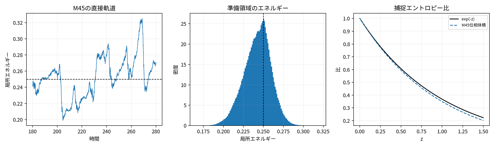
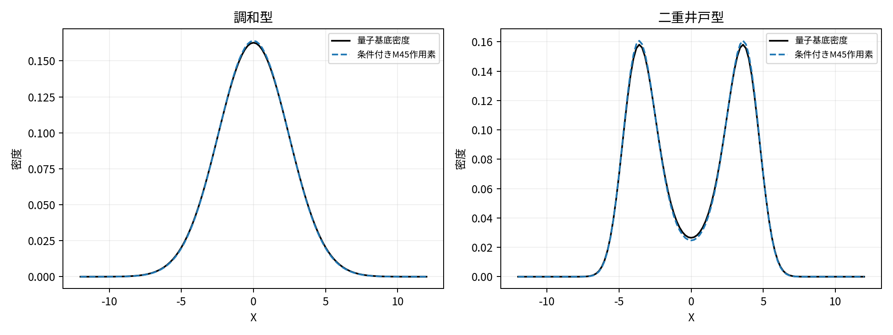

# 概要


本論文は、明示的な古典力学モデルを土台とし、量子力学に特徴的な可逆力学、測定、結合ゲート、位置、Bell型統計を有限構成と明示誤差の範囲で検証する。有限閉鎖Hamiltonianモデルと、外部駆動、散逸、雑音を明示した開放古典モデルを区別し、採用方程式後の厳密結果と、その方程式自体のミクロ導出を分ける。

Q1、Q2、Q3を1つの達成済み模型へまとめる主張はしない。Q1はW型ポテンシャルの最低2モードに限定したM47共同統計模型を使う。Q2-1はM49の行分解共同bath--実現配置CNOT供給模型、Q2-2はM48の設定依存paired-Hopf準備と局所開放配置応答を使う。Q1とQ2のBorn型重みにはM50「有限信号作用・作用殻・配置熱化共通モジュール」を使うが、これは共通理論部品であり同一ハードウェアではない。Q2-3とQ3は有限配置グラフ上の物理的複素振幅場と実現配置を持つM42を使う。M39とM41は置換済み模型へ移した。全系列を同じ物理ハードウェアと母測度へ統合したM0は未完成である。

M47では、各試行の基本状態を実現配置 $X$ と浴変数 $Z$ の組とし、規格化共分散

```math
C
=
\frac{\mathbb E[ZZ^\dagger]}
{\mathbb E[Z^\dagger Z]}
```

が階数1の場合にだけ複素因子を統計状態として定義する。R135とR136は閉鎖古典作用角流とW型左右占有振動、R137はmatching保存を仮定した旧連続閉包、R138は逆設計存在構成、R145は採用開放Hopf方程式の信号bath方向吸引と有限時間率を与える。Q1ではこれを拡張し、R139がBloch球、R140が傾斜制御による任意の $SU(2)$ と離調Rabi式、R141が左右占有周辺の有限誤差固定、R142が有限コントラストのBorn型左右読出しを与える。R164は単一試行信号作用と排他的2作用殻の状態数からBorn型条件付き重みと有効自由エネルギーを導き、R161はその地形への条件付きGibbs配置再平衡化と一様混合率、R162は局所詳細釣合い率の有限衝突熱浴実現、R163は粗視化配置過程の正逆経路確率比と有効仕事・熱・エントロピー生成を与える。R143は操作面ごとの作用殻準備、再平衡化、辺閉鎖、局所記録、結果別テンプレート交換を合成し、R144は固定有限段の記録、逆計算、弱開放resetまで閉じる。連続時間のmatching保存は現行Q1周期の前提にしない。

M49では、R165がM50中央4枝作用殻とM35作用区間標本化の同値性を与え、R157がその共同母測度を交差モーメントと単一試行配置matchingへ写す行分解共同bathを与える。R158はCNOTを同じbath・配置registerと状態数地形へ作用させる。R159はfresh出力殻を用いて固定有限CNOT共同統計を閉じ、R160は固定singlet出力をsetting-free面からM48へ恒等搬送する。

M48は設定前共通基準測度から、設定生成後の開放流で2翼bath対と実現配置を準備する。R146--R156はpaired-Hopf準備、2翼強matching、局所分析、記録、Bell統計、弱開放帰還を与える。R166は切断後のfresh局所作用殻が完全共通原因に条件付けて積因子化し、局所経路エントロピー生成が加法的になることを示す。共通原因を平均した大域Bell対数を切断後の物理ポテンシャルへ戻さない。Q2-2全体は固定singlet型、固定有限設定族、準備先行、非空間分離、採用開放法則の範囲で条件付き達成とする。

| 系列 | 現行模型 | 中心結果 | 主な制限 |
|---|---|---|---|
| Q1 | M47 W型2モード共同統計 | Bloch球、任意の $SU(2)$、離調Rabi式、条件付き作用殻状態数、条件付きGibbs再平衡化、有限衝突熱浴、左右局所記録、条件付き逐次測定、配置部分のゆらぎ関係 | 作用容量結合・fiber内平衡化・枝対称性・反作用の有限局所Hamiltonian統合と周期総収支が未導出。Q1-2、Q1-3は部分達成。Q1-4は未達・凍結 |
| Q2 | M49、M48、M50。M39、M41は置換済み | 中央4枝Born型状態数、CNOT共同入力--出力統計、固定singletの同一register受渡し、paired-Hopf共有ray、切断後局所殻因子化、余弦統計・非信号性・CHSH値 | Q2-2は固定singlet、固定有限設定族、準備先行、非空間分離、採用開放法則の範囲で条件付き達成 |
| Q3 | M37、M42、M43 | 有限時間Schrödinger型近似、位置読出し、低位束縛状態、純位相緩和、障壁値未満確率移動、最小2経路干渉 | 有限モード、有限時間、固定時刻読出し。Q3-2は未達・凍結 |

Q1の局所記録は $C$、統計振幅、全密度、確率流または遷移率を入力にせず、左右井戸に実在する $X$ だけを読む。M47の条件付き状態数は単一試行の信号作用と作用殻fiberを使うR164、配置応答はその有効自由エネルギーへ有限衝突セルで熱化するR161、R162である。従ってM42/R113の場から配置を動かす因果律をQ1へ使わない。M49は各試行の有限プログラム担体と行分解bathを使い、ensemble交差モーメントをcontrollerへ再注入しない。M48のR152はR161のBell限定形であり、各翼でR164の状態数起源とR162の衝突実現を利用できる。M42/R113はQ2-3とQ3の固定時刻位置読出しにだけ保持する。

第8章と付録Hでは、周期反応座標、対数型捕捉エントロピー座標、熱雑音、散逸、能動自由エネルギー供給を持つM45開放捕捉器を扱う。旧M46のcurrent transducerは不採用であり、R130--R132の再利用可能な有限次元計算だけを補助結果として保持する。M47ではR164がBorn型状態数と有効自由エネルギーの条件付き起源を与えたが、作用容量結合、fiber内平衡化、枝対称性、信号bath保持反作用を含む全周期の有限局所Hamiltonian統合、連続空間の一様極限、多粒子、多量子ビットの指数資源回避は未完成である。

本文は5部9章から成る。第1部は問題設定と模型地図、第2部はQ1、第3部はQ2、第4部はQ3、第5部は誤差、資源、反証条件、未完成目標、結論を扱う。長い証明、誤差評価、Q2共同bath--実現配置の受渡し契約、M50有限衝突熱浴、共通作用殻状態数、Q2中央4枝と切断後局所因子化は付録A--Nへ置く。

# 第I部　問題設定と共通言語

# 問題設定、模型地図、達成範囲

> **位置づけ：** Q1のM47経路、Q2のM49--M48接続周期、Q2-3・Q3のM42経路を分け、導出状態、達成判定、非主張を定める。


## 研究上の問い

本論文の目的は、明示的な古典力学モデルから、量子力学に特徴的な可逆力学と確率構造が有効理論として現れ得る範囲を明らかにすることである。有限閉鎖Hamiltonianモデルと開放古典モデルを記述階層として区別し、量子力学をそれらの入力には使わず、得られた力学、測定操作、統計を判定するときに比較対象として使う。

有限次元Schrödinger方程式を実正準座標へ写すことだけでは、各試行で実現する結果、測定後状態、記録、resetを得られない。本稿は次を分けて要求する。

1. Q1では、W型2モードの実現配置--浴共同統計からBloch球、任意軸操作、左右読出し、局所記録、条件付き状態を構成する。
2. Q2では、行分解共同bathと共同実現配置へCNOTを同一試行で作用させ、固定singlet出力をsetting-free面からpaired-Hopf Bell型測定周期へ接続する。
3. Q3では、局所振動子網から空間複素振幅場を誤差付きで導き、有限配置グラフの固定時刻位置読出しへ接続する。
4. 一般有限 $L$ のM35は、Q2・Q3の有限基底操作、作用区間、条件付き準備を補助する。
5. 全結果について理想式、有限装置、開放準備、無反応、記録後の帰還誤差、反証条件を区別する。

Q1の現行模型をM47、Q2結合ゲートと共同bath供給をM49、Q2 Bell周期をM48と呼ぶ。Q1とQ2で共有する有限信号作用・作用殻・配置熱化の理論部品をM50とするが、M50は同一ハードウェアを意味しない。Q3ミクロ振動子網をM37、Q2-3・Q3に残る共通模型をM42、Q3有限環境純位相緩和をM43と呼ぶ。M39、M41、M38は置換済みである。これらを1つのハードウェア、時計周期、反復母測度へまとめたM0は未完成である。

## 導出状態と達成判定

導出結果は、厳密結果、明示誤差付き近似結果、予想・未解決を区別する。装置の有限幅、比較境界、時計、記録、resetに由来する誤差は、理想式の導出状態と混同しない。

本稿の「達成」は、固定された範囲で基準を厳密に満たす場合、または任意の $\epsilon>0$ に対して誤差を $\epsilon$ 未満にする有限自由度・有限パラメータの明示構成を選べる場合を指す。形式極限だけ、構成のない収束仮定、無反応試行の事後除外は含まない。「部分達成」は一部の構成要素が得られたが、固定達成基準の全てを同じ模型で閉じていない状態である。

Q1-1はR139、R140によりM47上で達成とする。Q1-2はR164の条件付き作用殻状態数、左右占有周辺の傾斜固定、Born型読出し、操作面ごとの条件付きGibbs再平衡化、有限衝突熱浴、辺閉鎖による局所滞在、局所記録、枝別状態更新を有限誤差で合成した。一方、作用容量結合、fiber内平衡化、枝対称性、信号bath反作用を同じ有限局所Hamiltonianへ統合していないため部分達成とする。Q1-3は連続matching保存または周期間matching帰還を仮定せず、記録、逆計算、交換resetまで合成したが、Hopf pump、fiber、controller、衝突セル、記録、resetを含む周期総収支を閉じていないため部分達成とする。Q1-4は未達のまま凍結する。

R157--R159とR165はM49のQ2-1共同入力--出力統計と中央4枝Born型状態数、R160は固定singlet出力のsetting-free受渡しを与える。R151--R156とR166は、M48内部またはM49由来のsetting-pre等重みseed、2翼強matching、切断後fresh局所作用殻の条件付き積因子化、局所記録、弱開放resetを同じ周期へ閉じる。従ってQ2-1は達成、Q2-2全体は明示範囲で条件付き達成という判定を維持する。

## 現行模型の役割分担

| 層 | 変数・装置 | 主な法則 | 確立度 |
|---|---|---|---|
| Q1共同統計層M47 | 実現配置 $X$、信号bath変数 $Z$、条件付き作用殻fiber、容量・障壁controller、有限衝突セル、W型最低2モード、外部 $\lambda_{\rm prep}$ | 共分散回転、単一Hopf吸引、傾斜制御、条件付き作用殻状態数、条件付きGibbs再平衡化、辺閉鎖、局所記録、経路ゆらぎ関係 | R135、R136、R139--R145、R161--R164。採用開放法則と条件付き作用殻準備後に厳密または明示誤差付き。R137は旧連続matching閉包 |
| 共通理論部品M50 | $v\in\mathbb C^m$、枝作用、各枝の2作用殻、有限配置、衝突セル | Born型状態数、条件付き有効自由エネルギー、詳細釣合い、経路熱力学 | R161--R166、付録L--N。Q1・Q2の特殊化を結ぶが同一ハードウェアではない |
| Q3・Q2-3理想層M42 | $b\in\mathbb C^{|\Omega|}$、$X\in\Omega$ | 局所辺流、最小率、等変性 | 有限グラフ・有限時間で厳密。Q1、Q2-1、Q2-2には使わない |
| Q3・Q2-3有限装置層M42、M35 | 正則化、更新角、比較器、通信路、履歴、検出 | 実現配置分布の有限Hamiltonian近似、条件付き場準備 | 任意精度、無反応込み。Q1とQ2-1には使わない |
| Q2結合・供給層M49 | 4モードプログラム担体、中央4枝作用殻、行分解bath対、共同配置、fresh出力殻、受渡しport | 共同Born状態数、CNOT交差モーメント、共同入力--出力統計、M48受渡し | R104--R106、R157--R160、R165。固定有限プログラムで厳密または任意精度 |
| Q2 Bell周期M48 | setting-pre等重みseed、2翼bath対、fresh局所作用殻、切断器、局所分析器、記録、reset | paired-Hopf共有ray、strong matching、条件付き積因子化、局所再matching、余弦則 | R146--R166。採用開放法則後に厳密または明示誤差付き |
| 置換済みQ2 Bell模型M41 | 4頂点場・共同配置、条件付き2端準備 | 旧初期共通原因型Bell周期 | R107--R111、R121を研究メモに保持。現行根拠に使わない |
| Q3ミクロ層M37 | $q,p$ と局所回転包絡 | 位置ばね結合、反回転項、有限時間近似 | 厳密ミクロ式と近似誤差 |
| Q3有限環境層M43 | モード作用、環境正準対 | エネルギー保存型純位相緩和、有限時間減衰、回復 | 有限モードで厳密 |
| 定常準備候補層M45 | 周期反応座標、捕捉エントロピー座標、熱浴、能動源 | 準臨界殻、位相すべり、帰還、指数位相体積 | R127、R128は方程式後の結果、R129は橋渡し条件付き |
| 旧開放層M46 | 複素振幅場、capacity、位相比較 | 場から率を作るcurrent transducer | 不採用。R130--R132だけを補助計算として保持 |

Q1とQ2・Q3で「実現配置」という語を使うが、採用因果律は同じでない。M47では共同測度から統計核を定義し、単一試行の信号bath座標に条件付けたエネルギー地形と有限衝突セルで配置を再平衡化し、辺閉鎖後の既存配置を局所記録する。M42では物理的複素振幅場の辺流から最小率を作り、配置分布を等変に更新する。両者を同じ証明へ混ぜない。

## 準備、測度、結果変数

M47では信号bath、作用殻fiber、衝突bath、実現配置を分ける。開放Hopf準備段階では外部 $\lambda_{\rm prep}>0$ が能動供給、散逸、位相基準を許し、R145が信号bath方向の吸引率を与える。操作面では単一試行の信号作用からR164の条件付き作用殻状態数と有効自由エネルギーを作り、R161、R162の有限衝突セルで実現配置を再平衡化する。作用殻fiberは状態数を、衝突bathは配置遷移を担い、同じ部分系ではない。解析器中に配置--信号bath整合が崩れることを許し、終了後に作用殻を更新して再平衡化する。階数1共分散の因子は独立した物質場でなく、共同統計の記法である。

M48では設定前基準測度を設定生成後の開放流で押し出す。A設定 $x$ は中央準備へ入り、B設定 $y$ は切断後のB局所分析器へだけ入る。R152は単一試行bath座標に条件付けた有限配置jumpを使い、交差共分散を結果として読まない。R166は完全共通原因に条件付けたfresh局所作用殻と応答の積因子化を与える。共通原因を平均した後の大域対数を切断後の物理ポテンシャルへ戻さない。

Q1の主測定結果は、左右井戸の安全領域に存在する $X$ を局所ポインターへ写した記録である。無反応を含む完全結果集合を使い、無反応試行を除外して再規格化しない。結果枝の条件付き状態は、局所記録で開く準備済み2モードテンプレート交換から作る。

M49では、行分解共同bathとM35単一試行selectorを使い、最終selectorラベルを空の2配置registerへ可逆SWAPする。結果は $X_A,X_B$ だけであり、集団交差モーメントをcontrollerへ再注入しない。M42を使うQ2-3・Q3では、鋭い基準配置と同じ準備回路から $P(X=z)=|b_z|^2$ を作る。固定有限プログラムの一意エルゴード角は長期頻度を与えるが、独立同分布型有限標本揺らぎを与えない。

## 主結果と達成範囲

| 対象 | 中心結果 | 判定と範囲 | 根拠 |
|---|---|---|---|
| Q1-1 | 階数1共分散のBloch球、傾斜による任意の $SU(2)$、離調Rabi式 | 達成。W型最低2モード、全W型では明示漏れ誤差 | R139、R140 |
| Q1-2 | 左右占有周辺の傾斜固定、任意軸の左右Born型読出し、条件付き作用殻状態数、条件付きGibbs再平衡化、有限衝突熱浴、排他的局所記録、結果別条件付き状態、逐次測定 | 部分達成。無反応込み。Born型状態数の条件付き起源を導出。作用容量結合、fiber内平衡化、枝対称性、反作用の有限局所Hamiltonian統合が未導出 | R141--R145、R161--R164、付録L・M |
| Q1-3 | 永久記録、内部逆計算、外部空セル交換、固定有限周期 | 部分達成。連続matching保存は不要。fiberを含む周期全体の仕事・熱・エントロピー収支が未導出 | R143--R145、R161--R164 |
| Q1-4 | Zeno効果 | 未達・凍結。旧M38結果を現行根拠に使わない | 第3.17節、研究メモ |
| M35 | 一般有限基底の分析、配置準備、局所更新、条件付き場準備 | Q2・Q3補助。一般有限 $L$ の完全外部周期は未構成 | 第2章、付録A |
| Q2-1 | M49の中央4枝Born型状態数、行分解共同bath、同一試行CNOT、共同入力--出力統計 | 達成。固定有限ベンチマーク、任意精度 | R104--R106、R157--R159、R165 |
| Q2-2 | M49の固定singlet供給、M48のpaired-Hopf共有ray、2翼強matching、切断後局所殻因子化、局所記録、余弦統計、Bell監査、弱開放帰還 | 条件付き達成。固定singlet、固定有限設定族、準備先行、非空間分離、採用開放法則 | R146--R166、付録K--N |
| Q3-1 | M37複素振幅場、空間配置、等変性、節一様近似、固定時刻検出 | 達成。有限グラフ・有限時間 | R83--R88、R112--R118 |
| Q3-3 | 井戸型・調和型低位束縛状態、エネルギー保存型純位相緩和 | 達成。固定有限低位モード、有限時間 | R86、R123 |
| Q3-4 | 3頂点有限障壁の確率移動、位置読出し | 達成。最小有限例、固定時刻 | R113、R116、R117、R124 |
| Q3-5 | 2頂点再結合器のコヒーレンス差・相対位相差、位置読出し | 達成。最小2経路例、固定時刻 | R113、R116、R117、R125 |

## Q2共同bath--実現配置の共通契約

Q2-1とQ2-2を同じ体系へ接続する1試行状態を

```math
\Gamma_{\rm Q2}
=
\left(X_A,X_B,z_A,z_B,\eta,H,R\right)
```

として固定し、cross projectorの統計的matching、各端の単一試行配置matching、切断後の局所核因子化を同じ安全事象上で要求する。vectorizationはrow-majorに統一し、column-majorを使う場合は中央2成分を交換する $P_{23}$ を明示する。ensemble cross momentを単一試行controllerとして再注入しない。

物理的接続は局所設定生成前の $\Sigma_{\rm link}$ に置き、受渡し面の法則を設定から独立にする。破壊的読出しは、環境を含む拡大系で一対一のdilationを持ち、使用済み情報または履歴を保存する場合だけ許す。さらに入力状態、枝bias、履歴のどれが後段法則へ残るかをstate-carrying、branch-carrying、provenance-onlyに分類する。完全な数式契約、誤差記法、監査条件は付録Kを正本とする。

M49/R160は固定singlet供給プログラムについてこの契約を満たす。$T_{\rm link}$ は同じbath・配置registerの恒等搬送であり、state、branch、provenanceの感度を分けて検査する。旧M39--M48写像はM39状態に対する出力感度がないため、現行因果鎖に使わない。

## 共通の非主張

本稿は、量子力学の全構造、同一ハードウェアのM0、独立同分布型有限標本統計、総エネルギー収支、一般連続空間、多粒子、多量子ビットの多項式資源構成を与えない。M48は標準的な空間分離Bell実験でなく、R123--R125は有限モード・有限時間・固定時刻読出しを越えない。

M47は対称W型の最低2モードだけを扱う。R164は単一試行信号作用と排他的2作用殻からBorn型状態数と有効自由エネルギーを条件付きで導くが、作用容量結合、fiber内平衡化、枝対称性をW型装置の有限局所Hamiltonianから導いていない。R162は有限衝突近似を与えるが、R145のHopf pump、作用殻fiber、信号bath保持controller、記録、template交換、resetを同じ有限Hamiltonian台帳へ統合していない。R163の有効仕事・熱を全微視的仕事・熱と同一視しない。大域階数1共分散だけから結果枝ごとの測定後固有状態は出ない。傾斜による離調固定をZeno効果と呼ばない。

M42/R113はQ2-3・Q3の根拠であり、M47の原因、Q1測定、M49のQ2-1、M48のQ2-2には使わない。Q3の固定時刻位置読出しを別の共同統計へ移すまではM42を全面退役させない。

## 論文の読み方

第2章はQ2-3・Q3に残るM42とQ2・Q3のM35補助モジュール、第3章はM47によるQ1、第4章と第5章はM49--M48によるQ2、第6章と第7章はQ3を扱う。第8章は誤差、資源、反証条件、未完成目標を横断比較し、第9章で結論を述べる。

付録AはM35、付録BはM47傾斜制御測定、付録CはM49共同bath CNOT供給模型、付録DはM48完全Bell周期、付録EはM37包絡誤差、付録FはQ2-3・Q3に残るM42実現配置過程、付録GはQ3-3からQ3-5、付録HはM45、付録IはM47共同統計の基礎、付録JはM48 paired-Hopf bath準備、付録KはQ2共同bath--実現配置の受渡し契約、付録LはM47条件付きGibbs再平衡化と有限衝突熱浴、付録MはM47条件付き作用殻の状態数起源を扱う。

# Q2-3・Q3に残る有限配置グラフ模型

> **位置づけ：** M42/R113をQ2-3・Q3だけの模型へ縮小し、共通辺生成子、等変性、有限Hamiltonian近似、M35補助モジュールを整理する。


## Q2-3・Q3の有効模型と統一M0の違い

本章のM42は、Q2-3とQ3に残る**有限配置グラフ上の複素振幅場-実現配置模型**である。Q1は第3章のM47、Q2-1は第4章のM49、Q2-2は第5章のM48へ移行し、本章の最小率とR113を使わない。有限グラフを

```math
\mathcal G
=
(\Omega,E)
```

とし、各頂点 $z\in\Omega$ に実正準対 $(Q_z,P_z)$ と複素振幅場

```math
b_z
=
\frac{Q_z+iP_z}{\sqrt{2\mathcal J_0}}
```

を置く。各試行で1つだけ実現している配置を

```math
X_t\in\Omega
```

と書く。$b$ はグラフ全体へ広がる古典正準場であり、相対振幅、相対位相、辺流を担う。$X$ は測定時に新しく作る結果ラベルではなく、準備、操作、伝播、測定を通して存在する試行変数である。

M42の現行特殊化と、代数だけを共有するM49内部担体は次である。

| 系列 | 配置集合 $\Omega$ | 複素振幅場 | 実現配置 | 主なグラフプログラム |
|---|---|---|---|---|
| Q2-1のM49内部担体 | $\{00,01,10,11\}$ | $C\in\mathbb C^{2\times2}$ | 行分解bathと2配置register | 局所操作、CNOT、singlet供給。M42最小率は使わない |
| Q3 | 有限空間グラフの頂点集合 | $b\in\mathbb C^L$ | 実現中の空間セル $X$ | Laplacian伝播、ポテンシャル、干渉 |

M49の4モード担体は、4モード中に1個の粒子があるという意味ではない。bath対と2配置registerを伴う有限プログラム担体である。$n$ 論理成分へ直接拡張すると担体モード数は $2^n$ となる。この指数コストはQ2-3に残る。

M49とM42が共有するのは有限正準担体の辺生成子とM35補助部品であり、実現配置の因果律ではない。M37は位置ばね網からQ3の複素振幅場を弱結合・有限時間で近似する。M49は行分解共同bathと単一試行selector、M48は設定依存paired-Hopf開放流とR152の配置bathを使い、いずれも本章の最小率を使わない。R152はR161のBell限定形であり、R162の有限衝突実現を利用できる。M49とM48の接続はR160と付録Kで閉じる。全系列を同じ物理部品、時計周期、反復母測度へまとめたM0は未完成である。

## 複素振幅場の正準流

全作用を固定して

```math
\mathcal J_0b^\dagger b
=
\mathcal J_0
```

とする。時間依存Hermitian行列 $h(t)$ に対するHamiltonian

```math
H_h(t)
=
b^\dagger h(t)b
```

は

```math
i\mathcal J_0\dot b
=
h(t)b
```

を与える。有限次元Schrödinger方程式の実正準表示だけでは、各試行の結果、測定後状態、記録、resetを得られない。本稿は同じ正準流へ実現配置 $X$ と有限装置を接続する。

無向辺 $e=\{u,v\}$ に差モード射影

```math
\Pi_e
=
\frac12
\left(
|u\rangle-|v\rangle
\right)
\left(
\langle u|-\langle v|
\right)
```

を対応させる。基本辺生成子は

```math
G_e
=
\mathcal J_0b^\dagger\Pi_eb
=
\frac14
\left[
(Q_u-Q_v)^2
+
(P_u-P_v)^2
\right]
```

である。重み付きLaplacianは

```math
L_{\mathcal G}
=
2\sum_{e\in E}g_e\Pi_e
```

なので、Q3の空間伝播は多数の $G_e$ を同時に駆動したものになる。Q2のCNOTは $e=\{10,11\}$ について

```math
e^{-i\pi\Pi_e}
=
U_{\rm CX}
```

であり、同じ辺生成子を1本だけ面積 $\pi$ で駆動したものである。

**共通構造（R112：有限配置グラフ模型のQ2--Q3共通構造）**

Q2とQ3の可逆有効力学は、有限配置グラフ上の同じ複素振幅場の正準流である。違いは頂点集合、辺集合、係数、パルス列、配置の物理的解釈にある。局所2成分操作、CNOT、空間Laplacianは、頂点作用項と同じ差モード辺生成子の有限プログラムとして表せる。
これは独立した力学定理ではなく、本稿が採用する共通有効モデルの定義である。厳密な設計済み $QQ+PP$ 生成子と、M37の位置ばねによる近似実装は区別する。

## 局所辺流と実現配置の等変性

頂点重みと有向辺流を

```math
p_z(t)
=
|b_z(t)|^2,
```

```math
J_{z\to z'}(t)
=
\frac{2}{\mathcal J_0}
\operatorname{Im}
\left(
b_{z'}^*h_{z'z}b_z
\right)
```

と定める。Hermitian性から

```math
J_{z\to z'}
=
-J_{z'\to z},
\qquad
\dot p_z
=
\sum_{z'}J_{z'\to z}
```

が従う。$h_{z'z}=0$ の非辺では流も零である。

余分な対称往復流を持たない理想最小率を

```math
\lambda_{z\to z'}
=
\frac{[J_{z\to z'}]_+}{p_z}
```

とする。$p_z=0$ の到達不能状態上では率を任意に定める。

<!-- theorem-start:theorem -->
**定理（R113：時間依存グラフプログラムの実現配置等変性）**

有限時間区間で区分的に滑らかなHermitianグラフプログラム $h(t)$ を考える。初期分布が

```math
P(X_0=z)
=
|b_z(0)|^2
```

なら、理想最小率を持つ実現配置過程は

```math
P(X_t=z)
=
|b_z(t)|^2
```

を保つ。有限グラフと有界な $h(t)$ では有限時間爆発は起こらない。
<!-- theorem-end:theorem -->

最小率は連続方程式だけから一意に強制されない。対称な非負往復流を加えても同じ1時刻分布を保てる。本稿は、標準辺流を実現し、余分な往復を加えない選択として最小率をモデル定義に採用する。節では率が発散し得るため、有限装置との同一視はしない。

R113はM42のQ2-3・Q3模型に属する。M47のW型共同統計、M49の行分解共同bath、M48のpaired-Hopf模型は、この最小率または旧M46のcurrent transducerを使わない。Q1はR139--R145、R161--R164、Q2-1はR157--R159、Q2-2はR146--R164へ移行した。M42/R113はQ2-3とQ3の固定時刻位置読出しに必要なため保持する。全面退役にはQ3の位置読出しを別の単一試行共同統計から再導出する必要がある。

## 鋭い基準配置と任意場の初期準備

鋭い基準配置 $z_0$ から

```math
b(0)=e_{z_0},
\qquad
X_0=z_0
```

と開始すれば、初期分布条件は確率仮定を追加せず満たされる。準備プログラム $U_{\rm prep}$ を複素振幅場と実現配置へ同時に作用させると、R113により

```math
P(X=z)
=
\left|
(U_{\rm prep})_{zz_0}
\right|^2
=
|b_z|^2
```

となる。

<!-- theorem-start:corollary -->
**系（R118：鋭い基準配置からのQ3準備）**

任意の固定有限準備回路について、鋭い基準場と同じ基準実現配置から開始し、回路中の同じグラフ流で両者を発展させれば、準備終了時の実現配置分布は複素振幅場の作用比に一致する。従ってQ3の固定入力では、任意分布を開始面へ別に書き込む必要がない。旧Q2-1適用は現行根拠から外す。
<!-- theorem-end:corollary -->

任意の $b_0$ を準備回路の履歴なしに直接与える場合は、$P(X_0=z)=|b_{0,z}|^2$ を別に準備する必要がある。この場合はM35型累積作用区間を補助的に使う。最終分布が同じでも、実現配置の途中履歴は準備プログラムに依存する。

## 節の否定的結果と有限率正則化

一様有界な脱出率を持つ連続時間Markov過程では、ある頂点の正の占有を有限時間で厳密零へ送れない。これはR114である。従って節を通る理想交換を有限有界率装置で厳密に追跡したとはしない。

有限装置では、無次元の $\rho>0$、率次元の $\sigma>0$ と

```math
r_\sigma(j)
=
\frac12
\left(
j+\sqrt{j^2+\sigma^2}
\right)
```

を使い、

```math
\lambda_{z\to z'}^{\rho,\sigma}
=
\frac{r_\sigma(J_{z\to z'})}{p_z+\rho}
```

と正則化する。有限時間 $T$ での分布誤差はR115の節一様上界で制御する。有限正則化は小さな逆向き遷移を含み、厳密最小過程ではない。

## 有限Hamiltonian実現配置過程

正則化率を有限刻み $\Delta$ の局所遷移核へ変換する。現在配置 $z$ で待機または隣接辺 $z\to z'$ を1つ選び、実現配置を表す局在正準自由度を選択辺の細い通信路内で輸送する。旧配置、選択辺、待機、無反応を履歴セルへ残すので、全写像は1対1である。

選択器角は測定結果を独立に生成する変数ではない。複素振幅場が定める局所辺流を有限Hamiltonian写像として実装する更新変数である。固定有限更新数では全ての時計、選択器、通信路、履歴セルを初めから含む有限閉鎖系へ埋め込める。無期限運転では新規セルの流入と使用済みセルの流出を持つ弱開放系とする。

<!-- theorem-start:theorem -->
**定理（R116：共通実現配置過程の有限Hamiltonian近似）**

有限配置グラフ、有限時間、規格化初期場、任意の精度を固定する。節を除外せず、初期準備、正則化、時間離散化、局所選択、1辺輸送、時計、履歴保存、固定時刻検出からなる有限Hamiltonian構成を選び、全更新断面で実現配置分布を $|b_z|^2$ へ任意精度で近づけられる。固定更新数では有限閉鎖系、無期限運転では弱開放系となる。
<!-- theorem-end:theorem -->

完全局所な単純資源上界は $K$ 更新について $O(K(|\Omega|+|E|))$ 正準対である。これは最小性を主張しない。滑らかな比較境界は正式な無反応結果とし、無反応試行を除いて再規格化しない。

## Q2-3・Q3の測定規約

基底 $\{|u_s\rangle\}$ を測るときは、分析器 $W$ を

```math
W|u_s\rangle
=
e_s
```

となるように選ぶ。$W$ を複素振幅場へ作用させる間、実現配置も同じグラフプログラムで発展させる。分析器出口で $X=s$ を検出すれば、R113により

```math
P(X=s)
=
\left|
\langle u_s|b\rangle
\right|^2
```

となる。測定器はBorn型重みをその場で新しく生成せず、分析器を通過した実現配置を読む。

検出後は $X=s$ を制御ラッチとして、結果を外部記録し、測定前場を履歴セルへ退避し、複素振幅場を $|u_s\rangle$ へ準備する。無反応では固有状態を主張しない。M35の作用区間公式は、任意初期場に対する実現配置準備、局所更新の有限実装、条件付き場準備、分布検算に使う。主結果変数は常に $X$ であり、M35が別の測定結果を独立に生成する構成とはしない。

## 共通部品と限界

| 共通部品 | 主な利用先 | 役割 |
|---|---|---|
| 頂点作用と差モード辺生成子 | M49、Q3 | 可逆場プログラム。実現配置則は別 |
| 局所辺流、最小率、正則化 | Q2-3、Q3 | M42実現配置の理想則と有限近似 |
| 作用区間、滑らかな比較、無反応 | M35、M49 | 初期準備、単一試行配置router、条件付き帰還 |
| 時計、1辺通信路、履歴セル | M35、M42 | 有限Hamiltonian実装 |
| 外部記録、逆計算、reset | M35、M47、M48 | 反復周期 |
| M50有限信号作用・作用殻・配置熱化 | M47、M49、M48 | Q1・Q2のBorn型状態数と条件付き熱化。共通理論部品であり同一ハードウェアではない |

一意エルゴードな選択器角は長期頻度を与えるが、結果列の独立同分布性、二項分布型有限標本揺らぎ、中心極限定理を与えない。実現配置の理想確率過程を基礎的な乱雑さとして追加したとも主張しない。現行の物理的主張は、固定有限時間・固定有限プログラムの分布を有限Hamiltonian集団で任意精度に実装できることにある。

## M35有限基底補助モジュール

M35は、一般有限 $L$ の局所2モード回路、作用区間、条件付き場準備、内部逆計算を有限Hamiltonian化するQ2・Q3補助モジュールである。M49では、M50中央作用殻の枝内一様座標を作用区間ラベルへ押し出し、空の2配置registerへ可逆SWAPして最終結果を $X_A,X_B$ と読む。M42では分析器出口または固定時刻に既存の実現配置 $X$ を読む。どちらでも作用区間ラベルを別の第2結果として数えない。

選択器角が信号場、基底回路、全作用に条件付けて一様なら、安全区間 $\mathcal O_k$ の長期頻度は対応する作用比に一致する。M49でこの一様角を使うときは、中央2作用殻の枝周辺を平坦化した座標と解釈する。M35自体は殻内Gibbs熱化または一様化の力学を証明しない。有限幅の遷移領域は正式な無反応結果とし、除外後の再規格化を行わない。この作用区間公式は、任意初期場に対する実現配置準備、分布検算、局所更新、条件付き場準備に使う。

一般有限 $L$ の複数段測定、永久外部記録、resetセル流、長距離時計配線までを含む完全周期は未構成である。相関行列、作用区間、任意有限基底回路、比較器、測定後場、Poincaré写像、資源上界は付録Aでまとめて扱う。

## M50有限信号作用・作用殻・配置熱化共通モジュール

M50は、単一試行の有限信号 $v\in\mathbb C^m$、等長埋込み $\Psi:\mathbb C^m\to\mathbb C^L$、排他的枝 $i$ を結ぶ共通理論部品である。

```math
J_{\rm sig}
=
\mathcal J_0v^\dagger v,
\qquad
J_i
=
\mathcal J_0|(\Psi v)_i|^2,
```

```math
A_i^\delta
=
J_i+\delta q_iJ_{\rm sig},
\qquad
\Omega_i^\delta
=
\frac{(2\pi)^2}{J_{\rm ref}}A_i^\delta.
\tag{2.16}
```

各**枝**の内部に2つの非負作用を置くため状態数は容量に線形である。「2作用殻」は枝数が2という意味ではない。単一母測度を1回だけ規格化すると

```math
P_i^\delta
=
\frac{\Omega_i^\delta}{\sum_j\Omega_j^\delta}
```

を得る。Q1は主に $m=2$、Q2-1中央共同枝は $m=L=4$、Q2-2切断後局所枝は各翼 $m=2$ の特殊化である。

作用殻を消去する表示では

```math
E_i^\delta
=
-\Theta\log P_i^\delta
```

を条件付き中間状態有効自由エネルギーとして使う。状態数を残す表示と消去表示は同値であり、同じ縮約分配関数で $\Omega_i^\delta e^{-\beta E_i^\delta}$ を使うと二重計数になる。全系の平衡Hamiltonianを別に構成しない限り、$E_i^\delta$ を無条件に平均力Hamiltonianとは呼ばない。

R161はこの重みに対する有限配置再平衡化、R162は有限衝突熱浴、R163は相対有効仕事・熱・経路エントロピー、R164は状態数起源を与える。Q2への段階別特殊化、R165、R166は付録Nで扱う。

# 第II部　単一量子ビット型操作と測定

# M47のHopf準備・条件付きGibbs再平衡化・傾斜測定

> **位置づけ：** Q1を、M50の2成分特殊化として2モード信号bath、条件付き作用殻、有限衝突熱浴、実現配置の交互行程へ再編する。R164がBorn型状態数と条件付き中間状態有効自由エネルギーの起源を与える。達成判定は変更しない。


## Q1の統計力学的再編と主張範囲

本章は、Q1のM47を統計力学的な操作周期として再編する。基本状態は、W型ポテンシャル中で各試行に1つ存在する実現配置 $X$ と、2モード信号bath座標 $Z$ を持つ共同測度

```math
\mu(dX\,dZ)
```

である。複素振幅を独立した実在場として先に置かず、規格化共分散

```math
C
=
\frac{\mathbb E_\mu[ZZ^\dagger]}
{\mathbb E_\mu[Z^\dagger Z]}
```

が階数1の場合にだけ、その因子 $c$ を統計状態として使う。実現配置の分布と共分散の空間核を一致させる旧条件は、付録IのM47 matching条件である。本章ではmatchingを全時刻で保存しない。Hamiltonian制御中は実現配置が瞬時の信号bath方向から外れてよく、各操作面で付録Lの有限衝突熱浴を接続して条件付きGibbs分布へ戻す。

Q1の測定は次の仕事行程、熱化行程、記録行程へ分ける。

1. R145のHopf駆動で2モード信号bath方向を準備する。
2. 信号bath方向を保持し、R164の作用枝容量と条件付き作用殻fiberを準備する。
3. R161、R162で実現配置を条件付きGibbs分布へ近づける。
4. 衝突熱浴を切り、W型2モードの傾斜制御で測定軸の固有方向を左右局在方向へ写す。
5. 分析器終了後に作用殻fiberを更新し、再び衝突熱浴を有限時間だけ接続して新しい信号bath方向へ配置を再平衡化する。
6. 入射セルと辺遷移を止め、トンネル振動より速く、高モード間隔より遅く傾斜を立ち上げる。
7. 左右井戸の有効自由エネルギー差と閉じた辺ゲートで、既存の実現配置を記録終了まで片側へ保持する。
8. 各井戸に置いた局所記録ポインターが、その場所にある $X$ だけを記録する。
9. 安全枝では、記録結果に対応する準備済み2モードテンプレートと信号bathを正準交換し、交換後方向へ作用殻準備と配置再平衡化を行う。
10. 測定前情報と使用済み装置状態を外部セルへ残し、内部補助を逆計算と交換resetで戻す。

局所記録は、$C$、統計振幅、全密度、確率流、遷移率を入力にしない。従って、M42/R113の

```math
b
\longrightarrow
q(b)
\longrightarrow
X
```

という因果律を使わない。

付録IのR145は、雑音零の採用開放Hopf方程式について信号bath方向を目標位相円へ吸引する厳密解と有限時間率を与える。付録MのM50/R164は、同じ試行の有限信号作用を正則化枝容量へ写し、各排他的枝の2作用殻状態数からBorn型条件付き重みと有効自由エネルギーを導く。付録LのR161は任意有限信号方向に対する配置の一様指数再平衡化、R162はその局所詳細釣合い率の有限衝突実現、R163は制御切替と配置経路のゆらぎ関係を与える。R145、R164、R161を順に作用させれば、信号bath方向、条件付き状態数、配置分布を同じ操作面へ有限誤差で準備できる。

第5章のR152は、固定singlet型Bell装置に限って同じ平方根率を先に採用した結果である。R161はその数学的核を任意のM47 rayへ拡張し、R162は固定した単一試行信号bath座標に対する衝突熱浴実現を与える。R164は各翼の局所条件付き地形にも使えるが、paired-Hopf準備や2翼周期全体を導かない。R152を一般Q1定理として遡及的に読み替えず、R161--R164をQ1の新しい根拠とする。

R164により、条件付き地形 $E_i^\delta=-\Theta\log\pi_i^\delta$ は確率から直接設計する量でなく、作用殻を消去した条件付き中間状態有効自由エネルギーとして得られる。作用殻明示表示の $\Omega_i^\delta$ と消去表示の $e^{-\beta E_i^\delta}$ を同じ分配関数で掛けず、状態数を二重計数しない。ただし枝容量結合、殻内平衡化、枝対称性、信号bath保持反作用を同じ有限局所Hamiltonianへ統合しておらず、Hopf pump、記録、resetを含む周期全体の仕事・熱・エントロピー収支も未閉鎖である。このためQ1-2とQ1-3の判定は部分達成のまま維持する。

## 階数1共分散とBloch球

Pauli行列を $\sigma_x,\sigma_y,\sigma_z$ とし、共分散のBloch成分を

```math
r_k
=
\operatorname{tr}(C\sigma_k)
```

で定める。$C$ はHermitian、正半定値、trace 1なので

```math
C
=
\frac12
\left(
I_2+\boldsymbol r\cdot\boldsymbol\sigma
\right),
\qquad
|\boldsymbol r|\leq1
```

である。階数1なら $C=cc^\dagger$、$c^\dagger c=1$ と書け、$|\boldsymbol r|=1$ である。$c$ と $e^{i\alpha}c$ は同じ $C$ を与えるため、共通位相は観測状態に含まれない。

一般のHermitian行列 $G(t)$ に対して、古典2モードHamiltonianを

```math
H_G(t)
=
Z^\dagger G(t)Z
```

とする。正準方程式は

```math
i\mathcal J_0\dot Z
=
G(t)Z
```

であり、規格化共分散は

```math
i\mathcal J_0\dot C
=
[G(t),C]
```

に従う。

<!-- theorem-start:proposition -->
**命題（R139：M47階数1共分散のBloch縮約）**

trace 1の正半定値2次共分散について、階数1条件は $|\boldsymbol r|=1$ と同値である。階数1共分散の集合は共通位相を除いた $\mathbb{CP}^1\simeq S^2$ であり、$H_G$ の古典正準流はこの球面上の回転を与える。従ってM47の純粋2モード統計状態は、独立した複素振幅場を仮定せずBloch球を持つ。
<!-- theorem-end:proposition -->

R139はR135を一般の時間依存2モード生成子へ拡張したものである。共分散の回転は厳密だが、実現配置周辺のmatching保存は別の条件である。

## W型ポテンシャルと局在基底

対称W型生成子 $h_W(0)$ の最低2固有モードを、実偶関数 $\phi_0$ と実奇関数 $\phi_1$ とする。固有値を $E_0<E_1$、平均と半分裂を

```math
\overline E
=
\frac{E_0+E_1}{2},
\qquad
J
=
\frac{E_1-E_0}{2}
```

とする。位相規約を選び、左右局在基底を

```math
|L\rangle
=
\frac{\phi_0+\phi_1}{\sqrt2},
\qquad
|R\rangle
=
\frac{\phi_0-\phi_1}{\sqrt2}
```

と置く。左右の名称は $\langle L|x|L\rangle<\langle R|x|R\rangle$ となるように必要なら $\phi_1$ の符号を反転する。

制御可能な1次傾斜を

```math
h_W(F)
=
h_W(0)-F(t)x
```

とする。対称性から最低2モード内では対角位置要素が消え、局在基底での生成子は共通エネルギーを除いて

```math
G_F(t)
=
-J\sigma_x
+
\frac{\varepsilon(t)}{2}\sigma_z,
\qquad
\varepsilon(t)
=
2F(t)
\left|
\langle\phi_0|x|\phi_1\rangle
\right|
```

となる。$-J\sigma_x$ は左右トンネル振動、$\varepsilon\sigma_z/2$ は左右エネルギー差である。

## 傾斜制御による任意のSU(2)操作

傾斜を零にした区間は $\sigma_x$ 回転を与える。零でない一定傾斜は、$x$ 軸と平行でない $xz$ 平面内の軸回転を与える。2本の非平行回転軸の有限積は $SU(2)$ 全体を生成する。Lie代数では

```math
[\sigma_x,\sigma_z]
=
-2i\sigma_y
```

なので、$\sigma_x$ と $\sigma_z$ から3方向が閉じる。

一定傾斜 $\varepsilon$ で $|L\rangle$ から開始したとき、右井戸方向への2モード作用比は

```math
P_{L\to R}(t)
=
\frac{4J^2}{\varepsilon^2+4J^2}
\sin^2
\left(
\frac{\sqrt{\varepsilon^2+4J^2}}{2\mathcal J_0}t
\right).
```

この式は、共鳴 $\varepsilon=0$ での完全振動、離調による振幅低下、振動数の変化を同じ担体で与える。

<!-- theorem-start:theorem -->
**定理（R140：W型傾斜制御による2モード可制御性）**

$J>0$ とし、傾斜 $\varepsilon(t)$ を正負の2値以上へ区分的に設定できるとする。最低2モード射影内では、有限個の定傾斜区間からなる制御列で任意の $U\in SU(2)$ を実現できる。各区間の共分散流はunitary共役であり、trace、正値性、階数を保存する。一定傾斜の左右遷移は上の離調公式に従う。
<!-- theorem-end:theorem -->

R140は制御された2モード生成子についての厳密結果である。元の全W型系で同じ精度を得るには、高モード漏れと傾斜切替誤差を別に評価する。

## 2モード窓と傾斜切替の尺度階層

第3固有値を $E_2$ とし、最低2モードと高モードの間隔を

```math
G
=
E_2-E_1
```

とする。測定傾斜 $\varepsilon_m$ と切替時間 $\tau_q$ は

```math
J
\ll
|\varepsilon_m|
\ll
G,
```

```math
\frac{\mathcal J_0}{G}
\ll
\tau_q
\ll
\frac{\mathcal J_0}{J}
```

を満たすように選ぶ。時間尺度の右側 $\tau_q\ll\mathcal J_0/J$ はトンネル振動に対して急な切替、左側 $\mathcal J_0/G\ll\tau_q$ は高モードgapに対して遅い切替を表す。エネルギー尺度 $J\ll|\varepsilon_m|\ll G$ は、離調固定を強くしながら最低2モード窓を保つ条件である。

固定した有限格子W型族では、傾斜演算子の行列要素と時間微分が有界なら、2モード外漏れを

```math
\varepsilon_{2m}
\leq
C_W
\left[
\left(
\frac{|\varepsilon_m|}{G}
\right)^2
+
\left(
\frac{\mathcal J_0}{G\tau_q}
\right)^2
\right]
```

の形で抑えられる。$C_W$ は採用した有限W型族と切替形状に依存する。これは連続空間の一様上界ではない。

深いW型族で $J/G\to0$ なら、例えば

```math
|\varepsilon_m|
=
\sqrt{JG},
\qquad
\tau_q
=
\frac{\mathcal J_0}{\sqrt{JG}}
```

と選べる。このとき4つの比

```math
\frac{J}{|\varepsilon_m|},
\quad
\frac{|\varepsilon_m|}{G},
\quad
\frac{\mathcal J_0}{G\tau_q},
\quad
\frac{J\tau_q}{\mathcal J_0}
```

は全て $\sqrt{J/G}$ の次数で零へ近づく。

## 条件付き作用殻、状態数、有効自由エネルギー

有限W型配置グラフを $\Omega_W$、最低2モード埋込みを $\Phi$ とする。単一試行の信号bath座標 $z\neq0$ に対し、総信号作用、枝信号作用、正則化枝容量を

```math
J_{\rm sig}(z)
=
\mathcal J_0z^\dagger z,
\qquad
J_i(z)
=
\mathcal J_0|(\Phi z)_i|^2,
```

```math
A_i^\delta(z)
=
J_i(z)
+
\delta q_iJ_{\rm sig}(z)
```

とする。$q_i>0$、$\sum_iq_i=1$ は固定背景作用の枝配分、$\delta>0$ は有限装置の背景容量である。$\Phi^\dagger\Phi=I_2$ から

```math
\sum_iA_i^\delta(z)
=
(1+\delta)J_{\rm sig}(z)
```

となる。

各配置枝 $i$ に、非負作用 $K_i,I_i$ と2つの角を持つ排他的fiberを置き、$K_i+I_i=A_i^\delta(z)$ の作用殻を同じLiouville規約で数える。作用基準を $J_{\rm ref}$ とすれば、付録Mで

```math
\Omega_i^\delta(z)
=
\frac{(2\pi)^2}{J_{\rm ref}}
A_i^\delta(z)
```

を得る。

<!-- theorem-start:theorem -->
**定理（R164：有限信号作用のBorn型殻状態数）**

$\Phi^\dagger\Phi=I_2$、$z\neq0$、$q_i>0$、$\sum_iq_i=1$、$\delta>0$ とする。各排他的枝を同じ2作用殻Liouville母測度で数えると、規格化状態数は

```math
\begin{aligned}
\frac{\Omega_i^\delta(z)}
{\sum_j\Omega_j^\delta(z)}
&=
\frac{
|(\Phi z)_i|^2/(z^\dagger z)
+
\delta q_i
}{1+\delta}\\
&=:
\pi_i^\delta(z).
\end{aligned}
```

作用殻fiberの枝自由エネルギーを $F_i^{\rm sh}=-\Theta\log\Omega_i^\delta$、全枝基準を $F_{\rm eq}^{\rm sh}=-\Theta\log\sum_j\Omega_j^\delta$ とすれば

```math
E_i^\delta(z)
=
F_i^{\rm sh}(z)-F_{\rm eq}^{\rm sh}(z)
=
-\Theta\log\pi_i^\delta(z).
```

従ってBorn型条件付き重みとR161の有効自由エネルギーは、確率を枝容量へ書き込まず、信号作用のmode分解と2作用殻の状態数から得られる。
<!-- theorem-end:theorem -->

R164の証明、一般 $n$ 作用殻、作用分配次元の剛性、共通流束、有限幅拘束は付録Mに置く。直接作用を受け取る明反応方向が $q$ 本なら $\Omega\propto A^q$ なので、Born型線形則を全容量族で保つのは $q=1$ だけである。有限剛性 $\kappa$ の滑らかな作用殻は有限幅誤差を持ち、$\delta\downarrow0$ で一様精度を保つには必要条件として $\kappa=\Omega(\delta^{-2})$ であり、$\Theta(\delta^{-2})$ は代表的な選択である。

$E_i^\delta$ は裸の配置エネルギーでなく、作用殻を消去した条件付き中間状態有効自由エネルギーである。任意の配置分布 $p$ に対して

```math
\mathcal F[p\mid z]
-
\mathcal F[\pi^\delta\mid z]
=
\Theta
D_{\rm KL}
\left(
p\|\pi^\delta(z)
\right)
```

となる。従ってrematchingを、抽象多様体への射影でなく有効自由エネルギーの緩和として扱える。ただしR164は作用容量結合、fiber内平衡化、枝対称性をM47周期の有限局所Hamiltonianから導かない。

## 任意の信号bath方向に対する配置再平衡化

有限連結W型グラフの各辺 $i\sim j$ に $a_{ij}=a_{ji}>0$ を置き、

```math
k_{i\to j}^\delta(z)
=
\kappa_Xa_{ij}
\sqrt{
\frac{\pi_j^\delta(z)}{\pi_i^\delta(z)}
}
```

とする。これは単一試行の $z$ に条件付けた配置応答であり、M42/R113の複素振幅場からcurrentを作る因果律ではない。

<!-- theorem-start:theorem -->
**定理（R161：任意の有限信号方向に対する配置再平衡化）**

```math
q_{\min}=\min_iq_i,
\qquad
a_{\min}=\min_{i\sim j}a_{ij},
\qquad
m_\delta=\frac{\delta q_{\min}}{1+\delta}
```

とする。無重みW型グラフLaplacianの第1非零固有値を $\lambda_G$ とすれば、任意の $z\neq0$ に対して $\pi^\delta(z)$ は唯一の定常分布であり、全初期配置分布から

```math
D_{\rm TV}
\left(
\operatorname{Law}(X_T\mid z),
\pi^\delta(z)
\right)
\leq
C_\delta e^{-\lambda_\delta T}
```

で収束する。ここで一様に

```math
\lambda_\delta
\geq
\kappa_Xa_{\min}m_\delta\lambda_G,
\qquad
C_\delta
=
\frac12\sqrt{m_\delta^{-1}-1}
```

と選べる。目標分布は共通位相と全振幅に不変であり、理想W型対角との差は

```math
D_{\rm TV}
\left(
\pi^\delta(z),
w(z)
\right)
\leq
\frac{\delta}{1+\delta}
```

である。
<!-- theorem-end:theorem -->

証明は付録Lに置く。R152は固定Bell装置の有限設定族について同じ平方根率を採用した先行結果である。R161は全M47 rayへ拡張し、$q_{\min}$、$a_{\min}$、$\lambda_G$ による明示的一様下界を与える。

$\delta=0$ で目標占有が零となる頂点がグラフの切断点なら、詳細釣合いは正占有頂点からそのnodeへの流入を零にする。従って局所隣接率だけで全初期状態を任意の理想rayへ一様再平衡化することはできない。有限M47では $\delta>0$ を採用し、正則化誤差と資源増大を台帳へ残す。

## 有限衝突熱浴と局所詳細釣合い

R164の配置有効自由エネルギーに対して、辺の対称障壁を

```math
B_{ij}^\delta(z)
=
B_{ij}^0
+
\frac12
\left[
E_i^\delta(z)+E_j^\delta(z)
\right]
```

とする。衝突面へ実際に到着するセルの運動エネルギー分布を

```math
f_{\rm in}(\epsilon)
=
\beta e^{-\beta\epsilon},
\qquad
\beta=\Theta^{-1}
```

とし、$\epsilon\geq B_{ij}^\delta-E_i^\delta$ の場合だけ辺を通す。通過後のセルエネルギーは

```math
\epsilon'
=
\epsilon
+
E_i^\delta
-
E_j^\delta
```

とするので、粗視化された配置有効自由エネルギーとセルエネルギーの和は保存される。作用殻fiberを含む全微視的エネルギー保存は、fiberを明示したprotocolを構成するまで主張しない。

<!-- theorem-start:theorem -->
**定理（R162：局所詳細釣合い率の有限衝突熱浴実現）**

辺衝突流束を $\nu_{ij}=\nu_{ji}$ とする。入射位置、到着時計、運動方向、反射枝、出射エネルギー、履歴セルを完全状態へ含めると、正逆衝突を一対一に対応させる有限Hamiltonian散乱を構成できる。縮約配置率は

```math
k_{i\to j}^{\rm coll}(z)
=
\nu_{ij}e^{-\beta B_{ij}^0}
\sqrt{
\frac{\pi_j^\delta(z)}{\pi_i^\delta(z)}
}
```

となる。$\nu_{ij}e^{-\beta B_{ij}^0}=\kappa_Xa_{ij}$ と校正すればR161に一致する。固定観測時間、各辺の有限セル数、有限エネルギー切断では、理想経路測度との差をoverflow、エネルギー尾部、閾値平滑化、時計、信号bath保持の誤差和で抑えられる。超過セルと比較境界は無反応結果へ含める。
<!-- theorem-end:theorem -->

記録前には入射セルを止め、辺ゲートを閉じる。これによりR143が仮定していた単一試行の局所滞在失敗率を、障壁裾、エネルギー尾部、時計ずれの和として評価できる。固定有限個のセルで無期限のMarkov浴を実現するとは主張せず、反復にはfresh cell流を使う。

## 解析器quenchとゆらぎ関係

信号bath方向 $c_t$ を外部protocolと見る。作用殻を消去した条件付き中間状態の相対有効仕事と相対有効熱を

```math
W^{\rm rel}
=
\int_0^T
\dot E_{X_t}^\delta(c_t)
\,dt,
```

```math
Q^{\rm rel}
=
\sum_{\ell}
\left[
E_{i_\ell}^\delta(c_{t_\ell})
-
E_{i_{\ell-1}}^\delta(c_{t_\ell})
\right]
```

とすれば、各粗視化経路で $\Delta E=W^{\rm rel}+Q^{\rm rel}$ である。

<!-- theorem-start:theorem -->
**定理（R163：有限信号制御切替・配置再平衡化の経路ゆらぎ関係）**

R161またはR162の正逆protocolについて、経路エントロピー生成 $\Sigma$ は

```math
\frac{\mathcal P_F[\omega]}
{\mathcal P_R[\omega^\dagger]}
=
e^{\Sigma[\omega]},
\qquad
\left\langle e^{-\Sigma}\right\rangle_F
=1,
\qquad
\langle\Sigma\rangle_F
\geq0
```

を満たす。平衡方向 $c$ から $c'$ への瞬間quenchでは

```math
W_i^{\rm eff}
=
\Theta
\log
\frac{\pi_i^\delta(c)}
{\pi_i^\delta(c')},
```

```math
\left\langle e^{-\beta W^{\rm rel}}\right\rangle
=1,
\qquad
\langle W^{\rm rel}\rangle
=
\Theta
D_{\rm KL}
\left(
\pi^\delta(c)
\|
\pi^\delta(c')
\right)
```

である。作用殻明示表示では $W_i^{\rm sh}=\Delta F_i^{\rm sh}$、作用殻消去表示では $W_i^{\rm rel}=\Delta E_i=W_i^{\rm sh}-\Delta F_{\rm eq}^{\rm sh}$ と区別する。全作用保存unitaryでは共通項が一定になり得るが、pumpまたはresetでは一定とは限らない。
<!-- theorem-end:theorem -->

R163は、局所詳細釣合い率が単に目的分布を不変にするだけでなく、正逆経路確率比と相対有効散逸仕事を固定することを示す。経路確率比と積分ゆらぎ関係は粗視化跳躍過程で厳密だが、$W^{\rm rel}$ を全装置の機械仕事、$Q^{\rm rel}$ を全微視的熱と同一視しない。ゆらぎの定理はR164の地形の下流整合性を検査し、作用殻状態数の線形則を選び出すものではない。Hopf pump、作用殻準備、信号bath保持、傾斜回路、記録、template交換、resetを含む全周期の総収支は別に閉じる必要がある。

## 傾斜による左右分離固定

分析器操作を終えた直後に傾斜を立ち上げる。2モード射影内では、傾斜保持中の反対側遷移確率は全時刻で

```math
P_{L\to R}(t)
\leq
\frac{4J^2}{\varepsilon_m^2+4J^2}
```

を満たす。右から左も同じ上界である。

<!-- theorem-start:theorem -->
**定理（R141：傾斜による左右占有分布の固定）**

最低2モード内の任意の規格化共分散 $C$ について、一定傾斜 $\varepsilon_m$ の保持中の左占有率を $p_L(t)=\operatorname{tr}(|L\rangle\langle L|C(t))$ とする。このとき全時刻で

```math
|p_L(t)-p_L(0)|
\leq
\frac{2|J|}{\sqrt{\varepsilon_m^2+4J^2}}.
```

特に切替開始時の共分散が $|L\rangle\langle L|$ または $|R\rangle\langle R|$ なら、反対井戸へ移る作用比は $4J^2/(\varepsilon_m^2+4J^2)$ 以下である。一般入力について、2モード内の占有変化と保持中の残留結合を合わせた周辺固定誤差を

```math
\varepsilon_{\rm lock}
\leq
\frac{2|J|}{\sqrt{\varepsilon_m^2+4J^2}}
+
\varepsilon_{\rm hold}
```

で評価する。全W型系の固定中分布誤差は $\varepsilon_{2m}+\varepsilon_{\rm lock}$ 以下である。$J/G\to0$ の深いW型族では、前節の選択により両者を任意に小さくできる。
<!-- theorem-end:theorem -->

R141が固定するのは信号bathの左右占有周辺であり、一般入力を左右固有状態へ収縮させる結果ではない。周辺固定だけから単一試行の実現配置 $X$ の経路滞在は従わない。そこで再平衡化終了後にR162の入射セルを止め、辺ゲートを閉じる。記録時間中の離脱失敗率 $\varepsilon_{\rm res}$ は、有限障壁裾、エネルギー切断、閾値平滑化、時計ずれから評価する。どちらの枝にいるかは、ゲート閉鎖前から存在するM47実現配置を局所的に読む。

## 任意軸分析器

測定軸を単位ベクトル $\boldsymbol n$、射影を

```math
\Pi_{\boldsymbol n,s}
=
\frac12
\left(
I_2+s\boldsymbol n\cdot\boldsymbol\sigma
\right),
\qquad
s\in\{+1,-1\}
```

とする。R140により、有限傾斜列 $A_{\boldsymbol n}$ を

```math
A_{\boldsymbol n}
\Pi_{\boldsymbol n,+}
A_{\boldsymbol n}^\dagger
=
|L\rangle\langle L|,
```

```math
A_{\boldsymbol n}
\Pi_{\boldsymbol n,-}
A_{\boldsymbol n}^\dagger
=
|R\rangle\langle R|
```

となるように選べる。入力共分散を $C$ とすると、理想射影重みは

```math
p_s
=
\operatorname{tr}
\left(
C\Pi_{\boldsymbol n,s}
\right).
```

分析器後の共分散は $C'=A_{\boldsymbol n}CA_{\boldsymbol n}^\dagger$ である。分析器中は実現配置周辺がこの共分散を追跡しなくてよい。終了後の信号bath方向を固定し、R161の再平衡化を時間 $T_X$ だけ作用させれば、左右井戸の実現配置頻度が $p_s$ を有限コントラストと有限混合誤差で読む。

## 左右空間読出しの有限コントラスト

左半空間への位置射影を $\Pi_L$ とし、

```math
B_W
=
\langle\phi_0|\Pi_L|\phi_1\rangle
```

と置く。位相規約で $B_W\geq0$ とする。最低2モード上の左読出し効果は、偶奇基底で

```math
E_L
=
\begin{pmatrix}
1/2&B_W\\
B_W&1/2
\end{pmatrix}
```

である。局在基底では

```math
E_L
=
(1-\eta_W)
|L\rangle\langle L|
+
\eta_W
|R\rangle\langle R|,
\qquad
\eta_W
=
\frac12-B_W.
```

従って $0\leq\eta_W\leq1/2$ である。理想分析器後の左占有率は

```math
P_L
=
\eta_W
+
(1-2\eta_W)p_+,
```

なので

```math
|P_L-p_+|
\leq
\eta_W.
```

<!-- theorem-start:proposition -->
**命題（R142：W型左右読出しのBorn型有限誤差）**

分析器終了後にR164の作用殻準備とR161、R162の配置再平衡化を時間 $T_X$ だけ作用させ、その誤差を $\varepsilon_{\rm eq}$ とする。左、右の実現配置読出しは、任意軸射影重み $p_+,p_-$ から各成分で高々 $\eta_W+\varepsilon_{\rm eq}$ ずれた2値分布を持つ。有限の分析器、傾斜切替、固定、局所記録、境界無反応を加えた結果分布 $p^{\rm obs}$ は、無反応質量を零とした理想分布 $p^{\rm id}$ に対して

```math
D_{\rm TV}
\left(
p^{\rm obs},p^{\rm id}
\right)
\leq
\eta_W
+
\varepsilon_{\rm ctrl}
+
\varepsilon_{2m}
+
\varepsilon_{\rm eq}
+
\varepsilon_{\rm lock}
+
\varepsilon_{\rm res}
+
\varepsilon_{\rm guard}
+
\varepsilon_{\rm rec}
```

を満たす。
<!-- theorem-end:proposition -->

有限障壁で $\eta_W$ は一般に零でない。従って生の左右位置読出しを有限パラメータで厳密な射影測定とは呼ばない。深いW型族で $\eta_W\to0$ となる場合に、任意精度極限を持つ非鋭い測定として扱う。

## 枝別条件付きGibbs整合

測定記録を $R\in\{L,R,\varnothing\}$ とする。安全枝 $s\in\{L,R\}$ の非規格化共分散を

```math
\widetilde C_s
=
\frac{
\mathbb E
\left[
\mathbf1_{R=s}ZZ^\dagger
\right]
}{
\mathbb E[Z^\dagger Z]
}
```

とする。$p_s=\operatorname{tr}\widetilde C_s>0$ なら条件付き共分散は

```math
C_s
=
\frac{\widetilde C_s}{p_s}
```

である。理想測定操作が必要とする枝別条件は

```math
\widetilde C_s^{\rm out}
\simeq
p_s|s\rangle\langle s|,
\qquad
C_s^{\rm out}
\simeq
|s\rangle\langle s|
```

である。

入力の大域共分散が階数1であることは、この枝別条件を意味しない。結果で条件付けるだけでは、同じ $C$ を2つの異なる射影へ変えられない。測定操作には、実現配置と信号bathを結果依存に相関させる物理段階が必要である。本章では、井戸ごとに置いた局所記録、準備済みテンプレートの正準交換、交換後方向に対するR161の再平衡化をこの段階として使う。

## 実現配置の局所記録

左右井戸の内部に滑らかな検出関数 $\chi_L(X)$、$\chi_R(X)$ を置く。安全な左領域では $(\chi_L,\chi_R)=(1,0)$、安全な右領域では $(0,1)$ とし、分離面近傍を無反応領域とする。2つの記録セルを $(Q_s^R,P_s^R)$ とし、記録Hamiltonianを

```math
H_{\rm rec}(t)
=
g_{\rm rec}(t)
\sum_{s=L,R}
P_s^R\chi_s(X)
```

とする。単位面積パルスでは

```math
Q_s^R
\longmapsto
Q_s^R+\chi_s(X).
```

理想空セルで $P_s^R=0$ なら、記録中の $X$ への反作用は零である。有限準備幅は $\varepsilon_{\rm rec}$ に入れる。$\chi_s$ は各井戸の局所位置だけを読むため、記録装置は統計振幅、共分散、全密度、確率流を参照しない。

傾斜保持時間 $T_{\rm rec}$ は、局所ポインターが安全域を分離できる長さとする。R141により保持中の信号bath左右占有変化を $\varepsilon_{\rm lock}$ に抑える。R162により、再平衡化終了後の入射停止と辺ゲート閉鎖から、単一試行の経路滞在失敗を $\varepsilon_{\rm res}$ に抑える。分離面を通過中の試行、ゲート閉鎖失敗、有限閾値帯は無反応として記録し、除外後の2値再規格化を行わない。

## 結果枝ごとの状態更新と再平衡化

左右井戸に、規格化共分散がそれぞれ

```math
C_L^{\rm tpl}
=
|L\rangle\langle L|,
\qquad
C_R^{\rm tpl}
=
|R\rangle\langle R|
```

となる2モードテンプレートを準備する。安全枝 $s$ では、$\chi_s(X)$ が開く局所交換結合により、信号浴 $Z$ と対応テンプレート $Z_s^{\rm tpl}$ を角 $\pi/2$ だけ正準回転する。測定前の $Z$ は使用済みテンプレートへ移り、写像全体は1対1のままである。

交換後の装置座標では $C_s^{\rm out}=|s\rangle\langle s|$ である。測定前の論理座標へ戻して表すと

```math
A_{\boldsymbol n}^\dagger
C_s^{\rm out}
A_{\boldsymbol n}
=
\Pi_{\boldsymbol n,s}
```

となる。R162の辺閉鎖条件の下で、実現配置 $X$ は記録終了まで同じ安全井戸へ保持される。記録後に辺を開き、交換後テンプレート方向を固定してR161を時間 $T_{X,\rm post}$ だけ作用させる。これにより条件付き出力配置は $\pi^\delta(s)$ へ戻り、枝別配置--信号bath整合誤差は有限混合誤差、正則化誤差、有限障壁の反対井戸裾 $\eta_W$ の和で評価できる。

## 有限誤差instrument定理

1回の配置再平衡化誤差をM50の共通台帳として

```math
\begin{aligned}
\varepsilon_{\rm eq}
=\varepsilon_{M50}
={}&\varepsilon_{\rm cap}
+\varepsilon_{\rm width}
+\varepsilon_{\rm sym}
+\varepsilon_{\rm ad}\\
&+\varepsilon_\delta
+\varepsilon_{\rm mix}
+\varepsilon_{\rm coll}
+\varepsilon_{\rm hold}
\end{aligned}
```

とする。$\varepsilon_{\rm mix}=C_\delta e^{-\lambda_\delta T_X}$、$\varepsilon_\delta=\delta/(1+\delta)$ と選べる。各項は作用容量結合、有限幅拘束、枝対称性、殻内準備、正則化、有限混合、有限衝突実現、信号bath保持を表し、同じ偏差を2項へ重複して入れない。

<!-- theorem-start:theorem -->
**定理（R143：M47実現配置を傾斜で固定し局所記録する有限誤差instrument）**

固定した入力純粋共分散、測定軸 $\boldsymbol n$、有限観測時間について、次を仮定する。

1. R145で信号bath方向を有限誤差 $\varepsilon_{\rm Hopf}$ 以内に準備し、R164の条件付き作用殻準備とR161、R162の初期再平衡化を $\varepsilon_{\rm eq}$ 以内で実行できる。
2. 衝突熱浴を切った後、R140の傾斜列を2モード制御誤差 $\varepsilon_{\rm ctrl}$ 以下で実装し、終了方向に対する再平衡化を同じ $\varepsilon_{\rm eq}$ 以内で実行できる。
3. R141の尺度階層により信号bath左右占有の変化を $\varepsilon_{\rm lock}$ 以下にでき、R162の入射停止と辺ゲート閉鎖により、記録終了前に実現配置 $X$ が安全井戸を離れる確率を $\varepsilon_{\rm res}$ 以下にできる。
4. 安全枝で局所記録と結果別テンプレート交換を実行し、枝別交換誤差を $\varepsilon_{\rm br}$ 以下、交換後の条件付き再平衡化誤差を $\varepsilon_{\rm post}$ 以下にできる。
5. 分離面、閾値平滑化帯、セルoverflowを正式な無反応結果とし、その全質量を $\varepsilon_{\rm guard}$ 以下にできる。

このとき結果集合 $\{+1,-1,\varnothing\}$ を持つ、有限正準制御と有限セル弱開放配置bathからなる装置を構成でき、無反応質量を零とした理想Born分布との全変動距離は

```math
\varepsilon_{\rm inst}
\leq
\eta_W
+
\varepsilon_{\rm ctrl}
+
\varepsilon_{2m}
+
\varepsilon_{\rm Hopf}
+
2\varepsilon_{\rm eq}
+
\varepsilon_{\rm lock}
+
\varepsilon_{\rm res}
+
\varepsilon_{\rm guard}
+
\varepsilon_{\rm rec}
+
\varepsilon_{\rm br}
+
\varepsilon_{\rm post}
```

で抑えられる。安全結果 $s$ の条件付き出力共分散は、分析器座標で $|s\rangle\langle s|$ からtrace距離 $\varepsilon_{\rm br}+O(\eta_W)$ 以内であり、条件付き出力配置は $\pi^\delta(s)$ から $\varepsilon_{\rm post}$ 以内である。記録は実現配置 $X$ の局所関数だけを入力にし、M42/R113またはcurrent transducerを使わない。
<!-- theorem-end:theorem -->

R143はR137の全時刻matching保存を仮定しない。分析器操作で配置--信号bath整合が崩れることを許し、操作面ごとにR164の作用殻準備とR161の再平衡化で回復する。記録中の経路滞在もR162の入射停止と辺ゲート閉鎖へ置き換えた。一方、作用容量結合とfiber内平衡化を含む最小Hamiltonian、信号bath保持controllerの完全な反作用、Hopf準備からresetまでの総収支はR143から従わない。

## 同軸反復と異軸逐次測定

第1測定軸を $\boldsymbol n$ とし、安全結果 $s$ を得た後、装置座標の出力共分散は $|s\rangle\langle s|$ に近い。同じ軸を再測定する場合は同じ左右基底を読むため、反対結果の確率は理想的には零で、有限装置では条件付き状態誤差と第2段誤差の和で抑えられる。

第2軸を $\boldsymbol m$ とする。第1分析器の出力座標から第2分析器へ進む制御を

```math
A_{\boldsymbol m}
A_{\boldsymbol n}^\dagger
```

とすれば、理想条件付き分布は

```math
P(t\mid s)
=
\operatorname{tr}
\left(
\Pi_{\boldsymbol m,t}
\Pi_{\boldsymbol n,s}
\right)
=
\frac12
\left(
1+st\boldsymbol n\cdot\boldsymbol m
\right).
```

2段の実分布と理想逐次分布の全変動距離は、逐次結合により各段の $\varepsilon_{\rm inst}$ と第1段条件付き状態誤差の和で抑えられる。各段は独立な記録セルとテンプレートを使う。無反応試行は結果空間に残す。

## 永久記録、逆計算、交換reset

外部記録セルは前節の局所剪断で結果を保持する。記録後、分析器時計、傾斜制御器、局所比較器の補助自由度を逆順に戻す。測定前浴情報は使用済みテンプレートにあり、外部記録は逆実行しないため、内部補助だけを戻しても正準可逆性は破れない。

周期末の装置偏差 $\delta a$ を、流入する空セル $\eta_n$ と交換角 $\phi$ で回転すると

```math
\delta a^+
=
\cos\phi\,\delta a^-
+
\sin\phi\,\eta_n.
```

1周期の逆計算残差を $\varepsilon_{\rm cyc}$、空セル幅を $\|\eta_n\|\leq\sigma_E$ とすれば

```math
\limsup_{n\to\infty}
\|\delta a_n\|
\leq
\frac{
\varepsilon_{\rm cyc}
+
|\sin\phi|\sigma_E
}{
1-|\cos\phi|
}
```

である。旧状態は使用済み外部セルへ移る。永久記録と旧状態を有限閉鎖系の固定容量へ無期限に蓄積するとは主張しない。

## 条件付き完全周期

<!-- theorem-start:theorem -->
**定理（R144：M47傾斜測定の固定有限弱開放周期）**

固定純粋入力、固定された有限個の傾斜制御、固定された2つの測定軸、任意の有限周期数について、R143の5条件が各段と各周期で一様に成立するとする。Hopf方向準備、条件付きGibbs再平衡化、任意軸操作、再平衡化、辺閉鎖、傾斜分離固定、局所記録、枝別テンプレート交換、測定後再平衡化、2段逐次測定、永久記録、内部逆計算、外部fresh-cell交換からなる有限正準・弱開放構成を選べる。無反応を含む結果分布誤差は各段の $\varepsilon_{\rm inst}$ の和、周期末偏差は逆計算とresetの上界で抑えられる。能動装置の自由度は固定有限であり、永久記録、衝突セル、使用済み状態のセル数は周期数に比例する。
<!-- theorem-end:theorem -->

R144は全時刻のmatching保存または周期間matching帰還を仮定しない。各操作面でR164の作用殻準備とR161、R162を有限時間だけ作用させる。一方、Hopf pump、作用殻fiber、信号bath保持controller、衝突セル準備、記録、template交換、resetを含む総仕事、総熱、総エントロピー生成を一つの恒等式へ閉じていない。このためQ1-3の完全達成定理ではない。

## 誤差・熱力学・資源台帳

Q1測定の中心誤差を

```math
\varepsilon_{Q1}
=
\varepsilon_{\rm prep}
+
2\varepsilon_{\rm eq}
+
\varepsilon_{2m}
+
\varepsilon_{\rm ctrl}
+
\eta_W
+
\varepsilon_{\rm lock}
+
\varepsilon_{\rm res}
+
\varepsilon_{\rm guard}
+
\varepsilon_{\rm rec}
+
\varepsilon_{\rm br}
+
\varepsilon_{\rm post}
+
\varepsilon_{\rm ret}
```

とする。$\varepsilon_{\rm eq}$ はR164の作用殻準備、有限時間混合、正則化、有限衝突セル、信号bath保持を含む。$\varepsilon_{\rm lock}$ は信号bath左右占有の変化、$\varepsilon_{\rm res}$ は辺ゲート閉鎖後の単一試行経路離脱であり、同じ量ではない。状態方向誤差、結果分布の全変動距離、記録ポインター誤差、周期末正準座標偏差は単位が異なるため、付録Bで対応するLipschitz定数を通してから合成する。

準備誤差はさらに

```math
\varepsilon_{\rm prep}
=
\varepsilon_{\rm Hopf}
+
\varepsilon_{\rm seed}
+
\varepsilon_{\rm phase}
```

と分ける。R145は $\varepsilon_{\rm Hopf}$ の信号bath方向部分を有限準備時間で抑える。条件付き作用殻状態数、実現配置周辺、条件付き配置分布はR164、R161、R162の後段準備・再平衡化へ移し、R145単独の誤差へ入れない。零seedと位相基準の失敗は独立に完全結果集合へ残す。

熱力学台帳では、信号bath方向を変える解析器仕事 $W_{\rm ctrl}$、作用枝容量と作用殻拘束を切り替える殻自由エネルギー仕事 $W_{\rm sh}$、作用殻消去表示の相対有効仕事 $W_{\rm q}^{\rm rel}$、相対有効熱 $Q_X^{\rm rel}$、Hopf pump仕事 $W_{\rm Hopf}$、記録・template交換・reset仕事を分ける。R163は条件付き中間状態について

```math
\Delta E_X^{\rm rel}
=
W_{\rm q}^{\rm rel}
+
Q_X^{\rm rel}
```

と経路エントロピー生成を与える。$W_i^{\rm rel}=W_i^{\rm sh}-\Delta F_{\rm eq}^{\rm sh}$ であり、全作用保存unitaryでは共通項が一定になり得るが、pumpとresetでは一定とは限らない。この式だけで $W_{\rm sh}$、殻内散逸、controller反作用を含む全微視的仕事・熱を同定しない。周期全体について

```math
\Delta E_{\rm total}
=0
```

となる外部セル込みの収支と、記録情報、使用済みセル、Hopf散逸を含む総エントロピー生成は未閉鎖である。

1段の能動装置は、信号2モード、条件付き作用殻fiber、容量controller、条件付き障壁controller、有限衝突セル、辺ゲート、左右テンプレート、左右記録セル、傾斜制御、時計、実現配置の局所検出部からなる。固定段数と固定観測時間では有限自由度である。正準対の最小数は評価しない。$K$ 周期の永久記録、衝突履歴、使用済みテンプレート保存は $O(K)$ 以上、固定有限段の制御時間は傾斜パルス数、fiber準備時間、再平衡化時間に比例する。

$\delta\downarrow0$ では有効自由エネルギー幅が $O(\!\log\delta^{-1})$、必要衝突流束が少なくとも $\Omega(\!\delta^{-1/2})$、R161の一般混合率下界は $O(\!\delta)$ まで低下し得る。R164の滑らかな有限幅作用殻を一様精度で保つ剛性には $\Omega(\!\delta^{-2})$ が必要で、$\Theta(\!\delta^{-2})$ は代表的な選択である。有限資源のまま全bath方向の厳密nodeを追跡するとは主張しない。

深いW型極限は測定コントラストと固定誤差を小さくする一方、トンネル分裂 $J$ を小さくする。零傾斜の $x$ 回転時間は $O(\mathcal J_0/J)$ なので、精度を高めるほど任意軸操作が遅くなる可能性がある。この精度--時間交換は資源台帳から除外しない。

## Q1の達成判定とZeno凍結

本章による現在地は次である。

| 目標 | 現在地 | 根拠 | 残る条件 |
|---|---|---|---|
| Q1-1 | 達成 | R139、R140 | 全W型制御は有限2モード誤差。精度--時間交換を持つ |
| Q1-2 | 部分達成 | R141--R145、R161--R164 | Born型状態数と有効自由エネルギーの条件付き起源を導出。作用容量結合、fiber内平衡化、枝対称性、信号bath反作用の有限局所Hamiltonian統合が残る |
| Q1-3 | 部分達成 | R143--R145、R161--R164 | 連続matching保存は不要化。Hopf pump、fiber、controller、記録、resetを含む周期総収支が残る |
| Q1-4 | 未達（凍結中） | — | 判定基準を保持し、反復測定の新規構成・証明・検証を凍結 |

Q1-4の固定目標は削除しない。旧M38の有限Zeno結果は、M42/R113に依存する置換済み模型内の結果としてGit履歴と研究メモへ保存する。M47の傾斜固定は測定保持の一部であり、反復測定間隔に応じたZeno抑制の導出ではない。傾斜でHamiltonianを離調させて遷移を抑える現象をZeno効果と呼ばない。

## 非主張

本章は次を主張しない。

1. 大域階数1共分散だけから枝別測定後状態が自動的に生じること。
2. M45または具体的回路からR145の採用方程式を導出したこと。
3. R164の枝容量結合、作用殻fiber内平衡化、枝対称性がW型装置の有限局所Hamiltonianから自動的に発生すること。
4. 有効地形仕事・熱がfiberとcontrollerを含む全微視的仕事・熱に等しいこと。
5. 信号bath保持controllerへの反作用が厳密に零であること。
6. 全時刻の配置--信号bath matching保存。改訂後の周期はこれを必要としない。
7. 有限障壁の左右位置読出しが厳密射影になること。
8. 傾斜切替で高モード漏れが厳密に零になること。
9. 局所記録が統計振幅、共分散、確率流を測っていること。
10. 無反応なしの滑らかな厳密2値写像。
11. 固定容量の閉鎖系による無期限の衝突熱浴、永久記録、reset。
12. Hopf pumpからresetまでの総仕事、総熱、総エントロピー収支。
13. 2準位W型を越える一般Born則。
14. Zenoまたは反Zeno効果。
15. M42/R113をQ2・Q3からも撤去したこと。

# 第III部　2論理部分系とBell型統計

# M49の共同bath CNOT供給模型と共同入力--出力統計

> **位置づけ：** M49の中央4枝作用殻、M35作用区間への測度押し出し、行分解bath--配置matching、担体・bath・配置・作用殻地形へ同期するCNOT、fresh出力殻を使う固定有限ベンチマーク、M48へのsetting-free受渡しを構成する。Q2-1の達成判定は維持する。


## 目的、試行状態、二つの終了面

Q2-1の固定目標は、2量子ビット型結合ゲートと同一の共同入力--出力統計を生成する有限古典Hamiltonian過程を構成することである。本章ではM49「行分解共同bath--実現配置CNOT供給模型」を採用し、旧M39の4モード担体とM42/R113の最小率を組み合わせた経路を置き換える。

固定有限program族を $s=1,\ldots,S$ とし、1試行状態を

```math
 \Gamma_{49}
 =\bigl(S,C,u_S,u_X,u_Y,T_X,T_Y,X_A,X_B,Y_A,Y_B,z_A,z_B,\Gamma_X,\Gamma_Y,\tau,H,R\bigr)
 \tag{4.1}
```

とする。$S$ はprogram番号、$C\in\mathbb C^{2\times2}$ はFrobenius規格化された4モード正準担体である。$u_S$ はprogram頻度を作る外側scheduleであり、$u_X,u_Y$ はそれぞれ入力中央殻 $\Gamma_X$ とfresh出力殻 $\Gamma_Y$ の枝周辺を平坦化した相異なる座標である。$T_X,T_Y$ は入力・出力の一時作用区間pointer、$X_A,X_B$ は2端の実現配置、$Y_A,Y_B$ はbenchmark専用のfresh出力register、$z_A,z_B\in\mathbb C^2$ は2端へ継続するbath座標、$\tau$ は共有時計、$H$ は不変な履歴、$R$ は未使用・使用済みcellを含む補助レジスタである。provider運転では $\Gamma_Y,T_Y,Y_A,Y_B$ を空のまま保つ。$C$ は各試行に存在する物理担体であり、交差モーメントを推定して試行へ書き戻す集団制御器ではない。

M49は次の4層を同じ固定programで閉じる。

1. 4モード担体からM50中央4枝作用殻を作り、その枝周辺をM35作用区間へ押し出して一時pointer $T_X=e_{ab}$ と共同配置 $X_A=a,X_B=b$ を可逆にdecodeする。
2. $X_A=a$ が指定する有限bath templateをactive port $z_A,z_B$ へroutingし、交差モーメントと単一試行配置matchingを同時に作る。
3. $C$、$z_A,z_B$、$X_A,X_B$ と中央作用殻の枝地形へ同じCNOT置換を同一時計窓で作用させる。
4. provider運転ではCNOT直後に停止し、benchmark運転では固定積分析器とfreshな出力作用殻を追加する。

CNOT直後かつ積分析器前の面を $\Sigma_{\rm gate}$、固定積分析器と出力読出し後の面を $\Sigma_{\rm bench}$ とする。$\Sigma_{\rm gate}$ はM48へ状態を渡すprovider面、$\Sigma_{\rm bench}$ はQ2-1の共同統計を監査する面である。同じ試行で先にbenchmark読出しを行い、その後にprovider状態を渡したとは扱わない。

旧M39のR104--R106はM49内部の4モード担体に対する有限正準代数として再利用する。M42/R113の最小率、確率流、current transducerはQ2-1に使わない。M42はQ2-3とQ3だけに残す。

## 4モード担体とCNOT代数

行優先ベクトル化を

```math
 c
 :=\operatorname{vec}_{\rm row}(C)
 =(C_{00},C_{01},C_{10},C_{11})^{\mathsf T}
 \tag{4.2}
```

とする。局所操作代数は

```math
 \mathcal A=M_2(\mathbb C)\otimes I_2,
 \qquad
 \mathcal B=I_2\otimes M_2(\mathbb C)
 \tag{4.3}
```

であり、局所unitaryは

```math
 C\longmapsto U_ACU_B^{\mathsf T}
 \tag{4.4}
```

と作用する。両代数は相互に可換で、積状態条件 $\det C=0$ を保存する。

<!-- theorem-start:lemma -->
**補題（R104：M49有限program担体の操作誘導テンソル積）**

固定作用4モード正準担体上に、式(4.3)の二つの局所操作代数を有限2次Hamiltonian流として実装できる。両代数は互いの可換代数に一致し、4次元担体へ操作誘導テンソル積を定める。これは一つの物理担体内の論理分解であり、2物理端への分配ではない。
<!-- theorem-end:lemma -->

CNOT射影を

```math
 \Pi_{\rm CX}
 =|1\rangle\langle1|_A
 \otimes\frac{I_2-X}{2}
 \tag{4.5}
```

とする。対応する実2次生成子と時計Hamiltonianは

```math
 G_C
 =\frac14\left[(Q_{10}-Q_{11})^2+(P_{10}-P_{11})^2\right],
 \qquad
 H_C=P_\tau+g(\tau)G_C.
 \tag{4.6}
```

窓面積が $\pi$ なら、$e^{-i\pi\Pi_{\rm CX}}=U_{\rm CX}$ である。

<!-- theorem-start:lemma -->
**補題（R105：M49 program担体の厳密CNOT流）**

面積 $\pi$ の有限時計窓は、4モードprogram担体上でCNOTと厳密に一致し、全作用と正準性を保存する。積入力 $|+0\rangle$ を $(|00\rangle+|11\rangle)/\sqrt2$ へ写すため、局所操作の積へは分解できない。
<!-- theorem-end:lemma -->

固定作用面で $0\leq G_C\leq\mathcal J_0$ である。$0\leq g\leq g_{max}$ なら動作時間は $T_{\rm g}\geq\pi/g_{max}$、面積誤差 $\delta A\in[-\pi,\pi]$ には

```math
 F_{\rm avg}
 =1-\frac35\sin^2\frac{\delta A}{2},
 \qquad
 d_{\rm proj}
 =2\sin\frac{|\delta A|}{4}
 \tag{4.7}
```

が成立する。一般Hermitian制御誤差を共通位相を除いた積分作用素ノルム $\eta_C$ で評価すると、実行unitaryはCNOTから作用素距離 $\min{2,\eta_C}$ 以下にある。

<!-- theorem-start:lemma -->
**補題（R106：M49 CNOT担体の有限時間安定性と資源上界）**

M49のCNOT担体は4信号正準対と1時計正準対で実装でき、式(4.7)の面積誤差式と一般制御誤差上界を持つ。bath、配置、選択器、記録を含むM49全体の資源は別に加える。
<!-- theorem-end:lemma -->

## R157：行分解bath--配置matching

規格化program $C$ の行重みを

```math
 \rho_a
 :=\sum_{b=0}^1|C_{ab}|^2,
 \qquad
 \rho_0+\rho_1=1
 \tag{4.8}
```

とする。$\rho_a=0$ の行は活性枝から除く。M50で $v=c\in\mathbb C^4$、$\Psi=I_4$、$\delta=0$ とし、中央枝 $ab$ の作用と状態数を

```math
J_{ab}(C)
=
\mathcal J_0|C_{ab}|^2,
\qquad
\Omega_{ab}(C)
=
\frac{(2\pi)^2}{J_{\rm ref}}J_{ab}(C)
```

とする。従って活性支持上の単一母測度は $P(ab)=|C_{ab}|^2$ を持つ。零容量枝は中央殻に存在せず、有限幅境界とdecode失敗は無反応とする。中央殻の枝周辺を平坦化した座標 $u_X$ とM35の4作用区間を使い、一時pointerを

```math
 T_X=e_{ab},
 \qquad
 P(T_X=e_{ab})=|C_{ab}|^2
 \tag{4.9}
```

とする。安全区間ではfreshな2端配置registerへ

```math
 (T_X=e_{ab},x_A=e_0,x_B=e_0)
 \longmapsto
 (T_X=e_{ab},x_A=e_a,x_B=e_b)
 \tag{4.10}
```

を可逆decodeする。ここで $x_A,x_B$ は $X_A,X_B$ を担う2モードone-hot正準registerである。decode後にM35の比較器、一時pointer、選択器内部を逆計算しても、$x_A,x_B$ と使用済みcellに保存した履歴は残る。

共通位相 $\theta$ を設定と独立に選び、第 $a$ 行用の事前校正bath templateを

```math
 z_A^{(a)}
 =\rho_a^{-1/4}e^{i\theta}e_a,
 \qquad
 z_B^{(a)}
 =\rho_a^{-3/4}e^{-i\theta}C_{a\bullet}^{\mathsf T}
 \tag{4.11}
```

とする。$X_A=a$ のsafe plateauをcontrolとして、有限template bankからactive $z_A,z_B$ portへcanonical SWAPする。これにより

```math
 \mathbb E[z_Az_B^{\mathsf T}]=C,
 \qquad
 P(X_A=a,X_B=b)=|C_{ab}|^2
 \tag{4.12}
```

が同じ試行族で厳密に成立する。さらに付録Kの局所核 $\pi_w^0$ に対して

```math
 \operatorname{Law}(X_A\mid z_A)=\pi_A^0(z_A),
 \qquad
 \operatorname{Law}(X_B\mid z_B)=\pi_B^0(z_B).
 \tag{4.13}
```

式(4.12)の第1式は集団上の交差モーメント、式(4.13)は単一試行bathに条件付けた配置法則であり、役割を混同しない。付録NのR165は、中央4枝作用殻の枝周辺とM35作用区間が同じ測度の2表現であることを示す。M35は有限Hamiltonian標本器であり、作用殻の熱化証明ではない。

安全事象を $G$ とする。各固定programの各非零branchで、比較境界、decode、template routingの失敗率が一様に $\varepsilon_0$ 以下になるよう有限装置を選ぶ。失敗は全て無反応へ送る。固定有限program族について

```math
 \rho_*
 :=\min_{s,a:\rho_a(C_s)>0}\rho_a(C_s)>0
 \tag{4.14}
```

と置けば、safe cross moment $M^G_{AB}=\mathbb E[\mathbf1_Gz_Az_B^{\mathsf T}]$ は

```math
 P(G^c)\leq\varepsilon_0,
 \qquad
 \lVert M^G_{AB}-C\rVert_F
 \leq\frac{\varepsilon_0}{\sqrt{\rho_*}}
 \tag{4.15}
```

を満たす。$\varepsilon_0<\sqrt{\rho_*}$ なら、規格化cross projectorについて

```math
 d_\times(C^\times_G,cc^\dagger)
 \leq
 \min\left\{1,\frac{2\varepsilon_0}{\sqrt{\rho_*}}\right\},
 \qquad
 c=\operatorname{vec}_{\rm row}(C)
 \tag{4.16}
```

である。A側matchingはsafe branch上で厳密、B側は

```math
 \varepsilon_X^A=0,
 \qquad
 \varepsilon_X^B
 \leq\frac{\varepsilon_0}{1-\varepsilon_0}
 \tag{4.17}
```

と評価できる。

<!-- theorem-start:theorem -->
**定理（R157：M49中央4枝状態数の有限Hamiltonian準備）**

任意の固定有限規格化program族について、M50中央4枝作用殻とR165の作用区間押し出しから共同配置を可逆decodeし、行配置から事前校正bath templateをactive portへcanonical routingする有限Hamiltonian装置を構成できる。理想層では共同Born状態数、行周辺、式(4.12)、式(4.13)が厳密に整合し、有限装置では無反応を除外せず式(4.15)--(4.17)で誤差を抑えられる。交差モーメントまたは共同頻度を単一試行制御器へ書き戻さない。
<!-- theorem-end:theorem -->

「有限Hamiltonian準備」は、固定program用に校正済みの有限template bankからactive portへ可逆routingする意味である。未知入力の自然な自己分解ではない。また稀な行に一様資源上界はない。行 $a$ の条件付きcross momentを作る任意分解にはCauchy--Schwarzから

```math
 \mathbb E[\lVert z_A\rVert^2\mid a]
 \mathbb E[\lVert z_B\rVert^2\mid a]
 \geq\frac1{\rho_a}
 \tag{4.18}
```

が必要である。従って固定有限program族では有限だが、$\rho_a\to0$ を含む全program一様上界は主張しない。

## R158：担体・bath・配置へ同期するCNOT

係数行列上のCNOTを

```math
 \mathcal C_X(C)
 :=P_0C+P_1CX,
 \qquad
 P_a=|a\rangle\langle a|
 \tag{4.19}
```

とする。row-majorで $\operatorname{vec}_{\rm row}(\mathcal C_X(C))=U_{\rm CX}c$ である。R157の各試行へ

```math
 C^+=\mathcal C_X(C^-),
 \qquad
 z_A^+=z_A^-,
 \qquad
 z_B^+=X^{X_A}z_B^-,
 \tag{4.20}
```

```math
 X_A^+=X_A^-,
 \qquad
 X_B^+=X_B^-\oplus X_A
 \tag{4.21}
```

を作用させる。A配置registerのsafe value 1でだけ値1となり、境界では滑らかに0へ落ちるplateau関数を $\chi_1(x_A)$ とする。B側反対称射影 $\Pi_-=(I_2-X)/2$ を用い、同じ時計窓に

```math
 G_C=\mathcal J_Cc^\dagger\Pi_{\rm CX}c,
 \qquad
 G_z=\mathcal J_z\chi_1(x_A)z_B^\dagger\Pi_-z_B,
 \qquad
 G_X=\mathcal J_X\chi_1(x_A)x_B^\dagger\Pi_-x_B
 \tag{4.22}
```

を置く。三生成子はsafe sector上で異なるtarget registerに作用し、共有control $x_A$ の共役運動量を使わないためPoisson可換である。各面積を $\pi$ に合わせれば式(4.20)、式(4.21)を同時に得る。境界は無反応へ送り、反作用は使用済みcellへ残す。

理想層では行重みが保存され、各R157 branchは出力program $\mathcal C_X(C)$ の対応branchへ点ごとに写る。従って

```math
 M_{AB}^+=\mathcal C_X(M_{AB}^-),
 \qquad
 P(X_A^+=a,X_B^+=b)
 =|\mathcal C_X(C)_{ab}|^2.
 \tag{4.23}
```

CNOT枝置換を $P_X(a,b)=(a,b\oplus a)$ とすると、中央作用殻は

```math
\Omega_{P_X(a,b)}
\left(
\mathcal C_X(C)
\right)
=
\Omega_{ab}(C)
```

を満たす。作用殻消去表示の条件付き有効自由エネルギーも同じ置換で共変である。従って担体、bath、配置だけでなく、Born型状態数と熱力学的地形も同じ出力programへ移る。この共変性は分布地形についての主張であり、時計パルス、制御器反作用、作用殻変形を含むCNOTの機械仕事が零であることを意味しない。

<!-- theorem-start:theorem -->
**定理（R158：担体・bath・配置へ同期する同一試行CNOT）**

R157の各safe試行について、4モード担体、B bath、B配置へ式(4.20)、式(4.21)の同じCNOTを1つの有限時計窓で作用させられる。理想写像は自己逆、正準、作用保存であり、交差モーメント、共同配置、中央作用殻の状態数地形を式(4.23)と上の置換共変式へ同時に写す。別標本化または集団制御器を使用しない。
<!-- theorem-end:theorem -->

有限bath反転誤差を $\eta_z$、配置XOR誤差を $\varepsilon_\oplus$、担体誤差を $\eta_C$、時計同期誤差を $\varepsilon_{\rm clk}^{49}$ とする。例えば

```math
 \lVert M_{AB}^+-\mathcal C_X(C)\rVert_F
 \leq
 \frac{\varepsilon_0}{\sqrt{\rho_*}}
 +\sqrt2\eta_z
 +\varepsilon_{\rm clk}^{49},
 \tag{4.24}
```

```math
 D_{\rm TV}(P_X^+,P_{\mathcal C_X(C)})
 \leq\varepsilon_0+\varepsilon_\oplus,
 \qquad
 \varepsilon_{\rm sync}
 \leq\eta_C+\eta_z+\varepsilon_\oplus+\varepsilon_{\rm clk}^{49}.
 \tag{4.25}
```

と分ける。$\varepsilon_{\rm sync}$ は担体、bath、配置が同じprogram出力を表すかの監査量であり、Q2-1共同分布誤差と同じ記号に吸収しない。

## R159：固定有限共同入力--出力統計

固定有限benchmarkを

```math
 \mathcal B
 ={(C_s,W_A^s,W_B^s,\lambda_s)}_{s=1}^S,
 \qquad
 \sum_s\lambda_s=1
 \tag{4.26}
```

とする。CNOT後と固定積分析器後の係数行列を

```math
 C_s^+=\mathcal C_X(C_s),
 \qquad
 D_s=W_A^sC_s^+(W_B^s)^{\mathsf T}
 \tag{4.27}
```

とし、理想共同分布を

```math
 P_{\rm CX}^{\rm id}(s,a,b)
 =\lambda_s|(D_s)_{ab}|^2,
 \qquad
 P_{\rm CX}^{\rm id}(s,\varnothing)=0
 \tag{4.28}
```

とする。

入力program頻度は、固定源 $r_\lambda=(\sqrt{\lambda_1},\ldots,\sqrt{\lambda_S})$ に対する外側M35 schedule $u_S$ から作る。$u_S$ はprogram labelの長期頻度用であり、中央作用殻の熱座標ではない。選ばれた物理register $S=s$ により、program担体 $C_s$ と対応するR157 template bankをactive portへroutingする。R157の中央入力殻には独立な平坦化座標 $u_X$ を使う。R158後、provider運転は $\Sigma_{\rm gate}$ で停止する。

benchmark運転だけは、同じ担体 $C_s^+$ へ固定局所分析器を作用させて $D_s$ を得る。$D_s$ からfreshな中央4枝出力殻 $\Gamma_Y$ を準備し、その枝周辺を平坦化した別座標 $u_Y$ とM35の4作用区間を使い、一時pointer $T_Y=e_{ab}$ をfresh結果register $Y_A=e_a,Y_B=e_b$ へ可逆decodeする。その後に出力標本器内部を逆計算する。入力殻 $\Gamma_X$ と出力殻 $\Gamma_Y$ は同じ熱力学的中間状態の連続経路ではなく、分析器前の担体を複製せず、出力表を装置へ直接書き込まない。

3つの座標は積Haar測度、または

```math
 (u_S,u_X,u_Y)
 \longmapsto
 (u_S+\alpha_S,u_X+\alpha_X,u_Y+\alpha_Y)
 \pmod{1}
 \tag{4.29}
```

で $1,\alpha_S,\alpha_X,\alpha_Y$ が有理数体上一次独立な3トーラス回転を使う。これは長期頻度を与えるが、混合性または独立同分布型有限標本揺らぎを与えない。

入力殻と出力殻で同じ微視的座標を再利用してはならない。例えば $\lambda_0=\lambda_1=1/2$、$P(Y=1\mid S=0)=1/4$、$P(Y=1\mid S=1)=3/4$ の目標分布は

```math
 P_{\rm id}(S,Y)
 =\begin{pmatrix}3/8&1/8\\1/8&3/8\end{pmatrix}.
 \tag{4.30}
```

$S=0$ を $u<1/2$、各条件付き出力を同じ $u$ の閾値で選ぶと共同分布は全成分 $1/4$ となり、式(4.30)からの全変動距離は $1/4$ である。この反例は抽象的な角独立性だけでなく、使用済み入力殻の微視的状態をfresh出力殻へ再利用してはならないことを示す。

入力選択誤差を $\varepsilon_S$、R157失敗を $\varepsilon_{157,s}$、準備・CNOT・分析器の純粋状態距離を $\delta_{\rm state,s}$、出力作用区間誤差を $\varepsilon_{Y,s}$、decode誤差を $\varepsilon_{\rm dec,s}$、記録誤差を $\varepsilon_{\rm rec}$ とする。無反応込みの実分布は

```math
 D_{\rm TV}(P_{\rm obs},P_{\rm CX}^{\rm id})
 \leq
 \varepsilon_S
 +\sum_s\lambda_s
 \left(
 \varepsilon_{157,s}
 +\delta_{\rm state,s}
 +\varepsilon_{Y,s}
 +\varepsilon_{\rm dec,s}
 \right)
 +\varepsilon_{\rm rec}.
 \tag{4.31}
```

<!-- theorem-start:theorem -->
**定理（R159：固定有限入力、入力頻度、固定積出力基底の共同入力--出力統計）**

任意の固定有限純粋入力、入力頻度、固定積出力基底、任意の $\epsilon>0$ に対し、program schedule、M49の中央入力殻・行分解準備、同期CNOT、固定積分析器、fresh中央出力殻、無反応込みの出力decodeからなる有限Hamiltonian benchmarkを構成できる。入力labelと2配置出力の長期共同分布は式(4.28)から全変動距離 $\epsilon$ 未満にできる。
<!-- theorem-end:theorem -->

共同分布全体の精度に最小入力頻度は不要である。ただし各入力に条件付けた誤差を一様に主張する場合は

```math
 \lambda_*
 :=\min_{s:\lambda_s>0}\lambda_s
 \tag{4.32}
```

に対する条件付け誤差の増幅を別に評価する。R159は未知入力、完全過程tomography、独立同分布型有限標本、一般測定後状態を与えない。

## R160：M49からM48への受渡し

M48へ渡す固定積入力を

```math
 C_{\rm in}^{\rm s}
 =\frac1{\sqrt2}
 \begin{pmatrix}0&-1\\0&1\end{pmatrix}
 \tag{4.33}
```

とする。R158後には

```math
 \mathcal C_X(C_{\rm in}^{\rm s})
 =-\frac{\mathsf E}{\sqrt2}
 =:C_{\rm out}^{\rm s}
 \tag{4.34}
```

となる。$\rho_0=\rho_1=1/2$ なので、R157の二枝はCNOT後に

```math
 z_B=\mathsf E\overline{z_A},
 \qquad
 P(X_A,X_B)
 =\tfrac12\delta_{01}+\tfrac12\delta_{10},
 \tag{4.35}
```

```math
 \mathbb E[z_Az_B^{\mathsf T}]
 =-\frac{\mathsf E}{\sqrt2}
 \tag{4.36}
```

を満たす。これはM48の固定singlet fiberと同じbath・配置matchingである。

$\Sigma_{\rm gate}$ を局所設定生成前の $\Sigma_{\rm link}$ とする。受渡し写像 $T_{\rm link}^{49\to48}$ は、active $z_A,z_B,X_A,X_B$ の恒等搬送、または元portを使用済みcellへ残すcanonical SWAPとする。$C$、program label、履歴は受動registerに保持し、M48の結果形成へ入力しない。使用済み中央作用殻の作用・角座標はM48へ渡さず、履歴識別子だけをprovenance-onlyで残す。M48の各局所作用殻はfreshな空registerから準備する。M48のseedは

```math
 S_0=(-1)^{X_A}
 \tag{4.37}
```

と定める。固定singlet programでは等重みであり、branch biasを変えた監査では同じbiasを保存する。

理想singlet接続では $\varepsilon_{\rm Q2-link}=0$ である。有限装置では

```math
 \varepsilon_{\rm Q2-link}
 =\varepsilon_\times
 +\varepsilon_X^A+\varepsilon_X^B
 +\varepsilon_{\rm carry}
 \tag{4.38}
```

とし、M48単独周期の誤差を $\varepsilon_{\rm Bell}^{48,{\rm cyc}}$ とすると

```math
 \varepsilon_{\rm Bell}^{49\to48}
 \leq
 \varepsilon_{\rm Q2-link}
 +\varepsilon_{\rm Bell}^{48,{\rm cyc}}.
 \tag{4.39}
```
<!-- theorem-start:theorem -->
**定理（R160：M49固定singlet providerからM48へのsetting-free同一register受渡し）**

$T_{\rm link}^{49\to48}$ はM49のlink面族全体でbath・配置registerを変えず、付録Kのprogram matching、setting-free性、拡大系での1対1性を満たす。異なる二つのcross projector間距離と枝biasを保存するため、受渡し面ではstate-carryingかつbranch-carryingである。M48 Bell周期へ接続する現行結論は式(4.33)の固定singlet programに限る。理想singlet接続では式(4.38)が零となり、有限装置では式(4.39)の接続Bell誤差上界を持つ。
<!-- theorem-end:theorem -->

右辺が $(\sqrt2-1)/4$ 未満なら、R155のCHSH不等式の破れが接続周期でも残る。一般Q2-1出力を一般状態Bell receiverへ渡す定理ではない。

## 資源、達成判定、非主張

一つの固定programに対するR157準備の透明な単純上界は次である。

| 部品 | 正準対 |
|---|---:|
| M35 $L=4$ 入力配置選択器 | 16 |
| 中央2作用殻のactive枝 | 2 |
| $X_A,X_B$ one-hot配置register | 4 |
| active $z_A,z_B$ | 4 |
| 2行分bath template bank | 8 |
| 合計 | 34 |

4モード担体はM35信号部と共有する。表の16正準対はM35を使う運用上の標本器上界であり、中央作用殻を平衡準備する実際の自由度数と同一ではない。CNOT時計、外側program schedule、fresh出力benchmark殻、履歴、永久記録は運転方式に応じて別に加える。これは存在上界であり最小性を主張しない。active bath作用は

```math
 \mathcal J_{\rm bath}^{max}
 \leq\frac{2\mathcal J_0}{\sqrt{\rho_*}},
 \qquad
 \mathbb E[\mathcal J_{\rm bath}^{\rm active}]
 \leq2\sqrt2\mathcal J_0.
 \tag{4.40}
```

R157--R159とR165により、Q2-1は固定有限benchmark、無反応込み、制御された任意精度の範囲で引き続き達成である。根拠はR104--R106、R157--R159、R165となり、Born型共同頻度の統計力学的起源を追加しても判定語は変えない。R160により、固定singlet programは付録Kの契約を満たしてM48へ物理的に接続される。Q2-2全体はR166を加えても、固定singlet型、固定有限設定族、準備先行、非空間分離、採用開放法則という範囲の条件付き達成を維持する。

次は含まない。

1. 未知入力に対する一般量子channel。
2. 任意Q2-1出力を処理する一般状態Bell receiver。
3. 独立同分布型有限標本統計。
4. 空間的に分離した自由設定Bell実験。
5. R162の有限衝突配置bathとR151、paired-Hopf流、2翼controllerの同一ミクロHamiltonianへの統合。
6. $2^n$ モードを避ける多量子ビット拡張。

旧M39の単独模型、M42を使うQ2-1読出し、R118・R120の旧Q2-1適用、R122のM39--M37橋は現行根拠から外し、研究メモとGit履歴へ保存する。R122の4モード担体近似は補助計算として再利用できるが、bath・配置まで同期するM49の根拠にはしない。

# M48の2端Bell測定周期と前提監査

> **位置づけ：** 固定singlet型・固定有限設定族について、M48内部の対称2枝作用殻またはM49中央4枝状態数に由来する等重みseed、paired-Hopf共有ray準備、切断後fresh局所作用殻の条件付き積因子化、局所分析、記録、弱開放帰還を閉じる。条件付き達成の判定は維持する。


## 目的と模型の境界

本章は、付録JのM48 paired-Hopf準備を、setting-freeな等重みseedから2つの物理的測定端、局所記録、次周期入口まで閉じる。M48の各試行で実在する信号変数は、2翼のbath作用角表示 $z_A,z_B$、W型有限配置グラフ上の実現配置 $X_A,X_B$、freshな局所作用殻、設定、時計、局所雑音seed、記録・履歴・resetセルである。交差共分散射影は集団統計であり、単一試行の制御器または結果変数ではない。

M48単独周期は次の5項目を順に閉じる。

1. 設定前の等重みseedを履歴から独立に保持し、A設定生成後に安全盆へ送る。
2. paired-Hopf流の各安全枝について、bath対と2翼実現配置を強いmatching fiberへ準備する。
3. 中央結合を切った後は、A端とB端の生成子を因子化する。
4. 各局所分析器の終了後にmatchingを局所的に回復し、傾斜固定した実現配置だけを記録する。
5. 外部記録を残したまま、能動部をfresh cell交換で次周期入口へ戻す。

全時刻でmatching多様体が厳密不変であるとは主張しない。切断面、局所分析器終了面、記録面というプロトコル面ごとにmatching誤差を評価する。M48内部のBell結果頻度に必要な橋はR151--R156とR166、Q2-1から同じ試行registerを渡す橋はM49/R160が閉じる。R152はM50/R161と同じ平方根型核を持ち、各翼の局所条件付き地形にはR164の作用殻状態数、固定bath座標の局所遷移にはR162の有限衝突実現を利用できる。R166は完全共通原因に条件付けた切断後局所殻の積因子化を与える。ただしQ1とQ2を同一ハードウェアへ統合したことにはならない。

M48は採用開放古典模型である。paired-Hopf pump、設定controller、配置交換bath、傾斜固定、記録cell、fresh cell流を明示するが、全系を有限閉鎖Hamiltonianへ持ち上げたとは呼ばない。

## 設定前開始面と等重みseed

固定した有限A設定族を $\mathcal X$、有限B設定族を $\mathcal Y$ とする。設定前開始面では、設定生成角、固定pairing tensor $\mathsf E$、等重み枝seed $S_0\in\{+1,-1\}$、2翼の空W型配置、局所雑音seed、記録・履歴・resetセルを設定非依存測度 $\nu_0$ に置く。

```math
P(S_0=+1)=P(S_0=-1)=\frac12,
\qquad
\operatorname{Law}(S_0\mid x,y)=\operatorname{Law}(S_0).
```

$S_0$ は測定結果ではなく、設定生成前に存在する共通原因seedである。M48単独運転では $J_+=J_-=J_{\rm seed}/2$ の対称2枝作用殻を単一母測度で数え、$\Omega_+=\Omega_-$ から内部等重みcellを作る。M49接続運転では固定singlet中央4枝状態数の非零枝 $01,10$ が等しいことを使い、R160が渡した同じ実現配置から $S_0=(-1)^{X_A}$ と読む。後者はM49のbath対、配置対を恒等搬送した後のbranch-carrying成分であり、state-carrying性は受渡し面のcross projector感度で別に検査する。使用済み中央殻は履歴識別子 $H_{\rm prov}$ だけを残し、設定と結果形成へ入力しない。paired-Hopfは共有rayを準備するが、この等重みの状態数起源ではない。

## setting-pre seedの履歴付き安全盆routing

A設定 $x$ の生成後、有限controllerはbright seed $m$ を

```math
S_0h_x(m)
\geq
h_*,
\qquad
h_x(m)
=
\frac{m^\dagger\Sigma_xm}{m^\dagger m}
```

となる安全盆へ有限時間で送る。有限設定族なので、各 $(S_0,x)$ に1つずつ安全seedと有限routingを用意できる。目的の測定開始分布を開始面へ直接置くのではなく、設定生成後の前向き開放写像として実行する。

<!-- theorem-start:theorem -->
**定理（R151：setting-pre等重みseedの履歴付き安全盆routing）**

有限設定族 $\mathcal X$ と $h_*>0$ を固定する。設定前の等重みseed $S_0\in\{+1,-1\}$ と固定tensor $\mathsf E$ から開始し、各 $(S_0,x)$ について $S_0h_x(m)\geq h_*$ となるbright seedへ送る有限前向きroutingを構成できる。$S_0$ はM48内部cellまたはM49/R160の $X_A$ から供給してよく、いずれも設定生成前に存在する。接続運転では受渡された同じ $z_A,z_B$ registerをbright/dark portとして使い、ensembleから新しいbath対を再標本化しない。有限装置ではseed bias誤差を $\varepsilon_{\rm seed}$、盆外・routing失敗質量を $\varepsilon_{\rm route}$ として無反応へ送る。任意の許された履歴値 $h$ について

```math
\operatorname{Law}(A,B\mid x,y,H_{\rm prov}=h)
=
\operatorname{Law}(A,B\mid x,y)
```

とし、履歴はprovenance監査にだけ残す。M49接続では枝biasは保存され、bath・配置registerのstate-carrying受渡しはR160で評価する。R151自体は設定生成後の安全盆routingであり、一般状態Bell測定を主張しない。
<!-- theorem-end:theorem -->

## 単一試行bath座標からの局所matching流

各翼のW型2モード埋込みを

```math
\Phi:
\mathbb C^2
\longrightarrow
\mathbb C^{|\Omega_W|}
```

とし、$\Phi^\dagger\Phi=I_2$ とする。$\Omega_W$ は有限連結配置グラフである。正の基準分布 $q_i>0$、$\sum_iq_i=1$ と、正則化 $\delta>0$ を固定する。

単一試行のbath座標 $z\neq0$ に対して

```math
w_i(z)
=
\frac{
|\left(\Phi z\right)_i|^2
}{
z^\dagger z
},
```

```math
\pi_i^\delta(z)
=
\frac{
w_i(z)+\delta q_i
}{
1+\delta
}
```

と置く。$w_i$ は集団共分散または統計振幅を入力にせず、その試行に存在する2作用角と固定W型mode係数から作る局所controller信号である。

無向辺 $i\sim j$ に対し $a_{ij}=a_{ji}>0$ とし、配置jump率を

```math
k_{i\to j}^\delta(z)
=
\kappa_Xa_{ij}
\sqrt{
\frac{
\pi_j^\delta(z)
}{
\pi_i^\delta(z)
}
}
```

とする。生成子は

```math
\left(
\mathcal L_X^zf
\right)(i)
=
\sum_{j\sim i}
k_{i\to j}^\delta(z)
\left[
f(j)-f(i)
\right]
```

である。これはM48で先に採用した開放配置応答則であり、M42/R113の複素振幅場からcurrent rateを作る規則ではない。第3章R161は同じ数学的核を任意のM47 rayへ拡張し、付録MのR164は各翼の単一試行信号作用から $\pi^\delta$ の局所状態数起源を与え、付録LのR162は固定した単一試行bath座標に対する有限衝突熱浴実現を与える。

<!-- theorem-start:theorem -->
**定理（R152：有限W型配置グラフの局所matching生成子）**

$z\neq0$ を固定する。上のjump率は有限かつ非負で、隣接辺ごとに

```math
\pi_i^\delta(z)
k_{i\to j}^\delta(z)
=
\pi_j^\delta(z)
k_{j\to i}^\delta(z)
```

を満たす。従って $\pi^\delta(z)$ は一意定常分布である。$\lambda_X^\delta(z)>0$ を可逆生成子の第1非零固有値とすれば、固定有限seed集合上で有限定数 $C_X$ と一様下界 $\lambda_X^\delta>0$ を選べ、

```math
D_{\rm TV}
\left(
\operatorname{Law}(X_T\mid z),
\pi^\delta(z)
\right)
\leq
C_Xe^{-\lambda_X^\delta T}
```

となる。$\pi^\delta(e^{i\alpha}z)=\pi^\delta(z)$ であり、理想Born型対角 $w(z)$ との差は全変動距離で高々 $\delta/(1+\delta)$ である。
<!-- theorem-end:theorem -->

R152の正値性、詳細釣合い、有限時間収束は付録Dで直接証明する。さらにR164から各翼の条件付き作用殻状態数、R161から全ray一様の明示ギャップ下界、R162から有限衝突セル、粗視化された有効自由エネルギーとセルエネルギーの保存、overflow込み近似を利用できる。ただし作用容量fiberをpaired-Hopf準備、seed routing、2翼controller、信号bath保持へ統合した同一最小Hamiltonianを導いたことにはならない。

## 強いmatching fiber

規格化 $c\in\mathbb C^2$ に対し、強い正則化matching fiber $\mathcal F_W^\delta(c)$ を、次を満たす共同測度の族とする。

```math
z=e^{i\alpha}c,
\qquad
P(X=i\mid z)
=
\pi_i^\delta(z).
```

共通位相 $\alpha$ の分布は任意でよい。このfiberではbath共分散は $cc^\dagger$ であり、実現配置周辺は $|\Phi c|^2$ から高々 $\delta/(1+\delta)$ だけずれる。M47のmatching条件より強く、単一試行bath座標に条件付けた配置分布まで指定する。

$\delta=0$ の理想fiberを $\mathcal F_W^0(c)$ と書く。連続bath座標の有限時間近接を全変動距離で測ると、異なるrayに支持された測度間の距離が1になり得るため、切断面には次のprojective fiber距離を使う。規格化した目標対 $(u,v)$ に対して

```math
\begin{aligned}
d_{\rm pair}
\left(
(z_A,z_B),(u,v)
\right)
={}&
\left|\|z_A\|-1\right|
+
\left|\|z_B\|-1\right|\\
&+
\inf_{\alpha\in\mathbb R}
\left[
\left\|
\frac{z_A}{\|z_A\|}-e^{i\alpha}u
\right\|
+
\left\|
\frac{z_B}{\|z_B\|}-e^{-i\alpha}v
\right\|
\right].
\end{aligned}
```

枝符号の不一致、$X_A$、$X_B$ の不一致、および $d_{\rm pair}$ の和を1で切ったcostを $d_\Omega$ とする。切断面測度と理想fiber混合の間の $d_\Omega$-Wasserstein距離を $d_{\rm fib}$ と書く。離散配置部分では最適couplingの不一致確率が全変動距離に等しく、連続bath部分ではpaired位相を保った方向誤差を測る。この距離を完全状態の全変動距離と呼ばない。

paired-Hopf準備終了後、controllerを保持して $z_A,z_B$ を固定し、A、Bの配置jumpを独立に有限時間走らせる。安全枝 $s$ の理想目標を

```math
u_{s,x},
\qquad
v_{s,x}
=
\mathsf E\overline{u_{s,x}}
```

とする。

<!-- theorem-start:theorem -->
**定理（R153：M48中央切断面の2翼強matching準備）**

R147の有界seed条件、R151の安全盆routing、R152の有限配置グラフを仮定する。paired-Hopf時間を $T_{\rm PH}$、配置混合時間を $T_X$ とする。理想切断面fiber混合を

```math
\nu_x^0
=
\frac12
\sum_{s=\pm1}
\mathcal F_W^0(u_{s,x})
\mathbin{\widehat\otimes}
\mathcal F_W^0(v_{s,x})
```

とする。中央切断面の完全状態測度 $\mu_{\rm cut}^x$ は、無反応部分を含めてprojective fiber距離

```math
\begin{aligned}
d_{\rm fib}
\left(
\mu_{\rm cut}^x,\nu_x^0
\right)
\leq
\varepsilon_{\rm fib}
\leq{}&
\varepsilon_{\rm seed}
+
\varepsilon_{\rm route}
+
K_{48}e^{-\gamma_{48}T_{\rm PH}}\\
&+
\frac{2\delta}{1+\delta}
+
2C_Xe^{-\lambda_X^\delta T_X}
+
\varepsilon_{\rm cut}
\end{aligned}
```

以内にある。$\widehat\otimes$ は枝符号とpaired位相を共有し、配置jump noiseは条件付き独立であることを表す。この測度の交差共分散射影はR148のsinglet射影に有限時間誤差で一致し、同時に各翼の実現配置周辺と条件付きbath分布がmatchingされる。
<!-- theorem-end:theorem -->

## 中央切断と局所分析器

切断後の状態を

```math
\Lambda
=
(\Lambda_A,\Lambda_B,s,\alpha,\mathcal H)
```

と書く。$\mathcal H$ は中央の使用済みsourceと受渡し履歴であり、局所結果形成には入らない。切断後の生成子を

```math
\mathcal L_{\rm post}^{xy}
=
\mathcal L_A^x
+
\mathcal L_B^y
```

とする。A、Bの局所雑音seedは $s,\alpha$ に条件付けて独立である。A設定 $x$ は中央準備ですでに使われている。B設定 $y$ は中央切断後にB局所controllerへだけ入る。

各翼には中央作用殻から独立なfresh局所2枝作用殻を置く。完全共通原因を $\Lambda$ とすると、付録NのR166は

```math
\mu_{\rm sh}^{AB}
(d\gamma_A,d\gamma_B\mid\Lambda,x,y)
=
\mu_{{\rm sh},A}^x
(d\gamma_A\mid\Lambda)
\otimes
\mu_{{\rm sh},B}^y
(d\gamma_B\mid\Lambda)
```

を与える。従って局所状態数、局所詳細釣合い率、切断後の経路エントロピー生成は条件付きで積または和に分かれる。$\Lambda$ を積分した後の結果は相関してよく、既存の余弦共同分布と矛盾しない。有限な残留結合、共通雑音、局所殻registerの取り違えによる偏差を $\varepsilon_{\rm prod}$ とする。

A端はR140の分析器 $A_x$ で $u_{s,x}$ を左右局在方向へ写す。B端は $A_y$ で $v_{s,x}$ をB測定基底へ写す。局所2モード操作中に配置matchingが一時的に崩れることを許すが、操作終了後にbath方向を固定し、R152の局所配置流を時間 $T_{X,\rm meas}$ だけ走らせる。

その後、配置jump prefactorを零へ切り替え、R141の傾斜固定を保ったまま記録する。従って記録窓中の経路滞在失敗は、rate切断残差と傾斜保持誤差へ明示的に分けられる。

## 局所記録と結果の一意性

各翼の左右安全領域に局所検出関数 $\chi_{w,+}(X_w)$、$\chi_{w,-}(X_w)$ を置く。分離面近傍は無反応とする。外部記録cellへの生成子を

```math
G_{\rm rec}
=
P_A^R
\left(
\chi_{A,+}-\chi_{A,-}
\right)
+
P_B^R
\left(
\chi_{B,+}-\chi_{B,-}
\right)
```

とする。理想空cellでは記録中の能動部への反作用は零である。結果集合は

```math
\{+1,-1,\varnothing\}^2
```

であり、無反応試行を除外して再規格化しない。

Markov jumpの局所noise seedを完全状態へ含めれば、記録時刻の $X_A,X_B$ と記録結果は各試行で一意に決まる。確率応答は外から結果重みとして与えるのでなく、R152の開放配置bathと設定前noise seedから生じる。

<!-- theorem-start:theorem -->
**定理（R154：切断後の局所分析、再matching、固定、記録）**

R153の切断面から開始し、固定有限設定族について局所2モード制御誤差、2モード外漏れ、W型左右コントラスト、配置再matching、rate切断、傾斜固定、境界無反応、記録誤差を有限とする。guardから離れたcompact安全域上の局所応答核は、$d_\Omega$ に関して一様Lipschitzとする。切断後にA、Bの直接結合を使わず、各翼のbath座標、実現配置、設定、局所noiseだけから一意な局所記録を作れる。安全枝 $s$ についてA結果は $s$ から有限誤差内にあり、B条件付き結果は

```math
P(B=b\mid s,x,y)
=
\frac12
\left(
1-sb\,\boldsymbol n_x\cdot\boldsymbol n_y
\right)
```

から局所instrument誤差内にある。切断後の応答核は完全状態に条件付けてA、Bに因子化する。
<!-- theorem-end:theorem -->

本定理はBell結果形成だけを扱う。結果別2モードテンプレート交換、逐次測定後状態、Q1の一般射影instrumentは主張しない。

## 余弦共同分布、非信号性、CHSH値

枝seedは等重みであり、A記録は理想的に $a=s$ である。従ってR154の条件付き分布から

```math
P(a,b\mid x,y)
=
\frac14
\left(
1-ab\,\boldsymbol n_x\cdot\boldsymbol n_y
\right)
```

を得る。平面角では $\boldsymbol n_x\cdot\boldsymbol n_y=\cos(x-y)$ である。両周辺は

```math
P(A=a\mid x,y)
=
P(B=b\mid x,y)
=
\frac12
```

であり、相関は $E(x,y)=-\cos(x-y)$ となる。標準CHSH設定では $|S|=2\sqrt2$ である。これは固定singlet型平面2出力族の値であり、一般測定族を拘束するTsirelson原理の導出ではない。

## 前向き有限誤差

M48完全周期の前向き誤差を

```math
\begin{aligned}
\varepsilon_{\rm Bell}^{48,{\rm cyc}}
\leq{}&
\delta_{\rm set}
+\varepsilon_{\rm seed}
+\varepsilon_{\rm route}
+\varepsilon_{\rm PH}
+L_{\rm fib}\varepsilon_{\rm fib}\\
&+
\varepsilon_{\rm an}^A
+\varepsilon_{\rm an}^B
+\varepsilon_{\rm X,meas}^A
+\varepsilon_{\rm X,meas}^B\\
&+
\varepsilon_{\rm lock}^A
+\varepsilon_{\rm lock}^B
+\eta_W^A
+\eta_W^B\\
&+
\varepsilon_{\rm guard}
+\varepsilon_{\rm rec}^A
+\varepsilon_{\rm rec}^B
+\varepsilon_{\rm clk}
+\varepsilon_{\rm prod}
\end{aligned}
```

とする。$L_{\rm fib}<\infty$ は固定有限設定族の安全域上で局所応答核を結果全変動距離へ移す一様Lipschitz定数である。R153の展開を使う場合、$\varepsilon_{\rm PH}$ と $\varepsilon_{\rm fib}$ の中の同じpaired-Hopf項を二重に数えない。

<!-- theorem-start:theorem -->
**定理（R155：M48単独完全周期の有限誤差Bell統計と前提監査）**

各設定対について、M48の無反応を含む完全結果分布 $P_{\rm Bell}^{48,{\rm cyc}}$ と理想singlet分布の全変動距離は $\varepsilon_{\rm Bell}^{48,{\rm cyc}}$ 以下である。従って一側周辺の反対設定による差は $2\varepsilon_{\rm Bell}^{48,{\rm cyc}}$ 以下、CHSH値の理想値からのずれは $8\varepsilon_{\rm Bell}^{48,{\rm cyc}}$ 以下である。

```math
\varepsilon_{\rm Bell}^{48,{\rm cyc}}
<
\frac{\sqrt2-1}{4}
```

ならCHSH不等式の破れが残る。設定前測度 $\nu_0$ は設定に依存しないが、R151とR147の前向き準備後の切断面測度 $\mu_{\rm cut}^x$ はA設定に依存する。切断後の応答は局所因子化し、理想周辺は非信号的である。従ってBellの定理を否定せず、成立しない前提は測定設定独立性である。本定理はM48のreceiver側を閉じるが、付録Kの $T_{\rm link}$ を構成しない。
<!-- theorem-end:theorem -->

R149とR150は、完全matchingを抽象的に仮定した条件付き結果として残る。R153とR154は、固定Bell装置についてその仮定を有限誤差で充足し、R155を与える。

## Bell前提監査

| 監査項目 | M48完全周期での位置 |
|---|---|
| 局所性 | 切断後の生成子は $\mathcal L_A^x+\mathcal L_B^y$。fresh局所作用殻は完全共通原因に条件付けて積因子化し、反対翼の設定、結果、noiseを入力にしない |
| 測定設定独立性 | 設定前は共通測度。A設定生成後のseed routingとpaired-Hopf準備により $\mu_{\rm cut}^x$ が $x$ に依存するため成立しない |
| 結果の一意性 | noise seedを含む完全状態と記録時刻を固定すれば、各翼の実現配置と記録は一意 |
| 事後選別 | seed失敗、盆失敗、時計境界を $\varnothing$ として分母へ残す |
| 非信号性 | 理想singlet対称性から両周辺は $1/2$。有限装置では反対設定差を $2\varepsilon_{\rm Bell}^{48,{\rm cyc}}$ で抑える |
| 試行測度 | 枝重みはsetting-pre等重みseed、配置頻度はR152の有限時間開放流から作り、測定開始面へ目的分布を直接置かない |
| provenance | 履歴は監査にだけ使い、許された履歴値で条件付けても結果法則を変えない |

$x$ と $x'$ が同じ非順序軸を表さない場合、理想切断面の2枝支持

```math
\left\{
u_{+,x},u_{-,x}
\right\}
```

と

```math
\left\{
u_{+,x'},u_{-,x'}
\right\}
```

は異なる。従って交差共分散射影が両設定で同じでも、完全切断面測度は同じではない。設定依存性を2次交差共分散だけで監査してはならない。

## 弱開放帰還

paired-Hopf準備と配置混合は散逸を含むため、前向き流を逆実行して開始点へ戻すとはしない。外部記録を保持した後、各翼の使用済みbath、配置seed、controller残差を流出cellへ交換し、設定非依存のfresh cellを次周期入口へ入れる。

能動部偏差 $\Delta_n$ の1周期写像を

```math
\Delta_{n+1}
=
R_{\rm ret}\Delta_n
+
\eta_n
```

とし、$\|R_{\rm ret}\|\leq r_{\rm ret}<1$、$\|\eta_n\|\leq\sigma_{\rm ret}$ とする。この交換は外部記録と使用済み状態を同一点へ戻さない。固定有限周期では有限個の外部cell、無期限運転ではcell流を持つ弱開放系として扱う。

<!-- theorem-start:theorem -->
**定理（R156：M48の固定有限弱開放帰還）**

R151--R155の固定有限設定周期について、$r_{\rm ret}<1$ のfresh cell交換を各周期末に行うと、

```math
\limsup_{n\to\infty}
\|\Delta_n\|
\leq
\frac{
\sigma_{\rm ret}
}{
1-r_{\rm ret}
}
```

である。有限時間のcontroller減衰を明示する場合は

```math
\varepsilon_{\rm ret}
\leq
C_{\rm ret}e^{-\lambda_{\rm ret}T_{\rm ret}}
+
\varepsilon_{\rm swap}
+
\varepsilon_{\rm seed}
```

とできる。$\varepsilon_{\rm ret}$ は同じ周期の記録分布へ遡って加えず、次周期の $\varepsilon_{\rm seed}+\varepsilon_{\rm route}$ へ渡す。固定有限周期数について、永久記録、使用済み状態、fresh cellを含む有限装置を選べる。
<!-- theorem-end:theorem -->

## 開放模型の局所帳簿

| 段階 | 外部作用 | 散逸先・情報流 |
|---|---|---|
| seed routing | setting-pre seedの読出しと安全盆routingの仕事 | seed履歴を使用済みcellへ移し、結果形成へ再注入しない |
| paired-Hopf準備 | bright pump、設定controller | dark sinkと振幅飽和bathへ熱・位相情報を渡す |
| 配置matching | $z$ 依存局所有効ポテンシャルの制御仕事 | 各翼の配置交換bathへjump熱を渡す |
| 中央切断 | pairing、共通clock、中央配置bathとの結合を停止する仕事 | 切断残差を $\varepsilon_{\rm cut}$ へ入れる |
| 局所分析 | A、B別々の2モード制御仕事 | 各局所controllerと配置bathだけを使う |
| 固定・記録 | rate切断、傾斜、空記録cell | 記録情報を外部cellへ移す |
| 帰還 | fresh cell供給と使用済みcell排出 | 使用済みbath、配置seed、controller情報を外部へ流す |

配置jumpについて

```math
U_i^\delta(z)
=
-\Theta
\log
\pi_i^\delta(z)
```

と置けば、rate比は

```math
\frac{
k_{i\to j}^\delta
}{
k_{j\to i}^\delta
}
=
\exp
\left[
-\frac{
U_j^\delta-U_i^\delta
}{
\Theta
}
\right]
```

となる。固定 $z$ でのjump熱は局所有効ポテンシャル差、$z$ またはsettingを変える間のポテンシャル変化はcontroller仕事である。R163の経路確率比と積分ゆらぎ関係は各翼の配置応答にも適用できる。一方、paired-Hopf pump、中央controller、2翼記録、resetまで含む総仕事、総熱、総エントロピー生成を閉じてはいない。

切断後に共同分布から

```math
E_{ab}^{\rm Bell}(x,y)
=
-\Theta\log P(a,b\mid x,y)
```

を作って物理的な大域ポテンシャルとして局所率へ戻してはならない。それは反対翼の設定を局所制御器へ再注入し、R166を壊す。完全共通原因に条件付けた局所有効自由エネルギーは加法的に使えるが、共通原因を平均した後の大域対数は共同分布を要約する情報量に限る。

## 有限時間と精度--資源交換

目標誤差を正に固定すれば、少なくとも

```math
T_{\rm PH}
\geq
\frac1{\gamma_{48}}
\log
\frac{K_{48}}{\epsilon_{\rm PH}},
```

```math
T_X
\geq
\frac1{\lambda_X^\delta}
\log
\frac{C_X}{\epsilon_X},
```

```math
T_{\rm ret}
\geq
\frac1{\lambda_{\rm ret}}
\log
\frac{C_{\rm ret}}{\epsilon_{\rm ret}}
```

と選べる。$\delta\to0$ では率比と混合時間が悪化し得る。深いW型で $\eta_W\to0$ とするとR140の操作時間が増え得る。設定族は固定有限とし、設定数、論理量子ビット数、回路深さに対する規模依存性はQ2-3へ送るが、本改訂では解析しない。

## Q2-2判定と非主張

R151--R156とR166によりM48単独Bell周期を閉じ、M49/R160/R165によりQ2-1の固定singlet出力を同じbath・配置registerのままsetting-free面から接続する。従って固定singlet型、固定有限設定族、準備先行、非空間分離、プロトコル面matching、無反応込み、採用開放法則、弱開放帰還という解釈では、固定目標Q2-2全体を条件付き達成とする。

M41のR107--R111、R121は数学的に撤回せず、置換済み模型内の補助結果として研究メモへ置く。M39単独模型とM42/R113のQ2-1適用も現行因果鎖から外す。M42はQ2-3とQ3だけに残り、M48単独周期またはM49接続周期の結果形成には使わない。

本章は次を主張しない。

1. 任意のQ2-1出力を一般状態Bell測定へ渡すこと。
2. 標準的な空間分離Bell実験または準備後の自由設定変更。
3. 一般測定族に対するTsirelson原理。
4. 独立同分布型有限標本揺らぎ。
5. R151のseed routingとpaired-Hopf準備を具体的回路または有限閉鎖Hamiltonianから導出したこと。
6. 連続時間の全区間で強いmatching fiberが不変であること。
7. R161--R166を用いただけでpaired-Hopf、seed routing、2翼controller、一般状態M48 receiver、測定後状態、逐次測定を解いたこと。
8. 全系の総エネルギー・総エントロピー収支を閉じたこと。
9. Q2-3の多量子ビット資源問題を進めたこと。

# 第IV部　空間複素振幅場と空間実現配置

# M37空間複素振幅場と実現配置による位置

> **位置づけ：** M37の有限時間Schrödinger型近似を示し、R113、R116を空間グラフへ適用してQ3-1を扱う。


## Q3の4層構造とM37の範囲

本稿のQ3側は、次の4層を区別する。

1. ミクロ層は、実位置 $q_i$ と実運動量 $p_i$ を持つ有限個の古典振動子である。
2. 有効場層は、搬送振動を除いた局所複素包絡 $b_i$ である。
3. 実現配置層は、共通モデルが複素振幅場と別に置く1個の局在正準自由度 $(Z,P_Z)$ と、その粗視化セル位置 $X=X(Z)$ である。
4. 装置層は、初期準備、局所辺選択、実現配置輸送、履歴保存、位置検出を行う有限正準制御系である。

ミクロ層から有効場層への移行はQ3-1の固定達成基準である。M37は共通モデルへ空間複素振幅場を供給する役割を持つ。完全状態は模式的に $(b,Z,P_Z,\mathcal R,\mathcal C)$ と書き、$\mathcal R$ は選択・履歴セル、$\mathcal C$ は時計・局所制御自由度を表す。理想Markov記述では粗視化した $X_t\in V$ を使う。M37だけから実現配置または最小跳躍則が必然的に出るとは主張しない。

Q1はM47のW型2モード、Q2-2はM48のpaired-Hopf周期へ移行し、M35はQ2・Q3について一般有限 $L$ の作用選択器を与える。M42はM35の比較機構と可変全作用選択を局所更新部品として再利用する。任意の装置用正準混合がM37の局所ばね網だけで実装できるとは仮定しない。M37がM47へ供給するのは、時間非依存の対称W型生成子、最低2固有モード、スペクトル間隔である。置換済みM41の旧利用関係は現行因果鎖に含めない。

振動子の個数を $L<\infty$、共通質量を $M_{\rm osc}>0$、搬送周波数を $\omega_0>0$ とする。$M_{\rm osc}$ はミクロ振動子の質量であり、第6.6節に現れる有効質量 $m$ と区別する。固定作用尺度 $\mathcal J_0>0$ は正準座標の規格化に使う。

有限次元 Schrödinger 方程式を古典正準座標または結合振動子へ写すこと自体は既知である [34--37]。特に、位置結合だけを用いる弱結合近似と、位置・運動量の両結合を用いる厳密写像は先行研究で区別されている [35--37]。

本稿は次を新規性として主張しない。

1. 複素ベクトルを2倍次元の実ベクトルで表すこと。
2. 任意の Hermitian 行列を設計済み2次 Hamiltonian へ埋め込むこと。
3. 結合振動子が Schrödinger 型運動を近似できること。

本稿で追加するのは、局所位置結合網について反回転項を落とさない厳密式、正常モード生成子との作用素誤差、有限時間状態誤差、局所包絡誤差から有限基底測定分布への伝播を同じ誤差台帳で接続することである。

## ミクロHamiltonian

実正準対を

```math
\left\{q_i,p_j\right\}
=
\delta_{ij}
```

とし、時間非依存な有限振動子網を

```math
H_{\rm micro}
=
\frac{1}{2M_{\rm osc}}p^{\mathsf T}p
+
\frac12q^{\mathsf T}
\left(
M_{\rm osc}\omega_0^2I+A
\right)q
```

で定める。$A=A^{\mathsf T}$ は実対称である。局所グラフ $G=(V,E)$ 上では

```math
A
=
D_\delta+L_\kappa
```

とし、成分表示を

```math
H_{\rm micro}
=
\sum_i
\left[
\frac{p_i^2}{2M_{\rm osc}}
+
\frac{M_{\rm osc}\omega_0^2q_i^2}{2}
+
\frac{\delta_iq_i^2}{2}
\right]
+
\frac12
\sum_{\{i,j\}\in E}
\kappa_{ij}
\left(q_i-q_j\right)^2
```

と書ける。ここで $\kappa_{ij}=\kappa_{ji}\geq0$ である。$D_\delta$ は対角離調、$L_\kappa$ は重み付きグラフ Laplacian である。

安定条件は

```math
\omega_0^2I
+
\frac{A}{M_{\rm osc}}
>
0
```

である。離調 $\delta_i$ は負でもよいが、全剛性行列は正定値でなければならない。本章では浴、散逸、環境残差を加えない。閉鎖有限振動子網だけでQ3-1の基準定理を構成する。

## 局所正準座標と回転包絡

各振動子に局所的な規格化座標

```math
Q
=
\sqrt{M_{\rm osc}\omega_0}\,q,
\qquad
P
=
\frac{p}{\sqrt{M_{\rm osc}\omega_0}}
```

を導入する。これは頂点ごとに独立な正準変換であり、$\{Q_i,P_j\}=\delta_{ij}$ を保つ。局所複素振幅と回転包絡を

```math
a
=
\frac{Q+iP}{\sqrt{2\mathcal J_0}},
\qquad
b(t)
=
e^{i\omega_0t}a(t)
```

と定める。複素数は実2次元正準平面の表示であり、量子的な生成消滅演算子ではない。

摂動行列に対応する有効演算子を

```math
h_0
=
\frac{\mathcal J_0}{2M_{\rm osc}\omega_0}A
```

とする。$A$ が局所疎行列なら $h_0$ も同じグラフ上で局所的である。

## 反回転項を含む厳密局所方程式

<!-- theorem-start:theorem -->
**定理（局所回転包絡の厳密方程式）**
第6.2節のミクロ Hamiltonian に対し、局所回転包絡は厳密に

```math
i\mathcal J_0\dot b
=
h_0b
+
h_0e^{2i\omega_0t}\overline b
```

を満たす。
<!-- theorem-end:theorem -->


第2項は反回転項である。位置結合だけの実ばね網では、この項を厳密に消すことはできない。従って

```math
i\mathcal J_0\dot b
=
h_0b
```

をミクロ方程式として最初から置くのは正しくない。第6章で、反回転項の効果を正常モード変換と弱結合展開により有限時間で評価する。

局所包絡から作る作用を

```math
I_{\rm loc}(t)
=
\mathcal J_0b(t)^\dagger b(t)
```

とする。厳密方程式から

```math
\frac{dI_{\rm loc}}{dt}
=
2
\operatorname{Im}
\left[
b^\dagger h_0
e^{2i\omega_0t}
\overline b
\right]
```

となり、一般には零でない。保存されるのはミクロエネルギーであり、局所回転包絡の作用ではない。

この点は第2章との接続で重要である。測定器へ入る直前の $I_{\rm loc}$ を読み、その時点の作用比 $I_k/I_{\rm loc}$ を使う単発測定は定義できる。しかし、伝播中の局所作用を厳密保存量として扱ったり、準備から測定まで自動的に同じ規格化が保たれると主張したりしてはならない。

## 厳密正常モード包絡

正定値行列

```math
\Omega
=
\left(
\omega_0^2I
+
\frac{A}{M_{\rm osc}}
\right)^{1/2}
```

を定める。$\Omega$ を使って正常モード正準振幅 $c$ を作り、搬送回転を除いた厳密包絡を

```math
\widetilde b(t)
=
e^{i\omega_0t}c(t)
```

とする。付録Eで正準変換を明示し、厳密に

```math
i\mathcal J_0\dot{\widetilde b}
=
h_{\rm ex}\widetilde b,
\qquad
h_{\rm ex}
=
\mathcal J_0
\left(
\Omega-\omega_0I
\right)
```

が成立することを示す。

$\widetilde b$ は厳密に $\mathcal J_0\widetilde b^\dagger\widetilde b$ を保存する。ただし $\Omega$ の行列平方根を含むので、一般には各頂点だけで定義できる局所変数ではない。役割分担は次の通りである。

| 包絡 | 局所性 | 発展 | 作用保存 |
|---|---|---|---|
| $b$ | 頂点ごとに局所 | 反回転項を含めて厳密 | 一般には近似 |
| $\widetilde b$ | 一般には非局所 | $h_{\rm ex}$ で厳密 | 厳密 |
| 有効解 $b_L$ | 目標グラフ上で局所 | $h_L$ で近似 | 有効モデル内で厳密 |

## 目標グラフ演算子と弱結合量

有限空間グラフの重みを $g_{ij}=g_{ji}\geq0$ とし、

```math
\left(L_G\chi\right)_i
=
\sum_{j:\{i,j\}\in E}
g_{ij}
\left(\chi_i-\chi_j\right)
```

とする。目標とする実対称演算子を

```math
h_L
=
\frac{\mathcal J_0^2}{2m}L_G
+
V_L,
\qquad
V_L
=
\operatorname{diag}
\left(V_1,\ldots,V_L\right)
```

とする。古典パラメータを

```math
\kappa_{ij}
=
\frac{M_{\rm osc}\omega_0\mathcal J_0}{m}
g_{ij},
\qquad
\delta_i
=
\frac{2M_{\rm osc}\omega_0}{\mathcal J_0}
V_i
```

と選べば $h_0=h_L$ になる。従って、Laplacian の疎結合構造と局所ポテンシャルの形は、局所ばね結合と固有周波数離調から得られる。

一方、$m$ と $\mathcal J_0$ の値はこの対応式の設計パラメータである。特定の普遍定数または粒子質量がミクロ振動子網から必然的に選ばれることは示していない。

第6.6節の係数対応により $h_0=h_L$ とする。このとき

```math
A
=
\frac{2M_{\rm osc}\omega_0}{\mathcal J_0}h_L
```

であり、厳密正常モード生成子は

```math
h_{\rm ex}
=
\mathcal J_0\omega_0
\left[
\left(
I+
\frac{2h_L}{\mathcal J_0\omega_0}
\right)^{1/2}
-I
\right]
```

となる。作用素ノルムによる無次元弱結合パラメータを

```math
\eta
=
\frac{\left\|A\right\|}
{M_{\rm osc}\omega_0^2}
=
\frac{2\left\|h_L\right\|}
{\mathcal J_0\omega_0}
```

とする。以下では $\eta<1$ を仮定する。この十分条件により

```math
I+
\frac{2h_L}{\mathcal J_0\omega_0}
>
0
```

が保証され、ミクロ剛性行列も正定値になる。

## 生成子と状態の有限時間誤差

<!-- theorem-start:theorem -->
**定理（正常モード生成子の誤差上界）**
$h_L=h_L^\dagger$、$\eta<1$ とする。このとき

```math
\left\|
h_{\rm ex}-h_L
\right\|
\leq
\frac{
\left\|h_L\right\|^2
}{
2\mathcal J_0\omega_0
\left(1-\eta\right)^{3/2}
}
```

が成立する。
<!-- theorem-end:theorem -->

証明は付録E.6に置く。実対称 $h_L$ の固有値ごとにTaylor剰余を評価するだけであり、本文では上界と物理的な補正の意味を用いる。

主項は

```math
h_{\rm ex}
=
h_L
-
\frac{h_L^2}{2\mathcal J_0\omega_0}
+
O
\left(
\frac{\left\|h_L\right\|^3}
{\mathcal J_0^2\omega_0^2}
\right)
```

である。補正 $h_L^2$ は一般に元のグラフより長距離の結合を含む。これは、厳密正常モード生成子が局所目標演算子と一致せず、局所性が弱結合近似として回復することを示す。

同じ初期値 $\widetilde b(0)$ から始める厳密解と目標有効解を

```math
\widetilde b(t)
=
e^{-ih_{\rm ex}t/\mathcal J_0}
\widetilde b(0),
```

```math
\widetilde b_L(t)
=
e^{-ih_Lt/\mathcal J_0}
\widetilde b(0)
```

とする。Duhamel 公式から

```math
\sup_{0\leq t\leq T}
\left\|
\widetilde b(t)-\widetilde b_L(t)
\right\|
\leq
\frac{
T\left\|h_L\right\|^2
}{
2\mathcal J_0^2\omega_0
\left(1-\eta\right)^{3/2}
}
\left\|\widetilde b(0)\right\|
```

を得る。自然な有効時間を

```math
T
=
c_T
\frac{\mathcal J_0}{\left\|h_L\right\|}
```

とすれば、相対誤差上界は

```math
\frac{c_T\eta}
{4\left(1-\eta\right)^{3/2}}
```

であり、固定 $c_T$ に対して $O(\eta)$ である。誤差は時間に比例して蓄積するため、$T$ を無制限に伸ばせる定理ではない。Duhamel評価の詳細は付録E.7に示す。

正定値行列

```math
s
=
\left(
\frac{\Omega}{\omega_0}
\right)^{1/2}
=
\left(
I+
\frac{2h_L}{\mathcal J_0\omega_0}
\right)^{1/4}
```

を定め、

```math
U_s
=
\frac12
\left(s+s^{-1}\right),
\qquad
V_s
=
\frac12
\left(s-s^{-1}\right)
```

とする。付録Eの Bogoliubov 型正準変換は

```math
\widetilde b(t)
=
U_sb(t)
+
V_se^{2i\omega_0t}\overline{b(t)}
```

である。逆変換も同じ $U_s,V_s$ を使う。

```math
\delta_{\rm loc}(\eta)
=
\left(1-\eta\right)^{-1/4}-1
```

と置くと、全時刻で

```math
\left\|
b(t)-\widetilde b(t)
\right\|
\leq
\delta_{\rm loc}(\eta)
\left\|\widetilde b(0)\right\|
```

が成立する。$\delta_{\rm loc}=O(\eta)$ である。厳密だが非局所な包絡と、局所だが反回転項を持つ包絡の差を、この量で制御する。正準変換と上界は付録E.4、E.5に示す。

実際の局所初期値 $b(0)$ から始める目標解を

```math
b_L(t)
=
e^{-ih_Lt/\mathcal J_0}b(0)
```

とする。

<!-- theorem-start:theorem -->
**定理（局所包絡の有限時間近似）**
$\eta<1$ とする。第6章のミクロ解から作る局所包絡 $b(t)$ は

```math
\sup_{0\leq t\leq T}
\left\|
b(t)-b_L(t)
\right\|
\leq
\varepsilon_{\rm car}(T)
\left\|\widetilde b(0)\right\|
```

を満たす。ここで

```math
\varepsilon_{\rm car}(T)
=
2\delta_{\rm loc}(\eta)
+
\frac{
T\left\|h_L\right\|^2
}{
2\mathcal J_0^2\omega_0
\left(1-\eta\right)^{3/2}
}
```

である。
<!-- theorem-end:theorem -->

証明は付録E.5--E.7に置く。局所包絡と正常モード包絡の両端の変換差、およびDuhamel評価による中央の生成子差を加える。

自然時間 $T=O(\mathcal J_0/\|h_L\|)$ では $\varepsilon_{\rm car}=O(\eta)$ である。本稿で「局所古典振動子網から Schrödinger 型発展を導く」とは、この有限時間近似定理を意味する。

## 局所作用の変動

厳密包絡作用を

```math
I_{\rm ex}
=
\mathcal J_0
\widetilde b^\dagger\widetilde b
```

とする。これは保存される。局所作用との相対差は

```math
\left|
\frac{I_{\rm loc}(t)}{I_{\rm ex}}-1
\right|
\leq
2\delta_{\rm loc}
+
\delta_{\rm loc}^2
```

である。従って局所作用は弱結合領域で $O(\eta)$ だけ振動し得る。局所作用を厳密保存量とする旧記述は、有効層内部の近似としてのみ維持する。詳細は付録E.8に示す。

## 干渉と補助的なM35受渡し

有効モデル内で入力1モードを等分岐し、2経路に位相 $\phi_1,\phi_2$ を蓄積して再結合すると

```math
\chi_+
=
\frac{e^{i\phi_1}+e^{i\phi_2}}{2},
\qquad
\chi_-
=
\frac{e^{i\phi_1}-e^{i\phi_2}}{2}
```

となり、

```math
p_+
=
\cos^2
\left(
\frac{\phi_1-\phi_2}{2}
\right),
\qquad
p_-
=
\sin^2
\left(
\frac{\phi_1-\phi_2}{2}
\right)
```

を得る。理想暗出力は $\phi_1-\phi_2=\pi$ で零になる。

ミクロ局所包絡では、反回転項と正常モード補正により出力方向が $O(\eta)$ だけずれる。暗出力確率の誤差は振幅誤差の2乗だけとは限らない。規格化と任意有限基底測定を含む安全な上界は、第2章で全変動距離として与える。

第6章のミクロ局所包絡を測定時刻 $T$ で規格化し、

```math
\widehat b_{\rm mic}(T)
=
\frac{b(T)}{\left\|b(T)\right\|}
```

とする。目標有効状態を

```math
\chi_L(T)
=
\frac{b_L(T)}{\left\|b_L(T)\right\|}
```

とする。任意の有限基底変換 $W$ に対し、実際の作用比と目標 Born 型重みを

```math
p_k^{\rm mic}
=
\left|
\left(W\widehat b_{\rm mic}\right)_k
\right|^2,
\qquad
p_k^L
=
\left|
\left(W\chi_L\right)_k
\right|^2
```

と定める。

<!-- theorem-start:proposition -->
**命題（包絡方向誤差から測定分布誤差への伝播）**
任意のユニタリ $W$ について、全変動距離は

```math
D_{\rm TV}
\left(
p^{\rm mic},p^L
\right)
\leq
\sqrt{
1-
\left|
\left\langle
\widehat b_{\rm mic},
\chi_L
\right\rangle
\right|^2
}
\leq
\left\|
\widehat b_{\rm mic}-\chi_L
\right\|
```

を満たす。
<!-- theorem-end:proposition -->

最初の不等式は純粋状態間の距離が任意の射影成分分布の全変動距離を上から抑えること、2番目は単位ベクトルのノルム評価から従う。ここでは量子測定を仮定していない。左辺は古典作用比を同じ基底 $W$ で比較した量である。

第6章の有限時間上界と $\delta_{\rm loc}<1$ を使うと、

```math
D_{\rm TV}
\left(
p^{\rm mic},p^L
\right)
\leq
\varepsilon_{\rm dist}(T),
```

```math
\varepsilon_{\rm dist}(T)
=
\min
\left\{
1,
\frac{
2\varepsilon_{\rm car}(T)
}{
1-\delta_{\rm loc}(\eta)
}
\right\}
```

を得る。$\varepsilon_{\rm dist}$ は包絡方向のずれが測定分布へ伝わる誤差であり、環境誤差ではない。

本節の受渡しは、複素振幅場の作用比を任意有限基底で標本化するQ2・Q3用の補助診断として残す。M42の基本位置測定は、M35が測定時にセルを選ぶ方式ではなく、既に局在している実現配置を第6.15節の局所検出器が読む方式である。Q1のW型2モード測定は第3章で独立に扱い、本節の標本化式を使わない。

$W=I$ とし、モード $i$ が体積 $\Delta V$ の空間セルに対応する場合、$\psi_i=\chi_i/\sqrt{\Delta V}$ と定めれば、階数1状態では

```math
p_i
=
\left|\chi_i\right|^2
=
\left|\psi_i\right|^2
\Delta V
```

となる。M35だけを使う場合、これは複素振幅場の空間セル基底を標本化する式に留まる。M42は独立変数 $X$ とその等変力学を追加し、固定時刻の局所位置検出を別に構成する。従ってR87は削除せず、M42の初期準備と検算に使える補助的な作用標本化結果へ位置づける。

## 共通モデルの空間実現配置

R62が示すとおり、相関行列、階数1因子、複素振幅場の作用比だけでは1試行の位置、等変流、局所位置検出は決まらない。共通モデルはこの不足を解釈で埋めず、独立の正準変数 $(Z,P_Z)$ を置き、その粗視化セル位置を $X=X(Z)$ とする。

複素振幅場 $b$ はM37の全空間振動子網へ広がり、相対振幅、相対位相、局所辺流を担う。実現配置 $(Z,P_Z)$ は1個の古典局在自由度であり、頂点断面では $X(Z)$ が1個のセルを、輸送窓中は $Z$ が選択された1本の隣接辺チャネル上の位置を表す。$|b_i|^2$ は場の局所作用比であると同時に、適切に準備された実現配置集団の粗視化位置分布になる。場の作用が複数の粒子断片を表すとは解釈しない。

実現配置が複素振幅場の全エネルギー、慣性質量、電荷を運ぶことは示していない。有限幅辺チャネル内の軌道は構成するが、格子細分化で得る連続空間極限は本稿の範囲外である。

## 共通等変性定理の空間特殊化

有限空間グラフの理想複素振幅場 $b_L$ に第2章の局所辺流を適用する。初期分布が $P(X_0=i)=|b_{L,i}(0)|^2$ なら、R113により全ての有限時刻で $P(X_t=i)=|b_{L,i}(t)|^2$ が保たれ、有限時間爆発は起こらない。これは新しい独立定理ではなく、R113の空間セル基底への特殊化である。

## 初期準備と節の有限率近似

鋭い基準セルから固定準備回路を場と実現配置へ同時に作用させる場合、R118により準備終了時の分布は作用比に一致する。任意の場を準備履歴なしに直接与える場合だけ、付録AのM35作用区間を補助的に使う。

第8.13節と付録HのM45は、定常基底状態に限って、開放準臨界捕捉器の指数位相体積から同じ型の初期分布を作る別候補である。M45は一般の複素場を準備せず、M37の場導出、R118の準備回路、M35の任意既知場に対する補助準備を置き換えない。捕捉器の直接軌道と条件付き位置作用素を分け、粒子位置への局所帳簿、時間比例切片則、周辺可逆性は未導出として扱う。

理想最小率は節で発散し得る。R114は一様有界率過程が正の占有を有限時間で厳密零へ送れないことを示し、R115は重み正則化と率正則化により節占有と分布誤差を任意に小さくする。有限装置では厳密節追跡でなく、この正則化過程を使う。

## 有限Hamiltonian実装とM37誤差の受渡し

R116を有限空間グラフへ適用すれば、初期準備、正則化、時間離散化、局所選択、1辺輸送、時計、履歴、固定時刻検出を有限Hamiltonian構成へ埋め込める。M37のミクロ局所包絡を入力するときは、R117のLipschitz--Duhamel上界を追加する。従って中心誤差は

```math
\epsilon_X
\leq
\epsilon_{\rm prep}
+\epsilon_{\rm reg}
+\epsilon_{\rm disc}
+\epsilon_{\rm sel}
+\epsilon_{\rm tr}
+\epsilon_{\rm clk}
+\epsilon_{\rm car}
+\epsilon_{\rm det}
```

と分ける。理想等変性R113と有限装置R116を同一視せず、正則化を固定してからM37弱結合量、時間刻み、装置精度の順に選ぶ。

## 空間実現配置の物理的限界

実現配置は各試行で1つの空間セルを占める位置変数であるが、M37複素振幅場の全エネルギー、慣性質量、電荷を運ぶとは示していない。連続空間極限、多粒子過程、初回到達、吸収、時間積分流束もR113、R116からは従わない。

## 固定時刻の局所位置検出

頂点 $i$ の検出断面上で1となり、他の頂点領域と辺チャネル上では支持が交わらない滑らかな局所関数を $d_i(Z)$ とし、局所検出器の正準読出しを $(D_i,P_{D_i})$ とする。

```math
G_{\rm det}
=
\sum_i
d_i(Z)
P_{D_i}
```

を使えば、理想空入口 $P_{D_i}=0$ で実現配置への反作用なしに、該当する1個の検出器だけを作動できる。従って

```math
P(D_i=1)
=
P(X=i)
\simeq
|b_{L,i}|^2
```

となる。Born型位置重みを検出器が測定時に新しく生成するのではない。初期作用比準備で与えた分布を実現配置力学が等変に保ち、検出器はそれを局所的に読む。

これは予定時刻の局所読出しであり、R124とR125をQ3-4、Q3-5の固定判定へ接続する。Q3-4では3頂点有限障壁の反対側頂点、Q3-5では2頂点再結合器の全位置分布を読む。理想確率差を $\Delta$、比較する各読出しの全変動距離を $\epsilon$ 以下とすれば、観測差は三角不等式により $\Delta-2\epsilon$ 以上である。R124では $\epsilon<\alpha/2$、R125では $\epsilon<1/4$ を選ぶことで正の差が残る。源、シャッター、全検出器のHamiltonianは不要である。初回到達、吸収条件、時間積分流束、散乱極限、連続運転スクリーンは別の強い拡張である。

## 数値検算

8振動子の1次元鎖に弱い調和型離調を加え、固定目標 $h_L$ に対して $\omega_0$ を変えた。初期局所包絡は乱数種 `20260809` の複素ベクトルを規格化し、観測時刻を

```math
T
=
\frac{\mathcal J_0}{\left\|h_L\right\|}
```

とした。作用素誤差は $\|h_{\rm ex}-h_L\|$、局所状態誤差は $\|b(T)-b_L(T)\|$ である。

| $\omega_0$ | $\eta$ | 作用素誤差 | 局所状態誤差 | 規格化状態の距離 |
|---:|---:|---:|---:|---:|
| 20 | 0.1793 | 0.07391 | 0.03045 | 0.02890 |
| 40 | 0.08967 | 0.03849 | 0.01928 | 0.01690 |
| 80 | 0.04483 | 0.01966 | 0.01078 | 0.00959 |

全例で作用素上界、厳密包絡の状態上界、局所包絡の状態上界、局所作用変動上界を満たした。$\omega_0=40$ から80への倍増で作用素誤差は1.96分の1、局所状態誤差は1.79分の1になり、弱結合極限での $O(\eta)$ 収束と整合する。この表は `tools/verify_envelope_reduction.py` から再現できる。

M42については、乱数種 `20260812` の6頂点鎖、厳密節を持つ2頂点模型、複素Hermitian 3頂点模型、4頂点CNOT辺を使って42件を検査した。中心値は次のとおりである。

| 検査 | 実測値 | 解析上界または許容値 |
|---|---:|---:|
| 連続方程式誤差 | $3.469\times10^{-17}$ | $\leq2\times10^{-11}$ |
| 最小率master誤差 | $5.551\times10^{-17}$ | $\leq2\times10^{-11}$ |
| 2頂点厳密節占有 | $3.749\times10^{-33}$ | $\leq2\times10^{-30}$ |
| 正則化最大脱出率 | $2.227$ | $\leq10.8$ |
| 正則化全変動距離 | $1.696\times10^{-2}$ | $\leq5.40\times10^{-1}$ |
| Euler最小誤差比 | $2.001$ | $\geq1.85$ |
| 初期作用比頻度誤差 | $2.538\times10^{-6}$ | $\leq5\times10^{-6}$ |
| 場摂動全変動距離 | $1.359\times10^{-5}$ | $\leq2.401\times10^{-4}$ |

非隣接率が零であること、確率保存、非負性、待機作用、履歴セルの単射性に加え、複素Hermitian流の等変性、1辺射影のCNOT行列、共同実現配置の真理値表、R122の位置ばね誤差上界も合格した。この表は `tools/verify_realized_configuration.py` から再現できる。数値検算は解析証明の代わりではなく、添字、符号、係数、離散化を監査する回帰検査である。

## Q3-1の達成判定と限界

本稿の固定されたQ3-1達成基準は、局所位置結合振動子網から空間格子上の Schrödinger 型時間発展を、近似範囲と誤差を伴って導くことである。本章のM37部分は次を与えた。

1. 有限個の実古典振動子からなる局所位置結合 Hamiltonian 。
2. 反回転項を含む局所包絡の厳密方程式。
3. 厳密正常モード包絡と生成子 $h_{\rm ex}$。
4. 目標実対称 $h_L$ との係数対応。
5. 弱結合・弱離調・有限時間の作用素誤差と状態誤差。
6. 再現可能な数値検算。

従って、Q3-1はこの限定された有限実対称モデルについて達成と判定する。これは量子力学の必然的創発を示す結果ではなく、局所古典振動子網における制御された Schrödinger 型有効力学である。

Q3-1の固定基準自体はR83--R88で満たされ、今回の改訂で後から基準を広げたわけではない。R112--R117は、共通有限モード代数、独立実現配置、初期作用比準備、Born型等変性、節を含む有限率近似、局所Hamiltonian更新、固定時刻検出を追加する強化結果である。

位置ばね結合から直接得られる $A$ と $h_L$ は実対称である。磁場に対応する Peierls 位相、一般の複素 hopping、運動量に比例する結合は本定理に含まれない。これらを厳密に実装するには、位置と運動量の両方を結ぶ追加の正準結合が必要になる。

本稿のQ3-1定理は時間非依存 $A$ に限定する。時間依存 $A(t)$ が有界であるだけでは不十分である。$2\omega_0$ 近傍の Fourier 成分が反回転項と共鳴し得るため、時間依存駆動には例えば

```math
\frac{\sup_t\left\|h_L(t)\right\|}
{\mathcal J_0\omega_0}
\ll1,
\qquad
\frac{\sup_t\left\|\dot h_L(t)\right\|}
{\mathcal J_0\omega_0^2}
\ll1
```

のような低速条件、または明示的な非共鳴条件が別に必要である。M47のQ1-1は、M37が供給する時間非依存W型生成子の最低2モードへ傾斜制御を追加する。R83--R86の現行M37定理は時間非依存結合の包絡近似なので、時間依存傾斜のミクロ実装を自動的には証明しない。第3章と付録Bでは、全W型制御をスペクトル間隔と切替時間の誤差として別に評価する。時間依存M37を同じハードウェアへ厳密統合する課題は第8章に残す。

次はQ3-1の固定達成基準を超える一般化であり、本章の結論に含めない。

1. $\mathcal J_0$ と有効質量 $m$ の普遍的な値の導出。
2. 一般の複素 Hermitian 演算子と磁場結合。
3. 時間依存駆動に対する一様な非共鳴定理。
4. 非線形ミクロ結合に対する閉包。
5. 一般連続極限と境界条件の一様誤差。
6. 格子細分化で得る連続空間の粒子軌道、位相量子化、多実現配置。
7. 任意の初期実現配置分布からBorn型分布への収束、初期作用比準備を不要にする機構。
8. 実現配置の慣性質量、電荷、担体エネルギーとの同定。
9. 有限帯域装置による厳密節追跡、固定性能の同じ装置による誤差零極限。
10. 1次元井戸型・調和型ポテンシャルの低位束縛スペクトルと、エネルギー保存型の有限時間デコヒーレンス。
11. 障壁値未満状態の障壁反対側への位置確率移動、および有限グラフ2経路入力のコヒーレント分布と非干渉混合の差を、固定時刻位置読出しへ接続する最小例。
12. 源、シャッター、全検出器、散乱極限、初回到達、吸収、時間積分流束、連続運転スクリーンを扱う、固定目標より強い装置模型。

M47ではM37を、対称W型生成子 $h_W$、最低2モード $\phi_0,\phi_1$、モード分裂 $E_1-E_0$ を供給する層としてだけ使う。M37の物理包絡 $b$ をM47の独立実在場とはせず、$b$ からrateを作って実現配置を動かさない。M47の統計振幅は、実現配置--浴共同測度のrank-one核として別に定義する。M37のHamiltonianと反回転項の評価は変更しない。外部 $\lambda_{\rm prep}(t)$ による開放準備と閉鎖作用角伝播、matching受渡しの条件は第8.15節と付録Iに示す。

M42はBorn型位置分布を「初期作用比準備と等変保存」に分ける。等変性だけで初期分布の起源を説明したとはしない。M35による直接セル標本化は補助診断として残し、M42の固定時刻位置検出とは混同しない。

# Q3の束縛状態、純位相緩和、障壁、2経路干渉

> **位置づけ：** Q3-2の凍結と、R123--R125によるQ3-3からQ3-5の達成範囲をまとめる。


本章は、Q3-2の凍結状態と、R123--R125によるQ3-3からQ3-5の達成範囲を、共通位置読出しとの依存関係が見える順にまとめる。完全証明は付録Gに置く。

## 位相量子化（Q3-2）

**固定目標と達成判定。** Q3-2は、巻数、節、単価性、位相すべりを一貫して扱い、位相量子化の成立条件を示すことで、Wallstrom 問題へ限定的に回答する。非零閉路での整数巻数、零点を通らない変形での不変性、節を介した位相すべり、格子細分化に対する安定性、非整数モノドロミーの力学的排除が必要である。

**運用状態。** Q3-2は未達のまま凍結する。本版では新しいモデル構成、証明、数値検証を追加せず、既存の判定基準だけを再開時の境界として保持する。単価性を外から仮定する、閉路位相を整数へ丸める、整数巻数を許容条件として直接置く構成を達成としないという制限も維持する。

**非主張。** 密度と流れだけを基本変数とする一般的な確率力学への完全回答、節を横切る閉路の巻数、外部ゲージ場を含む一般化は主張しない。凍結は否定的結果でも達成判定の撤回でもない。

## 束縛状態（Q3-3）

**固定目標と達成判定。** Q3-3は、1次元の井戸型・調和型ポテンシャルについて有限個の非縮退低位固有状態の固有値、密度、節構造を再現する。さらに、有限環境との弱結合を縮約したエネルギー固有基底で、非対角相関の有限時間減衰と対角占有率の安定性を導く。1試行ごとの状態選択、基底状態への緩和、射影的な収縮、独立したエネルギー測定器は要求しない。

<!-- theorem-start:theorem -->
**定理（R123：低位束縛状態と有限環境純位相緩和）**

1次元Dirichlet井戸と調和型ポテンシャルについて、任意に固定した有限個の低位固有値、密度、節位置は有限差分模型から連続模型へ収束し、低位固有値は非縮退である。先頭 $K$ モードを有限個の環境正準対へ純位相結合し、独立な二点環境運動量を読まずに縮約すると、注目系エネルギーと対角占有率を厳密に保存したまま全非対角相関が同じ有限時刻に零となり、有限の完全回復時刻を持つ。
<!-- theorem-end:theorem -->

**R123の束縛スペクトル。** 区間 $(0,\ell)$ のDirichlet井戸を $N$ 内部点、$a=\ell/(N+1)$ で離散化する。第 $k$ 固有値と固有ベクトルは

```math
E_{k,N}^{\rm well}
=
\frac{2\mathcal J_0^2}{ma^2}
\sin^2
\left(
\frac{k\pi}{2(N+1)}
\right),
\qquad
u_{k,N}(j)
=
\sqrt{\frac{2}{N+1}}
\sin
\left(
\frac{k\pi j}{N+1}
\right)
```

である。固有値は単純で、第 $k$ 状態は $k-1$ 個の節区間を持つ。固定低位モードについて固有値誤差は $O(a^2)$、格子密度と節位置も連続井戸へ収束する。

調和型では、有限区間のDirichlet差分生成子に $m\omega^2x^2/2$ を加える。実対称三重対角行列の固有値は単純で、第 $k$ 固有ベクトルは $k$ 回符号を変える。固定 $k$ について

```math
E_{k,N,L}^{\rm osc}
\longrightarrow
\mathcal J_0\omega
\left(k+\frac12\right),
\qquad
\left|
E_{k,N,L}^{\rm osc}
-
\mathcal J_0\omega
\left(k+\frac12\right)
\right|
\leq
C_k
\left(
a^2+e^{-c_kL^2}
\right)
```

であり、密度と節位置もHermite--Gauss状態へ収束する。離散Sturm振動、二次形式のmin--max収束、Gauss尾部評価を含む証明は付録G.2節に置く。

**R123の有限環境純位相緩和。** 先頭 $K$ モードの作用を $I_n=\mathcal J_0|b_n|^2$、有限環境を $K$ 個の正準対 $(\theta_n,P_n)$ とし、

```math
H_{\rm deph}
=
\sum_n
\frac{E_n}{\mathcal J_0}I_n
+
\sum_n
\frac{P_n^2}{2M_n}
+
\frac{\lambda}{\mathcal J_0}
\sum_n
I_nP_n
```

を採用する。初期環境運動量を独立な $P_n=\pm p_*$ の等重み集団で調製し、環境を読まずに縮約すると、

```math
C_{nn}(t)=C_{nn}(0),
```

```math
C_{nm}(t)
=
C_{nm}(0)
\exp
\left[
-\frac{i(E_n-E_m)t}{\mathcal J_0}
\right]
\cos^2
\left(
\frac{\lambda p_*t}{\mathcal J_0}
\right),
\qquad
n\neq m
```

となる。各 $I_n$ と $P_n$ が保存されるので、注目系のエネルギー占有率、注目系エネルギー、全Hamiltonianは厳密に保存される。それでも $\lambda\neq0$ では系の位相が読まない環境運動量と相関するため、縮約した注目系は開放系である。

全非対角相関は

```math
T_{\rm dec}
=
\frac{\pi\mathcal J_0}{2\lambda p_*}
```

で零となり、任意の $0<\delta<1$ に対してその周りの正の幅を持つ観測窓で減衰因子を $\delta$ 以下にできる。有限環境なので

```math
T_{\rm rec}
=
\frac{\pi\mathcal J_0}{\lambda p_*}
=
2T_{\rm dec}
```

で完全なコヒーレンス回復が起こる。主張する有効窓と回復時刻を同じ式で明示しており、不可逆な無限時間減衰とはしていない。

**達成判定。** R123は、井戸型・調和型の任意に固定した有限個の非縮退低位状態について、固有値、密度、節、格子・領域収束を与える。さらに有限自律Hamiltonian、初期調製、縮約、非対角相関の有限時間減衰、対角占有率の厳密保存、回復時間を与える。従ってQ3-3は改訂後の固定範囲で達成である。

**非主張。** 状態選択、固有状態を吸引状態とする機構、基底状態への冷却、射影収縮、不可逆な熱浴極限は導かない。二点運動量集団は外部乱数位相を時間ごとに注入する処方ではなく、開始面で明示した有限Hamiltonian環境の調製分布である。

## トンネル効果（Q3-4）

**固定目標と達成判定。** Q3-4は、有限障壁を持つSchrödinger型発展で、障壁値より低いエネルギー成分だけからなる状態が障壁反対側へ位置確率を移すことを示し、その確率を位置読出しへ接続する。散乱装置全体や透過率曲線は要求しない。

<!-- theorem-start:theorem -->
**定理（R124：障壁値未満状態の反対側確率増加）**

3頂点有限障壁には、障壁値未満のスペクトル支持だけを持ち、有限時刻に障壁反対側の位置確率を正の幅 $\alpha$ だけ増加させる規格化初期状態が存在する。初期と終期のM42位置読出し誤差が各々全変動距離 $\epsilon$ 以下なら、観測増分は $\alpha-2\epsilon$ 以上である。
<!-- theorem-end:theorem -->

**R124の最小有限障壁。** 頂点を障壁手前 $L$、障壁 $B$、反対側 $R$ とし、

```math
h_{\rm bar}
=
\begin{pmatrix}
0&-\kappa&0\\
-\kappa&V&-\kappa\\
0&-\kappa&0
\end{pmatrix},
\qquad
V>0,\quad \kappa>0
```

を使う。障壁値は $V$ である。低位固有値と係数を

```math
E_-
=
\frac{V-\sqrt{V^2+8\kappa^2}}{2},
\qquad
\alpha
=
\left(
1+\frac{E_-^2}{2\kappa^2}
\right)^{-1/2}
```

とする。零エネルギー反対称状態 $a$ と、$E_-$ の左右対称固有状態 $v_-$ の等重み重ね合わせ $b_0=(a+v_-)/\sqrt2$ を選ぶ。残る固有値 $E_+$ は $V$ より大きく、$b_0$ の支持は $\{E_-,0\}$ だけなので

```math
\mathbf 1_{[V,\infty)}
(h_{\rm bar})b_0
=
0.
```

有限時刻 $T_{\rm bar}=\pi\mathcal J_0/|E_-|$ では低位対称成分だけが符号反転し、

```math
p_R(0)
=
\frac{(1-\alpha)^2}{4},
\qquad
p_R(T_{\rm bar})
=
\frac{(1+\alpha)^2}{4},
```

```math
p_R(T_{\rm bar})-p_R(0)=\alpha>0
```

を得る。初期右裾を零とせず、その厳密値を基準にした増分である。$V/\kappa$ を大きくすると初期右裾と障壁占有率は小さくなる一方、移動時刻は長くなる。

第6.15節のM42固定時刻位置読出しが初期・終期の各分布を全変動距離 $\epsilon$ 以内で再現すれば、観測増分は $\alpha-2\epsilon$ 以上である。$\epsilon<\alpha/2$ を満たす有限装置をR116、R117から選べるため、正の増分は読出し後にも残る。完全な代数証明は付録G.3節に置く。

**達成判定。** R124は有限グラフの3分割、生成子、障壁値、障壁値未満の厳密スペクトル支持、初期基準確率、有限時刻の正の増分、M42位置読出し誤差条件を全て与える。従ってQ3-4は改訂後の固定範囲で達成である。

**非主張。** 障壁高・幅・入射エネルギーに対する連続的な透過率曲線、半無限散乱極限、透過・反射・未確定を含む完全散乱装置、熱活性化との装置比較、初回通過、吸収器、到達時間分布は固定目標より強い拡張であり、本結果には含めない。

## 2重スリット干渉（Q3-5）

**固定目標と達成判定。** Q3-5は、有限空間グラフ上の2経路入力について、コヒーレント分布が非干渉混合と異なり、相対位相に応じて位置分布が変化することを示し、位置読出しへ接続する。固定目標名の「2重スリット」は、この最小の2経路干渉を指す。

<!-- theorem-start:theorem -->
**定理（R125：最小2経路干渉と位置読出し）**

2頂点再結合器へ同じ重みのコヒーレント入力と非干渉混合を入れると、有限時刻の位置分布の全変動距離は位相 $\pi/2$ で $1/2$ となる。相対位相 $\pi/2$ と $-\pi/2$ の位置分布距離は1である。各位置読出し誤差が $\epsilon$ 以下なら、対応する距離はそれぞれ $1/2-2\epsilon$、$1-2\epsilon$ 以上である。
<!-- theorem-end:theorem -->

**R125の最小2経路再結合器。** 直交入力 $|L\rangle,|R\rangle$ に同じ生成子

```math
h_{\rm int}
=
\kappa
\left(
|L\rangle\langle R|
+
|R\rangle\langle L|
\right)
```

を作用させる。コヒーレント入力と同じ経路重みの非干渉混合は

```math
|\psi_\phi\rangle
=
\frac{|L\rangle+e^{i\phi}|R\rangle}{\sqrt2},
\qquad
\rho_{\rm mix}
=
\frac12
\left(
|L\rangle\langle L|
+
|R\rangle\langle R|
\right).
```

$T_{\rm int}=\pi\mathcal J_0/(4\kappa)$ では

```math
p_\phi
=
\left(
\frac{1+\sin\phi}{2},
\frac{1-\sin\phi}{2}
\right),
\qquad
p_{\rm mix}
=
\left(
\frac12,\frac12
\right).
```

従って

```math
D_{\rm TV}
\left(
p_{\pi/2},p_{\rm mix}
\right)
=
\frac12,
\qquad
D_{\rm TV}
\left(
p_{\pi/2},p_{-\pi/2}
\right)
=
1.
```

第1式はコヒーレント交差項の有無を、第2式は相対位相変更の位置分布への効果を示す。同じSchrödinger型発展を全入力に使っており、入力後に結果依存の生成子を選んでいない。

M42固定時刻位置読出しが各理想分布を全変動距離 $\epsilon$ 以内で再現すれば、読出し分布間の距離はそれぞれ $1/2-2\epsilon$、$1-2\epsilon$ 以上である。$\epsilon<1/4$ を満たす有限装置を選べるので両方の差が正に残る。完全な証明は付録G.4節に置く。

**達成判定。** R125は、有限グラフの直交2経路入力、同一発展、コヒーレント入力、同じ重みの混合、正のコヒーレンス差、正の相対位相差、M42位置読出し誤差条件を全て与える。従ってQ3-5は改訂後の固定範囲で達成である。

**非主張。** 幾何学的な開口、源、シャッター、多画素スクリーン、全検出器のHamiltonian、無検出を含む完全装置、初回到達、吸収、永久記録、反復resetは固定目標より強い拡張であり、本結果には含めない。

## M47との境界

第8.15節と付録IのM47は、対称W型ポテンシャルの最低2モードについて、固有状態単独でなく重ね合わせの左右占有分布が時間振動することを解析的に扱う追加模型である。R123--R125の数値または有限グラフ証明をM47の証拠へ読み替えず、M47をQ3-4、Q3-5の既存位置読出し根拠にも使わない。

今回の改訂では新しいW型数値解析を追加しない。M47のR135、R136は古典作用角と偶奇2モードから得る解析結果であり、R137のmatching保存は条件付きのまま残す。従ってQ3-3からQ3-5の現行達成判定と根拠結果は変更しない。

# 第V部　総合評価

# 誤差、資源、反証条件、未完成目標

> **位置づけ：** 各モデルの誤差、資源、反証条件、Q2-3、M48完全Bell周期、置換済み模型との境界、M0の未完成条件を横断整理する。


## モデル間受渡しと共通有効代数

Q1ではM42の受渡しを使わない。M47傾斜測定の中心誤差を

```math
\begin{aligned}
\varepsilon_{Q1}
\leq{}&
\varepsilon_{\rm prep}
+2\varepsilon_{\rm eq}
+
\varepsilon_{2m}
+
\varepsilon_{\rm ctrl}
+
\eta_W\\
&+
\varepsilon_{\rm lock}
+
\varepsilon_{\rm res}
+
\varepsilon_{\rm guard}
+
\varepsilon_{\rm rec}
+
\varepsilon_{\rm br}
+
\varepsilon_{\rm post}
+
\varepsilon_{\rm ret}
\end{aligned}
```

と分ける。$\varepsilon_{\rm prep}$ は信号bath方向、零seed、位相基準の準備、2つの $\varepsilon_{\rm eq}$ は解析器前後の条件付き作用殻準備とGibbs再平衡化、$\varepsilon_{2m}$ と $\varepsilon_{\rm ctrl}$ はW型制御、$\eta_W$ は左右空間効果の有限コントラスト、$\varepsilon_{\rm lock}$ は信号bath左右占有の傾斜保持、$\varepsilon_{\rm res}$ は辺閉鎖後に単一試行の実現配置が安全井戸を離れる経路確率、$\varepsilon_{\rm rec}$ と $\varepsilon_{\rm br}$ は局所記録と枝別テンプレート交換、$\varepsilon_{\rm post}$ は交換後方向への再平衡化、$\varepsilon_{\rm ret}$ は次周期への帰還である。前向き分布誤差と帰還誤差は同じ観測へ二重に加えない。

R145を反映し、M47の準備誤差を

```math
\varepsilon_{\rm prep}
=
\varepsilon_{\rm Hopf}
+
\varepsilon_{\rm seed}
+
\varepsilon_{\rm phase}
```

と分ける。雑音零の採用開放方程式では $\varepsilon_{\rm Hopf}$ の信号bath方向成分を有限時間指数率で抑えられる。作用殻fiberと条件付き配置分布はR164、R161、R162の後段準備・再平衡化で作るため、Hopf準備誤差へ混ぜない。

R164、R161、R162の1回の作用殻準備・再平衡化誤差は

```math
\varepsilon_{\rm eq}
=
\varepsilon_{\rm sh}
+
C_\delta e^{-\lambda_\delta T_X}
+
\frac{\delta}{1+\delta}
+
\varepsilon_{\rm coll}
+
\varepsilon_{\rm hold}
```

とする。$\varepsilon_{\rm sh}=\varepsilon_{\rm cap}+\varepsilon_{\rm width}+\varepsilon_{\rm sym}+\varepsilon_{\rm ad}$ はR164の作用容量結合、有限幅拘束、枝対称性、fiber内準備、第2項は有限混合、第3項は正則化、第4項は有限セル数、有限エネルギー、閾値平滑化、時計の衝突近似、第5項は再平衡化中の信号bath保持である。fiber内準備と信号bath保持を二重に数えない。R161の一様下界 $\lambda_\delta\geq\kappa_Xa_{\min}m_\delta\lambda_G$ と $m_\delta=\delta q_{\min}/(1+\delta)$ を使い、$\delta$ を零と置いて一様率を主張しない。

M37の規格化局所包絡を $\widehat b_{\rm mic}$、目標状態を $\chi_L$ とすると、任意有限基底の分布誤差は

```math
D_{\rm TV}
\left(
p^{\rm mic},p^L
\right)
\leq
\sqrt{
1-
\left|
\langle\widehat b_{\rm mic},\chi_L\rangle
\right|^2
}
```

である。M35を実装する場合は、これに準備、基底回路、読出し、比較、角切断、時計のうち実際に評価した分だけを加える。一般有限 $L$ の物理的時計配線は未評価量として分ける。

このM37からM35への受渡しは、任意有限基底の作用標本化を検査する補助診断である。M42の基本位置読出しでは、M37包絡を正則化局所跳躍核へ渡し、空間実現配置を時間発展させた後に局所検出器で読む。中心誤差は

```math
\begin{aligned}
\varepsilon_{\rm Q3}
\leq{}&
\varepsilon_{\rm init}
+
\varepsilon_{\rm reg}
+
\varepsilon_{\rm disc}
+
\varepsilon_{\rm sel}
+
\varepsilon_{\rm hop}\\
&+
\varepsilon_{\rm win}
+
\varepsilon_{\rm car\to X}
+
\varepsilon_{\rm det}
\end{aligned}
```

と分ける。正則化項とM37受渡し項は

```math
\varepsilon_{\rm reg}
\leq
T
\left[
|E|\sigma
+
\frac{2H_E}{\mathcal J_0}
\sqrt\rho
\right],
```

```math
\varepsilon_{\rm car\to X}
\leq
TL_{\rho,\sigma,h,R}
\varepsilon_{\rm car}(T)
\|\widetilde b(0)\|
```

である。$\rho,\sigma$ を固定してからM37弱結合量を選ぶため、節で分母が発散する循環論法を避ける。

Q2-1の固定有限ベンチマークでは、入力program選択、R157のbath--配置準備、担体CNOTと固定積分析器、出力作用区間、decode、記録を分ける。第 $s$ programのR157失敗を $\varepsilon_{157,s}$、準備・CNOT・分析器の純粋状態距離を $\delta_{\rm state,s}$、出力作用区間とdecodeの誤差を $\varepsilon_{Y,s}$、$\varepsilon_{\rm dec,s}$ とすると、

```math
\begin{aligned}
D_{\rm TV}^{\rm Q2-1}
\leq{}&
\varepsilon_S
+\sum_s\lambda_s
\left(
\varepsilon_{157,s}
+\delta_{\rm state,s}
+\varepsilon_{Y,s}
+\varepsilon_{\rm dec,s}
\right)
+\varepsilon_{\rm rec}.
\end{aligned}
```

入力、R157の配置、出力読出しには独立な三つの選択器角を使う。共有角では入力labelと結果が相関し得る。理想M49では全項が0であり、有限装置の失敗は無反応へ送る。担体、bath、配置が同じCNOTを表すかは別の $\varepsilon_{\rm sync}$ で監査し、共同分布誤差へ根拠なく吸収しない。ゲート単体、行分解matching、三選択器の検査は付録Cに置く。

## 誤差の比較規則

異なるモデルの誤差を機械的に足さない。各誤差は、まず次の4分類へ置く。

| 分類 | 対象 | 扱い |
|---|---|---|
| 前向き分布誤差 | 観測開始から外部記録まで | 同じ結果空間の全変動距離へ換算して加える |
| 帰還誤差 | 記録後の逆計算とreset | 次周期の準備誤差へ渡し、同じ周期の記録へ遡って加えない |
| 状態・操作誤差 | 包絡方向、ゲート作用素、正準状態 | 測定境界移動量または出力分布距離へ換算してから比較する |
| 未評価実装量 | 配線、輸送、長期雑音、総エネルギー | 既知の上界へ数値として混ぜず、必要な入力として分ける |

M47、M48、M49、置換済みM39、置換済みM41、M42の前向き分布は対象周期と因果律が異なる。M47のQ1誤差またはM48のBell誤差へM42の最小率誤差を混ぜない。M49は共同bath座標と配置を同じ行枝から準備し、M42/R113をQ2-1へ使わない。M47のR161とM48のR152は同じ平方根型詳細釣合い核を共有し、R162の有限衝突実現を利用できるが、Q1とQ2を同一ハードウェアへ統合したことにはならない。M37からM35への接続は状態方向誤差から有限基底分布誤差への数学的受渡しであり、M42の局所実現配置力学または同一ハードウェアの構成ではない。

## 中心誤差の横断表

| 対象 | 中心指標 | 主な制御量 | 詳細 |
|---|---|---|---|
| M47のQ1可逆制御 | 共分散の作用素距離と左右遷移確率 | 2モード漏れ、傾斜面積、切替時間、$J/G$ | 第3章、付録B |
| M47のQ1測定 | 無反応込み結果分布の全変動距離、条件付きGibbs分布距離、枝別共分散距離 | 有限混合、正則化、有限衝突セル、左右コントラスト、傾斜固定、辺閉鎖、局所記録、テンプレート交換 | 第3章、付録B、付録I、付録L |
| M37 | 局所包絡の状態ノルム誤差 | 弱結合量 $\eta$、観測時間 | 第6章、付録E |
| M37からM35 | 任意有限基底の出力全変動距離 | 包絡方向誤差とM35装置誤差 | 第6.9節 |
| M42共通過程 | 実現配置分布の全変動距離 | 初期準備、$\rho,\sigma$、時間刻み、局所選択、辺輸送、時計、検出 | 第2章、付録F |
| M35 | 補助的な作用区間分布と条件付き場準備の誤差 | 比較増幅、角切断幅、無反応 | 第2章、付録A |
| M49 | 交差共分散、bath--配置matching、共通位相を除いた操作距離、固定有限出力分布 | 行分解近似、配置matching、面積誤差、一般制御誤差、作用区間選択 | 第4章、付録C、付録A |
| M47の基礎閉包 | W型左右占有率、統計核、Hopf位相円の距離、配置自由エネルギー、経路エントロピー生成 | Hopf有限時間率、rank-oneずれ、Gibbs混合率、正則化、有限衝突誤差、浴記憶 | 第8.15節、付録I、付録L |
| M48 Bell周期 | bath対距離、singlet交差共分散、strong matching、共同分布全変動距離、帰還偏差 | setting-pre seed、safe-basin routing、paired-Hopf時間、配置混合率、局所分析、切断、記録、fresh cell | 第5章、第8.16節、付録D、付録J |
| M49--M48受渡し | cross matching、単一試行配置matching、同一レジスタ搬送、setting-free性 | singlet行分解、$T_{\rm link}$、state・branch・provenance感度 | 第4章、付録C、付録K |

## 前向き誤差と帰還誤差

M47のQ1測定では、分析器、2モード漏れ、左右コントラスト、傾斜固定、無反応、記録の誤差を結果分布の全変動距離へ換算して加える。枝別テンプレート交換は条件付き共分散のtrace距離で評価し、次段の確率誤差へ移すときにだけ効果作用素の上界を使う。逆計算と周期末resetは別の $\varepsilon_{\rm ret}^{\rm M47}$ とし、次周期の準備へ渡す。

2段測定では第 $j$ 段の一様前向き誤差を $\delta_j$、第1段の条件付き状態誤差を $\delta_{\rm post}$ とすると

```math
D_{\rm TV}
\left(
p_2^{\rm obs},p_2^{\rm id}
\right)
\leq
\delta_1
+
\delta_2
+
\frac12\delta_{\rm post}
```

である。Q1-4は未達・凍結であり、反復回数に依存するZeno履歴誤差を現行上界として掲げない。

置換済みM41の旧誤差分解と有限誤差Bell監査は研究メモに保存し、現行誤差台帳には重複掲載しない。M48単独の前向き誤差、非信号周辺差、CHSH値のずれは第8.16節の $\varepsilon_{\rm Bell}^{48,{\rm cyc}}$ で管理する。M49から接続してQ2-2全体を評価するときだけ $\varepsilon_{\rm Q2-link}$ を加え、M48単独周期へ二重に算入しない。

## 資源上界

以下は明示構成の上界であり、最小性を主張しない。

| 構成 | 上界 | 非算入資源 |
|---|---:|---|
| M47 Q1能動測定器 | 固定有限段・固定精度で有限 | 条件付き作用殻fiber、容量・障壁controller、fiber内混合器、辺ゲート、有限衝突セルの最小正準対数 |
| M47 Q1永久記録 | $K$ 周期で $O(K)$ | 最適共有、無期限セル供給 |
| M35 有限 $L$ 補助セル | $3L+4$ 対 | 実現配置通信路、外部完全周期 |
| M49 CNOT担体 | 5対 | 行分解準備、読出し、永久記録 |
| M49固定有限選択器 | 16対／固定program | 最小性、独立同分布型標本 |
| M49共同bath--配置register | 固定2量子ビットで有限 | 最小性、多項式規模拡張、一般状態Bell receiver |
| M48 Bell周期 | 固定設定族・固定W型グラフで有限、記録・使用済みcellは $O(K)$ | 最小自由度、設定数依存性、無期限cell供給 |
| M42 固定 $K$ 局所更新 | $O(K(L+|E|))$ 対 | 最小性、移動式制御器、連続空間極限 |

M35の密な基底回路は高々 $L(L-1)/2$ 個の隣接2モード変換を使う。M49が内部に保持する直接モード符号化を $n$ 論理量子ビットへ拡張すると、信号だけで $2^n$ モードを要する。従って現行値をQ2-3の多量子ビット資源評価へ外挿しない。

固定 $K$ 周期なら、永久記録と使用済みreset状態を含む有限閉鎖Hamiltonian系へ埋め込める。M42の上界は各時刻層・各頂点へ判定セルを事前配置する完全局所な単純構成であり、有限次数グラフでは $O(KL)$ である。$O(L+K)$ には移動式制御器または明示的な局所通信路が必要なので現行上界にしない。無期限運転では空セル流入と使用済みセル流出を持つ弱開放系として扱う。

M47の1段測定には、信号2モード、条件付き作用殻、容量制御器、殻内混合器、条件付き障壁制御器、各辺の有限衝突セル、辺ゲート、左右テンプレート、左右記録ポインター、傾斜制御、時計、実現配置検出部、使用済み情報セルが必要である。固定段数、固定観測時間、固定精度では有限だが、最小正準対数は未評価である。誤差は付録Mの $\varepsilon_{M50}$ で記帳する。$\delta\downarrow0$ では有効自由エネルギー幅が $O(\!\log\delta^{-1})$、必要衝突流束が $\Omega(\!\delta^{-1/2})$、一様混合率下界は $O(\!\delta)$ まで低下し得る。有限幅作用殻の一様精度には剛性 $\Omega(\!\delta^{-2})$ が必要で、$\Theta(\!\delta^{-2})$ は代表的な選択である。Zeno用の反復セル数は現行資源表から外す。

## 動作時間、エネルギー、反復

パルス面積だけを固定し、最大結合強度を制限しなければ、絶対動作時間の主張にはならない。M49内部の非負CNOT窓は $T_{\rm g}\geq\pi/g_{\max}$、reset交換は接触角 $\phi$ と結合強度 $g$ に対して $T_{\rm rst}=\phi/g$ を満たす。弱結合化は接触時間を延ばす。

M47では、傾斜切替をトンネル振動より速く、高モード間隔より遅くする必要がある。$J/G\to0$ の深いW型族は左右読出しと固定を高精度化するが、零傾斜の $x$ 回転時間は $O(\mathcal J_0/J)$ へ増える。さらに正則化誤差を下げるとR164の作用殻剛性、R161の混合時間、R162の衝突資源が増える。精度、操作時間、傾斜帯域、有効自由エネルギー幅、fiber剛性を同時に固定した任意精度定理ではない。

R163は配置部分について、正逆経路確率比、積分ゆらぎ関係、quench仕事と相対エントロピーの恒等式を与える。これはHopf pump、傾斜controller、記録、template交換、resetを含む周期総収支ではない。配置部分の熱力学台帳を全周期の台帳として二重計数しない。

M37のミクロエネルギーと各理想正準流は保存的である。M42の固定有限更新も全補助自由度を含むHamiltonian流へ埋め込むが、これは空間実現配置に独立の慣性質量や保存エネルギーを割り当てたことを意味しない。一方、準備装置、時計、記録媒体、外部セル輸送、低エントロピーセル供給まで含む総エネルギー収支は未評価である。Landauer原理だけを引用して具体的resetの熱・仕事収支の代わりにはしない [17,18]。

M42の正則化最大率は

```math
\Lambda_*^{\rho,\sigma}
\leq
\frac{h_1}{\mathcal J_0\sqrt\rho}
+
\frac{d_*\sigma}{2\rho}
```

で増大する。精度を上げると必要な更新速度と比較精度が増し得るため、任意精度は固定性能の同じ装置を意味しない。またM37担体は読出し・比較・輸送窓中も発展し続け、その窓誤差を零と仮定しない。

反復可能性は、測定後信号を同じ観測内の次段へ渡すこと、記録後に内部装置を戻すこと、reset後に次周期を始めること、外部履歴を含む全系を同一点へ戻すこと、の4つを区別する。M47のR144は操作面ごとの有限時間再平衡化を用いて前3者を構成する。M48のR156はBell記録後の能動部をfresh cell交換で次周期へ戻すが、測定後状態を次段へ渡すQ1 instrumentではない。第4者は要求しない。

## 未評価量と残る資源問題

既知の上界とは別に、次が未評価である。

1. 最大結合強度と帯域を固定した最小測定間隔。
2. 一般有限 $L$ の長距離時計配線、複数段外部記録、resetセル流。
3. M47、M49、M48の長期雑音耐性と誤差蓄積。
4. 準備・時計・輸送・記録を含む総エネルギー収支と資源下界。
5. M49の $2^n$ 直接符号化を避ける多量子ビット構成。
6. M49--M48接続を一般状態へ拡張するreceiver、M48の準備後設定変更、空間分離、独立同分布型有限標本統計。
7. M42の格子細分化に対する連続空間極限、多粒子拡張、実現配置の質量・電荷・担体エネルギーとの関係。
8. M42の初期作用比準備を含む反復周期、局所通信路、最大率・帯域・総エネルギーの精度依存性。
9. M47のHopf pump、条件付き作用殻fiber、容量・障壁controller、有限衝突セル、傾斜切替、局所記録、枝別テンプレート交換、resetを含む総エネルギー・エントロピー収支。

これらは既存上界の未記入係数ではなく、追加の物理構成または別の定理を要する課題である。特に多量子ビットの規模依存性を扱うQ2-3は未着手である。

## 一般有限次元への拡張

M35はQ2・Q3について一般有限 $L$ の固定準備・固定基底、Born型長期頻度、条件付き場準備、内部逆計算を与える。これをM48の固定Bell周期を越える一般有限次元測定周期へ拡張するには、次が必要である。

1. 一般有限 $L$ の複数段異基底測定と独立選択器。
2. 外部記録セルへの結果非依存正準コピー。
3. 一般有限 $L$ の外部resetセル交換。
4. 空間的に離れた各辺への時計配線と遅延上界。
5. 自由度、時計窓、外部セルの規模依存性。

2モードの結果で記号 $L$ だけを置き換えたものは一般化と数えない。

## 量子ゲート型計算機の実装コスト（Q2-3）

Q2-3には、$n$ 論理量子ビット、回路深さ $d$、目標誤差 $\epsilon$ に対する少なくとも次の増加率が必要である。

1. 信号と補助装置の正準対数。
2. 局所結合数、最大並列度、時計窓数、動作時間。
3. 制御角、比較器、resetセルの必要精度。
4. 永久記録と使用済みセルの容量。
5. 隠れた指数コストの有無。

M49内部の直接モード符号化は信号だけで $2^n$ モードを要する。ゲート担体5対、固定program選択器16対という現行上界はQ2-3の達成ではなく、指数コストを監査する出発点である。

## M49--M48受渡しと未達拡張

M41は置換済み模型であり、その旧条件付き達成評価を現行Q2-2根拠へ戻さない。R157はM49で共同状態とcross matchingと単一試行配置matchingを同じ行枝から準備し、R158はその同じregisterへCNOTを点ごとに作用させる。R160は固定singlet入力について、設定生成前の面で同じ $(z_A,z_B,X_A,X_B)$ を恒等port $T_{\rm link}$ によりM48へ渡す。従って付録Kの固定singlet受渡し契約は構成済みである。

この結果を越えるには、準備後の自由な設定変更、空間的に隔たった設定選択、有限伝播速度を持つ長距離時計配線、一般状態を受けるBell receiver、独立同分布型有限標本統計を別々に扱う。これらを現行singlet型の誤差係数へ吸収してはならない。

state-carrying監査では、R160の受渡し面において2つ以上の射影類が区別可能に残ることを要求する。branch-carryingでは入力枝bias $p$ を保存し、provenance-onlyでは履歴条件付きでも結果法則を変えないことを検査する。M49の恒等portは3条件を満たすが、M48の結果法則を与える現行定理は固定singletに限る。旧R151の反対称filterは入力状態を固定 $\mathsf E$ へ潰し、等重み枝を内部fair seedで代替できたため、state-carrying条件を満たさなかった。

## 反証または範囲縮小の条件

個別の数値検査を再掲せず、主張を変更すべき条件を結果群ごとにまとめる。数値検算の個別項目は `VALIDATION.md` で管理する。

| 結果群 | 反証または範囲縮小が必要な条件 |
|---|---|
| M47 Q1可逆制御 | 階数1共分散がBloch球を与えない、傾斜生成子が $\mathfrak{su}(2)$ を張らない、離調Rabi式または共分散保存が解析式と一致しない |
| M47 Q1測定 | 左右効果がR142と一致しない、R164の作用分解・2作用殻線形容量・単一母測度規格化・有限幅上界が破れる、R161の定常分布・一様ギャップ上界・正則化誤差が破れる、R162の衝突率・粗視化有効エネルギー保存・有限セル誤差が破れる、辺閉鎖後の離脱率が $\varepsilon_{\rm res}$ を超える、局所記録が統計振幅や全密度を入力にする、枝別テンプレート交換後の条件付き共分散がR143上界を超える、無反応を事後除外する |
| M47 Q1周期 | 操作面ごとの作用殻準備と再平衡化を実行せず無条件完全周期と記す、R163の有効仕事・熱をfiberとcontrollerを含む全微視的収支と扱う、外部記録または使用済み状態を消して非可逆化する、作用殻・保持・帰還誤差を同じ周期の記録分布へ二重加算する |
| Q1-4 Zeno効果 | 凍結中に達成済みと記す、傾斜離調・障壁増大・駆動停止・摩擦・事後選別をZeno抑制と呼ぶ |
| M37包絡 | $\eta<1$ の範囲で生成子上界または有限時間状態上界が破れる、正常モード包絡を局所場として扱う |
| M42実現配置 | 局所連続方程式または等変性が破れる、正則化誤差がR115の節一様上界を超える、非隣接跳躍または複数実現配置分裂が生じる、履歴を消して非可逆化する、固定時刻検出を初回到達分布と同一視する |
| M35測定 | 完全結果集合が入力を覆わない、Born型長期分布が無反応上界を超える、測定後状態または逆計算が定理と一致しない |
| M49共同bath--配置CNOT | 行分解の交差共分散または配置周辺が目標係数と一致しない、点ごとのCNOTがbathと配置に同じ写像を与えない、局所代数が可換でない、面積 $\pi$ 流がCNOTでない、実流が正準性・作用保存を破る、固定有限出力分布がR159上界を超える |
| M49--M48受渡し | setting-free面より前に設定が入る、同じbath・配置registerを運ばない、singlet fiberまたは枝biasを保存しない、provenance履歴が結果形成へ入る、R160の接続誤差上界を超える |
| M48 Bell周期 | R151の受渡しが破壊的単一portでない、R152が正規化・詳細釣合い・一意混合を失う、R153のfiber上界を超える、切断後に反対翼設定が局所生成子へ入る、無反応を再規格化する、R155またはR156の上界が破れる |
| Q3-2位相量子化 | 凍結中に達成済みと記す、再開時に補間が量子化条件を暗黙に仮定する、零点なしに巻数が変化する、非整数モノドロミーのエネルギーが細分化しても有界に残る |
| Q3-3束縛状態 | 非対角相関の減衰を外部乱数として直接仮定する、有限環境Hamiltonianまたは縮約を示さない、エネルギー占有率が許容値を超えて変化する、コヒーレンス回復を無視する |
| Q3-4トンネル効果 | 初期状態に障壁値以上のスペクトル成分が残る、反対側確率の増分が正でない、初期の反対側裾を無視する、位置読出しへの接続誤差が増分以上になる |
| Q3-5干渉 | コヒーレント入力と非干渉混合の位置分布が一致する、相対位相を変えても位置分布が変わらない、位置読出しへの接続誤差が分布差以上になる |
| M45開放準臨界準備 | 能動項を外しても同じ準備殻が現れる、位相すべり後の自律帰還が再現しない、捕捉位相体積比が指数則から大きく外れる、$W(X)$ の局所帳簿に二重計数が残る、時間切片則または位置核の周辺可逆性が成立しない、条件付き基底密度比較が格子細分化で収束しない |
| M47 W型共同統計 | 古典作用角からR135の共分散回転が出ない、W型交差項がR136の左右占有振動と一致しない、R145の信号bath方向吸引が破れる、R164の条件付き作用殻結果だけで作用容量結合・fiber内平衡化・枝対称性を自然発生と扱う、R161の零node no-goを無視して $\delta=0$ の一様局所混合を主張する、準備散逸・位相固定・浴記憶・2モード外漏れが観測時間で残る、大域階数1を枝別固有状態と同一視する |
| 文書上の範囲 | M37の時間非依存定理だけで時間依存傾斜をミクロ導出済みと扱う、M42/R113を現行Q1・Q2-1・M48へ使う、R162またはR164だけでHopf準備またはpaired-Hopf周期全体をミクロ導出済みと扱う、R163の有効仕事・熱を全微視的収支と扱う、M49相関またはM48を空間分離Bell統計と扱う、固定singlet接続から一般状態receiverを推論する、生成物と正本が食い違う |

目的共同分布を設定条件付き初期測度へ直接書き込み、R151--R153の前向き準備を省いた場合、M48の中心主張は成立しない。無反応試行を除外して共同分布またはCHSH値を再規格化した場合は事後選別となり、現行判定を使えない。

## 次の目標と統合課題

中心課題は次の6本である。

1. M47のQ1について、R164の作用容量結合、fiber内平衡化、枝対称性、信号bath保持反作用を有限局所Hamiltonianとして構成し、R145のHopf pump、R162の衝突熱浴、傾斜切替、局所記録、template交換、resetと同じ有限時間台帳へ統合する。Q1-4は判定基準を保ったまま凍結する。
2. Q2-3として、M49内部の $2^n$ 直接モードコストを監査し、多量子ビット回路の物理自由度、時間、精度、記録、resetの規模依存性を評価する。
3. Q3-2は判定基準を保持したまま凍結する。達成済みのQ3-3からQ3-5についてはR123--R125の有限モード・有限時間範囲を維持し、源、シャッター、全検出器、散乱極限、初回到達、吸収、時間積分流束、連続運転スクリーンを独立した強い拡張として管理する。
4. R160の固定singlet接続を基点に、R164の各翼作用容量fiberとR162の衝突熱浴をpaired-Hopf準備・seed routing・2翼controllerへ統合し、準備後設定変更、空間分離、一般状態receiver、独立同分布型標本統計を検査する。
5. M45について、開放捕捉器の準臨界殻、位相すべり、自律帰還、捕捉エントロピー則の頑健性を検査し、$W(X)$ の局所帳簿、時間比例切片則、位置核の周辺可逆性という3つの橋を直接結合模型から導けるかを判定する。
6. Q2-1から外れたM42を全面退役させるため、Q3の固定時刻位置読出しをtransducerなしの共同統計から再導出する。

一般有限 $L$ への拡張はM35のQ2・Q3一般化課題として並行して管理する。M47、M48、M49、M37、M35、M42を1つのM0と統一母測度へまとめることは、その後の統合目標である。M39とM41は置換済み研究メモとして統合対象から外す。

## M45開放自己組織化準臨界準備

M42のBorn型等変性には、開始時の実現配置分布を複素振幅場の作用比へ合わせる準備が必要である。M45は、物理ポテンシャル $V(X)$ の正の定常基底状態に限り、目的固有関数を装置へ直接入力せずに、この分布を作れるかを調べる現行補助モデルである。

M45は、一つの熱的環境と非平衡自由エネルギー源へ接続された、一つの非線形準安定捕捉器を開放有効模型として採用する。局所状態は周期反応座標 $s$、対数型捕捉エントロピー座標 $r$、対応する運動量 $p_s,p_r$ である。ポテンシャルを

```math
U_C(s,r)
=
U_0(1-\cos s)
+
\frac{\Theta}{2}
\log
\left[
1+
\left(
\frac{r-c\sin s}{r_0}
\right)^2
\right]
```

とし、分離エネルギーを $E_{\rm sep}=2U_0$ とする。Itô規約の運動方程式は

```math
ds=v_s\,dt,
\qquad
dr=v_r\,dt,
```

```math
dp_s
=
\left[
-\partial_sU_C
-\gamma_sv_s
+
\alpha
\left(
1-\frac{v_s^2}{v_*^2}
\right)v_s
\right]dt
+
\sqrt{2\gamma_sT_b}\,dB_s,
```

```math
dp_r
=
\left[
-\partial_rU_C
-\gamma_rv_r
\right]dt
+
\sqrt{2\gamma_rT_b}\,dB_r
```

である。ここで $v_s=p_s/M_s$、$v_r=p_r/M_r$ である。Rayleigh型能動項は低速で注入、高速で抑制し、周期障壁、受動散逸、熱雑音との釣り合いで分離面近傍の有限幅殻を維持する。この意味だけで「自己組織化準臨界」と呼ぶ。厳密な相転移、熱力学極限、普遍的べき則、無調整の臨界到達は主張しない。

局所エネルギー

```math
E_C
=
\frac{p_s^2}{2M_s}
+
\frac{p_r^2}{2M_r}
+
U_C
```

は、R127の厳密なItô恒等式

```math
dE_C
=
\left[
F_A(v_s)v_s
-\gamma_sv_s^2
-\gamma_rv_r^2
+
\frac{\gamma_sT_b}{M_s}
+
\frac{\gamma_rT_b}{M_r}
\right]dt
+
\sqrt{2\gamma_sT_b}\,v_s\,dB_s
+
\sqrt{2\gamma_rT_b}\,v_r\,dB_r
```

を満たす。定常平均では能動仕事、受動散逸、Itô熱流入が釣り合う。能動項を維持するには熱浴と区別された自由エネルギー源が必要であり、M45はエネルギー無消費模型ではない。

位相すべり率またはリセット写像は運動方程式へ入れない。実数直線へ持ち上げた周期セル番号が変わるときに位相すべりを観測し、その後 $E_C<E_{\rm sep}$ が確認時間だけ続いたときを帰還と数える。直接積分で観測される帰還は連続軌道の自律帰還である。準備されるのは未来の雑音波形でなく、定常時刻に準備領域へある局所状態で条件付けた現在の共同測度である。

対数座標により、1周期セルのLiouville劣位相体積は高エネルギー側で

```math
\Omega_C(E)
=
C_C
\exp(E/\Theta)
\left[
1+o(1)
\right]
```

となる。R128は、接触時の利用可能内部エネルギーが

```math
W(X)
=
V(X)-V_{\min}
```

だけ減り、同次数の位置依存Jacobianがなければ、

```math
\frac{\Omega_C(E-W(X))}{\Omega_C(E)}
=
\exp
\left[
-\frac{W(X)}{\Theta}
\right]
\left[
1+o(1)
\right]
```

となることを与える。多数の調和内部モードを置かず、1個の対数座標で指数状態密度を作る。

ただしM45の直接方程式は粒子位置 $X$ をまだ含まない。次の3点は未導出の橋である。

1. $V$ を二重計数せず、$W(X)$ だけ内部利用可能エネルギーから差し引く局所結合
2. 1回の位相体積選別を、短時間 $\delta$ に比例する準備率へ変える弱接触切片則
3. 能動捕捉器を消去した位置周辺核の可逆性

総接触時間を $T$、切片数を $N$、$\delta=T/N$ とし、完全接触因子の $1/N$ 乗を各端点因子へ割り当てると仮定する。$\Theta=4m\nu/T$ の尺度整合の下で

```math
A_\delta(X)
=
\exp
\left[
-\frac{\delta W(X)}{4m\nu}
\right]
```

を得る。さらに無偏向基準位置核

```math
K_\delta
=
I+\delta\nu\partial_X^2+o(\delta)
```

と周辺可逆性を仮定し、

```math
G_{\delta,V}
=
A_\delta K_\delta A_\delta
+
o(\delta)
```

とすれば、R129は

```math
G_{\delta,V}
=
I
-
\frac{\delta}{2m\nu}
\left(
H_V-V_{\min}
\right)
+
o(\delta),
\qquad
H_V
=
-2m\nu^2\partial_X^2+V
```

を与える。対称作用素の左右主固有関数は同じ $h$ となり、形成方向と保持方向の積から準備密度は $h^2$ に比例する。連続極限で $h\to\phi_0$、$H_V\phi_0=E_0\phi_0$ なので、

```math
\rho_0(X)
=
\phi_0(X)^2
```

を得る。二方向は二つの浴でなく、一つの捕捉器の形成方向と保持方向であり、右因子だけでなく左右因子の積を作る役割を持つ。

主固有関数によるDoob変換[16]は

```math
b_+
=
2\nu\partial_X\log\phi_0,
\qquad
b_-
=
-2\nu\partial_X\log\phi_0
```

を与える。従って $v=0$、$u=\nu\partial_X\log\rho_0$ であり、Nelsonの時間対称加速度[3--6]は

```math
a_N
=
-uu'-\nu u'',
\qquad
ma_N
=
-V'
```

を満たす。これは3つの橋を仮定した後の定常基底sectorの条件付き結果であり、直接局所軌道の加速度から得た結果ではない。

現行数値コードは `simulations/m45_open_quasicritical/` に置く。直接Langevin検査では、分離面近傍率0.8275、3096離脱エピソード中2959件の有限時間帰還、平均収支残差 $3.45\times10^{-6}$ を得た。能動項を外した対照の分離面近傍率は0である。捕捉位相体積比の対数傾きは $-1.0673$、指数目標からの最大偏差は0.0220だった。これとは別に、3つの橋を入力した条件付き位置作用素監査では、量子基底密度との全変動距離が調和型0.00404、二重井戸型0.00882となった。後者を直接模型の量子基底状態再現とは呼ばない。

M45とR127--R129はM37、M47、M42、R118、M35を置換せず、M45単独でQ1--Q3の現行達成判定を変更しない。正の主固有関数を選ぶため一般の励起状態を準備せず、一般の時間依存Nelson流、複素位相、Schrödinger時間発展を導かない。完全な方程式、位相体積積分、数値事象定義、条件付き作用素、反証条件は付録Hに示す。

## M46から保持する補助結果と不採用部分

旧M46は、物理的複素振幅場から局所current rateを作り、実現配置を動かし、その配置がcapacityを消費する三角形因果律を採用していた。M47では複素振幅を実現配置--浴共同統計の後に定義するため、この因果律を同時に使うと循環する。従ってM46、R133、R134は現行因果模型から外し、完全な旧式、不採用理由、再検討条件を `notes/rejected_m46_current_transducer.md` で管理する。

一方、R130--R132の有限次元計算にはcurrent transducerと独立に再利用できる部分がある。本節ではその条件と限界だけを保持する。

作用尺度を

```math
\mathcal J_0
=
\frac{\Theta}{\omega_c}
=
2m\nu
```

とする。残りenergy $Z$ をaction capacity $I=Z/\omega_c$ へ換算すると、理想ready分布は

```math
P(I>i)
=
\exp
\left(
-\frac{i}{\mathcal J_0}
\right).
```

準備モードで採用する三角形loading則は

```math
\dot I_t
=
-W(X_t),
\qquad
W=V-V_{\rm ref}\geq0.
```

energy表示では $\dot Z=-\omega_cW(X)$ なので、$\dot Z=-\alpha W(X)$ の規約で

```math
\alpha=\omega_c,
\qquad
\nu
=
\frac{\Theta}{2m\omega_c}
```

となる。これは旧M46が置いた一回のaction matchingであり、M45の回路定数またはM47の共同統計から導出した普遍関係ではない。

R130は指数分布の無記憶性から、位置経路を固定したready生存率を

```math
D[X]
=
\exp
\left[
-\frac{1}{\mathcal J_0}
\int_0^tW(X_s)\,ds
\right]
```

とする。有限グラフの1周期では

```math
\mathsf P_\delta
=
K_\delta D_\delta,
\qquad
D_\delta
=
\exp
\left(
-\frac{\delta W}{\mathcal J_0}
\right),
```

である。$\mathsf P_\delta$ は古典的な非正規化生存核である。

古典thresholdだけでは複素振幅の平方根則は出ない。R131では、同じ係数を持つphase-preservingな線形散逸応答を条件として置き、

```math
\dot b_x
=
-\frac{W(x)}{2\mathcal J_0}b_x
```

を与えると採用する。R131により

```math
A_\delta
=
\exp
\left(
-\frac{\delta W}{2\mathcal J_0}
\right)
=
D_\delta^{1/2}
```

となる。複素共分散核は

```math
\mathsf S_\delta
=
A_\delta K_\delta A_\delta
```

であり、古典生存核とは

```math
\mathsf S_\delta
=
A_\delta
\mathsf P_\delta
A_\delta^{-1}
```

の相似関係にある。確率核と共分散核を同じ記号で呼ばない。

正のグラフLaplacian $L_{\mathcal G}$ について

```math
K_\delta
=
\exp
\left(
-\delta\nu L_{\mathcal G}
\right)
```

とすれば、

```math
\mathsf S_\delta
=
I
-
\frac{\delta}{\mathcal J_0}
\left(
H_V-V_{\rm ref}
\right)
+
O(\delta^2),
```

```math
H_V
=
\mathcal J_0\nu L_{\mathcal G}+V
=
\frac{\mathcal J_0^2}{2m}L_{\mathcal G}+V
```

を得る。

準備モードの線形化を

```math
Y_{n+1}
=
g\mathsf S_\delta Y_n
+
\eta_n
```

とする。$\mathsf S_\delta h_0=\lambda_0h_0$、$h_0>0$ とし、雑音が主モードへ非零成分を持つなら、R132は $g\lambda_0\uparrow1$ で規格化共分散が

```math
\frac{C_g}{\operatorname{tr}C_g}
\longrightarrow
\frac{|h_0\rangle\langle h_0|}
{\langle h_0,h_0\rangle}
```

へ収束することを与える。ただし、この線形共分散極限だけでは実現配置周辺が $h_0^2$ になること、有限振幅Hopf定常測度がrank-oneへ集中すること、一般複素相対位相を準備すること、切断後にmatchingが保存されることは従わない。R130--R132の詳細な保持範囲は付録I.3に示す。

R133の有限グラフcurrent恒等式と、R134のSchrödinger--Madelung式を仮定した後のNelson恒等式は、旧M46内の解析結果として誤りとはしない。ただし新しい統計場解釈のミクロ因果律には使わず、現行本文の結果鎖から外す。R130--R132もM47のmatching準備を自動的に与えない。

## M47 W型2モード Hopf共同統計模型

M47は対称W型ポテンシャルの最低2モードだけを対象とする。M37から得る実対称生成子を

```math
h_W
=
\frac{\mathcal J_0^2}{2m}L_W+V_W
```

とし、最低2モードの固有対を

```math
h_W\phi_0=E_0\phi_0,
\qquad
h_W\phi_1=E_1\phi_1,
\qquad
E_0<E_1
```

とする。$\phi_0$ は実偶モード、$\phi_1$ は実奇モードである。ここで $h_W$ は古典振動子網の包絡生成子であり、量子Hamiltonianを入力していない。

各試行の実在状態を

```math
\Gamma_t=(X_t,\xi_t)
```

とし、共同測度を $\mu_t(dX\,d\xi)$ とする。浴 $\xi$ に含まれる二作用角から $Z_0,Z_1$ を作り、規格化共分散を

```math
C_{mn}[\mu_t]
=
\frac{E_{\mu_t}[Z_mZ_n^*]}
{E_{\mu_t}[Z^\dagger Z]}
```

とする。空間核は

```math
K_W[\mu_t]
=
\Phi C[\mu_t]\Phi^\dagger,
\qquad
\Phi c=c_0\phi_0+c_1\phi_1
```

である。matching多様体を

```math
\mathcal M_W
=
\left\{
\mu:
\operatorname{rank}C[\mu]=1,
\quad
P_\mu(X=i)=K_{W,ii}[\mu]
\right\}
```

と定める。$\mu\in\mathcal M_W$ なら $C=cc^\dagger$ と因数分解でき、

```math
\psi_W^{\rm stat}[\mu]=\Phi c
```

を共通位相を除いて定義する。複素振幅は独立場でなく、実現配置周辺とbath共分散が同じ共同測度上で一致した後の統計因子である。

準備と伝播は外部制御 $\lambda_{\rm prep}(t)$ で分ける。$\lambda_{\rm prep}>0$ の間はreservoir、能動供給、散逸、外部位相基準へ接続した開放Hopf系とし、所定の回転軌道近傍へ吸引する。$\lambda_{\rm prep}=0$ にすると準備portを切り、二作用角の閉鎖Hamiltonian

```math
H_{\rm rot}
=
\sum_{n=0}^1
\frac{E_n}{\mathcal J_0}I_n
```

だけを残す。内部latchまたは反応座標 $s$ を切替器に使わない。

R135はこの古典Hamiltonianから

```math
i\mathcal J_0\dot C=[D_W,C],
\qquad
D_W=\operatorname{diag}(E_0,E_1)
```

を厳密に導く。trace、正値性、rankは保存される。rank-one因子は

```math
c(t)
=
\exp
\left[
-\frac{iD_W(t-t_0)}{\mathcal J_0}
\right]c(t_0)
```

と回転する。

係数の大きさを $a_0,a_1$、bath相対角を $\delta=\theta_1-\theta_0$ とすると

```math
\delta(t)
=
\delta(t_0)
+
\frac{E_1-E_0}{\mathcal J_0}(t-t_0).
```

R136はmatching条件下の配置密度を

```math
\rho(x,t)
=
a_0^2\phi_0(x)^2
+
a_1^2\phi_1(x)^2
+
2a_0a_1\phi_0(x)\phi_1(x)\cos\delta(t)
```

と与える。左井戸射影 $\Pi_L$ と

```math
B_W=\langle\phi_0,\Pi_L\phi_1\rangle
```

を使えば

```math
P_L(t)
=
\frac12
+
2a_0a_1B_W\cos\delta(t).
```

等重みでは角周波数と周期が

```math
\Omega_W
=
\frac{E_1-E_0}{\mathcal J_0},
\qquad
T_W
=
\frac{2\pi\mathcal J_0}{E_1-E_0}
```

となる。基底または第1励起モード単独では交差項が消えて密度が定常だが、2モード重ね合わせでは左右分布が振動する。この解析式がM47の閉鎖伝播の中心検査である。

R137は、切断直後に $\mu_{t_0}\in\mathcal M_W$ であり、完全な閉鎖古典流が観測時間中に $\mathcal M_W$ を保存すると仮定した場合、$\psi_W^{\rm stat}$ の2モード生成子式と $P(X=i)=|\psi_{W,i}^{\rm stat}|^2$ が同時に保たれることを示す。matching保存は仮定であり、同じ局所Hopf--bath方程式から未導出である。

R138は一様な古典ラベルと逆累積分布を使い、任意のR135密度を各時刻の $X$ 周辺として実現できることを示す。これは量子力学を使わない決定論的古典存在構成だが、全密度を先に使う逆設計であり、自然な局所実現配置軌道、有限伝播、bath反作用を与えない。

Q1では、一般2モードHamiltonian $H_G=Z^\dagger G(t)Z$ へ拡張する。R139は階数1共分散をBloch球へ縮約する。W型へ1次傾斜を加えると、局在基底の生成子は

```math
G_F(t)
=
-J\sigma_x
+
\frac{\varepsilon(t)}{2}\sigma_z
```

となる。R140はこの2方向が $\mathfrak{su}(2)$ を生成し、任意の $SU(2)$ と離調Rabi式を与えることを示す。R141は

```math
J
\ll
|\varepsilon_m|
\ll
G,
\qquad
\frac{\mathcal J_0}{G}
\ll
\tau_q
\ll
\frac{\mathcal J_0}{J}
```

の尺度階層で傾斜を立ち上げる。任意の2モード共分散について左右占有率の変化を $2|J|/\sqrt{\varepsilon_m^2+4J^2}$、局在射影からの反対井戸遷移をより強い $4J^2/(\varepsilon_m^2+4J^2)$ で抑え、全W型では2モード漏れを別に加える。これは各時刻の周辺分布上界であり、単一試行の $X$ が同じ井戸へ滞在する経路上界ではない。

左右空間射影は有限障壁では厳密な2値射影でない。$B_W=\langle\phi_0,\Pi_L\phi_1\rangle$、$\eta_W=1/2-B_W$ とすると、R142は左読出し効果を

```math
E_L
=
(1-\eta_W)|L\rangle\langle L|
+
\eta_W|R\rangle\langle R|
```

と与える。深いW型族で $\eta_W\to0$ の場合に、任意軸Born重みへ近づく。

R145は採用開放Hopf方程式により信号bath方向を階数1位相円へ準備する。R164は、その後の単一試行bath座標 $z$ の信号作用を枝容量

```math
A_i^\delta(z)
=
\mathcal J_0
\left[
|(\Phi z)_i|^2
+
\delta q_i z^\dagger z
\right]
```

へ写し、排他的2作用殻を単一Liouville母測度で数えると状態数 $\Omega_i^\delta\propto A_i^\delta$ が得られることを示す。規格化状態数は

```math
\pi_i^\delta(z)
=
\frac{|(\Phi z)_i|^2/(z^\dagger z)+\delta q_i}{1+\delta}
```

であり、R161はこれを条件付きGibbs分布として、平方根型局所率の詳細釣合い、一意定常分布、全ray一様の有限時間混合率を与える。$E_i^\delta=-\Theta\log\pi_i^\delta$ は作用殻fiberを消去した条件付き中間状態有効自由エネルギーである。R162は、到着粒子の運動エネルギーが指数分布を持つ有限衝突bathと粗視化された有効自由エネルギー保存散乱から同じ率を作り、有限セル、有限エネルギー、閾値平滑化、時計、保持の誤差を分ける。再平衡化後に入射を止めて辺ゲートを閉じることで、記録中の経路滞在失敗も有限誤差化する。

R143は、Hopf方向準備、初期再平衡化、解析器、分析後再平衡化、傾斜固定、辺閉鎖、左右井戸の局所記録、結果別2モードテンプレート交換、交換後再平衡化を順に合成する。記録相互作用は $X$ の局所関数だけを入力にし、統計振幅、共分散、全密度、確率流またはM42/R113を使わない。大域階数1共分散は枝別測定後状態を意味しないため、R143は枝別共分散を独立に評価する。

R144は固定有限段の記録、逆計算、外部空セル交換を合成する。各操作面でR164の作用殻準備とR161、R162を有限時間作用させるため、分析器中または周期間の連続matching保存を仮定しない。R163は条件付き配置中間状態の正逆経路確率比、積分ゆらぎ関係、有効quench仕事と相対エントロピーの恒等式を与える。ただし作用容量結合、fiber内平衡化、枝対称性、信号bath反作用の有限局所Hamiltonian統合と、周期総収支は閉じていない。

従ってM47の導出状態は次の通りである。

| 内容 | 状態 |
|---|---|
| 古典作用角からの共分散回転 | R135、厳密 |
| W型2モードの密度、current、左右占有振動 | R136、厳密 |
| matching保存後の統計振幅閉包 | R137、条件付き |
| 共同測度の古典的存在 | R138、逆設計存在構成 |
| 階数1共分散のBloch縮約 | R139、厳密 |
| 傾斜による任意の $SU(2)$ と離調Rabi式 | R140、2モード内で厳密 |
| 傾斜による左右占有周辺の固定 | R141、2モード内で厳密、全W型では明示誤差付き |
| 左右実現配置のBorn型読出し | R142、有限コントラスト |
| 局所記録と枝別状態更新 | R143、有限再平衡化・辺閉鎖・無反応誤差付き |
| 固定有限弱開放周期 | R144、操作面ごとの再平衡化に条件付き |
| 採用開放Hopf方程式による信号bath方向準備 | R145、雑音零の方程式後に厳密 |
| 条件付き作用殻からのBorn型状態数と有効自由エネルギー | R164、条件付き厳密結果＋滑らかな有限幅近似 |
| 任意の階数1方向への条件付きGibbs再平衡化 | R161、正則化後に一様有限時間率 |
| 局所詳細釣合い率の有限衝突熱浴実現 | R162、有限セル・有限エネルギー誤差付き |
| 配置quenchと再平衡化のゆらぎ関係 | R163、粗視化配置過程と有効仕事で厳密 |
| 作用容量結合、fiber内平衡化、枝対称性、反作用の有限局所Hamiltonian | 未導出 |
| Hopf pumpからresetまでの周期総収支 | 未導出 |

この改訂でQ1-1は達成、Q1-2とQ1-3は部分達成、Q1-4は未達・凍結を維持する。Q1-2の残件は作用殻起源を有限局所Hamiltonian周期へ統合すること、Q1-3の残件はfiberを含む周期総収支であり、旧い連続matching保存問題ではない。M42/R113はQ2-3とQ3だけに残す。R139--R145、R161--R164の定義、証明、誤差目標は第3章、付録B、付録I、付録L、付録Mに示す。

## M48設定依存paired-Hopf完全Bell周期

M48は設定前の共通基準測度 $\nu_0$ から、設定生成後のA設定 $x$ に依存する決定論的開放流で2翼bath対を準備する。bright変数とdark変数を

```math
m
=
\frac{z_A-\mathsf E\overline{z_B}}{2},
\qquad
d
=
\frac{z_A+\mathsf E\overline{z_B}}{2}
```

とし、

```math
\frac{dm}{d\tau}
=
g(1-m^\dagger m)m
+
\kappa h_x(m)
\left(
\Sigma_x-h_x(m)I_2
\right)m,
```

```math
\frac{dd}{d\tau}
=
-\kappa_{\rm p}d
```

を採用する。$h_x=m^\dagger\Sigma_xm/(m^\dagger m)$ である。動径供給・飽和、設定依存整列、dark散逸、外部切断を持つ開放古典模型であり、有限閉鎖Hamiltonian系から導出したとは呼ばない。

R146は積標本 $z_A\otimes z_B$ の直接4次元共分散をsinglet階数1射影へできないことを示す。M48は代わりに交差共分散

```math
M_{AB}^{G}
=
\mathbb E
\left[
\mathbf1_{G_x}z_Az_B^{\mathsf T}
\right]
```

を使う。R147は $|h_x(m_0)|\geq h_*>0$ で2枝吸引多様体への有限時間率

```math
\gamma_{48}
=
\min
\left\{
2g,2\kappa,\kappa_{\rm p}
\right\}
```

を与える。Haar方向基準測度では盆無反応率は $h_*$、安全な2枝の質量はそれぞれ $(1-h_*)/2$ である。

R148は全ての有限A設定について

```math
M_{AB}^{G}(\infty\mid x)
=
-\frac{1-h_*}{2}\mathsf E,
\qquad
B_{AB}(\infty\mid x)
=
-\frac{\mathsf E}{\sqrt2}
```

を与える。規格化交差共分散をベクトル化した階数1射影は $c_{\rm s}c_{\rm s}^\dagger$ であり、$x$ に依存しない。これは集団統計であり、単一試行の2値結果ではない。

R149は2翼の完全matchingと局所instrumentを抽象的に仮定した後に

```math
P(A=a,B=b\mid x,y)
=
\frac14
\left(
1-ab\,n_x\cdot n_y
\right)
```

を与える。平面内では相関は $-\cos(x-y)$ である。有限時間の盆境界は無反応として完全結果集合へ残し、再規格化しない。

R151--R154は、この抽象仮定を固定singlet型Bell装置のreceiver側について閉じる。R151は、setting-pre等重みseed $S_0$ と固定pairing tensor $\mathsf E$ から始め、A設定生成後に各枝を安全なpaired-Hopf盆へ送る。provenance履歴を付けても結果形成へ入力しない。seedはM48内部でも準備でき、接続周期ではR160によりM49の共同配置 $01,10$ から $S_0=(-1)^{X_A}$ として同じ枝を受ける。

R152は単一試行bath座標 $z$ に対して

```math
\pi_i^\delta(z)
=
\frac{
|\left(\Phi z\right)_i|^2/(z^\dagger z)
+
\delta q_i
}{
1+\delta
}
```

を定め、有限W型配置グラフの局所率

```math
k_{i\to j}^\delta(z)
=
\kappa_Xa_{ij}
\sqrt{
\frac{
\pi_j^\delta(z)
}{
\pi_i^\delta(z)
}
}
```

が詳細釣合い、一意定常分布、有限時間全変動収束を持つことを示す。これはM42/R113の場からcurrent rateを作る因果律でなく、M48に採用する局所開放配置応答則である。R152はR161のBell限定形であり、R161の一様ギャップ下界とR162の有限衝突熱浴実現を利用できる。

R153はpaired-Hopf時間 $T_{\rm PH}$ と配置混合時間 $T_X$ の後、中央切断面測度が2つの理想strong matching fiberの等重み混合から、連続bath対にはpaired位相を保つprojective cost、離散配置には最適coupling不一致確率を使うfiber距離で

```math
\begin{aligned}
\varepsilon_{\rm fib}
\leq{}&
\varepsilon_{\rm seed}
+
\varepsilon_{\rm route}
+
K_{48}e^{-\gamma_{48}T_{\rm PH}}\\
&+
\frac{2\delta}{1+\delta}
+
2C_Xe^{-\lambda_X^\delta T_X}
+
\varepsilon_{\rm cut}
\end{aligned}
```

以内にあることを示す。連続状態を完全状態全変動距離で理想rayへ近づけたとは呼ばない。R154は切断後の生成子をA、Bへ因子化し、局所分析器終了後の再matching、rate切断、傾斜固定、局所記録を閉じる。結果別テンプレート交換を必要としないBell結果専用instrumentであり、Q1の一般測定後状態を解かない。

R155で使うM48完全周期の前向き誤差を

```math
\begin{aligned}
\varepsilon_{\rm Bell}^{48,{\rm cyc}}
\leq{}&
\delta_{\rm set}
+
\varepsilon_{\rm seed}
+
\varepsilon_{\rm route}
+
\varepsilon_{\rm PH}
+
L_{\rm fib}\varepsilon_{\rm fib}\\
&+
\varepsilon_{\rm an}^{A}
+
\varepsilon_{\rm an}^{B}
+
\varepsilon_{\rm X,meas}^{A}
+
\varepsilon_{\rm X,meas}^{B}\\
&+
\varepsilon_{\rm lock}^{A}
+
\varepsilon_{\rm lock}^{B}
+
\eta_W^A
+
\eta_W^B\\
&+
\varepsilon_{\rm guard}
+
\varepsilon_{\rm rec}^{A}
+
\varepsilon_{\rm rec}^{B}
+
\varepsilon_{\rm clk}
+
\varepsilon_{\rm prod}
\end{aligned}
```

と分ける。$L_{\rm fib}<\infty$ は固定有限設定族のguard安全域上でfiber距離を結果分布の全変動距離へ移す一様Lipschitz定数である。$\varepsilon_{\rm fib}$ をR153の右辺で展開するとき、同じpaired-Hopf誤差を $\varepsilon_{\rm PH}$ と二重に加えない。各設定対の結果全変動距離が $\varepsilon_{\rm Bell}^{48,{\rm cyc}}$ 以下なら、R150、R155により一側周辺の設定差は $2\varepsilon_{\rm Bell}^{48,{\rm cyc}}$ 以下、CHSH値のずれは $8\varepsilon_{\rm Bell}^{48,{\rm cyc}}$ 以下である。

```math
\varepsilon_{\rm Bell}^{48,{\rm cyc}}
<
\frac{\sqrt2-1}{4}
```

なら有限誤差下でもCHSH不等式の破れが残る。

M48の状態、誤差、資源、反証条件は次の通りである。

| 項目 | 現行の状態 |
|---|---|
| 積bath直接共分散の否定的結果 | R146、厳密 |
| paired-Hopf吸引多様体と有限時間率 | R147、採用開放方程式後に厳密 |
| 共通基準測度からのsinglet交差共分散 | R148、有限設定族で厳密、有限時間誤差付き |
| setting-pre seedの安全盆routing | R151、等重みseedと履歴不活性、有限誤差付き |
| 単一試行bath条件付き配置matching | R152、R161のBell限定形。各翼の条件付き状態数はR164、採用開放rate後に厳密、R162で有限衝突近似可能 |
| 切断面の2翼強matching | R153、連続bathのprojective costと離散配置couplingによる有限時間fiber距離上界 |
| 切断後の局所分析、再matching、固定、記録 | R154、有限誤差付き |
| 切断後fresh局所作用殻の条件付き積因子化 | R166、完全共通原因に条件付けて厳密、残留結合偏差 $\varepsilon_{\rm prod}$ 付き |
| 余弦共同分布、非信号性、CHSH破れ | R149、R150の抽象結果をR153、R154で充足し、R155でM48単独周期化 |
| 弱開放帰還 | R156、fresh cell交換と次周期誤差 |
| 開放資源 | fair-seed register、bright pump、設定controller、dark sink、2翼配置bath、切断器、局所分析器、記録、fresh cell流 |
| M49接続資源 | 行分解共同原因、4モードCNOT担体、同じbath・配置register、setting-free恒等port、受動履歴cell |
| 未評価資源 | R164の作用容量fiberとR162をpaired-Hopf・seed routing・2翼controllerへ統合する資源、一般状態Bell receiver、総エネルギー・総エントロピー収支、無期限cell供給、設定数に対する規模依存性 |
| 反証条件 | seed bias保存、履歴不活性、詳細釣合い、混合率、2翼fiber、局所条件付き確率、有限誤差上界、帰還上界のいずれかが破れること |

切断後は局所応答を

```math
P(A,B\mid\Lambda,x,y)
=
P_A(A\mid\Lambda_A,x)
P_B(B\mid\Lambda_B,y)
```

と因子化する。一方、測定開始面の $\Lambda$ の分布は $\mu_x$ なので測定設定独立性は成立しない。Bellの定理を否定せず、前提違反の位置を設定生成後の中央準備へ置く。

R151--R156とR166は、固定singlet型、固定有限設定族、準備先行、非空間分離、プロトコル面matchingという範囲でM48単独周期を局所記録、次周期入口まで閉じる。R157--R160とR165はM49で同じsinglet交差共分散と配置枝をCNOT出力として作り、setting-free面で同じregisterをM48へ渡す。従ってM48単独周期と固定目標Q2-2全体を、ともにこの範囲で条件付き達成とする。受渡し誤差は

```math
\varepsilon_{\rm Q2-link}
=
\varepsilon_\times
+\varepsilon_X^A
+\varepsilon_X^B
+\varepsilon_{\rm carry}
```

とし、接続周期では

```math
\varepsilon_{\rm Bell}^{49\to48}
\leq
\varepsilon_{\rm Q2-link}
+
\varepsilon_{\rm Bell}^{48,{\rm cyc}}
```

と加える。M48単独周期へは二重に加えない。M41のR107--R111、R121は置換済み模型内の結果として研究メモへ移す。R162またはR164だけでpaired-Hopf準備、seed routing、2翼controller、信号bath保持を含むBell周期全体をミクロ導出したこと、連続時間の全区間でmatching fiberを保存すること、一般状態receiver、標準的な空間分離Bell実験は主張しない。

## M50とQ1・Q2の共通状態数・熱力学台帳

M50の共通誤差を

```math
\begin{aligned}
\varepsilon_{M50}
={}&\varepsilon_{\rm cap}
+\varepsilon_{\rm width}
+\varepsilon_{\rm sym}
+\varepsilon_{\rm ad}\\
&+\varepsilon_\delta
+\varepsilon_{\rm mix}
+\varepsilon_{\rm coll}
+\varepsilon_{\rm hold}
\end{aligned}
```

とする。Q1は全項を使う。Q2-1の中央4枝直接標本化は $\varepsilon_{\rm cap}$、$\varepsilon_{\rm width}$、$\varepsilon_{\rm sym}$、作用区間座標誤差、decode誤差を使い、配置混合と衝突熱浴を確率の起源にしない。Q2-2は各翼・各局所段階のM50誤差に $\varepsilon_{\rm prod}$ を加える。

作用殻明示表示

```math
P_i=\Omega_i/\sum_j\Omega_j
```

と、作用殻消去表示

```math
E_i=-\Theta\log P_i
```

は同値な2表示であり、同じ縮約分配関数で $\Omega_i e^{-\beta E_i}$ を使わない。殻自由エネルギー仕事 $W_i^{\rm sh}=\Delta F_i^{\rm sh}$ と相対有効仕事 $W_i^{\rm rel}=\Delta E_i=W_i^{\rm sh}-\Delta F_{\rm eq}^{\rm sh}$ を区別する。全作用保存unitaryでは共通項が一定になり得るが、pumpとresetでは一定とは限らない。

Q2-1のM35 16対は運用上の有限Hamiltonian標本器上界であり、中央作用殻の実際の平衡自由度数ではない。Q2-2ではM49の使用済み中央殻をprovenance-onlyとし、M48の各翼へfreshな局所殻を供給する。切断後に $-\Theta\log P(a,b\mid x,y)$ を物理的な大域ポテンシャルへ戻す構成はR166に反するため、現行模型に含めない。

$J,A,J_{\rm ref}$ は作用、$\Omega$ は無次元、$\Theta,E,F,B$ はエネルギー、$\beta$ はエネルギーの逆数、殻剛性はエネルギー毎作用2乗、率は時間の逆数である。有限幅を正則化極限で一様に保つ剛性には $\Omega(\delta^{-2})$ が必要で、$\Theta(\delta^{-2})$ は代表的な選択である。Q1-1達成、Q1-2・Q1-3部分達成、Q2-1達成、Q2-2条件付き達成、Q2-3未着手の判定は変えない。

# 結論

> **位置づけ：** M50で統合したQ1・Q2のBorn型作用殻状態数と条件付き熱力学、Q1のM47、Q2のM49--M48接続周期、Q2-3・Q3のM42経路を総括する。達成判定は維持する。


## 確立したこと

Q1をM47のW型2モード共同統計へ移した。R139は階数1bath共分散のBloch球、R140は1次傾斜制御による任意の $SU(2)$ と離調Rabi式、R141は左右エネルギー差による占有周辺固定、R142は有限コントラストの左右Born型読出しを与える。R145は雑音零の採用開放Hopf方程式について信号bathの目標位相円への厳密解と有限時間率を与える。2モード射影内の共分散制御と遷移式は厳密であり、全W型系では高モード間隔、切替時間、左右重なりを明示誤差として分けた。R139、R140によりQ1-1をM47だけで再構成し、達成と判定した。

M50/R164は一般有限信号作用を枝容量へ写し、各排他的枝の2作用殻を単一Liouville母測度で数えるとBorn型条件付き状態数が得られることを示す。R161は条件付きGibbs再平衡化、R162は有限衝突熱浴、R163は条件付き中間状態の正逆経路確率比と相対有効仕事を与える。作用殻明示表示と消去表示を同じ分配関数で二重計数せず、殻自由エネルギー仕事 $W^{\rm sh}$ と相対有効仕事 $W^{\rm rel}$ を区別する。

R143はHopf方向準備、操作面ごとの再平衡化、解析器、傾斜固定、辺閉鎖、M47実現配置の局所記録、結果別テンプレート交換、測定後再平衡化を合成する有限誤差instrumentである。記録器は統計振幅、共分散、全密度、確率流、遷移率を入力にせず、各試行に存在する $X$ の局所位置だけを読む。R144は固定有限段について永久記録、内部逆計算、外部空セル交換を合成する。解析器中または周期間に配置--信号bath matchingを連続保存することは仮定しない。

Q2-1にはM49を採用した。R165は中央4枝作用殻の状態数 $\Omega_{ab}\propto|D_{ab}|^2$ とM35作用区間標本化の同値性を示す。R157は同じ共同母測度を行分解bathと2配置matchingへ写し、R158はCNOTを担体、bath、配置、状態数地形へ共変に作用させる。R159はfresh出力殻を使い、固定有限CNOT共同入力--出力統計を任意精度で閉じる。

Q2-2にはM48を採用した。R146は積bath標本の直接4次元共分散をsinglet階数1射影へできないことを示し、R147は設定依存paired-Hopf流の2枝吸引多様体と有限時間率、R148は設定前共通基準測度から有限設定族に共通なsinglet交差共分散射影を与える。R149、R150は完全matchingを抽象仮定にした余弦共同分布とBell有限誤差監査を与える。

R151はM48内部の対称2枝作用殻またはM49固定singlet中央4枝状態数に由来する等重みseedをpaired-Hopf安全盆へ送る。paired-Hopfは共有rayを準備するが、Born重みの状態数起源ではない。R166は切断後のfresh局所作用殻と局所応答が完全共通原因に条件付けて積因子化し、経路エントロピー生成が加法的になることを示す。共通原因を平均した大域Bell対数を物理的な切断後ポテンシャルへ戻さない。R160は同じbath・配置registerだけをsetting-free面から運び、使用済み中央殻はprovenance-onlyとする。

Q3ではM37の有限時間Schrödinger型近似、M42/R113の固定時刻位置読出し、R123--R125の束縛状態、純位相緩和、障壁値未満確率移動、最小2経路干渉を保持する。M39とM41は置換済み模型へ移し、再利用可能なR104--R106はM49内部担体へ、R107--R111とR121は研究メモへ保存する。付録KはQ2-1とQ2-2の共同状態、matching、受渡し面、許される破壊性を固定し、R160を監査する。Q1、Q2、Q3の因果模型を同一視しない。

## 条件付きで確立したこと

R143の結果分布と条件付き状態は、R145の信号bath方向準備、R164の作用殻準備、R161の有限時間再平衡化、R162の有限衝突近似と辺閉鎖、傾斜保持、局所記録、枝別テンプレート交換の誤差上界に条件付く。大域階数1共分散だけでは枝別測定後状態が生じないため、結果枝の非規格化共分散を独立に評価した。

従ってQ1-2とQ1-3は部分達成である。ただし残件は旧版と異なる。Q1-2では、R164がBorn型状態数と有効自由エネルギーの条件付き起源を与えた。残るのは作用容量結合、fiber内平衡化、枝対称性、信号bath保持反作用を有限局所Hamiltonianへ統合することである。Q1-3では、Hopf pump、fiber、controller、衝突セル、傾斜、記録、template交換、resetを含む周期全体の仕事・熱・エントロピー収支を閉じていない。連続matching保存または周期間matching帰還は現行周期の必要条件ではない。

M48のR149、R150は、2翼完全matchingと局所instrumentを抽象仮定にした結果である。R153、R154、R166は固定Bell装置についてその仮定と切断後局所作用殻の積因子化を有限誤差で充足する。一方、切断面の完全状態分布はA設定に依存するため、Bellの測定設定独立性は成立しない。

M48単独周期は条件付き達成である。条件は、固定singlet型、固定有限設定族、準備先行、非空間分離、プロトコル面matchingである。交差共分散を単一試行頻度と同一視せず、R152の局所配置bathを明示した。R162はこの配置応答を有限衝突bathで近似実現するが、paired-Hopf準備、seed routing、2翼controllerを同じミクロ回路へ統合したことを条件付き達成へ含めない。

固定目標Q2-2全体は条件付き達成である。R160の受渡しは固定singlet供給プログラムに限定されるが、同じ試行のbath・配置registerをsetting-free面から恒等搬送し、cross projector感度と枝bias感度を保存する。旧M39--M48反対称filterは使わない。条件は固定singlet型、固定有限設定族、準備先行、非空間分離、採用開放法則、プロトコル面matchingである。

## 確立していないこと

M47について未導出なのは、自然な局所Hopf--bath相互作用からR145の採用方程式を導くこと、R164の作用容量結合・fiber内平衡化・枝対称性を有限局所Hamiltonianとして構成すること、R162の衝突散乱と信号bath保持controllerを同じ最小有限Hamiltonianへ統合すること、R163の有効仕事・熱を全微視的台帳へ持ち上げてHopf pumpからresetまでの全周期ゆらぎ関係へ拡張することである。時間依存傾斜をM37のミクロ位置ばね網から一様誤差付きで導くこと、連続空間極限、多粒子も未完成である。

M48について未導出なのは、具体的な回路または振動子bathからpaired-Hopf方程式とR151のseed整列を導き、R162の衝突配置bath、fresh cell流まで統合すること、連続時間の全区間で強いmatching fiberを不変にすること、一般Q2-1出力を一般状態Bell測定へ接続することである。A設定が中央準備へ入るため、空間的に分離した自由設定Bell実験を再現したとはいえない。総仕事、総熱、総エントロピー生成も閉じていない。

Q1-4のZeno効果は未達のまま凍結する。傾斜による離調固定、障壁増大、駆動停止、摩擦、事後選別をZeno効果とは呼ばない。Q3-2も未達・凍結を維持する。

M42/R113はQ2-3とQ3の固定時刻位置読出しに残る。Q2-1の共同配置はM49へ移行した。Q3の共同統計読出しを別の単一試行模型で再導出するまで、M42をリポジトリ全体から全面退役させない。同一ハードウェアと統一母測度を持つM0、独立同分布型有限標本統計、Q2-3の多項式資源構成も未完成である。

## 次の決定的検査

Q1の次の検査は、R164の作用容量結合、fiber内平衡化、枝対称性をW型装置の有限局所Hamiltonianから導くことである。その上で、R145のHopf pump、R162の有限衝突bath、信号bath保持controller、任意軸分析器、傾斜切替、局所記録、枝別テンプレート交換、resetを同じ有限時間Hamiltonian台帳へまとめ、R163を周期全体の微視的ゆらぎ関係へ拡張する。$\delta\downarrow0$、深いW型、長いfiber準備・混合時間の精度--時間--エネルギー交換を同時に評価する。

Q2-2の次の検査は、R162の有限衝突bathをR151の安全盆routing、paired-Hopf pump、2翼controllerへ統合し、作用依存詳細釣合い、rate切断、局所記録までの熱・仕事・情報流を同じミクロ模型で閉じることである。別の強化課題として、一般Q2-1出力に対する一般状態受渡し、準備後の設定変更、有限伝播を持つ空間分離版を検査する。Q2-3はこの検査範囲に含めない。

Q3ではM42/R113を使わない固定時刻位置読出しを別に構成する。M49の未知入力拡張、M48の空間分離拡張、R123の連続環境極限、R124・R125の散乱・吸収拡張は、それぞれ固定目標と区別して監査する。成立しない場合は対応する達成範囲を縮小し、成立する場合だけM0への橋として採用する。

# 付録

# 共通作用、相関行列、M35有限基底補助

> **位置づけ：** 共通相関行列、作用区間、一意エルゴード性、M35の任意有限基底回路と完全正準構成をまとめる。


## 理想有効担体と相関行列

この節だけでは、実正準対から

```math
d_i
=
\frac{Q_i+iP_i}{\sqrt{2\mathcal J_0}}
```

を作り、設計済み有効 Hamiltonian

```math
H_{\rm eff}
=
d^\dagger h_Ld
```

を置く。これは第6章の位置ばね網そのものではなく、測定回路を記述する理想正準制御層である。この層内部では

```math
i\mathcal J_0\dot d
=
h_Ld,
\qquad
\mathcal J_0d^\dagger d
=
\operatorname{const}
```

が厳密に成立する。

調製条件 $\mathcal P$ とプログラム $M$ を固定した集団について

```math
C_M(t)
=
\mathbb E_{\mu_{\mathcal P,M}}
\left[
d_t d_t^\dagger
\right]
```

と定める。$C_M$ は正半定値 Hermitian 行列であり、単一試行に追加する物質または正準変数ではない。

## 相関行列の交換子発展

同じ集団の全試行が共通の $h_L(t)$ に従うなら、

```math
\begin{aligned}
i\mathcal J_0
\frac{d}{dt}
\left(dd^\dagger\right)
={}&
h_Ldd^\dagger
-
dd^\dagger h_L
\end{aligned}
```

なので、

```math
i\mathcal J_0\dot C_M
=
\left[h_L,C_M\right]
```

を得る。時間発展作用素を $U$ とすれば

```math
C_M(t)
=
U(t,t_0)
C_M(t_0)
U(t,t_0)^\dagger
```

である。従って跡、全固有値、階数、

```math
\mathcal P_C
=
\frac{\operatorname{tr}C^2}
{\left(\operatorname{tr}C\right)^2}
```

で定める純度が保存される。閉鎖線形発展だけでは高階数集団を階数1へ純化できない。

局所包絡 $b$ の厳密ミクロ発展には反回転項があるため、この交換子方程式を $b$ の厳密集団方程式として使わない。Q3-1のミクロ集団へ適用する場合は、第6章の包絡誤差を残す必要がある。

## 階数1条件

$C=\Lambda\chi\chi^\dagger$、$\Lambda>0$、$\chi^\dagger\chi=1$ とする。$\chi$ と直交する任意の $v$ について

```math
0
=
v^\dagger Cv
=
\mathbb E
\left|
v^\dagger d
\right|^2
```

なので、$v^\dagger d=0$ がほとんど確実に成立する。有限次元直交補空間の基底を取れば、ある複素確率変数 $c^\omega$ が存在して

```math
d^\omega
=
c^\omega\chi
```

がほとんど確実に成立する。逆も明らかなので、階数1相関と共通射影方向は同値である。

交換子発展の下では、共通位相を選んで

```math
i\mathcal J_0\dot\chi
=
h_L\chi
```

とできる。この結果は理想有効層内部では厳密であるが、Q3-1のミクロ導出を置き換えない。

## 近似階数1と閉包残差

$C$ の最大固有値を $\lambda_1$、主固有ベクトルを $\chi$ とし、

```math
C
=
\lambda_1\chi\chi^\dagger
+
E,
\qquad
E\geq0
```

とする。階数欠陥を

```math
\varepsilon_{\rm rank}
=
\frac{\operatorname{tr}E}
{\operatorname{tr}C}
```

とする。ユニタリ $W$ の出力 $k$ が理想因子に対して節を持つなら、

```math
\frac{
\left(WCW^\dagger\right)_{kk}
}{
\operatorname{tr}C
}
\leq
\varepsilon_{\rm rank}
```

である。

残差付き有効式

```math
i\mathcal J_0\dot d
=
h_Ld+r
```

では

```math
i\mathcal J_0\dot C
=
\left[h_L,C\right]
+
D_C,
```

```math
D_C
=
\mathbb E
\left[
rd^\dagger-dr^\dagger
\right]
```

であり、

```math
\left\|D_C\right\|
\leq
2
\left(
\mathbb E\left\|r\right\|^2
\right)^{1/2}
\left(
\mathbb E\left\|d\right\|^2
\right)^{1/2}
```

を満たす。4次以上の Hamiltonian では $D_C$ が高次モーメントを含むため、$C$ だけの閉包は自動的に成立しない。

## 作用区間選択

M49へ適用する場合、以下の一様角は付録Nの中央2作用殻で枝周辺を平坦化した座標と解釈する。作用区間写像はその母測度を枝labelへ押し出す有限Hamiltonian標本器であり、M35だけから殻内Gibbs熱化、混合時間、または独立同分布型標本を導かない。

固定した $b,W$ に対し、$I_k\geq0$、$I_{\rm ph}=\sum_kI_k>0$ とする。$u$ が $[0,I_{\rm ph})$ 上で一様なら、結果事象

```math
E_k
=
\left\{
S_{k-1}\leq u<S_k
\right\}
```

の Lebesgue 長は $S_k-S_{k-1}=I_k$ である。従って

```math
P(E_k\mid b,W)
=
\frac{I_k}{I_{\rm ph}}
```

となる。境界集合 $\{u=S_k\}$ は有限集合なので零測度である。

選択器角 $\vartheta$ が $(b,W,\mathcal P)$ の下で条件付き Haar 分布なら、$u=I_{\rm ph}\vartheta/(2\pi)$ は条件付き一様である。条件付き期待値を取れば、

```math
P(k\mid W,\mathcal P)
=
\mathbb E
\left[
\frac{I_k}{I_{\rm ph}}
\middle|
W,\mathcal P
\right]
```

を得る。

## 固定作用公式と共分散補正

$I_{\rm ph}=I_0$ が集団で固定されるとする。$I_k=\mathcal J_0|(Wb)_k|^2$ なので、

```math
\mathbb E[I_k]
=
\mathcal J_0
\left(
WCW^\dagger
\right)_{kk},
```

```math
\mathbb E[I_{\rm ph}]
=
\mathcal J_0
\operatorname{tr}C
=
I_0
```

である。従って

```math
P_k
=
\frac{
\left(WCW^\dagger\right)_{kk}
}{
\operatorname{tr}C
}
```

を得る。

全作用が変動する場合、$r_k=I_k/I_{\rm ph}$ と置けば $I_k=I_{\rm ph}r_k$ だから、

```math
\mathbb E[I_k]
=
\mathbb E[I_{\rm ph}]
\mathbb E[r_k]
+
\operatorname{Cov}
\left(
I_{\rm ph},r_k
\right)
```

である。$P_k=\mathbb E[r_k]$ を解けば本文の共分散恒等式を得る。

## 無理数円回転の長期頻度と非混合性

正規化角 $r\in\mathbb R/\mathbb Z$ と無理数 $\alpha$ に対し、

```math
R_\alpha(r)
=
r+\alpha
\pmod1
```

とする。円周Haar測度は平行移動不変である。非零整数 $n$ に対するFourier指標の軌道平均は

```math
\frac1N
\sum_{j=0}^{N-1}
e^{2\pi in(r+j\alpha)}
=
e^{2\pi inr}
\frac{
1-e^{2\pi inN\alpha}
}{
N\left(1-e^{2\pi in\alpha}\right)
}
\longrightarrow
0
```

となる。三角多項式近似により回転は一意エルゴード的であり、境界がHaar零の半開区間 $[a,b)$ について、全初期角で訪問頻度が $b-a$ へ収束する。本文で使うBorn型長期頻度はこの区間頻度である。

一方、同じFourier指標の時間相関の絶対値は1のままなので、この回転は混合的でない。従って長期平均は得られるが、結果列の独立同分布性または二項分布型有限標本揺らぎは従わない。

## 有限幅境界の測度上界

固定作用 $I_{\rm ph}$ の区間内に $L-1$ 個の内部境界 $S_1,\ldots,S_{L-1}$ がある。各境界の半幅 $w$ 近傍は長さ高々 $2w$ なので、一様測度と和集合上界から

```math
\mu_{\chi,W}^{\rm cyc}
\left(
\min_{1\leq k<L}
|u-S_k|<w
\right)
\leq
2(L-1)
\frac{w}{I_{\rm ph}}
```

を得る。境界近傍が重なれば左辺はさらに小さい。

角の切断点近傍では、$f(\vartheta)=\vartheta/(2\pi)$ を円周上の滑らかな関数へ置き換える必要がある。その近傍の Haar 幅を $\varepsilon_{\rm cut}$ とすれば、無反応結果の全質量は右辺に $\varepsilon_{\rm cut}$ を加えて抑えられる。

## 高階数集団に必要な追加自由度

固定作用殻上の源状態を $b^\omega$ とし、選択器角が $b^\omega$ の下で条件付き一様なら、

```math
P(k)
=
\mathbb E_\omega
\left[
\left|
\left(Wb^\omega\right)_k
\right|^2
\right]
=
\left(
WCW^\dagger
\right)_{kk}
```

である。ただし、本文の1次元不変トーラスでは $b^\omega=\chi$ が固定される。高階数 $C$ を単一軌道の時間平均として得るには、$b^\omega$ を動かす別の不変力学と、その力学に条件付けても選択器角が Haar 分布を保つ積構造または十分な結合条件が必要である。

## 正準自由度

信号とテンプレートを

```math
b,t
\in
\mathbb C^L,
\qquad
b_j
=
\frac{Q_j^{b}+iP_j^{b}}{\sqrt{2\mathcal J_0}},
\qquad
t_j
=
\frac{Q_j^{t}+iP_j^{t}}{\sqrt{2\mathcal J_0}}
```

とする。作用レジスター、閾値、内部記録、選択器、時計は

```math
(Q_k,P_k)_{k=1}^L,
\quad
(Q_U,P_U),
\quad
(Q_M,P_M),
\quad
(\vartheta,J_{\rm sel}),
\quad
(\tau,P_\tau)
```

である。正準対数は $3L+4$ である。$L=2$ では10正準対になる。

周期開始値を

```math
b=t=e_1,
```

```math
Q_k=P_k=Q_U=P_U=Q_M=P_M=0,
```

```math
J_{\rm sel}=J_*>0,
\qquad
P_\tau=E
```

とする。選択器角 $\vartheta$ だけを自由にする。

## 時計窓と自律化

$\tau\in S^1$ とし、

```math
H_{\rm clk}
=
P_\tau
```

と置く。各時計窓 $g_r(\tau)$ は滑らかで、逐次実行する窓の支持は互いに交わらず、

```math
\int_0^1g_r(\tau)\,d\tau
=
1
```

とする。互いに素な辺の生成子は同じ窓へまとめてもよい。全周期を

```math
H_{\chi,W}^{\rm cyc}
=
P_\tau
+
\sum_{r=1}^{N_{\rm cyc}(L,W)}
g_r(\tau)G_r
```

とする。$\dot\tau=1$ なので、これは時計を含む1本の有限自律 Hamiltonian である。旧来の固定14窓表示は、基底回路の長さが $L$ と $W$ に依存するため使わない。

## 隣接2モード回路による任意ユニタリ

単一モード位相回転と隣接交換の実生成子を

```math
G_{Z,j}
=
\frac{
\left(Q_j^b\right)^2
+
\left(P_j^b\right)^2
}{2},
```

```math
G_{X,j}
=
Q_j^bQ_{j+1}^b
+
P_j^bP_{j+1}^b
```

とする。複素表示では

```math
G_{Z,j}
=
\mathcal J_0|b_j|^2,
```

```math
G_{X,j}
=
\mathcal J_0
\left(
b_j^*b_{j+1}
+
b_{j+1}^*b_j
\right)
```

である。$G_{Z,j}-G_{Z,j+1}$ と $G_{X,j}$ の Poisson 交換子は、行列表現で

```math
Y_j
=
-i|j\rangle\langle j+1|
+
i|j+1\rangle\langle j|
```

の方向を生成する。従って $Z$、$X$、$Z$ の有限列で任意の隣接 $U(2)$ を実装できる。各流れはユニタリ正準変換であり、全作用を厳密に保存する。

構成的分解を確認する。複素数 $a,c$ に対し、

```math
G(a,c)
=
\frac1{\sqrt{|a|^2+|c|^2}}
\begin{pmatrix}
a^*&c^*\\
-c&a
\end{pmatrix}
```

とすれば、

```math
G(a,c)
\begin{pmatrix}
a\\
c
\end{pmatrix}
=
\begin{pmatrix}
\sqrt{|a|^2+|c|^2}\\
0
\end{pmatrix}
```

である。任意の $W\in U(L)$ に対し、列ごとに下から隣接2行へこの変換を掛けると、$L(L-1)/2$ 回以下で対角位相だけが残る。逆向きに並べ、残った対角位相を $D$ とすれば

```math
W
=
V_1V_2
\cdots
V_{N_W}D,
\qquad
N_W
\leq
\frac{L(L-1)}2
```

という隣接2モード変換と対角位相回転の積を得る。$D$ は $L$ 個以下の単一モード位相回転で実装する [38,39]。

逆回路は

```math
W^\dagger
=
D^\dagger
V_{N_W}^\dagger
\cdots
V_2^\dagger
V_1^\dagger
```

であり、同じ辺を逆順・逆角で使う。固定状態だけを作る $U_{\rm prep}e_1=\chi$ は、下成分を順に消去することで $L-1$ 個以下の2モード混合と位相調整に分解できる。

## 準備回路と測定基底

第1の局所回路で

```math
b=e_1
\longmapsto
U_{\rm prep}e_1
=
\chi
```

とし、第2の局所回路で

```math
b
=
W\chi
```

とする。両回路はC.3節の生成子だけからなり、全位相作用を厳密に保存する。逆計算では同じ回路を逆順に使うため、密な一括生成子 $K_W$ を装置へ置かない。

信号鎖とテンプレート鎖を並べ、同じ番号の信号・テンプレートを SWAP 用の辺で結ぶ。作用レジスターは別の1次元鎖に置き、$Q_U$ を $Q_1$ の隣へ置く。基底変換、累積比較、テンプレート経路はこの有限次数グラフ上で局所になる。

## 作用、閾値、累積差の読出し

読出し時のモード作用を

```math
I_k
=
\mathcal J_0|b_k|^2,
\qquad
I_{\rm ph}
=
\sum_{k=1}^LI_k
=
\mathcal J_0
```

とする。角の切断接続領域を除いて $f(\vartheta)=\vartheta/(2\pi)$ とし、

```math
G_{\rm read}
=
\sum_{k=1}^L
P_kI_k
+
P_U\mathcal J_0f(\vartheta)
```

と置く。Hamilton 方程式は

```math
\dot Q_k=I_k,
\qquad
\dot Q_U=\mathcal J_0f(\vartheta),
\qquad
\dot P_k=\dot P_U=0
```

を与える。$P_k=P_U=0$ なので、信号と選択器の方程式へ入る読出し反作用は零である。単位面積流の後に

```math
Q_k=I_k,
\qquad
Q_U=u
```

となる。

続いて

```math
G_{0}^{\rm cum}
=
-P_1Q_U
```

を作用させ、次に

```math
G_j^{\rm cum}
=
P_{j+1}Q_j,
\qquad
j=1,\ldots,L-2
```

を番号順に作用させる。帰納的に

```math
Q_j
=
\sum_{r=1}^jI_r-u
=
S_j-u,
\qquad
j=1,\ldots,L-1
```

を得る。逆計算では $G_j^{\rm cum}$ を逆番号順・逆符号で使い、最後に $G_0^{\rm cum}$ を逆にする。

## 双曲型増幅と滑らかな比較

累積差を

```math
G_{\rm amp}
=
\Lambda
\sum_{j=1}^{L-1}Q_jP_j
```

で増幅する。単位面積流は

```math
Q_j
\longmapsto
e^\Lambda Q_j,
\qquad
P_j
\longmapsto
e^{-\Lambda}P_j
```

である。$P_j=0$ は保たれ、逆流は $\Lambda\mapsto-\Lambda$ で得られる。

滑らかな関数を

```math
\rho(z)
=
\begin{cases}
0,&z\leq0,\\
e^{-1/z},&z>0,
\end{cases}
```

```math
\sigma(z)
=
\frac{\rho(z+1)}{\rho(z+1)+\rho(1-z)}
```

とし、

```math
h_j
=
\sigma
\left(
\frac{Q_j}{X}
\right),
\qquad
h_0=0,
\qquad
h_L=1
```

と置く。$Q_1\leq\cdots\leq Q_{L-1}$ なので $h_1\leq\cdots\leq h_{L-1}$ である。従って

```math
c_k
=
h_k-h_{k-1}
```

は非負で総和1となる。

角の切断接続領域を $\mathcal C_{\rm cut}$ とし、安全セクターを

```math
\mathcal O_k
=
\left\{
\vartheta\notin\mathcal C_{\rm cut},
\quad
Q_j\leq-X\quad(j<k),
\quad
Q_j\geq X\quad(j\geq k)
\right\}
```

とする。これらは互いに素である。補集合を $\mathcal O_\varnothing$ と定める。結果は比較ポインターセクターで判定し、後段の $Q_M$ だけでは判定しない。

入力換算幅は $w=Xe^{-\Lambda}$ である。$u$ が一様なので、

```math
\mu_{\chi,W}^{\rm cyc}
\left(
\mathcal O_\varnothing
\right)
\leq
2(L-1)
\frac{Xe^{-\Lambda}}{I_{\rm ph}}
+
\varepsilon_{\rm cut}
```

となる。境界近傍が重なれば右辺は過大評価になる。

## 隣接テンプレート経路と記録

隣接生成子を

```math
Y_{j,j+1}
=
-i|j\rangle\langle j+1|
+
i|j+1\rangle\langle j|
```

とし、$\ell_j=1-h_j$ とする。最初に

```math
G_M^{(0)}
=
P_M
```

を作用させ、$Q_M=1$ とする。続いて $j=1,\ldots,L-1$ の順に

```math
G_j^{\rm route}
=
\frac{\pi\mathcal J_0}{2}
\ell_j
t^\dagger Y_{j,j+1}t
+
P_M\ell_j
```

を作用させる。

$\mathcal O_k$ では

```math
\ell_j
=
\begin{cases}
1,&j<k,\\
0,&j\geq k,
\end{cases}
```

なので、$t=e_k$、$Q_M=k$ となる。初期テンプレートの成分は実で、各 $Y_{j,j+1}$ の流れも実回転として作用する。従って全経路で

```math
t^\dagger Y_{j,j+1}t
=
0
```

が保たれる。$P_M=0$ と合わせ、$\ell_j(Q)$ の座標依存性がポインター共役運動量へ与える反作用は零である。

$\mathcal O_\varnothing$ では複数の $\ell_j$ が中間値を取り得る。例えば $\sum_j\ell_j$ が整数でも、全 $h_j$ が平坦部にあるとは限らない。従って整数の $Q_M$ は必要な内部記録だが、十分な結果判定ではない。

## 正準 SWAP 、測定後基底、保持

SWAP 生成子を

```math
G_{\rm sw}
=
i
\left(
b^\dagger t-t^\dagger b
\right)
```

とする。$\pi\mathcal J_0G_{\rm sw}/2$ の単位面積流は

```math
b\longmapsto t,
\qquad
t\longmapsto-b
```

を与える。$\mathcal O_k$ では SWAP 後に

```math
b=e_k,
\qquad
t=-W\chi
```

となる。信号へC.3節の逆局所回路 $W^\dagger$ を作用させると、

```math
b
=
W^\dagger e_k
=
|u_k\rangle
```

となる。次の時計窓は相互作用を置かない保持窓とし、比較ポインター、信号、$Q_M$ を読める状態に保つ。$\mathcal O_\varnothing$ では信号は一般に基底ベクトルではなく、結果は無反応である。

## 全入力に対する逆計算

保持窓後に次を実行する。

1. 信号へ局所回路 $W$ を作用させる。
2. $-\pi\mathcal J_0G_{\rm sw}/2$ の流れで逆 SWAP する。
3. $G_j^{\rm route}$ を $j=L-1,\ldots,1$ の順に逆符号で作用させる。
4. $-G_M^{(0)}$ を作用させる。
5. $-G_{\rm amp}$ を作用させる。
6. $G_j^{\rm cum}$ を逆番号順・逆符号で作用させ、最後に $-G_0^{\rm cum}$ を作用させる。
7. $-G_{\rm read}$ を作用させる。
8. 信号へ $W^\dagger$ と $U_{\rm prep}^\dagger$ の局所回路を作用させる。

逆経路では読出しレジスターを消す前に、前向きと同じ $h_j$ と $\ell_j$ を再計算する。順序を入れ替えると逆写像にならない。

各操作は前向き流れの厳密な逆なので、安全セクターだけでなく $\mathcal O_\varnothing$ でも

```math
b=t=e_1,
```

```math
Q_k=P_k=Q_U=P_U=Q_M=P_M=0
```

へ戻る。滑らかな有限幅モデルでは、結果形成を無反応込みの粗視化で定義しながら、内部 Hamiltonian 写像そのものは全入力で厳密に可逆である。

## 選択器ドリフトと時計運動量

最後に

```math
G_{\rm drift}
=
2\pi\alpha J_{\rm sel},
\qquad
\alpha\notin\mathbb Q
```

を作用させる。Hamilton 方程式から

```math
\vartheta
\longmapsto
\vartheta+2\pi\alpha
\pmod{2\pi},
\qquad
J_{\rm sel}
\longmapsto
J_{\rm sel}
```

となる。

各単独窓では $H=P_\tau+g_r(\tau)G_r$ である。$G_r$ は自分自身が生成する流れに沿って保存されるので、

```math
\Delta P_\tau
=
-\int
g_r'(\tau)G_r
\,d\tau
=
-G_r
\left[
g_r
\right]_{\rm in}^{\rm out}
=
0
```

である。窓は互いに重ならず、各窓端で $g_r=0$ なので、全周期後にも $P_\tau=E$ へ戻る。

## Poincaré 写像と長期分布

断面 $\Sigma_{\chi,W}=\{\tau=0\}$ 内の不変集合を

```math
\mathcal T_{\chi,W}
=
\left\{
b=t=e_1,
Q_k=P_k=Q_U=P_U=Q_M=P_M=0,
J_{\rm sel}=J_*,
P_\tau=E
\right\}
```

とする。自由なのは $\vartheta$ だけである。C.3節からC.10節までの写像を合成すると、

```math
\mathcal R_{\chi,W}
\left(
\vartheta
\right)
=
\vartheta+2\pi\alpha
\pmod{2\pi}
```

であり、他の全変数は定義値へ戻る。従って $\mathcal T_{\chi,W}$ は不変であり、Haar 測度の下で一意エルゴード的である。

理想累積区間の分布を

```math
p^{\rm id}
=
\left(
|\langle u_1|\chi\rangle|^2,
\ldots,
|\langle u_L|\chi\rangle|^2,
0
\right)
```

とする。実際の結果 $k$ は安全セクター $\mathcal O_k$、実際の無反応は $\mathcal O_\varnothing$ で定める。理想結果から失われた質量と無反応質量が一致するので、

```math
D_{\rm TV}
\left(
p^{\rm cyc},p^{\rm id}
\right)
=
p_{\varnothing}^{\rm cyc}
```

である。C.6節の上界により、有限 $\Lambda$ と有限切断幅で任意精度へ近づけられる。

## 有限誤差に対する安全余裕

増幅前の累積差誤差を $\Delta_{\rm in}$、増幅後のポインター誤差を $\Delta_{\rm out}$ とする。入力換算された有効半幅は

```math
w_{\rm eff}
=
Xe^{-\Lambda}
+
\Delta_{\rm in}
+
e^{-\Lambda}\Delta_{\rm out}
```

である。従って

```math
\varepsilon_{\rm cmp}
\leq
\min
\left\{
1,
2(L-1)
\frac{w_{\rm eff}}{I_{\rm ph}}
\right\}
```

となる。増幅前の入力誤差は双曲型増幅で減らない。増幅後の固定出力誤差だけが入力換算で $e^{-\Lambda}$ 倍になる。

装置誤差が他にない場合、比較誤差を $\epsilon$ 以下にする十分条件は概ね

```math
\Lambda
\geq
\log
\frac{2(L-1)X}{\epsilon I_{\rm ph}}
```

である。精度を上げるほど必要な増幅率とポインター座標範囲が増える。有限温度での雑音床と長時間保持は本付録では評価しない。

## ゲート数と直列深さ

密な $W$ に対する資源上界は次である。

| 対象 | 隣接2モード混合回数 |
|---|---:|
| $W$ 1回 | $L(L-1)/2$ 以下 |
| 周期内の $W$、$W^\dagger$ 4回 | $2L(L-1)$ 以下 |
| 固定純粋準備 $U_{\rm prep}$ | $L-1$ 以下 |
| 準備と逆準備 | $2(L-1)$ 以下 |

比較剪断、テンプレート経路、逆実行はそれぞれ $O(L)$ 回である。信号モード数と物理交換辺数は増えず、1次元鎖の $L-1$ 辺を再利用する。

逐次 Givens 消去では基底回路の直列深さは $O(L^2)$ である。互いに素な辺を同じ時計層へ並列化する Clements 型配置では、基底回路の深さを $O(L)$ にできる [39]。ただし1個の時計自由度から空間的に離れた各辺へ窓信号を局所伝播させる配線自由度と遅延は、この数え上げに含めない。

## 通常の位置ばねだけに限定した場合

正の位置ばね1本から得る有効2モード生成子は、対角離調を補正すれば交換方向へ近づけられる。しかし局所回転包絡は厳密には

```math
i\mathcal J_0\dot b
=
h(t)b
+
h(t)e^{2i\omega_0t}\overline b
```

を満たし、第2項が反回転項として残る。従って通常の位置ばねだけによる時間依存基底回路は、弱結合・非共鳴の近似である。

固定有限個のゲートでは、各ゲート誤差を $\delta_r$ とすれば

```math
\varepsilon_W^{\rm spr}
\leq
\sum_r\delta_r
```

と評価できる。しかし現行Q3-1定理は時間非依存 $h_L$ に限定され、順方向と逆方向の反回転誤差が無限反復で相殺されることも証明していない。古典振動子による一般複素状態の厳密表示に位置・運動量の双方の結合または符号調整が必要になることは、既存研究とも整合する [35--37]。

従って本付録では $QQ+PP$ 型の局所交換をQ2・Q3補助装置の現行構成とする。M37の位置ばね網、M47のQ1傾斜装置、本付録の交換回路を同一ハードウェアへ統合することは、M0またはM35の一般化として扱う別課題である。

## 永久記録の限界

本周期の $Q_M$ と比較ポインターは内部記録であり、保持窓後に逆計算される。保持窓で結果を別の外部記録へコピーすれば、その外部自由度は結果情報を保持する。Hamiltonian 流の1対1性により、その外部記録まで結果に依存しない同一点へ戻すことはできない。

永久記録を伴う反復装置では、外部自由度を拡大するか、記録を循環履歴レジスターへ移すか、弱開放系として情報とエネルギーを外へ運ぶ必要がある。$L=2$ では付録BのM47/R144が、付録Lの操作面再平衡化を用いて外部記録セルとresetセル流を構成する。本付録の一般有限 $L$ のM35は、その外部過程を含まない。

## 未導出事項

本付録の明示周期からは、次は導かれない。

1. 可変準備または可変基底を含む単一のエルゴード周期。
2. 高階数相関行列を1本の軌道から生成する源力学。
3. 混合性と二項分布型有限標本揺らぎ。
4. 一般有限 $L$ の複数段逐次測定、外部記録、弱開放 reset 、長距離時計配線。
5. 永久外部記録を含む有限閉鎖全系の同一点への完全帰還。
6. 無反応なしで連結入力領域全体を厳密な離散基底状態だけへ写す滑らかな有限時間流。
7. 作用区間ラベルと分析器出口の実現配置が各試行で同一であること。
8. 連続スペクトル極限。
9. M37の位置ばね網、M35またはM47の測定・記録回路を含むM0の完全統合。

# M47傾斜制御測定の証明と誤差評価

> **位置づけ：** R139--R144について、共分散縮約、W型2モード制御、傾斜固定、左右読出し、局所記録、枝別状態更新、条件付き周期を証明する。


## 規格化共分散の正準発展

複素2モード正準変数を $Z=(Z_0,Z_1)^{\mathsf T}$ とし、Poisson括弧を

```math
\{Z_j,Z_k^*\}
=
-\frac{i}{\mathcal J_0}\delta_{jk}
```

とする。Hermitian行列 $G(t)$ に対するHamiltonian $H_G=Z^\dagger GZ$ は

```math
i\mathcal J_0\dot Z
=
GZ
```

を与える。伝播行列 $U(t,t_0)$ は

```math
i\mathcal J_0\partial_tU
=
G(t)U,
\qquad
U(t_0,t_0)=I_2
```

を満たし、Hermitian性からunitaryである。各試行で $Z(t)=U(t,t_0)Z(t_0)$ なので

```math
\mathbb E[Z(t)Z(t)^\dagger]
=
U
\mathbb E[Z(t_0)Z(t_0)^\dagger]
U^\dagger.
```

分母 $\mathbb E[Z^\dagger Z]$ は保存される。従って

```math
C(t)
=
U(t,t_0)C(t_0)U(t,t_0)^\dagger
```

であり、微分すると $i\mathcal J_0\dot C=[G,C]$ を得る。

## R139の証明

2次Hermitian行列はPauli基底で

```math
C
=
\frac12
\left(
\operatorname{tr}C\,I_2
+
\sum_{k=x,y,z}
\operatorname{tr}(C\sigma_k)\sigma_k
\right)
```

と展開できる。$\operatorname{tr}C=1$ なので本文の表示を得る。固有値は

```math
\lambda_\pm
=
\frac12(1\pm|\boldsymbol r|)
```

である。正半定値性は $|\boldsymbol r|\leq1$、階数1は固有値集合が $\{1,0\}$ であることと同値なので $|\boldsymbol r|=1$ である。

階数1なら $C=cc^\dagger$ と因数分解できる。同じ $C$ を与える規格化因子 $d$ は、$C$ の1次元像を張るので $d=e^{i\alpha}c$ である。従って因子空間は $S^3/U(1)=\mathbb{CP}^1$ である。

<!-- theorem-start:proof -->
**証明（R139）**

上の固有値計算により階数1条件と単位Bloch球面が同値である。B.1のunitary共役は階数1を保存し、共通位相を変えても $C$ を変えない。従ってM47階数1共分散の有効状態空間はBloch球面であり、古典正準流がその回転を与える。証明終。
<!-- theorem-end:proof -->

## 傾斜W型の2モード行列

偶奇基底で、対称生成子の最低2モード射影は

```math
P_2h_W(0)P_2
=
\begin{pmatrix}
E_0&0\\
0&E_1
\end{pmatrix}.
```

$x$ は奇なので

```math
\langle\phi_0|x|\phi_0\rangle
=
\langle\phi_1|x|\phi_1\rangle
=
0.
```

$x_{01}=\langle\phi_0|x|\phi_1\rangle$ を実非負に選べば

```math
P_2xP_2
=
x_{01}\sigma_x
```

である。偶奇基底から局在基底へのHadamard変換を $H$ とすると

```math
H\sigma_zH
=
\sigma_x,
\qquad
H\sigma_xH
=
\sigma_z.
```

従って共通項 $\overline E I_2$ を除き

```math
H P_2h_W(F)P_2 H
-
\overline E I_2
=
-J\sigma_x
-
Fx_{01}\sigma_z.
```

左右の名称または傾斜符号を選び直せば本文の $\varepsilon=2F|x_{01}|$ の形になる。

## R140の可制御性

共通エネルギーは共通位相しか生成しないため除く。傾斜零の反Hermitian生成子を

```math
X_0
=
\frac{iJ}{\mathcal J_0}\sigma_x
```

とし、傾斜差から得る制御方向を

```math
X_1
=
-\frac{i}{2\mathcal J_0}\sigma_z
```

とする。交換子は

```math
[X_0,X_1]
=
-\frac{iJ}{\mathcal J_0^2}\sigma_y
```

である。$J>0$ なら $X_0,X_1,[X_0,X_1]$ は $\mathfrak{su}(2)$ を張る。$SU(2)$ はコンパクトで連結なので、正負の傾斜を含む区分一定制御の到達集合は $SU(2)$ 全体である。固定目標操作ごとに有限積を選ぶ。

一定傾斜では

```math
G
=
-J\sigma_x
+
\frac{\varepsilon}{2}\sigma_z,
\qquad
G^2
=
\left(
J^2+\frac{\varepsilon^2}{4}
\right)I_2.
```

$\Omega_E=\sqrt{J^2+\varepsilon^2/4}$ とすると

```math
e^{-iGt/\mathcal J_0}
=
\cos
\left(
\frac{\Omega_Et}{\mathcal J_0}
\right)I_2
-
i\frac{G}{\Omega_E}
\sin
\left(
\frac{\Omega_Et}{\mathcal J_0}
\right).
```

$|L\rangle=(1,0)^{\mathsf T}$、$|R\rangle=(0,1)^{\mathsf T}$ とすれば、遷移振幅の絶対値2乗は本文の式になる。

<!-- theorem-start:proof -->
**証明（R140）**

Lie代数階数条件から任意の $SU(2)$ 操作が有限傾斜列で到達できる。B.1から各区間は共分散のunitary共役である。一定傾斜の指数行列を展開して左右遷移成分を取れば、Rabi振幅、振動数、離調依存式を得る。証明終。
<!-- theorem-end:proof -->

## 2モード漏れの有限次元評価

有限格子上の全生成子を、最低2モード射影 $P$ と補空間 $Q=I-P$ に分ける。傾斜摂動を $V(t)=-F(t)x$ とし、観測区間で

```math
\|PVQ\|
\leq
v,
\qquad
\operatorname{dist}
\left(
\operatorname{spec}(PhP),
\operatorname{spec}(QhQ)
\right)
\geq
G
```

とする。$v/G<1/2$ なら、スペクトル射影の静的回転は $O(v/G)$、確率漏れは $O((v/G)^2)$ である。滑らかな切替では、瞬時射影の時間微分に由来する振幅が $O(\mathcal J_0/(G\tau_q))$ である。有限次元かつ固定切替形状なので、両者をまとめる定数 $C_W<\infty$ が存在し

```math
\varepsilon_{2m}
\leq
C_W
\left[
\left(
\frac{v}{G}
\right)^2
+
\left(
\frac{\mathcal J_0}{G\tau_q}
\right)^2
\right]
```

となる。本文では $v$ を $|\varepsilon_m|$ と同じ次数へ吸収した。この評価は固定有限格子族の作用素ノルム上界を使う。格子幅を零へ送るときに $C_W$ が一様とは主張しない。

## R141の証明と尺度選択

一定傾斜の生成子を

```math
G_m
=
-J\sigma_x
+
\frac{\varepsilon_m}{2}\sigma_z,
\qquad
\Omega_m
=
\sqrt{\varepsilon_m^2+4J^2}
```

とする。Bloch球上では、時間発展は単位軸 $\boldsymbol n=(-2J,0,\varepsilon_m)/\Omega_m$ のまわりの回転である。$\Pi_L=(I_2+\sigma_z)/2$ とすると

```math
\left\|
U(t)^\dagger\Pi_LU(t)-\Pi_L
\right\|_\infty
\leq
\frac{2|J|}{\Omega_m}.
```

実際、$z$ 軸の $\boldsymbol n$ に直交する成分の長さは $2|J|/\Omega_m$ であり、回転によるその成分の変化は高々2倍、射影のBloch係数は $1/2$ だからである。従って任意の規格化共分散について左占有率の変化は $2|J|/\Omega_m$ 以下である。

初期共分散が局在射影の場合は、R140の遷移式で正弦2乗は1以下なので、さらに強い上界

```math
P_{L\to R}(t)
\leq
\frac{4J^2}{\varepsilon_m^2+4J^2}
```

である。右から左も同じである。保持中の残留散逸、制御揺らぎ、matching driftを $\varepsilon_{\rm hold}$ とすれば、一般入力の2モード内周辺固定誤差は本文の $\varepsilon_{\rm lock}$ で抑えられる。全W型発展と2モード近似の分布距離 $\varepsilon_{2m}$ はこれと別に加え、全W型系の固定中分布誤差を $\varepsilon_{2m}+\varepsilon_{\rm lock}$ とする。

深いW型族で $r=J/G\to0$ とする。$|\varepsilon_m|=G\sqrt r$、$\tau_q=\mathcal J_0/(G\sqrt r)$ を選ぶと

```math
\frac{J}{|\varepsilon_m|}
=
\frac{|\varepsilon_m|}{G}
=
\frac{\mathcal J_0}{G\tau_q}
=
\frac{J\tau_q}{\mathcal J_0}
=
\sqrt r.
```

一般入力の周辺固定項は $2\sqrt r/\sqrt{1+4r}$ 以下、局在射影からの反対井戸遷移は $4r/(1+4r)$ 以下、2モード漏れは $O(r)$ である。

<!-- theorem-start:proof -->
**証明（R141）**

2モード内の一般入力上界は射影の作用素ノルム評価、局在入力の強い上界はR140の遷移式から従う。B.5の漏れと保持残差を全変動距離の三角不等式で加える。上の尺度選択は高速切替と高モード抑制を同時に満たし、$r\to0$ で誤差を零へ送る。証明終。
<!-- theorem-end:proof -->

この証明が抑えるのは各時刻の左右周辺占有率である。同じ試行の $X$ が有限記録時間中に安全井戸を離れないという経路事象は周辺分布だけから従わず、R143ではR162の入射停止と辺ゲート閉鎖からその失敗率 $\varepsilon_{\rm res}$ を別に評価する。

## R142の左右効果

対称性により

```math
\langle\phi_0|\Pi_L|\phi_0\rangle
=
\langle\phi_1|\Pi_L|\phi_1\rangle
=
\frac12.
```

従って偶奇基底の効果は本文の $E_L$ である。Hadamard変換で対角化すると固有値は $1/2\pm B_W$ である。$B_W\geq0$ とし、$\eta_W=1/2-B_W$ と置けば

```math
E_L
=
\begin{pmatrix}
1-\eta_W&0\\
0&\eta_W
\end{pmatrix}_{L,R}.
```

分析器後の局在基底対角を $(p_+,p_-)=(p_+,1-p_+)$ とすると

```math
P_L
=
(1-\eta_W)p_+
+
\eta_W(1-p_+)
=
\eta_W+(1-2\eta_W)p_+.
```

差は $\eta_W|1-2p_+|\leq\eta_W$ である。

<!-- theorem-start:proof -->
**証明（R142）**

上の2次行列計算が理想2モードの有限コントラスト式を与える。分析器、漏れ、matching、固定、無反応、記録による各実分布を中間分布として挿入し、全変動距離の三角不等式を順に使えば本文の誤差和を得る。無反応成分は理想分布側に質量0で追加するため、事後再規格化はない。証明終。
<!-- theorem-end:proof -->

## 大域階数1と枝別共分散の違い

入力共分散が $C=cc^\dagger$ なら、$c$ に直交する $v$ について

```math
\mathbb E
\left[
|v^\dagger Z|^2
\right]
=
\mathbb E[Z^\dagger Z]
v^\dagger Cv
=
0.
```

従って $Z=\alpha c$ がほとんど確実に成り立つ。結果事象 $R=s$ で条件付けても、交換前の $Z$ の方向は $c$ のままである。一般の $c$ は同時に $|L\rangle$ と $|R\rangle$ に平行ではないため、条件付けだけでは2つの測定後固有状態を作れない。

結果別テンプレート交換は、この不足を物理写像として補う。交換前の信号浴を捨てず使用済みテンプレートへ移すので、異なる入力を同じ出力へ不可逆に押しつぶさない。

## 局所記録剪断の正準性

1個の記録セルについて

```math
H_{\rm rec}
=
g(t)P^R\chi(X)
```

とする。単位面積パルスのHamilton方程式は

```math
Q^R_+
=
Q^R_-+\chi(X_-),
\qquad
P^R_+
=
P^R_-,
```

```math
P_{X,+}
=
P_{X,-}
-
P^R_-\nabla\chi(X_-),
\qquad
X_+=X_-.
```

である。これはHamiltonian流なので正準的である。$P^R_-=0$ なら $X$ への反作用は零である。$|P^R_-|\leq\delta_R$ なら反作用は $\delta_R\|\nabla\chi\|$ 以下であり、記録誤差台帳へ入る。

左右の $\chi_s$ は空間的に分離した支持を持つ。安全領域では片方だけが1である。支持が重なる分離面近傍を無反応領域とするため、1試行に2つの排他的安全記録が同時に立つことはない。

## 結果別テンプレート交換

信号浴と枝 $s$ のテンプレートを $Z$、$T_s$ と書く。交換生成子を

```math
G_s
=
i\mathcal J_0
\left(
Z^\dagger T_s
-
T_s^\dagger Z
\right)
```

とする。その角 $\theta$ の流れは

```math
Z_+
=
\cos\theta\,Z_-
+
\sin\theta\,T_{s,-},
```

```math
T_{s,+}
=
-\sin\theta\,Z_-
+
\cos\theta\,T_{s,-}.
```

$\theta=\pi/2$ で完全交換となる。安全枝では局所因子 $\chi_s(X)=1$ がこの結合だけを開き、他枝では零にする。無反応領域では完全固有状態を主張しない。

テンプレート共分散が $|s\rangle\langle s|$ なら、完全交換後の信号共分散も同じである。角誤差 $|\delta\theta|$、テンプレート誤差 $\delta_{\rm tpl}$、分岐漏れ $\delta_{\rm gate}$ がある場合、固定作用殻上でtrace距離は

```math
\varepsilon_{\rm br}
\leq
2|\delta\theta|
+
\delta_{\rm tpl}
+
\delta_{\rm gate}
```

と評価できる。係数2はunitary回転の作用素ノルム評価から取った保守的上界である。

## R143の証明

理想分布を $p^{(0)}$ とし、Hopf方向準備後、初期再平衡化後、分析器誤差後、2モード漏れ後、分析器後再平衡化後、有限コントラスト後、信号bath周辺固定後、辺閉鎖後、無反応境界後、記録後、template交換後、測定後再平衡化後の分布を順に $p^{(1)},\ldots,p^{(12)}$ とする。各段の定義から

```math
D_{\rm TV}(p^{(k)},p^{(k-1)})
\leq
\varepsilon_k.
```

従って

```math
D_{\rm TV}(p^{(12)},p^{(0)})
\leq
\sum_{k=1}^{12}\varepsilon_k.
```

増分を順に $\varepsilon_{\rm Hopf}$、$\varepsilon_{\rm eq}$、$\varepsilon_{\rm ctrl}$、$\varepsilon_{2m}$、$\varepsilon_{\rm eq}$、$\eta_W$、$\varepsilon_{\rm lock}$、$\varepsilon_{\rm res}$、$\varepsilon_{\rm guard}$、$\varepsilon_{\rm rec}$、$\varepsilon_{\rm br}$、$\varepsilon_{\rm post}$ と取ると本文の $\varepsilon_{\rm inst}$ になる。各 $\varepsilon_{\rm eq}$ はR164の作用殻誤差 $\varepsilon_{\rm sh}$、R161の有限混合、正則化、R162の有限衝突、信号bath保持を一度ずつ含む。fiber内準備誤差を $\varepsilon_{\rm hold}$ へ重ねて数えない。R161の全変動縮小性により、各再平衡化段は前段誤差を増幅しない。

安全枝ではB.10により信号共分散が $|s\rangle\langle s|$ へ近づく。記録後にR161をtemplate方向へ作用させると、条件付き配置分布は $\pi^\delta(s)$ から $\varepsilon_{\rm post}$ 以内になる。従って枝別共同状態の条件付きGibbs整合誤差は $\varepsilon_{\rm br}+\varepsilon_{\rm post}+O(\eta_W)$ である。

<!-- theorem-start:proof -->
**証明（R143）**

R145で信号bath方向、R164で条件付き作用殻、R161で初期配置分布を準備し、衝突熱浴を切ってR140で任意軸を左右基底へ写す。分析器終了後に作用殻fiberを更新し、R161、R162で配置を新しい信号bath方向へ戻す。R141で傾斜保持中の信号bath左右周辺変化を抑え、R162の入射停止と辺ゲート閉鎖で単一試行の経路滞在失敗を抑え、R142で左右読出しとBorn重みの差を評価する。B.9の局所剪断で既存の $X$ を記録し、B.10の結果別正準交換で安全枝の条件付き共分散を作る。最後にtemplate方向へ作用殻準備と再平衡化を行う。分布誤差は上の三角不等式、条件付き状態誤差は交換、再平衡化、局在裾の評価で抑えられる。証明終。
<!-- theorem-end:proof -->

この証明はR137の全時刻matching保存を使わない。付録Mの条件付き状態数、付録Lの有限混合率、有限衝突誤差、辺閉鎖誤差を使う。一方、作用容量結合、fiber内平衡化、枝対称性を含む有限局所Hamiltonianと、信号bath保持controllerの完全な反作用は別の未導出事項である。

## 逐次測定誤差

理想2段核を $K_1,K_2$、実核を $\widetilde K_1,\widetilde K_2$ とする。各入力安全状態について

```math
\sup_z
D_{\rm TV}
\left(
\widetilde K_j(z,\cdot),
K_j(z,\cdot)
\right)
\leq
\delta_j
```

なら、核の縮約性から

```math
D_{\rm TV}
\left(
\mu\widetilde K_1\widetilde K_2,
\mu K_1K_2
\right)
\leq
\delta_1+\delta_2.
```

第1段条件付き状態が理想射影からtrace距離 $\delta_{\rm post}$ だけずれる場合、2値効果に対する確率差は $\delta_{\rm post}/2$ 以下である。従って2段誤差は

```math
\delta_1
+
\delta_2
+
\frac12\delta_{\rm post}
```

で抑えられる。同軸では理想反対結果が零であるため、実反対結果は同じ上界以下である。

## 記録後の逆計算とreset

装置内部を $z$、測定前情報を受け取る使用済みセルを $w_s$、外部記録を $R_s$ とする。安全枝の理想写像は概念的に

```math
(z_0,w_0,0_R)
\longmapsto
(z_s,w_s,0_R)
\longmapsto
(z_s,w_s,R_s)
\longmapsto
(z_0,w_s,R_s)
```

である。最後の逆計算は記録剪断と信号テンプレート交換を逆実行せず、時計、傾斜駆動器、比較補助だけを戻す。測定前情報は $w_s$、結果は $R_s$ に残るため、写像は1対1である。

交換resetの漸化式

```math
d_{n+1}
\leq
a d_n+b,
\qquad
a=|\cos\phi|<1,
\qquad
b=\varepsilon_{\rm cyc}+|\sin\phi|\sigma_E
```

を反復すると

```math
d_n
\leq
a^nd_0
+
\frac{1-a^n}{1-a}b
```

となり、本文の上極限を得る。

## R144の証明

固定有限段数 $N$ について、各段の初期再平衡化、分析器、分析器後再平衡化、辺閉鎖、傾斜切替、記録、テンプレート交換、測定後再平衡化を共通時計の重ならない窓へ割り当てる。各段の衝突セル、使用済みテンプレート、記録セルを別に用意すれば、前向き写像は有限個の正準流と有限セル散乱の合成である。観測後、内部補助を逆順に戻し、周期末にfresh-cell交換を行う。

結果分布についてはB.12を反復し

```math
D_{\rm TV}
\left(
p_N^{\rm obs},p_N^{\rm id}
\right)
\leq
\sum_{j=1}^N
\left(
\varepsilon_{{\rm inst},j}
+
\frac12\delta_{{\rm post},j}
\right)
```

を得る。周期末偏差はB.13の上界に従う。固定 $N$ と固定周期数 $K$ なら、必要な記録セルと使用済みセルも有限である。$K\to\infty$ を固定容量で実現するとはしない。

<!-- theorem-start:proof -->
**証明（R144）**

各測定段にR143を適用し、独立な衝突セル、テンプレート、記録セルを割り当てる。有限個の拡大正準流の合成は正準的であり、B.12が前向き分布誤差、B.13が内部帰還誤差を与える。永久記録と使用済み状態を外部セルへ保持するため、内部補助だけを準備集合へ戻せる。証明終。
<!-- theorem-end:proof -->

R144は各段でR164の作用殻準備とR161の有限時間再平衡化を明示的に走らせるため、周期間のmatching保存を仮定しない。ただしfiberとcontrollerを含む周期全体の熱力学収支は本証明に含まれない。

## 連続性障害と無反応

連結な初期領域から滑らかな有限時間Hamiltonian流で得る写像は連続であり、その像は連結である。2つの異なる離散固有状態だけを両方含む像は連結でない。従って、安全な左右結果の間には、遷移領域または無反応領域が必要である。

この一般事実は旧R97から保持する。M47の局所記録では、分離面近傍、傾斜切替中、高モード漏れが大きい領域を無反応へ含める。無反応率を有限パラメータで厳密零にせず、理想2値分布側へ質量0の第3結果を追加して全変動距離を評価する。

## 資源と適用範囲

1段の装置は少なくとも次を必要とする。

1. 信号浴の2正準対。
2. 左右テンプレートの4正準対。
3. 左右記録ポインターの2正準対。
4. 傾斜制御と共通時計の有限正準対。
5. 実現配置の局所位置と共役運動量。
6. 条件付き作用殻fiber、容量controller、fiber内混合器。
7. 条件付き障壁controller、辺ゲート、有限衝突セル。
8. 使用済み信号、衝突履歴、制御履歴を保持する外部セル。

これは下界でも最適構成でもない。能動部は固定有限段数と固定観測時間に対して有限、永久記録と使用済み状態は実験周期数 $K$ に対して $O(K)$ 以上である。深いW型極限で $J$ が指数的に小さくなる場合、零傾斜回転時間 $\mathcal J_0/J$ は増大する。$\delta\downarrow0$ では付録Lの有効自由エネルギー幅、衝突流束、混合時間に加え、付録Mの作用殻剛性も増大する。誤差だけを零へ送り、時間、エネルギー、セル数、制御帯域を固定したとは扱わない。

本付録は、W型2モード外の一様連続極限、R164の作用容量結合とfiber内平衡化を含む有限局所Hamiltonian、信号bath保持controllerの完全な反作用、周期全体の微視的熱力学収支、無期限反復、Zeno効果を証明しない。全時刻matching保存は証明対象から外し、操作面ごとの作用殻準備と再平衡化へ置き換えた。

# M49共同bath CNOT供給模型の証明

> **位置づけ：** R104--R106の4モード担体、R157--R160の行分解bath--配置matching、同期CNOT、固定有限共同統計、M48受渡しを証明する。


## 4モード正準担体

$C\in\mathbb C^{2\times2}$ を行優先で

```math
 c=\operatorname{vec}_{\rm row}(C)
 =(C_{00},C_{01},C_{10},C_{11})^{\mathsf T}
 \tag{C.1}
```

と並べ、

```math
 C_{ab}
 =\frac{Q_{ab}+iP_{ab}}{\sqrt{2\mathcal J_0}}
 \tag{C.2}
```

とする。Hermitian行列 $K$ に対する実2次Hamiltonian

```math
 F_K=\mathcal J_0c^\dagger Kc
 \tag{C.3}
```

は $i\dot c=Kc$ を与える。従ってunitaryは実正準流であり、$c^\dagger c$ を保存する。

局所代数

```math
 \mathcal A=M_2(\mathbb C)\otimes I_2,
 \qquad
 \mathcal B=I_2\otimes M_2(\mathbb C)
 \tag{C.4}
```

は相互に可換で、互いの可換代数に一致する。積 $A\otimes B$ の線形包は $M_4(\mathbb C)$ 全体なので、この二代数が操作誘導テンソル積を定める。局所unitaryは

```math
 C\longmapsto U_ACU_B^{\mathsf T}
 \tag{C.5}
```

と作用し、$\operatorname{rank}C$ と $|\det C|$ を保存する。

<!-- theorem-start:proof -->
**証明（R104）**

式(C.3)へ $K=A\otimes I_2$ と $L=I_2\otimes B$ を入れると、対応HamiltonianのPoisson括弧は行列交換子 $[K,L]=0$ に比例して零となる。正方形配線の対辺へ同じ $QQ+PP$ 交換と作用差を置けば、各局所Pauli生成子を有限2次Hamiltonianで実装できる。式(C.5)が積状態集合を保存する。証明終。
<!-- theorem-end:proof -->

## CNOT担体とR105、R106

差モード $|d\rangle=(|10\rangle-|11\rangle)/\sqrt2$ への射影は

```math
 \Pi_{\rm CX}
 =|d\rangle\langle d|
 =|1\rangle\langle1|_A
 \otimes\frac{I_2-X}{2}.
 \tag{C.6}
```

対応する実2次生成子は

```math
 G_C
 =\mathcal J_0c^\dagger\Pi_{\rm CX}c
 =\frac14\left[(Q_{10}-Q_{11})^2+(P_{10}-P_{11})^2\right].
 \tag{C.7}
```

射影の冪は $\Pi_{\rm CX}^n=\Pi_{\rm CX}$ なので、

```math
 e^{-iA\Pi_{\rm CX}}
 =I_4+(e^{-iA}-1)\Pi_{\rm CX}.
 \tag{C.8}
```

$A=\pi$ では制御値0部分空間に恒等、制御値1部分空間に $X$ が作用するためCNOTに一致する。

<!-- theorem-start:proof -->
**証明（R105）**

$H_C=P_\tau+g(\tau)G_C$ では $\dot\tau=1$ で、信号生成子は全時刻で同じ射影の実数倍である。時間順序積は窓面積 $A$ の式(C.8)へ厳密に縮約する。$A=\pi$ でCNOTを得て、式(C.3)により正準性と作用保存が従う。積入力 $|+0\rangle$ の出力係数行列は階数2なので、局所操作の積ではない。証明終。
<!-- theorem-end:proof -->

固定作用面では $0\leq G_C\leq\mathcal J_0$ である。$0\leq g\leq g_{max}$ の非負窓には

```math
 T_{\rm g}\geq\frac{\pi}{g_{max}}
 \tag{C.9}
```

が必要である。面積誤差を $\delta A\in[-\pi,\pi]$ とすると、相対行列は $e^{-i\delta A\Pi_{\rm CX}}$ であり、固有値は1が3重、$e^{-i\delta A}$ が1重である。このため

```math
 d_{\rm mat}
 =2\left|\sin\frac{\delta A}{2}\right|,
 \qquad
 d_{\rm proj}
 =2\sin\frac{|\delta A|}{4},
 \tag{C.10}
```

```math
 F_{\rm avg}
 =1-\frac35\sin^2\frac{\delta A}{2}.
 \tag{C.11}
```

一般Hermitian誤差 $\Delta K(t)$ には

```math
 \eta_C
 :=\inf_{q(t)\in\mathbb R}
 \int_0^{T_{\rm g}}
 \lVert\Delta K(t)-q(t)I_4\rVert_{\rm op},dt
 \tag{C.12}
```

を使う。共通位相を除いた相互作用表示のDuhamel式から

```math
 \inf_\phi
 \lVert\widetilde U-e^{i\phi}U_{\rm CX}\rVert_{\rm op}
 \leq\min{2,\eta_C}.
 \tag{C.13}
```

4信号正準対と1時計正準対で担体CNOTを実装できる。

<!-- theorem-start:proof -->
**証明（R106）**

式(C.9)は窓面積、式(C.10)、式(C.11)は射影の固有値、式(C.13)はDuhamel式から従う。生成子は4信号正準対上の2作用項と1交換辺で、時計に1正準対を要する。証明終。
<!-- theorem-end:proof -->

## R157の理想行分解

R157の共同枝確率は、付録NのR165によりM50中央4枝作用殻の状態数 $\Omega_{ab}\propto|C_{ab}|^2$ と同じ単一母測度から得られる。以下の行分解は別の確率源ではなく、その共同母測度をA周辺とB条件付き分布へ分解した表示である。

非零行の集合を $I_C={a:\rho_a>0}$ とする。M35の理想作用区間は4モード担体の作用比をそのまま使うため、

```math
 P(T_X=e_{ab})=|C_{ab}|^2,
 \qquad
 P(X_A=a)=\rho_a.
 \tag{C.14}
```

safe sector $T_X=e_{ab}$ から式(4.10)のone-hot配置へcontrolled SWAPすると、

```math
 P(X_A=a,X_B=b)=|C_{ab}|^2.
 \tag{C.15}
```

第 $a$ 行bath templateの1試行外積は

```math
 z_Az_B^{\mathsf T}
 =\rho_a^{-1}e_aC_{a\bullet}.
 \tag{C.16}
```

従って

```math
 \mathbb E[z_Az_B^{\mathsf T}]
 =\sum_{a\in I_C}\rho_a
 \rho_a^{-1}e_aC_{a\bullet}
 =C.
 \tag{C.17}
```

共通位相は外積から消える。$z_A$ は $e_a$ のray上にあり、$z_B$ の規格化成分比は $C_{a\bullet}$ と同じなので、

```math
 \operatorname{Law}(X_A\mid z_A)=\pi_A^0(z_A),
 \qquad
 \operatorname{Law}(X_B=b\mid z_B)
 =\frac{|C_{ab}|^2}{\rho_a}.
 \tag{C.18}
```

## R157の有限Hamiltonian準備

M35のsafe作用区間には互いに素な有限幅sectorがある。各sectorをcontrolとして、freshなone-hot配置registerへ有限列の2モード交換を作用させる。active配置を残した後、M35内部の比較pointerと一時作用registerを逆計算する。外部配置へ写した情報と使用済みcellを含む全写像は1対1である。

固定program $s$ とactive行 $a$ ごとに、式(4.11)の4複素成分を持つtemplate cellを事前校正する。$X_A=a$ のsafe plateauをcontrolとするcanonical SWAPにより、templateをactive $z_A,z_B$ portへ移す。全窓を

```math
 H_{157}
 =P_\tau+\sum_{r=1}^{R_{157}}g_r(\tau)G_r
 \tag{C.19}
```

と書ける。$R_{157}$ は固定program族で有限、各 $G_r$ は有限個の作用差、$QQ+PP$ 交換、滑らかなplateau controlから成る。従って有限正準対と有限時間のHamiltonian準備である。templateの値は装置programであり、ensemble量を測定して再注入したものではない。

各非零branchのsurvival係数を $r_{ab}\in[1-\varepsilon_0,1]$ とする。安全事象上の非規格化配置分布は $|C_{ab}|^2r_{ab}$ であり、失敗質量を無反応へ置けば理想完全分布からの全変動距離は $\varepsilon_0$ 以下である。

式(C.16)のFrobeniusノルムは

```math
 \lVert z_Az_B^{\mathsf T}\rVert_F
 =\rho_a^{-1/2}
 \leq\rho_*^{-1/2}.
 \tag{C.20}
```

従って

```math
 \lVert M^G_{AB}-C\rVert_F
 \leq
 \sum_{a,b}|C_{ab}|^2(1-r_{ab})\rho_a^{-1/2}
 \leq\frac{\varepsilon_0}{\sqrt{\rho_*}}.
 \tag{C.21}
```

$\delta=\varepsilon_0/\sqrt{\rho_*}<1$ と置く。$\lVert C\rVert_F=1$ と三角不等式から

```math
 \left\lVert
 \frac{M^G_{AB}}{\lVert M^G_{AB}\rVert_F}-C
 \right\rVert_F
 \leq2\delta.
 \tag{C.22}
```

単位ベクトルの距離は対応する階数1projectorのtrace距離を上から抑えるため式(4.16)が従う。

A配置は全safe branchで行labelと一致する。B側では、行 $a$ の理想条件付き分布を $q_b=|C_{ab}|^2/\rho_a$ とすると、安全条件付き分布は

```math
 q_b^G
 =\frac{q_br_{ab}}{\sum_jq_jr_{aj}}.
 \tag{C.23}
```

分母は $1-\varepsilon_0$ 以上なので

```math
 D_{\rm TV}(q^G,q)
 \leq\frac{\varepsilon_0}{1-\varepsilon_0}.
 \tag{C.24}
```

<!-- theorem-start:proof -->
**証明（R157）**

式(C.15)、式(C.17)、式(C.18)が理想matchingを与える。式(C.19)が有限Hamiltonian準備、式(C.21)--(C.24)が無反応込みの有限誤差上界を与える。証明終。
<!-- theorem-end:proof -->

## 稀な行の資源下界

行 $a$ に条件付けた目標momentは

```math
 \mathbb E[z_Az_B^{\mathsf T}\mid a]
 =\frac{e_aC_{a\bullet}}{\rho_a},
 \qquad
 \left\lVert
 \mathbb E[z_Az_B^{\mathsf T}\mid a]
 \right\rVert_F
 =\rho_a^{-1/2}.
 \tag{C.25}
```

Cauchy--Schwarzから

```math
 \mathbb E[\lVert z_A\rVert^2\mid a]
 \mathbb E[\lVert z_B\rVert^2\mid a]
 \geq\frac1{\rho_a}.
 \tag{C.26}
```

従って $\rho_a\to0$ を含むprogram族について両端bath作用を一様有界にはできない。式(4.11)では各端の作用が $\mathcal J_0/\sqrt{\rho_a}$、active pair全体が $2\mathcal J_0/\sqrt{\rho_a}$ である。行平均は

```math
 \sum_a\rho_a\frac{2\mathcal J_0}{\sqrt{\rho_a}}
 =2\mathcal J_0\sum_a\sqrt{\rho_a}
 \leq2\sqrt2\mathcal J_0.
 \tag{C.27}
```

この有限平均を全program一様の最大作用と混同しない。

## R158の点ごとの共変性

係数行列CNOTは行ごとに

```math
 (\mathcal C_X(C))_{0\bullet}=C_{0\bullet},
 \qquad
 (\mathcal C_X(C))_{1\bullet}=C_{1\bullet}X.
 \tag{C.28}
```

R157 branch $a$ で $z_B^+=X^az_B$ とすると

```math
 \begin{aligned}
 \mathbb E[z_A^+(z_B^+)^{\mathsf T}]
 &=\sum_a\rho_a
 \rho_a^{-1}e_aC_{a\bullet}X^a\\
 &=\mathcal C_X(C).
 \end{aligned}
 \tag{C.29}
```

配置は $b^+=b\oplus a$ なので

```math
 P(X_A^+=a,X_B^+=b)
 =|C_{a,b\oplus a}|^2
 =|\mathcal C_X(C)_{ab}|^2.
 \tag{C.30}
```

行重み $\rho_a$ は列交換で保存される。従って式(4.11)の各入力templateは、式(4.20)により出力programの対応templateへ点ごとに移る。

## 三port CNOTのHamiltonian

3つのportへ同期するCNOTは、中央作用殻の枝labelにも $P_X(a,b)=(a,b\oplus a)$ を作用させる。$\Omega_{P_X(a,b)}(\mathcal C_XC)=\Omega_{ab}(C)$ なので状態数地形は共変だが、以下の有限時計Hamiltonianが行う機械仕事を零とはしない。

4モード担体には式(C.7)、B bathとB配置には

```math
 G_z=\mathcal J_z\chi_1(x_A)z_B^\dagger\Pi_-z_B,
 \qquad
 G_X=\mathcal J_X\chi_1(x_A)x_B^\dagger\Pi_-x_B
 \tag{C.31}
```

を使う。$\chi_1$ はA配置のsafe one-hot sectorで0または1のplateauを持ち、共役運動量へ依存しない。$G_C$ は担体、$G_z$ はB bath、$G_X$ はB配置へ作用し、共有するA配置についてはいずれも共役運動量を含まない。従って

```math
 {G_C,G_z}
 ={G_C,G_X}
 ={G_z,G_X}=0
 \tag{C.32}
```

である。一つの時計窓で各面積を $\pi$ にすれば、三流の積は順序に依存せず式(4.20)、式(4.21)になる。各流は自己逆であり、全active・使用済みregisterを含む拡大写像も1対1である。

有限bath unitaryを理想値から作用素距離 $\eta_z$ 以下とする。式(C.20)の重み付き平均から

```math
 \begin{aligned}
 \left\lVert
 \mathbb E[z_A(R_z-X^{X_A})z_B^{\mathsf T}]
 \right\rVert_F
 &\leq
 \eta_z\sum_a\rho_a\rho_a^{-1/2}\\
 &\leq\sqrt2\eta_z.
 \end{aligned}
 \tag{C.33}
```

配置XORの失敗質量を $\varepsilon_\oplus$ とすれば、全変動距離は同じ量以下だけ増える。担体誤差と時計誤差を別に加えると式(4.24)、式(4.25)を得る。

<!-- theorem-start:proof -->
**証明（R158）**

式(C.29)、式(C.30)が理想共変性、式(C.31)、式(C.32)が同一時計の有限Hamiltonian実装、式(C.33)が有限bath誤差を与える。証明終。
<!-- theorem-end:proof -->

## R159の三選択器周期

入力源を

```math
 r_\lambda
 =(\sqrt{\lambda_1},\ldots,\sqrt{\lambda_S})^{\mathsf T}
 \tag{C.34}
```

とする。外側M35の作用区間はprogram label $S=s$ を頻度 $\lambda_s$ で選ぶ。safe labelをfresh program registerへdecodeし、そのlabelで $C_s$ とR157 template bankをactive portへroutingする。入力配置のM35には独立角 $u_X$ を使う。

provider運転はR158後の $\Sigma_{\rm gate}$ で終わる。benchmark運転では同じ担体に $W_A^s\otimes W_B^s$ を作用させ、

```math
 D_s=W_A^s\mathcal C_X(C_s)(W_B^s)^{\mathsf T}
 \tag{C.35}
```

を得る。出力M35は第三角 $u_Y$ と実在する $D_s$ の作用区間を使うため、

```math
 P(Y_A=a,Y_B=b\mid S=s)=|(D_s)_{ab}|^2.
 \tag{C.36}
```

出力safe sectorをfresh結果registerへdecodeし、内部pointerを逆計算する。CNOTを恒等窓へ置き換えると式(C.35)そのものが変わるため、出力器が理想CNOT表を固定的に返す構成ではない。

三つの選択器角の積回転に対し、$1,\alpha_S,\alpha_X,\alpha_Y$ が有理数体上一次独立なら、Weylの判定条件から3トーラス上で一意エルゴード的である。従って積Haar測度に関する長期頻度が得られる。一方、Fourier指標の時間相関は減衰しないので混合的ではない。

共有角反例では、$S=0$ を $u<1/2$ とする。$S=0$ で $Y=1$ を $u<1/4$、$S=1$ で $Y=1$ を $u<3/4$ と同じ $u$ から決めると、四つの共同sectorは全て幅 $1/4$ になる。従って

```math
 P_{\rm shared}
 =\begin{pmatrix}1/4&1/4\\1/4&1/4\end{pmatrix},
 \qquad
 D_{\rm TV}(P_{\rm shared},P_{\rm id})=\frac14.
 \tag{C.37}
```

独立な $u_S,u_Y$ なら条件付き作用区間を積分して式(4.30)を得る。

入力label誤差を含む結合を先に作り、各 $s$ でR157、担体unitary、出力作用区間、decodeを順にcoupleする。全変動距離の縮小性と三角不等式から式(4.31)が従う。失敗は $\varnothing$ に送るので事後選別はない。各項は固定有限program族について、比較幅、時計幅、template精度を有限値で選んで任意に小さくできる。

<!-- theorem-start:proof -->
**証明（R159）**

式(C.34)--(C.36)が理想共同分布、三トーラスの一意エルゴード性が長期頻度、逐次couplingが式(4.31)を与える。式(C.37)により選択器独立性は省略できない。証明終。
<!-- theorem-end:proof -->

## R160の固定singlet provider

式(4.33)の二行はともノルム2乗 $1/2$ である。CNOT後は

```math
 \mathcal C_X(C_{\rm in}^{\rm s})
 =\frac1{\sqrt2}
 \begin{pmatrix}0&-1\\1&0\end{pmatrix}
 =-\frac{\mathsf E}{\sqrt2}.
 \tag{C.38}
```

$r_*=2^{1/4}$ とすると、CNOT後の二枝は

```math
 \begin{array}{c|c|c|c}
 a&z_A&z_B&(X_A,X_B)\\ \hline
 0&r_*e^{i\theta}e_0&-r_*e^{-i\theta}e_1&(0,1)\\
 1&r_*e^{i\theta}e_1& r_*e^{-i\theta}e_0&(1,0)
 \end{array}.
 \tag{C.39}
```

付録Kの $\mathsf E$ について各枝で

```math
 z_B=\mathsf E\overline{z_A},
 \qquad
 \frac{z_A-\mathsf E\overline{z_B}}2=z_A,
 \qquad
 \frac{z_A+\mathsf E\overline{z_B}}2=0.
 \tag{C.40}
```

従ってM48のbright変数は $m=z_A$、dark変数は $d=0$ であり、cross momentと配置分布は式(4.35)、式(4.36)に一致する。

$T_{\rm link}^{49\to48}$ はbath・配置registerに恒等で、設定角は受渡し後に生成される。よって

```math
 \operatorname{Law}(\Gamma_{\Sigma_{\rm link}}\mid x,y)
 =\operatorname{Law}(\Gamma_{\Sigma_{\rm link}}).
 \tag{C.41}
```

有限port交換では元cellを使用済み側へ残すため、拡大写像は1対1である。

state-carrying感度には、link面族内の $C_0=e_0e_0^{\mathsf T}$ と $C_{\rm out}^{\rm s}$ を使う。対応する規格化row-majorベクトルは直交するので、cross projectorのtrace距離は1である。恒等portはこの距離を保存する。枝seed $S_0=(-1)^{X_A}$ は $P(X_A=0)=p$ をそのまま $P(S_0=+1)=p$ へ写すため、$p=0,1/4,1/2,3/4,1$ のbias監査を全て通る。履歴は受動的で、結果形成核へ入れない。

<!-- theorem-start:proof -->
**証明（R160）**

式(C.38)--(C.40)が固定singletのcross matchingと単一試行配置matching、式(C.41)がsetting-free性を与える。同一registerの恒等搬送がprogram matchingを、canonical SWAP dilationが有限装置の1対1性を与える。state距離と枝biasも保存される。M48結果分布へ全変動距離の三角不等式を適用すると式(4.39)が従う。証明終。
<!-- theorem-end:proof -->

## 資源と適用限界

一programのR157準備は、M35の16対、2配置registerの4対、active bathの4対、2行template bankの8対からなる単純上界32対を持つ。CNOT担体はM35の4信号対と共有できる。外側program選択器とbenchmark出力選択器はprogram数と運転modeに応じて別に加える。template bankは固定有限族について $O(S)$、全装置も固定2論理部分系では有限である。

本付録は次を証明しない。

1. 未知入力を保持する一般量子channel。
2. 任意Q2-1出力に対する一般状態M48測定。
3. 独立同分布型有限標本統計。
4. 空間分離、準備後の自由設定変更、有限伝播円錐。
5. R162の有限衝突配置bathとR151、paired-Hopf流、2翼controllerの閉鎖Hamiltonian統合。
6. $2^n$ モードを避ける多量子ビット拡張。

M39単独模型とM42最小率はQ2-1の現行因果鎖に使わない。R104--R106はM49内部担体の再利用可能な有限正準結果として維持する。R122の位置ばね近似は担体部分の補助計算であり、R157--R160のbath・配置・受渡しを導かない。

# M48完全Bell周期の証明

> **位置づけ：** R151--R156のsetting-pre seed routing、局所matching生成子、切断面fiber、局所記録、Bell監査、弱開放帰還を証明する。


## 記号と有限設定族

A、Bの有限設定族を $\mathcal X,\mathcal Y$ とする。A設定作用素を

```math
\Sigma_x
=
\boldsymbol n_x\cdot\boldsymbol\sigma
```

とし、固有ベクトルを

```math
\Sigma_xu_{s,x}
=
s u_{s,x},
\qquad
s\in\{+1,-1\}
```

とする。位相規約は任意でよい。$\mathsf E$ は

```math
\mathsf E
=
\begin{pmatrix}
0&1\\
-1&0
\end{pmatrix}
```

であり、

```math
\mathsf E\Sigma_x^*
=
-\Sigma_x\mathsf E
```

を満たす。従って

```math
v_{s,x}
=
\mathsf E\overline{u_{s,x}}
```

は $\Sigma_x$ の固有値 $-s$ の固有ベクトルである。

W型有限配置グラフの埋込み $\Phi$ は $\Phi^\dagger\Phi=I_2$ とする。従って $z\neq0$ について

```math
\sum_i
\frac{
|\left(\Phi z\right)_i|^2
}{
z^\dagger z
}
=1.
```

## R151の証明：setting-pre seedの安全盆routing

設定前の枝seedを $S_0\in\{+1,-1\}$ とし、

```math
P(S_0=+1)=P(S_0=-1)=\frac12
```

とする。M48単独運転では内部の設定非依存registerを使う。M49接続運転では、R160がsetting-free面へ渡した $X_A$ から $S_0=(-1)^{X_A}$ と読み、同じ $z_A,z_B$ registerをbright/dark変数へ接続する。pairing tensor $\mathsf E$ は固定装置定数である。許されたprovenance履歴 $H_{\rm prov}$ は同じ拡大状態に保存できるが、routing核、paired-Hopf流、局所分析器、記録核のいずれにも入力しない。

任意の $h_0\in[h_*,1)$ を固定し、$s=S_0$ と置く。各 $(s,x)$ について

```math
m_{s,x}
=
r_0
\left[
\sqrt{\frac{1+h_0}{2}}
u_{s,x}
+
\sqrt{\frac{1-h_0}{2}}
u_{-s,x}
\right]
```

と選べば

```math
\|m_{s,x}\|
=r_0,
\qquad
h_x(m_{s,x})
=s h_0.
```

有限設定族なので、設定registerと枝seedで選ぶ有限数のcontroller窓を事前配置できる。例えば各窓で

```math
\dot m
=
-\kappa_{\rm seed}
\left(
m-m_{s,x}
\right)
```

という採用開放整列を時間 $T_{\rm seed}$ だけ作用させれば、誤差は $e^{-\kappa_{\rm seed}T_{\rm seed}}$ の定数倍で減衰する。十分小さい誤差では $s h_x(m)\geq h_*$ を保てる。設定はこの前向き整列前に生成され、設定前測度へ $m_{s,x}$ を置いていない。

seed準備のbiasと欠損を $\varepsilon_{\rm seed}$、安全域外とrouting接続域の失敗質量を $\varepsilon_{\rm route}$ として無反応へ送る。M49接続ではbranch biasと同一register搬送の誤差を式(K.12)と式(4.24)で別に管理し、R151のrouting誤差と二重計上しない。

<!-- theorem-start:proof -->
**証明（R151）**

内部またはM49由来の等重みseedと明示seed $m_{s,x}$ が各設定の安全盆を与え、有限時間整列がそこへ指数的に近づける。全写像は設定前共通測度に設定依存分布を置かず、設定生成後の有限前向き操作である。M49接続でもbath・配置registerをensembleから再構成せず、そのまま前向きroutingへ使う。履歴を全結果形成核の入力から外しているため、履歴で条件付けた結果法則は周辺結果法則と一致する。seed誤差と安全域外を無反応へ含めれば定理が従う。証明終。
<!-- theorem-end:proof -->

## R152の証明：局所matching生成子

各翼の固定した単一試行bath座標 $z$ に対し、付録MのR164を局所適用する。信号作用 $J_{\rm sig}=\mathcal J_0z^\dagger z$、枝作用 $J_i=\mathcal J_0|(\Phi z)_i|^2$、正則化枝容量 $A_i^\delta=J_i+\delta q_iJ_{\rm sig}$ を排他的2作用殻で数えると

```math
\frac{\Omega_i^\delta(z)}
{\sum_j\Omega_j^\delta(z)}
=
\pi_i^\delta(z)
```

となる。従って以下の定常分布は、Born型確率を初期配置分布へ直接置いた量でなく、条件付き作用殻状態数から得た局所有効地形である。

$w_i(z)\geq0$ かつ $\sum_iw_i(z)=1$ なので

```math
\pi_i^\delta(z)
\geq
\frac{\delta q_i}{1+\delta}
>0,
\qquad
\sum_i\pi_i^\delta(z)=1.
```

従って全ての採用辺率は有限かつ正である。対称性 $a_{ij}=a_{ji}$ から

```math
\begin{aligned}
\pi_i^\delta k_{i\to j}^\delta
&=
\kappa_Xa_{ij}
\sqrt{
\pi_i^\delta\pi_j^\delta
}\\
&=
\pi_j^\delta k_{j\to i}^\delta
\end{aligned}
```

となる。有限連結グラフ上の連続時間鎖なので既約であり、$\pi^\delta$ は一意定常分布である。

$-\mathcal L_X^z$ を $L^2(\pi^\delta)$ で見ると自己共役非負である。固有値を

```math
0
=
\lambda_0
<
\lambda_1
\leq
\cdots
```

と並べ、$\lambda_X^\delta(z)=\lambda_1$ とする。既約性から $\lambda_1>0$ である。初期分布を $\rho_0$ とすれば、標準的な有限次元スペクトル分解から

```math
\left\|
\frac{\rho_T}{\pi^\delta}-1
\right\|_{L^2(\pi^\delta)}
\leq
e^{-\lambda_X^\delta(z)T}
\left\|
\frac{\rho_0}{\pi^\delta}-1
\right\|_{L^2(\pi^\delta)}.
```

Cauchy--Schwarz不等式により

```math
D_{\rm TV}
\left(
\rho_T,\pi^\delta
\right)
\leq
\frac12
\left\|
\frac{\rho_T}{\pi^\delta}-1
\right\|_{L^2(\pi^\delta)}.
```

$\pi_i^\delta\geq\delta q_{\min}/(1+\delta)$ なので、全初期分布に対する右辺前因子を有限定数 $C_X$ で一様に抑えられる。$z$ を規格化し、有限次元単位球面上の安全なcompact集合へ制限すると、生成子行列は $z$ に連続である。固有値の連続性と各点での正値性から、固定有限seed集合上で $\lambda_X^\delta(z)$ の正の一様下界を選べる。

共通位相に対し $w_i(e^{i\alpha}z)=w_i(z)$ なので $\pi^\delta$ も不変である。また

```math
\begin{aligned}
D_{\rm TV}
\left(
\pi^\delta,w
\right)
&=
\frac{\delta}{2(1+\delta)}
\sum_i
\left|q_i-w_i\right|\\
&\leq
\frac{\delta}{1+\delta}.
\end{aligned}
```

<!-- theorem-start:proof -->
**証明（R152）**

R164が各翼の条件付き状態数と正規化を与える。上の正値性、詳細釣合い、既約性が一意定常分布を与える。有限可逆生成子のスペクトル分解と正則化による一様正値性から指数全変動収束を得る。共通位相不変性と正則化誤差は表示式から直接従う。証明終。
<!-- theorem-end:proof -->

## 強いfiberの基本性質

$\mu\in\mathcal F_W^\delta(c)$ とする。$z=e^{i\alpha}c$ かつ $\|c\|=1$ なので

```math
\frac{
E_\mu[zz^\dagger]
}{
E_\mu[z^\dagger z]
}
=
cc^\dagger.
```

また

```math
P_\mu(X=i)
=
E_\mu
\left[
\pi_i^\delta(z)
\right]
=
\pi_i^\delta(c).
```

従ってM47のrank-one bath条件を厳密に満たし、配置対角matchingを $\delta/(1+\delta)$ の誤差で満たす。さらに $X$ のbath条件付き分布を固定するため、周辺matchingだけより強い。

連続bath座標について、有限時間軌道は一般に目標rayそのものへは到達しない。従って切断面の完全状態測度を全変動距離で理想fiberと比較してはならない。第5.5節の $d_{\rm pair}$ は、同じ $\alpha$ をA側とB側へ反対符号で使うためpaired位相を保存し、動径誤差と2翼方向誤差を同時に測る。これに枝符号と2つの離散配置の不一致indicatorを加えて1で切った $d_\Omega$ は有界距離である。

このcostに関するWasserstein距離 $d_{\rm fib}$ では、bath対を同じ初期seedから理想吸引先へcoupleしたときの期待costをR147の有限時間ノルム上界で抑えられる。有限配置分布は最大couplingを使えば不一致確率が全変動距離に等しい。従って連続方向誤差と離散配置誤差を同じfiber距離へ加えられる。

## R153の証明：切断面2翼fiber

R151の理想枝seedでは、各 $s$ が確率 $1/2$ で選ばれ、$s h_x(m_0)\geq h_*$ である。R147から、paired-Hopf時間 $T_{\rm PH}$ 後にある同じ位相 $\alpha$ が存在して

```math
\left|
z_A-e^{i\alpha}u_{s,x}
\right|
+
\left|
z_B-e^{-i\alpha}v_{s,x}
\right|
\leq
K_{48}e^{-\gamma_{48}T_{\rm PH}}
```

となる。seed biasと安全盆routingの有限誤差は、それぞれ $\varepsilon_{\rm seed}$ と $\varepsilon_{\rm route}$ へ入れる。

R152の $\pi^\delta(z)$ は、$\|z\|$ が零から離れたcompact集合で $z$ の射影にLipschitzである。その定数をpaired-Hopf前因子へ吸収すれば、有限時間bath方向誤差から配置目標の誤差も $K_{48}e^{-\gamma_{48}T_{\rm PH}}$ の定数倍で抑えられる。

paired-Hopf終了時の $z_A,z_B$ をcontrollerで保持する。条件付き独立なA、B配置bathを時間 $T_X$ だけ作用させると、R152から各翼の条件付き配置分布は対応する $\pi^\delta$ から $C_Xe^{-\lambda_X^\delta T_X}$ 以内になる。最大couplingを各翼へ使うと配置不一致確率は各全変動誤差の和以下である。さらに $\pi^\delta$ と理想 $w$ の全変動距離は各翼で $\delta/(1+\delta)$ 以下なので、理想fiber $\mathcal F_W^0$ への正則化costは2翼で $2\delta/(1+\delta)$ 以下である。

理想安全枝の非規格化交差共分散は

```math
\begin{aligned}
M_{AB}
&=
\frac12
\sum_{s=\pm1}
u_{s,x}v_{s,x}^{\mathsf T}\\
&=
-\frac12\mathsf E
\end{aligned}
```

である。最後の等式は付録Jのspin-flip恒等式である。規格化ベクトル化射影はsinglet射影で、$x$ に依存しない。

枝分布を最大couplingし、bath対を同じseedとpaired位相でcoupleし、配置を条件付き最大couplingする。枝、bath対、配置正則化、有限混合、切断の期待costを加えると、理想fiber混合 $\nu_x^0$ に対するR153の $d_{\rm fib}\leq\varepsilon_{\rm fib}$ を得る。$\varepsilon_{\rm seed}$ と $\varepsilon_{\rm route}$ に含めた同じ源誤差を別の項へ重複して入れない。

<!-- theorem-start:proof -->
**証明（R153）**

R151が等重み安全枝、R147がpaired bath対の有限時間近接、R152が各bath座標に条件付けた配置分布の有限時間収束を与える。正則化誤差、積核誤差、切断誤差を上のcouplingで加えると、強い理想2翼fiberへのprojective fiber距離上界を得る。連続bath状態の全変動近接は使わない。交差共分散は枝和恒等式からsinglet射影になる。証明終。
<!-- theorem-end:proof -->

## R154の証明：局所分析と記録

局所分析に入る作用殻は中央殻の使用済み微視的状態でなく、各翼のfresh registerに準備する。切断後半群と初期条件付き測度の積因子化は付録NのR166で証明し、ここではその有限偏差 $\varepsilon_{\rm prod}$ を局所instrument誤差とは別に加える。

切断後、A、Bの正準変数、配置bath、noise seedを別々にする。共有する $s,\alpha$ は切断面に存在する共通過去であり、切断後の相互作用ではない。生成子の和に交差項がないため、その後の遷移核は完全状態に条件付けて

```math
K_{\rm post}^{xy}
=
K_A^x
\otimes
K_B^y
```

と因子化する。

A分析器を

```math
A_xu_{s,x}
=
|s\rangle
```

となるように選ぶ。B分析器について、局在出力 $|b\rangle$ の理想2モード重みは

```math
\begin{aligned}
p(b\mid s,x,y)
&=
\left|
\langle b|
A_yv_{s,x}
\rangle
\right|^2\\
&=
\left|
\langle b_y|
v_{s,x}
\rangle
\right|^2\\
&=
\frac12
\left(
1-sb\,\boldsymbol n_x\cdot\boldsymbol n_y
\right).
\end{aligned}
```

最後の式は $v_{s,x}$ のBlochベクトルが $-s\boldsymbol n_x$ であることから従う。

各分析器終了後にbath方向を固定し、R152の局所配置bathを走らせる。従って記録直前の配置分布は分析器後bath座標のW型対角から有限混合誤差内にある。R142により左右空間効果と理想2モード射影の差は $\eta_W$ 以下である。固定有限設定族のguardから離れたcompact安全域では、分析器、$w(z)$、記録効果の合成応答核は $d_\Omega$ に関して一様Lipschitzである。その定数を $L_{\rm fib}$ とすれば、切断面fiber誤差が結果分布へ与える寄与は $L_{\rm fib}\varepsilon_{\rm fib}$ 以下である。

配置jump prefactorを零に切り替えた後、傾斜保持と局所記録剪断を作用させる。理想rate切断では記録窓中にjumpは起きない。有限切断残差、傾斜保持、分離面、記録cell幅をそれぞれ独立誤差へ入れる。

連続時間Markov鎖は、初期位置と各辺の局所jump clock列を固定すれば標本路がほとんど確実に一意である。clock列を完全状態のnoise seedに含めると、記録時刻の配置と結果は一意になる。無反応は正式な第3結果である。

<!-- theorem-start:proof -->
**証明（R154）**

局所2モード分析器が理想条件付き重みを与え、R152がそのbath座標に対応する配置分布を記録前に局所的に回復する。rate切断と傾斜保持後の局所剪断が配置だけを記録する。生成子とnoiseが切断後にA、Bへ分かれるため応答核は因子化する。有限制御、混合、W型コントラスト、固定、境界、記録の誤差を加えれば定理が従う。証明終。
<!-- theorem-end:proof -->

## R155の証明：共同分布と有限誤差

完全共通原因 $\Lambda$ に条件付けるとR166により局所作用殻と応答核は積になる。$\Lambda$ を $\mu_{\rm cut}^x$ で積分することで既存の余弦共同分布を回復するため、条件付き積因子化はBell相関を消去しない。有限誤差の三角不等式には $\varepsilon_{\rm prod}$ を1回だけ加える。

理想枝では $P(s)=1/2$、$a=s$ なので

```math
\begin{aligned}
P(a,b\mid x,y)
&=
\sum_s
\frac12
\mathbf1_{a=s}
\frac12
\left(
1-sb\,\boldsymbol n_x\cdot\boldsymbol n_y
\right)\\
&=
\frac14
\left(
1-ab\,\boldsymbol n_x\cdot\boldsymbol n_y
\right).
\end{aligned}
```

和を取れば両周辺は $1/2$、符号積を取れば

```math
E(x,y)
=
-\boldsymbol n_x\cdot\boldsymbol n_y
```

である。平面標準設定を代入すればCHSH絶対値は $2\sqrt2$ になる。

前向き周期を有限個のMarkov核 $K_1,\ldots,K_N$、理想核を $K_1^0,\ldots,K_N^0$ とする。各段の一様全変動誤差が $\epsilon_j$ 以下なら逐次結合から

```math
D_{\rm TV}
\left(
\nu_0K_1\cdots K_N,
\nu_0K_1^0\cdots K_N^0
\right)
\leq
\sum_j\epsilon_j.
```

状態方向またはcontroller誤差は、対応する有限設定核のLipschitz定数を通して結果分布距離へ換算してから加える。特にR153のprojective fiber誤差は $L_{\rm fib}\varepsilon_{\rm fib}$ として加える。この和が第5章の $\varepsilon_{\rm Bell}^{48,{\rm cyc}}$ である。

周辺化は全変動距離を増やさない。A周辺が同じ理想周辺から各設定で $\varepsilon_{\rm Bell}^{48,{\rm cyc}}$ 以内なら、三角不等式により反対設定間の差は $2\varepsilon_{\rm Bell}^{48,{\rm cyc}}$ 以下である。

各相関関数の被積分関数は、無反応を数値0として絶対値1以下である。従って1設定対の相関差は $2\varepsilon_{\rm Bell}^{48,{\rm cyc}}$ 以下、4項のCHSH差は $8\varepsilon_{\rm Bell}^{48,{\rm cyc}}$ 以下である。

設定前測度は同じ $\nu_0$ だが、R151のseed routingとR147の吸引先は $x$ に依存する。異なる非順序軸 $x,x'$ では2つの固有ray集合が異なるため、理想切断面測度の支持も異なる。従って一般に

```math
\mu_{\rm cut}^x
\neq
\mu_{\rm cut}^{x'}.
```

一方、D.6節の切断後核は局所因子化する。測定設定独立性は成立せず、局所応答因子化と理想非信号性は成立する。

<!-- theorem-start:proof -->
**証明（R155）**

等重み枝とB条件付き重みを合成するとsinglet共同分布を得る。逐次核の全変動上界が前向き誤差和を与え、周辺化、三角不等式、有界観測量の期待値差から非信号周辺差とCHSH差を得る。$2\sqrt2-8\varepsilon_{\rm Bell}^{48,{\rm cyc}}>2$ を解けば定理の破れ条件になる。切断面支持の設定依存性と切断後核の因子化がBell前提監査を与える。証明終。
<!-- theorem-end:proof -->

## R156の証明：fresh cell帰還

周期末偏差が

```math
\Delta_{n+1}
=
R_{\rm ret}\Delta_n
+
\eta_n,
\qquad
\|R_{\rm ret}\|
\leq
r_{\rm ret}
<1,
\qquad
\|\eta_n\|
\leq
\sigma_{\rm ret}
```

を満たすとする。反復すれば

```math
\|\Delta_n\|
\leq
r_{\rm ret}^n
\|\Delta_0\|
+
\sigma_{\rm ret}
\sum_{j=0}^{n-1}
r_{\rm ret}^j.
```

従って

```math
\limsup_{n\to\infty}
\|\Delta_n\|
\leq
\frac{
\sigma_{\rm ret}
}{
1-r_{\rm ret}
}.
```

controller残差が $\dot\Delta=-\lambda_{\rm ret}\Delta$ に従う時間窓では、有限時間残差は $C_{\rm ret}e^{-\lambda_{\rm ret}T_{\rm ret}}$ 以下である。これに有限SWAPとfresh seed幅を加えれば $\varepsilon_{\rm ret}$ の式を得る。

外部記録、使用済みsource、使用済みbathを逆実行しないため、全外部状態を同一点へ押しつぶさない。固定有限周期数なら必要な外部cell数も有限である。帰還は記録後に行うので、同じ周期の観測分布へ因果的に影響せず、次周期入口誤差へだけ渡す。

<!-- theorem-start:proof -->
**証明（R156）**

縮小写像の幾何級数評価が一様周期末上界を与える。有限時間減衰、SWAP、fresh seedの誤差を加えると1周期帰還誤差を得る。外部記録と使用済み状態を保持するため情報の不可逆消去を有限閉鎖系内で行ったとは主張せず、固定有限周期またはcell流を持つ弱開放周期として定理が従う。証明終。
<!-- theorem-end:proof -->

## 任意精度の有限パラメータ選択

固定有限設定族と固定有限W型グラフについて、目標 $\epsilon>0$ を与える。まず十分小さい正則化 $\delta$ を選び、

```math
\frac{2\delta}{1+\delta}
<
\frac{\epsilon}{6}
```

とする。次に

```math
T_{\rm PH}
>
\frac1{\gamma_{48}}
\log
\frac{6K_{48}}{\epsilon},
```

```math
T_X
>
\frac1{\lambda_X^\delta}
\log
\frac{12C_X}{\epsilon}
```

を選ぶ。有限設定controller、W型深さ、記録幅、時計幅、reset時間を順に選び、残る有限個の誤差をそれぞれ $\epsilon$ の所定部分以下にする。従って形式的に時間を無限へ送るだけでなく、各 $\epsilon$ に対して有限時間・有限グラフ・有限設定controllerを選べる。

$\delta$ を小さくすると最小定常重みが小さくなり、$\lambda_X^\delta$ または最大rateが悪化し得る。W型を深くすると読出し誤差は下がるが、2モード操作時間が伸び得る。この構成は任意精度を同じ固定性能装置で得るとは主張しない。

## M41との置換境界

旧M41はM42/R113の場から配置への最小率と、A結果に条件付けた2担体準備を使った。M48は、内部のsetting-pre等重みseed、paired-Hopf bath対、単一試行bath座標に条件付けたR152の局所配置bath、切断後の局所再matchingから結果を作る。両者の因果律を同じ証明へ混ぜない。

M41のR107--R111、R121は置換済み模型内の結果として研究メモに保存する。R151--R156はM41の4モード条件付き2端準備もM39の4-mode状態受渡しも仮定せず、M42/R113をM48の実現配置頻度へ使わない。Q2-1からの共同bath受渡しは、M49/R160が付録Kの契約に従って固定singlet供給プログラムについて閉じる。一般Q2-1出力を扱う一般状態receiverは未完了である。

## 証明範囲

本付録で厳密なのは、採用した有限次元paired-Hopf方程式、有限Markov生成子、有限設定controller、局所分析器、記録・帰還式の後段である。R152の局所状態数には付録MのR164、rate形には第3章R161、固定bath座標の有限衝突熱浴には付録LのR162を利用できる。一方、作用容量fiber、seed整列drift、paired-Hopf pump、信号bath保持、2翼controller、fresh cell流までを同じ具体的電子回路、流体装置、振動子浴、有限閉鎖Hamiltonianへ統合した結果ではない。Bell統計の条件付き達成範囲は変更しない。

# M37正常モード変換と局所包絡誤差

> **位置づけ：** R83--R87の正常モード変換、反回転項、作用素誤差、有限時間誤差を証明する。


## 正常モード分解

第6章の剛性行列を

```math
K
=
\omega_0^2I
+
\frac{A}{M_{\rm osc}}
```

とし、$K>0$ を仮定する。実直交行列 $O$ と正の固有周波数 $\omega_r$ により

```math
K
=
O^{\mathsf T}
\operatorname{diag}
\left(
\omega_1^2,\ldots,\omega_L^2
\right)
O
```

と書ける。行列平方根は

```math
\Omega
=
K^{1/2}
=
O^{\mathsf T}
\operatorname{diag}
\left(
\omega_1,\ldots,\omega_L
\right)
O
```

である。

正常座標を $x=Oq$、$\pi=Op$ とすれば、

```math
H_{\rm micro}
=
\sum_{r=1}^L
\left[
\frac{\pi_r^2}{2M_{\rm osc}}
+
\frac{M_{\rm osc}\omega_r^2x_r^2}{2}
\right]
```

となる。

## 厳密正準振幅

行列表記で

```math
c
=
\frac{1}{\sqrt{2\mathcal J_0}}
\left[
\sqrt{M_{\rm osc}}\,
\Omega^{1/2}q
+
\frac{i}{\sqrt{M_{\rm osc}}}
\Omega^{-1/2}p
\right]
```

と定める。$\Omega$ は実対称正定値なので、

```math
\left\{c_r,c_s^*\right\}
=
-\frac{i}{\mathcal J_0}
\delta_{rs}
```

が成立する。従って $(c,c^*)$ は複素正準座標である。

逆変換は

```math
q
=
\sqrt{
\frac{\mathcal J_0}{2M_{\rm osc}}
}
\Omega^{-1/2}
\left(c+\overline c\right),
```

```math
p
=
-i
\sqrt{
\frac{M_{\rm osc}\mathcal J_0}{2}
}
\Omega^{1/2}
\left(c-\overline c\right)
```

である。Hamiltonian は

```math
H_{\rm micro}
=
\mathcal J_0
c^\dagger\Omega c
```

となり、

```math
i\dot c
=
\Omega c
```

を得る。

## 厳密回転包絡

搬送回転を除いた

```math
\widetilde b(t)
=
e^{i\omega_0t}c(t)
```

を定めると、

```math
i\mathcal J_0
\dot{\widetilde b}
=
\mathcal J_0
\left(
\Omega-\omega_0I
\right)
\widetilde b
```

となる。従って

```math
h_{\rm ex}
=
\mathcal J_0
\left(
\Omega-\omega_0I
\right)
```

である。また

```math
I_{\rm ex}
=
\mathcal J_0
\widetilde b^\dagger\widetilde b
=
\mathcal J_0c^\dagger c
```

は厳密保存量である。

## 局所振幅との正準変換

局所振幅は

```math
a
=
\frac{1}{\sqrt{2\mathcal J_0}}
\left[
\sqrt{M_{\rm osc}\omega_0}\,q
+
\frac{i}{\sqrt{M_{\rm osc}\omega_0}}p
\right]
```

である。

```math
s
=
\left(
\frac{\Omega}{\omega_0}
\right)^{1/2},
\qquad
U_s
=
\frac12
\left(s+s^{-1}\right),
\qquad
V_s
=
\frac12
\left(s-s^{-1}\right)
```

と置く。$q,p$ の表示を代入すると

```math
c
=
U_sa
+
V_s\overline a
```

を得る。$U_s^2-V_s^2=I$ なので逆変換は

```math
a
=
U_sc
-
V_s\overline c
```

である。回転包絡では

```math
\widetilde b(t)
=
U_sb(t)
+
V_se^{2i\omega_0t}\overline{b(t)},
```

```math
b(t)
=
U_s\widetilde b(t)
-
V_se^{2i\omega_0t}
\overline{\widetilde b(t)}
```

となる。

## 局所変換差の上界

$h_0=h_L$ なら

```math
s
=
\left(
I+
\frac{2h_L}{\mathcal J_0\omega_0}
\right)^{1/4}
```

である。$\eta=2\|h_L\|/(\mathcal J_0\omega_0)<1$ なので、$s$ の固有値は

```math
\left(1-\eta\right)^{1/4}
\leq
s_r
\leq
\left(1+\eta\right)^{1/4}
```

を満たす。

各正の実数 $s_r$ について

```math
\left|
\frac{s_r+s_r^{-1}}{2}-1
\right|
+
\left|
\frac{s_r-s_r^{-1}}{2}
\right|
=
\max
\left\{
s_r-1,
s_r^{-1}-1
\right\}
```

である。従って

$|\log s_r|$ が増えると上式の両項が同時に増え、許容区間では $s_r<1$ 側の最大偏差が $s_r>1$ 側の最大偏差以上である。このため $\|U_s-I\|$ と $\|V_s\|$ の上界を同じ端点で取ることができ、

```math
\left\|U_s-I\right\|
+
\left\|V_s\right\|
\leq
\left(1-\eta\right)^{-1/4}-1
=
\delta_{\rm loc}(\eta)
```

を得る。逆変換と $\|\overline v\|=\|v\|$ から

```math
\left\|
b(t)-\widetilde b(t)
\right\|
\leq
\delta_{\rm loc}
\left\|\widetilde b(t)\right\|
```

である。$\|\widetilde b(t)\|$ は保存されるので本文の一様上界が従う。

## 生成子の Taylor 上界

```math
X
=
\frac{2h_L}{\mathcal J_0\omega_0}
```

と置く。$h_L$ は実対称なので $X$ を直交対角化できる。各固有値 $x\in[-\eta,\eta]$ に対し Taylor の定理から

```math
\left|
\sqrt{1+x}-1-\frac{x}{2}
\right|
\leq
\frac{x^2}
{8\left(1-\eta\right)^{3/2}}
```

である。従って

```math
\left\|
h_{\rm ex}-h_L
\right\|
\leq
\frac{
\left\|h_L\right\|^2
}{
2\mathcal J_0\omega_0
\left(1-\eta\right)^{3/2}
}
```

となる。

## Duhamel 評価

Hermitian 行列 $H_1,H_2$ に対し、

```math
e^{-iH_1t/\mathcal J_0}
-
e^{-iH_2t/\mathcal J_0}
=
-\frac{i}{\mathcal J_0}
\int_0^t
e^{-iH_1(t-s)/\mathcal J_0}
\left(H_1-H_2\right)
e^{-iH_2s/\mathcal J_0}
\,ds
```

である。両指数の作用素ノルムは1なので、

```math
\left\|
e^{-iH_1t/\mathcal J_0}
-
e^{-iH_2t/\mathcal J_0}
\right\|
\leq
\frac{t}{\mathcal J_0}
\left\|H_1-H_2\right\|
```

を得る。$H_1=h_{\rm ex}$、$H_2=h_L$ とすれば本文第6.7節の上界になる。

局所初期値 $b(0)$ を使う場合は、

```math
\begin{aligned}
\left\|b(t)-e^{-ih_Lt/\mathcal J_0}b(0)\right\|
\leq{}&
\left\|b(t)-\widetilde b(t)\right\|
\\
&+
\left\|
\widetilde b(t)
-e^{-ih_Lt/\mathcal J_0}\widetilde b(0)
\right\|
\\
&+
\left\|
e^{-ih_Lt/\mathcal J_0}
\left[
\widetilde b(0)-b(0)
\right]
\right\|
\end{aligned}
```

と分解し、両端の変換差と中央の生成子差を加える。

## 局所作用変動

```math
e(t)
=
b(t)-\widetilde b(t)
```

と置くと、$\|e(t)\|\leq\delta_{\rm loc}\|\widetilde b(t)\|$ である。従って

```math
\begin{aligned}
\left|
\left\|b(t)\right\|^2
-
\left\|\widetilde b(t)\right\|^2
\right|
\leq{}&
2
\left\|\widetilde b(t)\right\|
\left\|e(t)\right\|
+
\left\|e(t)\right\|^2
\\
\leq{}&
\left(
2\delta_{\rm loc}
+
\delta_{\rm loc}^2
\right)
\left\|\widetilde b(t)\right\|^2.
\end{aligned}
```

$\mathcal J_0$ を掛ければ本文第6.8節の局所作用上界を得る。

## 規格化写像

非零ベクトル $x,y$ に対し、

```math
\left\|
\frac{x}{\left\|x\right\|}
-
\frac{y}{\left\|y\right\|}
\right\|
\leq
\frac{2\left\|x-y\right\|}
{\left\|y\right\|}
```

である。$x=b(T)$、$y=b_L(T)$ とし、

```math
\left\|b_L(T)\right\|
=
\left\|b(0)\right\|
\geq
\left(1-\delta_{\rm loc}\right)
\left\|\widetilde b(0)\right\|
```

を使えば、第6.9節の規格化状態誤差が従う。

## 適用限界

本付録は有限次元、時間非依存、実対称 $h_L$ を扱う。$\eta<1$ は十分条件であり最適条件ではない。負の固有値を持つ $h_L$ も、全剛性が正定値であれば含む。

時間依存行列では各時刻の行列平方根が一般に可換でなく、正常モード基底の回転項が加わる。非線形結合では正常モード生成子自体が状態依存になる。これらへ本文の上界をそのまま適用しない。

## R83：局所回転包絡の厳密方程式の証明

<!-- theorem-start:proof -->
**証明**
規格化座標で Hamiltonian は

```math
H_{\rm micro}
=
\frac{\omega_0}{2}
\left(P^{\mathsf T}P+Q^{\mathsf T}Q\right)
+
\frac{1}{2M_{\rm osc}\omega_0}
Q^{\mathsf T}AQ
```

となる。$Q=\sqrt{\mathcal J_0/2}(a+\overline a)$ を代入し、複素 Poisson 括弧を使うと

```math
i\mathcal J_0\dot a
=
\mathcal J_0\omega_0a
+
h_0
\left(a+\overline a\right)
```

を得る。$b=e^{i\omega_0t}a$ へ移れば結論が従う。
<!-- theorem-end:proof -->

# 有限配置グラフ上の実現配置過程

> **位置づけ：** Q2-3・Q3に残るR113--R118の理想過程、節正則化、有限Hamiltonian実装、M37誤差伝播を証明する。


本付録はM42の物理的複素振幅場から最小rateを作るQ2-3・Q3模型を扱う。M47のW型共同統計模型と現行Q1、M49のQ2-1、M48のQ2-2は、本付録のrate、場から配置への因果律、有限更新装置を使用しない。M42を残すのはQ2-3の資源評価とQ3の固定時刻位置読出しが依存するためであり、本付録をM47の統計閉包、M49の共同bath準備、またはtransducerなし模型の証拠とは扱わない。

## 有限グラフの局所流

有限無向グラフを $G=(V,E)$、$|V|=L$ とし、Hermitian行列 $h$ はグラフ局所的、すなわち非対角成分について

```math
h_{ij}=0
\qquad
\left(
\{i,j\}\notin E
\right)
```

を満たすとする。理想複素振幅場を

```math
i\mathcal J_0\dot b
=
hb,
\qquad
b^\dagger b=1
```

で定め、頂点重みと有向辺流を

```math
p_i
=
|b_i|^2,
```

```math
J_{i\to j}
=
\frac{2}{\mathcal J_0}
\operatorname{Im}
\left(
b_j^*h_{ji}b_i
\right)
```

とする。$J_{i\to j}$ の次元は時間の逆数である。

<!-- theorem-start:lemma -->
**補題（グラフ局所連続方程式）**
有向辺流は

```math
J_{i\to j}
=
-J_{j\to i},
\qquad
\dot p_i
=
\sum_{j:j\sim i}
J_{j\to i}
```

を満たす。
<!-- theorem-end:lemma -->

<!-- theorem-start:proof -->
**証明**
Hermitian性から反対称性が従う。また、

```math
\begin{aligned}
\dot p_i
&=
2\operatorname{Re}
\left(
b_i^*\dot b_i
\right)\\
&=
\frac{2}{\mathcal J_0}
\sum_j
\operatorname{Im}
\left(
b_i^*h_{ij}b_j
\right)\\
&=
\sum_jJ_{j\to i}
\end{aligned}
```

である。グラフ局所性により非隣接項は零になる。
<!-- theorem-end:proof -->

M37の局所包絡 $b_{\rm mic}$ は反回転項を含むため、この式を厳密なM37局所作用流として使わない。共通モデルが厳密な流として使うのは理想複素振幅場 $b_L$ の $J_{i\to j}$ である。$b_{\rm mic}$ から同じ式で計算する量は、目標流の局所推定値としてF.10節で誤差評価する。

## 最小跳躍率、等変性、非爆発性

$p_i(t)>0$ のとき、最小跳躍率を

```math
\lambda_{i\to j}(t)
=
\frac{
[J_{i\to j}(t)]_+
}{
p_i(t)
},
\qquad
[z]_+
=
\max\{z,0\}
```

とする。$p_i=0$ では $J_{i\to j}=0$ であり、その頂点は等変分布の下で占有されない。従って率の値は到達不能状態上で任意に定めてよい。

<!-- theorem-start:proof -->
**証明（R113）**
分布を $\pi_i$ とするとmaster方程式は

```math
\dot\pi_i
=
\sum_j
\left(
\pi_j\lambda_{j\to i}
-
\pi_i\lambda_{i\to j}
\right)
```

である。$\pi_i=p_i$ を代入すれば、

```math
\begin{aligned}
\dot\pi_i
&=
\sum_j
\left(
[J_{j\to i}]_+
-
[J_{i\to j}]_+
\right)\\
&=
\sum_jJ_{j\to i}
=
\dot p_i
\end{aligned}
```

となる。全ての正成分が零から離れる開区間では率が有限であり、有限状態の線形master方程式の一意性から結論が従う。節へ近づく区間については、後述の期待跳躍数上界が有限時間非爆発性を与え、既知の大域存在定理 [45] により節をまたいで過程を延長できる。その延長でも上の無条件辺流が連続方程式を満たすため、等変分布 $p(t)$ が保たれる。
<!-- theorem-end:proof -->

この定理は初期分布を生成しない。初期分布を $p(0)$ として準備する物理過程はF.6節に分ける。また、連続方程式だけでは率は一意でない。任意の対称な非負辺流を両方向へ加えても同じ一時刻分布を保てる。上式は、余分な対称往復流を加えず、標準流を実現する率の中で期待跳躍頻度を最小にする選択である [44]。共通モデルはこの最小性を理想則の定義として採用する。

最大重み付き次数を

```math
h_1
=
\sup_{0\leq t\leq T}
\max_i
\sum_{j:j\sim i}
|h_{ij}(t)|
```

とする。$2\sqrt{p_ip_j}\leq p_i+p_j$ から、等変分布下の期待総跳躍率は

```math
\begin{aligned}
\mathbb E
\left[
\Lambda_{X_t}(t)
\right]
&=
\sum_{\{i,j\}\in E}
|J_{i\to j}(t)|\\
&\leq
\frac{h_1}{\mathcal J_0}.
\end{aligned}
```

従って有限時間 $T$ の跳躍数 $N_T$ は

```math
\mathbb E[N_T]
\leq
\frac{h_1T}{\mathcal J_0}
```

を満たし、有限時間爆発の確率は零である。節で特異な率を持つBell型過程の大域存在は既知であり [45]、有限状態・有界 $h$ はその十分条件の特別な場合である。本稿の新規結果はこの確率過程自体でなく、M37複素振幅場と有限Hamiltonian装置への接続にある。

## 一様有界率による厳密節追跡のno-go

<!-- theorem-start:theorem -->
**定理（一様有界率Markov過程の有限時間厳密節追跡no-go）**
連続時間Markov跳躍過程の各頂点からの全脱出率が

```math
\Lambda_i(t)
\leq
\Lambda_{\max}
<
\infty
```

で一様に抑えられるとする。ある $s$ で $q_i(s)>0$ なら、全ての有限 $t>s$ について

```math
q_i(t)
\geq
q_i(s)
e^{-\Lambda_{\max}(t-s)}
>
0
```

である。
<!-- theorem-end:theorem -->

<!-- theorem-start:proof -->
**証明**
流入項は非負なので

```math
\dot q_i
\geq
-\Lambda_iq_i
\geq
-\Lambda_{\max}q_i
```

である。Grönwall不等式を適用すれば結論を得る。
<!-- theorem-end:proof -->

この定理が禁止するのは、一様有界な脱出率を持つ連続時間Markov跳躍過程が、正の頂点占有を有限時間で厳密零へ送ることである。一般の決定論的Hamiltonian流、離散Poincaré写像、有限時間輸送写像を禁止する結果ではない。有限装置には厳密節追跡でなく、節占有を任意に小さくすることを要求する。

## 節一様の滑らかな正則化

$\rho>0$ は無次元の重み正則化、$\sigma>0$ は時間の逆数を持つ流正則化とする。正部分の滑らかな近似を

```math
r_\sigma(z)
=
\frac12
\left(
z+
\sqrt{z^2+\sigma^2}
\right)
```

とし、

```math
\lambda_{i\to j}^{\rho,\sigma}(b)
=
\frac{
r_\sigma(J_{i\to j}(b))
}{
p_i(b)+\rho
}
```

を正則化率とする。$\sigma$ と $\rho$ を同一視しない。1パラメータ化する場合は、固定率尺度 $\Omega_*$ を使って $\sigma=\Omega_*\rho$ とする。

```math
0
\leq
r_\sigma(z)-[z]_+
\leq
\frac{\sigma}{2}
```

である。最大次数を $d_*$ とすると、

```math
\Lambda_*^{\rho,\sigma}
\leq
\frac{h_1}{\mathcal J_0\sqrt\rho}
+
\frac{d_*\sigma}{2\rho}
```

が全状態空間で成立する。固定した正の $\rho,\sigma$ では率は滑らかかつ一様有界である。

理想の無条件辺流と、Born型分布を正則化率へ入れた辺流を

```math
F_{i\to j}
=
[J_{i\to j}]_+,
```

```math
F_{i\to j}^{\rho,\sigma}
=
\frac{p_i}{p_i+\rho}
r_\sigma(J_{i\to j})
```

とする。このとき

```math
\left|
F_{i\to j}^{\rho,\sigma}
-
F_{i\to j}
\right|
\leq
\frac{\sigma}{2}
+
\frac{|h_{ij}|}{\mathcal J_0}
\sqrt\rho
```

である。右辺は $p_i$ の正の下限を含まず、節でも有限である。

時間依存生成子については、辺重み和も考えている有限時間区間での上限として

```math
H_E
=
\sup_{0\leq t\leq T}
\sum_{\{i,j\}\in E}
|h_{ij}(t)|
```

とし、正則化過程の分布を $q^{\rho,\sigma}(t)$ とする。

<!-- theorem-start:theorem -->
**定理（節一様の正則化分布誤差）**
$q^{\rho,\sigma}(0)=p(0)$ なら、任意の有限 $T$ について

```math
\sup_{0\leq t\leq T}
D_{\rm TV}
\left(
q^{\rho,\sigma}(t),p(t)
\right)
\leq
T
\left[
|E|\sigma
+
\frac{2H_E}{\mathcal J_0}
\sqrt\rho
\right].
```
<!-- theorem-end:theorem -->

<!-- theorem-start:proof -->
**証明**
各無向辺の両向き流差を足すと、$p(t)$ を正則化master方程式へ代入した残差の全変動ノルムは

```math
C_{\rho,\sigma}
\leq
|E|\sigma
+
\frac{2H_E}{\mathcal J_0}
\sqrt\rho
```

である。Markov発展の全変動縮小性とDuhamel公式から

```math
D_{\rm TV}
\left(
q^{\rho,\sigma}(t),p(t)
\right)
\leq
\int_0^tC_{\rho,\sigma}\,ds
```

を得る。
<!-- theorem-end:proof -->

有限 $\rho,\sigma$ では逆向きの小さな対称跳躍も生じる。この過程は最小跳躍過程そのものではなく、$\rho,\sigma\to0$ でそれへ近づく有限率近似である。

## 理想過程との軌道結合

理想過程と正則化過程を、同じ状態にいる間は各辺について両率の小さい方の跳躍を共有するよう結合する。初めて異なる跳躍が起きる時刻を $\tau_{\rm diff}$ とすると、F.4節の辺流差から

```math
P
\left(
\tau_{\rm diff}\leq T
\right)
\leq
T
\left[
|E|\sigma
+
\frac{2H_E}{\mathcal J_0}
\sqrt\rho
\right]
```

を得る。従って有限時間の軌道分布も正則化極限で理想軌道分布へ近づく。ただし有限正則化では、理想重みが零となる時刻に実現配置がその頂点へ残る確率を厳密零にはできない。

## 鋭い基準配置と任意初期場の準備

鋭い基準配置 $z_0$ から

```math
b(0)=e_{z_0},
\qquad
X_0=z_0
```

と開始すれば、等変性の初期条件は確率分布を別に与えず満たされる。固定準備回路 $U_{\rm prep}$ の各時計窓で、場と実現配置へ同じグラフプログラムを作用させる。R113から準備終了時に

```math
P(X=z)
=
\left|
(U_{\rm prep})_{zz_0}
\right|^2
=
|b_z|^2
```

を得る。これがR118であり、Q2の固定準備とQ3の固定入力で使う。

任意の初期場 $b_0$ を準備履歴なしに直接与える場合は、初期実現配置を $|b_{0,i}|^2$ に従って別に準備する必要がある。

等変性を使うには、初期実現配置を $p_i(0)$ に従って準備する必要がある。初期作用を

```math
I_i(0)
=
\mathcal J_0|b_i(0)|^2,
\qquad
\sum_iI_i(0)
=
\mathcal J_0
```

とする。1個の初期選択器角 $\vartheta_0\in[0,2\pi)$ から一様閾値

```math
u_0
=
\frac{\mathcal J_0\vartheta_0}{2\pi}
\in
[0,\mathcal J_0)
```

を作り、作用区間

```math
\left[
\sum_{k<i}I_k(0),
\sum_{k\leq i}I_k(0)
\right)
```

へ分割し、選ばれたセル $i$ へ実現配置を運ぶ。作用読出しの共役運動量を入口で零に置けば、理想剪断は複素振幅場を変えない。比較境界を無反応結果とし、選択履歴を外部セルへ残せば、M35と同じ有限Hamiltonian機構で初期分布を任意精度に準備できる。

この準備は一般には全セル作用を集める大域過程であり、その後の局所実現配置運動と区別する。初期準備誤差を $\varepsilon_{\rm init}$ とすると、後段の等変性はこの誤差を増幅せず、最終全変動距離へ加算する。

## 有限時間離散化

正則化生成子を $Q^{\rho,\sigma}(t)$ とする。刻み $\Delta=T/K$ を

```math
\Delta
\Lambda_*^{\rho,\sigma}
\leq
1-\kappa,
\qquad
0<\kappa<1
```

となるよう選べば、

```math
P_n(i,j)
=
\Delta
\lambda_{i\to j}^{\rho,\sigma}(t_n)
```

と

```math
P_n(i,i)
=
1-
\Delta
\sum_j
\lambda_{i\to j}^{\rho,\sigma}(t_n)
```

は確率核を成す。固定した $\rho,\sigma>0$ では $Q^{\rho,\sigma}(t)$ とその時間微分が有限時間区間で有界である。従って時間非一様master方程式のEuler近似について有限な定数 $C_{\rm disc}(\rho,\sigma,h,T)$ が存在し、

```math
\max_{n\leq K}
D_{\rm TV}
\left(
q_n^\Delta,
q^{\rho,\sigma}(t_n)
\right)
\leq
C_{\rm disc}
T\Delta
```

となる。$C_{\rm disc}$ は $\rho\to0$ で一様である必要はない。正則化を先に固定し、その後で $\Delta$ を選ぶ。

## 局所選択器と1辺内Hamiltonian輸送

現在セルを $i$ とする。局所作用、正則化枝作用、待機作用を

```math
I_i^\rho
=
\mathcal J_0
\left(
p_i+\rho
\right),
```

```math
A_{i\to j}
=
\mathcal J_0\Delta
r_\sigma(J_{i\to j}),
```

```math
A_{i\to0}
=
I_i^\rho
-
\sum_{j:j\sim i}
A_{i\to j}
```

とする。F.7節の刻み条件により全て非負で、総和は $I_i^\rho$ である。従って1個の局所選択器角から一様閾値 $u_i\in[0,I_i^\rho)$ を作り、これらの作用区間へ入れれば、除算器を使わず

```math
P(i\to j)
=
\frac{A_{i\to j}}{I_i^\rho}
=
\Delta
\lambda_{i\to j}^{\rho,\sigma}
```

を得る。$\mathcal J_0\rho$ は固定校正作用として現在セルの選択器へ供給する。この可変全作用の選択は置換済みM41で使ったもの、排他的な滑らか比較と無反応はM35の機構と同じである。現行M48/R152はこのrateを使わない。

局所読出しは模式的に

```math
G_{\rm read}
=
P_p|b_i|^2
+
\sum_{j:j\sim i}
P_{J,j}
J_{i\to j}(b)
```

と書ける。入口で $P_p=P_{J,j}=0$ なら、読出し座標は変化するが複素振幅場への理想反作用は零である。比較幅、角切断、有限読出し窓に由来する誤差は無反応を含む1step核の全変動距離として数える。

実現配置は新たな波動モードでなく、1個の古典局在自由度 $Z$ とする。有限グラフを互いに交わらない頂点領域と、端点以外では交わらない細い辺チャネルとして3次元空間へ埋め込み、その近傍を実現配置の配置空間とする。粗視化位置を

```math
X(Z)
\in
|G|
```

と書く。実現配置の正準位相空間は、この配置空間上の余接束であり、1個の位置 $Z$ とその共役運動量 $P_Z$ だけを持つ。各有向辺チャネル上で入口から出口へ向く滑らかなベクトル場を $v_{ij}(Z)$ とし、選択ラッチ $c_{i\to j}$ による輸送生成子を

```math
G_{i\to j}^{X}
=
c_{i\to j}
P_Z\mathbin{\cdot}v_{ij}(Z)
```

とする。これはベクトル場 $v_{ij}$ の余接持上げであり、正準流を生成する。時計窓と $v_{ij}$ の積分を選び、入口Poincaré断面から出口断面までを有限時間で運ぶ。安全枝では1個のラッチだけが作動するため、実現配置を担う1個の局在正準位相点は1頂点領域または選択された1辺チャネル上にあり、非隣接セルへ移らず、複数辺へ分裂しない。これは有限幅チャネル内の連続軌道を与えるが、格子細分化で得る連続空間極限や、実現配置の慣性質量を複素振幅場の有効質量 $m$ と同定することまでは主張しない。

各時刻層と各頂点へ選択器、読出し、枝ラッチ、履歴セルを事前配置すれば、固定 $K$ の全写像は有限個の滑らかな局所Hamiltonian窓へ埋め込める。使用済み履歴セルには旧位置、選択辺、待機、比較無反応の別を残す。同じ終点へ来る異なる履歴を消さないため、全写像の1対1性が保たれる。完全局所な単純資源上界は

```math
O
\left(
K
\left(
L+|E|
\right)
\right)
```

であり、有限次数グラフでは $O(KL)$ である。より小さい $O(L+K)$ 上界には、移動式制御器または明示的な局所通信路が別に必要なので、本稿では主張しない。無期限運転では新規の選択器・履歴セルを流入させ、使用済みセルを流出させる弱開放系とする。

M37複素振幅場は読出し、比較、輸送窓の間も発展する。理想的に停止した複素振幅場を仮定せず、窓内変化、読出し時刻と輸送完了時刻のずれ、時計窓との非可換性を $\varepsilon_{\rm win}$ として評価する。

## 局所位置検出

頂点検出断面上で1となり、他の頂点と辺チャネル上で支持が交わらない滑らかな関数を $d_i(Z)$ とする。各局所検出器の正準読出し座標を $(D_i,P_{D_i})$ とし、

```math
G_{\rm det}
=
\sum_i
d_i(Z)
P_{D_i}
```

を使う。理想空入口 $P_{D_i}=0$ では実現配置への反作用なしに、実現配置を含む1個の頂点検出器だけが作動する。検出誤差と外部記録誤差を $\varepsilon_{\rm det}$ とすれば、予定されたPoincaré断面で

```math
P(D_i=1)
=
P(X=i)
```

を任意精度で実装できる。

これは固定時刻の局所位置読出しであり、初回到達、吸収、時間積分流束を与えない。これらはより強い検出模型として別に構成する必要がある。Q3-4とQ3-5の改訂後の固定判定にはこの読出しで十分だが、障壁値未満状態の確率増分と、2経路コヒーレント分布・非干渉混合・相対位相変更の間の正の分布差はまだ導いていない。

## M37包絡誤差の伝播

固定した $\rho,\sigma>0$ について、正則化生成子を複素振幅の関数

```math
b
\longmapsto
Q^{\rho,\sigma}(b)
```

とみなす。分母が $|b_i|^2+\rho$ で下から抑えられ、$r_\sigma$ が滑らかなので、任意の有界球 $\|b\|\leq R$ 上に有限なLipschitz定数 $L_{\rho,\sigma,h,R}$ が存在する。

```math
\left\|
Q^{\rho,\sigma}(b)
-
Q^{\rho,\sigma}(c)
\right\|_{1\to1}
\leq
L_{\rho,\sigma,h,R}
\|b-c\|_2
```

とする。R86により

```math
\sup_{0\leq t\leq T}
\|b_{\rm mic}(t)-b_L(t)\|_2
\leq
\varepsilon_{\rm car}(T)
\|\widetilde b(0)\|_2
```

なら、2つの時間非一様Markov発展のDuhamel評価から

```math
D_{\rm TV}
\left(
q_{\rm mic}^{\rho,\sigma}(t),
q_L^{\rho,\sigma}(t)
\right)
\leq
tL_{\rho,\sigma,h,R}
\varepsilon_{\rm car}(T)
\|\widetilde b(0)\|_2
```

を得る。固定した正則化の後では節で発散しない。$L_{\rho,\sigma,h,R}$ は $\rho,\sigma\to0$ で増大し得るため、M37弱結合量は正則化パラメータを固定した後に選ぶ。

## 有限時間Hamiltonian実現配置近似

<!-- theorem-start:proof -->
**証明（R116）**
全誤差を

```math
\begin{aligned}
\varepsilon_{X}
\leq{}&
\varepsilon_{\rm init}
+
\varepsilon_{\rm reg}
+
\varepsilon_{\rm disc}
+
\varepsilon_{\rm sel}\\
&+
\varepsilon_{\rm hop}
+
\varepsilon_{\rm win}
+
\varepsilon_{\rm det}
\end{aligned}
```

と分ける。まずF.4節により有限の $\rho,\sigma$ を選び、

```math
\varepsilon_{\rm reg}
=
T
\left[
|E|\sigma
+
\frac{2H_E}{\mathcal J_0}
\sqrt\rho
\right]
```

を任意に小さくする。次にF.7節で有限の $K$ を選び、$\varepsilon_{\rm disc}$ を小さくする。最後に比較幅、角切断、読出し、輸送、時計、検出の有限精度を選び、残りの項を小さくする。全ての項を例えば $\epsilon/7$ 未満へ選べば結論が従う。
<!-- theorem-end:proof -->

Q3でM37ミクロ複素振幅場を使う場合は、上の台帳へ

```math
\varepsilon_{\rm car\to X}
\leq
TL_{\rho,\sigma,h,R}
\varepsilon_{\rm car}(T)
\|\widetilde b(0)\|_2
```

を加える。パラメータは

1. $\rho,\sigma$
2. M37弱結合量 $\eta$
3. $\Delta$ と $K$
4. 比較幅、角切断、輸送、時計、記録精度

の順に選ぶ。この順序で任意の固定精度に対する有限構成が得られる。

本定理は、初期Born型準備を任意の初期実現配置分布からの収束として導かない。実現配置が複素振幅場の全エネルギー、質量、電荷を運ぶとも、連続空間の点粒子軌道、多粒子過程、固定帯域の同じ装置による $\epsilon\to0$、2重スリット完全検出周期を構成したとも主張しない。

# Q3-3からQ3-5の詳細形と証明

> **位置づけ：** 第7章で要約したR123--R125の仮定と結論を完全な形で記し、低位束縛状態、純位相緩和、障壁値未満確率移動、最小2経路干渉を証明する。


## 記法と証明範囲

本付録では、第7章の定理文を再掲するのではなく、その簡潔な定理文に対応する完全な仮定と結論を示してから証明する。Q3-3では1次元井戸型・調和型ポテンシャルの有限個の低位状態と、有限個の環境正準対を読まない純位相緩和を構成する。Q3-4では3頂点鎖、Q3-5では2頂点再結合器を使う。後2者については第6.15節のM42固定時刻位置読出しへ全変動距離で接続する。

源、シャッター、幾何学的開口、散乱状態、吸収器、初回到達時刻、多画素スクリーン、永久記録、全検出器のHamiltonianは本付録の仮定にも結論にも入れない。

## R123：束縛状態とエネルギー保存型純位相緩和

<!-- theorem-start:theorem -->
**定理（R123：低位束縛状態と有限環境純位相緩和）**

正数 $\ell,m,\omega,\mathcal J_0$ と有限モード数 $K$ を固定する。

1. 区間 $(0,\ell)$ のDirichlet井戸を $N$ 個の内部格子点で離散化すると、生成子 $h_N^{\rm well}$ は単純固有値

```math
E_{k,N}^{\rm well}
=
\frac{2\mathcal J_0^2}{ma^2}
\sin^2
\left(
\frac{k\pi}{2(N+1)}
\right),
\qquad
a=\frac{\ell}{N+1},
\qquad
1\leq k\leq N
```

と規格化固有ベクトル

```math
u_{k,N}(j)
=
\sqrt{\frac{2}{N+1}}
\sin
\left(
\frac{k\pi j}{N+1}
\right)
```

を持つ。固定 $k$ について固有値、格子密度 $|u_{k,N}(j)|^2/a$、節の位置は連続Dirichlet井戸の値へ収束し、固有値誤差は $O(a^2)$ である。
2. 区間 $(-L,L)$ のDirichlet格子に調和型ポテンシャル $m\omega^2x^2/2$ を置いた生成子 $h_{N,L}^{\rm osc}$ は単純固有値を持ち、第 $k$ 固有ベクトルはちょうど $k$ 回符号を変える。固定 $k<K$ について、$a\to0$、$L\to\infty$ とすると

```math
E_{k,N,L}^{\rm osc}
\longrightarrow
\mathcal J_0\omega
\left(k+\frac12\right)
```

であり、密度と節位置も対応するHermite--Gauss状態へ収束する。適切な正数 $C_k,c_k$ により誤差は

```math
\left|
E_{k,N,L}^{\rm osc}
-
\mathcal J_0\omega
\left(k+\frac12\right)
\right|
\leq
C_k
\left(
a^2+e^{-c_kL^2}
\right)
```

と抑えられる。
3. いずれかの模型の先頭 $K$ モードの作用を $I_n=\mathcal J_0|b_n|^2$ とし、環境に $K$ 個の正準対 $(\theta_n,P_n)$ を置く。自律Hamiltonian

```math
H_{\rm deph}
=
\sum_{n=0}^{K-1}
\frac{E_n}{\mathcal J_0}I_n
+
\sum_{n=0}^{K-1}
\frac{P_n^2}{2M_n}
+
\frac{\lambda}{\mathcal J_0}
\sum_{n=0}^{K-1}
I_nP_n
```

を採用する。$\lambda>0$ とし、初期環境運動量を互いに独立な $P_n=\pm p_*$ の等重み集団で調製し、系の初期調製とは独立にする。環境を読まずに縮約した相関行列 $C_{nm}(t)$ は

```math
C_{nn}(t)=C_{nn}(0),
```

```math
C_{nm}(t)
=
C_{nm}(0)
\exp
\left[
-\frac{i(E_n-E_m)t}{\mathcal J_0}
\right]
\cos^2
\left(
\frac{\lambda p_*t}{\mathcal J_0}
\right),
\qquad n\neq m
```

を満たす。従って

```math
T_{\rm dec}
=
\frac{\pi\mathcal J_0}{2\lambda p_*}
```

で全ての非対角相関が厳密に零となり、対角占有率は全時刻で厳密に保存される。任意の $0<\delta<1$ に対し

```math
\mathcal W_\delta
=
\left[
T_{\rm dec}
-
\frac{\mathcal J_0}{\lambda p_*}
\arcsin\sqrt\delta,
\quad
T_{\rm dec}
+
\frac{\mathcal J_0}{\lambda p_*}
\arcsin\sqrt\delta
\right]
```

では非対角減衰因子が $\delta$ 以下である。最初の完全コヒーレンス回復時刻は

```math
T_{\rm rec}
=
\frac{\pi\mathcal J_0}{\lambda p_*}
=
2T_{\rm dec}
```

である。全Hamiltonianと注目系エネルギーはともに保存されるが、注目系は環境と相互作用し、環境を読まないため縮約記述では開放系である。
<!-- theorem-end:theorem -->

<!-- theorem-start:proof -->
**証明（R123）**

井戸型生成子を

```math
(h_N^{\rm well}u)_j
=
\frac{\mathcal J_0^2}{2ma^2}
\left(
2u_j-u_{j-1}-u_{j+1}
\right),
\qquad
u_0=u_{N+1}=0
```

とする。正弦加法公式を代入すれば定理の固有対を直接得る。$1\leq k\leq N$ で正弦の引数は厳密に増えるため固有値は単純で、第 $k$ ベクトルは $k-1$ 個の節区間を持つ。固定 $k$ で $\sin x=x+O(x^3)$ を使うと

```math
E_{k,N}^{\rm well}
=
\frac{\mathcal J_0^2\pi^2k^2}{2m\ell^2}
+O(a^2)
```

となる。$u_{k,N}/\sqrt a$ の区分線形補間は $\sqrt{2/\ell}\sin(k\pi x/\ell)$ へ一様に収束するので、密度は $L^1$ で、単純な内部零点は位置について収束する。

調和型生成子は

```math
(h_{N,L}^{\rm osc}u)_j
=
\frac{\mathcal J_0^2}{2ma^2}
\left(
2u_j-u_{j-1}-u_{j+1}
\right)
+
\frac12m\omega^2x_j^2u_j
```

である。これは全ての副対角成分が非零の実対称三重対角行列なので固有値は単純であり、離散Sturm振動定理により第 $k$ 固有ベクトルは $k$ 回符号を変える。

格子ベクトルの区分線形補間をDirichlet区間の関数とみなす。差分運動エネルギーは補間関数の微分二乗積分に一致し、ポテンシャル項はRiemann和として収束する。従って離散二次形式は連続区間の二次形式へ上からも下からも収束する。上からの評価には先頭 $k+1$ 個の連続固有関数の格子標本を、下からの評価にはエネルギー有界列の弱コンパクト性を使う。min--max原理により各固定低位固有値と固有空間が収束する。固有値が単純なので位相を選べば固有ベクトル自体が収束し、密度の $L^1$ 収束と単純零点の収束が従う。中心差分の局所切断誤差は滑らかな固有関数上で $O(a^2)$、区間外のHermite--Gauss尾部は $O(e^{-c_kL^2})$ なので、孤立固有値の摂動評価から表示した上界を得る。

次に純位相緩和を示す。$H_{\rm deph}$ はモード位相と環境角 $\theta_n$ に依存しないため、Hamilton方程式から

```math
\dot I_n=0,
\qquad
\dot P_n=0,
\qquad
i\mathcal J_0\dot b_n
=
(E_n+\lambda P_n)b_n
```

を得る。従って

```math
b_n(t)
=
b_n(0)
\exp
\left[
-\frac{i(E_n+\lambda P_n)t}{\mathcal J_0}
\right].
```

$n\neq m$ では独立な2個の二点運動量を平均するため

```math
\mathbb E
\exp
\left[
-\frac{i\lambda(P_n-P_m)t}{\mathcal J_0}
\right]
=
\cos^2
\left(
\frac{\lambda p_*t}{\mathcal J_0}
\right),
```

$n=m$ では因子は1である。これで縮約相関式が従う。$T_{\rm dec}$、$\mathcal W_\delta$、$T_{\rm rec}$ は余弦因子へ代入すればよい。

$I_n$ と $P_n$ が全て一定なので、$H_{\rm deph}$、注目系エネルギー $\sum_nE_nI_n/\mathcal J_0$、各占有率 $I_n/\sum_mI_m$ は厳密に保存される。一方、$\lambda\neq0$ では系の位相速度が読まない環境運動量に依存する。従って全系は有限自由度の閉じたHamiltonian系だが、その環境を縮約した注目系はエネルギー交換を伴わない開放系である。
<!-- theorem-end:proof -->

## R124：3頂点有限障壁の障壁値未満確率移動

<!-- theorem-start:theorem -->
**定理（R124：障壁値未満状態の反対側確率増加）**

正数 $\kappa,V$ に対し、頂点集合を障壁手前 $\{L\}$、障壁 $\{B\}$、障壁反対側 $\{R\}$ に分け、生成子を

```math
h_{\rm bar}
=
\begin{pmatrix}
0&-\kappa&0\\
-\kappa&V&-\kappa\\
0&-\kappa&0
\end{pmatrix}
```

とする。障壁値を $V$ とし、

```math
E_-
=
\frac{V-\sqrt{V^2+8\kappa^2}}{2},
\qquad
\alpha
=
\left(
1+\frac{E_-^2}{2\kappa^2}
\right)^{-1/2}
```

と置く。零固有ベクトル $a=(|L\rangle-|R\rangle)/\sqrt2$ と、$E_-$ の規格化固有ベクトル

```math
v_-
=
\frac{\alpha}{\sqrt2}
\left(
|L\rangle+|R\rangle
\right)
-
\frac{E_-\alpha}{\sqrt2\kappa}
|B\rangle
```

から

```math
b_0
=
\frac{a+v_-}{\sqrt2}
```

を調製する。この初期状態は

```math
\mathbf 1_{[V,\infty)}
(h_{\rm bar})b_0
=
0
```

を満たす。有限時刻

```math
T_{\rm bar}
=
\frac{\pi\mathcal J_0}{|E_-|}
```

では

```math
p_R(0)
=
\frac{(1-\alpha)^2}{4},
\qquad
p_R(T_{\rm bar})
=
\frac{(1+\alpha)^2}{4},
```

従って

```math
p_R(T_{\rm bar})-p_R(0)=\alpha>0
```

である。M42の固定時刻位置読出し分布 $q_t$ が $t=0,T_{\rm bar}$ の各時刻で理想位置分布から全変動距離 $\epsilon$ 以内なら

```math
q_{T_{\rm bar}}(R)-q_0(R)
\geq
\alpha-2\epsilon.
```

従って $\epsilon<\alpha/2$ なら読出し後にも正の増分が残る。
<!-- theorem-end:theorem -->

<!-- theorem-start:proof -->
**証明（R124）**

$s=(|L\rangle+|R\rangle)/\sqrt2$ とすると、$a$ は固有値0を持ち、$\{s,|B\rangle\}$ 上の行列は

```math
\begin{pmatrix}
0&-\sqrt2\kappa\\
-\sqrt2\kappa&V
\end{pmatrix}.
```

残る固有値は

```math
E_\pm
=
\frac{V\pm\sqrt{V^2+8\kappa^2}}{2}
```

である。$E_-<0<V<E_+$ なので、$b_0$ のスペクトル支持 $\{E_-,0\}$ は障壁値 $V$ より真に低い。表示した $v_-$ は直接代入により $E_-$ 固有ベクトルであり、$\alpha$ の定義により規格化されている。

$T_{\rm bar}$ では $a$ の位相は変わらず、$v_-$ の位相は $-1$ になる。従って

```math
b(T_{\rm bar})
=
\frac{a-v_-}{\sqrt2}.
```

$R$ 成分を取ると、初期振幅は $(\alpha-1)/2$、終期振幅は $-(1+\alpha)/2$ である。二乗差は $\alpha$ となる。初期の反対側裾を零と置かず、その厳密値を基準にしている。

全変動距離が $\epsilon$ 以下なら任意事象の確率差は $\epsilon$ 以下である。初期と終期の2回について三角不等式を使えば、読出し増分は理想増分から最大 $2\epsilon$ だけ減り得る。これで結論を得る。
<!-- theorem-end:proof -->

## R125：2頂点再結合器のコヒーレンス差と位相差

<!-- theorem-start:theorem -->
**定理（R125：最小2経路干渉と位置読出し）**

直交する2経路入力を有限グラフの頂点 $|L\rangle,|R\rangle$ とし、同一のSchrödinger型生成子

```math
h_{\rm int}
=
\kappa
\left(
|L\rangle\langle R|
+
|R\rangle\langle L|
\right),
\qquad
\kappa>0
```

を使う。コヒーレント入力と同じ経路重みの非干渉混合を

```math
|\psi_\phi\rangle
=
\frac{|L\rangle+e^{i\phi}|R\rangle}{\sqrt2},
\qquad
\rho_{\rm mix}
=
\frac12
\left(
|L\rangle\langle L|
+
|R\rangle\langle R|
\right)
```

とする。有限時刻

```math
T_{\rm int}
=
\frac{\pi\mathcal J_0}{4\kappa}
```

の位置分布は

```math
p_\phi
=
\left(
\frac{1+\sin\phi}{2},
\frac{1-\sin\phi}{2}
\right),
\qquad
p_{\rm mix}
=
\left(
\frac12,\frac12
\right).
```

特に

```math
D_{\rm TV}
\left(
p_{\pi/2},p_{\rm mix}
\right)
=
\frac12,
\qquad
D_{\rm TV}
\left(
p_{\pi/2},p_{-\pi/2}
\right)
=
1.
```

M42の固定時刻位置読出しが各入力の理想分布から全変動距離 $\epsilon$ 以内なら、読出し分布間の距離はそれぞれ $1/2-2\epsilon$ 以上、$1-2\epsilon$ 以上である。従って $\epsilon<1/4$ なら、コヒーレント入力と混合の差、および相対位相変更による差がともに正に残る。
<!-- theorem-end:theorem -->

<!-- theorem-start:proof -->
**証明（R125）**

$\sigma_x=|L\rangle\langle R|+|R\rangle\langle L|$ と書けば、$\sigma_x^2=I$ なので

```math
U(T_{\rm int})
=
\exp
\left(
-\frac{i h_{\rm int}T_{\rm int}}{\mathcal J_0}
\right)
=
\frac{I-i\sigma_x}{\sqrt2}.
```

$|\psi_\phi\rangle$ へ作用させて各成分の絶対値を二乗すると表示した $p_\phi$ を得る。混合は $I/2$ であり、任意のユニタリ発展後も $I/2$ のままである。2点分布の全変動距離は第1成分差の絶対値に等しいため、一般に

```math
D_{\rm TV}
\left(
p_\phi,p_{\rm mix}
\right)
=
\frac{|\sin\phi|}{2},
```

```math
D_{\rm TV}
\left(
p_\phi,p_{\phi'}
\right)
=
\frac{|\sin\phi-\sin\phi'|}{2}.
```

$\phi=\pi/2$ と $-\pi/2$ を代入すれば理想距離を得る。各読出し分布に全変動距離 $\epsilon$ の誤差がある場合、三角不等式により2分布間距離は理想距離から最大 $2\epsilon$ だけ小さくなる。これで結論を得る。
<!-- theorem-end:proof -->

## 達成範囲の切り分け

R123は、束縛固有状態の選択、冷却、射影収縮を導かない。有限環境の純位相緩和なので、コヒーレンスは $T_{\rm rec}$ で回復する。主張するのは $\mathcal W_\delta$ 内の有限時間減衰と、全時刻での対角占有率保存である。

R124は半無限散乱の透過率ではない。初期状態は厳密な低エネルギー部分空間に属し、初期右裾を含む基準値からの増分を示す。$V/\kappa$ が大きいと、初期右確率と障壁占有率は小さく、移動時刻は長くなる。

R125は固定目標で定めた最小2経路干渉である。幾何学的2開口装置または連続運転スクリーンへの拡張ではない。後2結果の読出し接続は、既に構成済みのM42固定時刻位置検出だけを使う。

# 開放自己組織化準臨界準備と定常Nelson流

> **位置づけ：** 第8.13節のM45とR127--R129について、開放捕捉器、エネルギー収支、捕捉エントロピー、条件付き位置作用素、定常Nelson則、数値検査、未導出の橋を詳述する。


## この付録の目的

M42のBorn型等変性は、開始時の実現配置分布が複素振幅場の作用比と一致することを必要とする。M45は、物理ポテンシャル $V(X)$ の正の定常基底状態に限り、目的固有関数を装置へ直接書き込まずに、この初期分布を準備できるかを調べる現行補助モデルである。

M45は有限閉鎖Hamiltonian模型ではない。周期反応座標、対数型捕捉エントロピー座標、受動摩擦、熱雑音、能動自由エネルギー供給を持つ開放Langevin模型として採用する。開放方程式を仮定した後の恒等式、その有限時間数値検査、粒子位置過程へ進むために別途必要な橋渡し条件を区別する。

この区別は主張範囲の中心である。直接積分する局所軌道だけから量子基底状態を得たとはしない。M45の論証は次の3段階から成る。

1. 局所捕捉器の開放方程式から、分離面近傍の準備殻、位相すべり、大振幅離脱運動、自律帰還を検査する。
2. 対数座標の位相体積から、利用可能エネルギーを $W(X)=V(X)-V_{\min}$ だけ減らしたときの指数選別を導く。
3. 無偏向位置拡散、時間比例の準備率、周辺可逆性を橋渡し条件として課した後、対称位置作用素、基底密度、Doob変換、定常Nelson則を導く。

旧有限Hamiltonian捕捉模型の再利用可能な計算と不採用理由は論文外の研究メモへ分離し、本付録では現行開放模型だけを扱う。

## 記述階層と状態変数

直接モデルの局所状態を

```math
Z_t=(s_t,r_t,p_{s,t},p_{r,t})
```

とする。$s$ は周期 $2\pi$ の反応座標であり、実数直線上へ持ち上げると各周期セル間の移動を数えられる。$r$ は対数状態密度を作る内部座標である。$p_s,p_r$ は対応する運動量、$M_s,M_r$ は質量である。

粒子位置 $X$ はこの4変数へまだ接続しない。従って直接シミュレーションが扱うのは局所捕捉器 $Z_t$ であり、位置過程 $X_t$ ではない。$X$ との局所エネルギー交換はH.10、時間切片への換算はH.11、捕捉器消去後の周辺可逆性はH.13で独立に管理する。

準備状態と離脱状態は粒子に付随する空間境界で分けない。境界は反応座標の周期障壁と、局所エネルギーの分離面である。数値計算では、周期セル番号

```math
n(s)
=
\left\lfloor
\frac{s+\pi}{2\pi}
\right\rfloor
```

が変化したときを位相すべりと数える。これは力学へ追加した跳躍則ではなく、連続軌道を積分した後の事象定義である。

## 非線形捕捉ポテンシャル

局所ポテンシャルを

```math
U_C(s,r)
=
U_0(1-\cos s)
+
\frac{\Theta}{2}
\log
\left[
1+
\left(
\frac{r-c\sin s}{r_0}
\right)^2
\right]
```

とする。$U_0>0$ は周期障壁、$\Theta>0$ は捕捉エントロピー尺度、$r_0>0$ は対数特異性を丸める核幅、$c$ は二座標の結合である。構造部分の分離エネルギーは

```math
E_{\rm sep}=2U_0
```

である。

$r-c\sin s$ というずれは、$s$ が動くと対数座標を引きずる。固定 $s$ で $r$ を全範囲に積分すると、変数移動により位相体積の指数率を変えない。一方、有限時間軌道では $s$ と $r$ の間にエネルギー交換を作り、$r$ を単なる独立な静的状態数から動的な内部自由度へ変える。

局所エネルギーは

```math
E_C(Z)=\frac{p_s^2}{2M_s}+\frac{p_r^2}{2M_r}+U_C(s,r)
```

である。$U_C$ 自体は下に有界で、$|r|\to\infty$ では対数的に増加する。熱浴だけを接続した受動系では低エネルギー側へ偏り、分離面近傍の殻を維持しない。M45は次節の能動項を加える。

## 開放Langevin方程式

$v_s=p_s/M_s$、$v_r=p_r/M_r$ とする。Itô規約で採用する方程式は

```math
ds_t
=
v_{s,t}\,dt,
\qquad
dr_t
=
v_{r,t}\,dt,
```

```math
dp_{s,t}
=
\left[
-\partial_sU_C
-\gamma_s v_{s,t}
+F_A(v_{s,t})
\right]dt
+
\sqrt{2\gamma_sT_b}\,dB_{s,t},
```

```math
dp_{r,t}
=
\left[
-\partial_rU_C
-\gamma_r v_{r,t}
\right]dt
+
\sqrt{2\gamma_rT_b}\,dB_{r,t}.
```

$B_s,B_r$ は独立な標準Brown運動、$T_b$ は熱浴温度、$\gamma_s,\gamma_r$ は受動摩擦係数である。雑音は運動量への加法雑音なので、座標・運動量方程式の表示自体はStratonovich規約でも変わらない。ただしエネルギー収支ではItô補正を保持する。

能動項にはRayleigh型の負性抵抗

```math
F_A(v)
=
\alpha
\left[
1-
\left(
\frac{v}{v_*}
\right)^2
\right]v
```

を使う。$|v|<v_*$ ではエネルギーを注入し、$|v|>v_*$ では非線形飽和により取り去る。従って低速注入が無限加速を起こさず、周期障壁、内部交換、受動散逸との釣り合いで有限エネルギー殻を作り得る。

この能動項は熱雑音ではない。化学ポテンシャル差、外部励振された局所モード、能動回路、反応流など、熱浴と区別された非平衡自由エネルギー源の有効表示である。M45はその供給源を消費する開放模型であり、全局所エネルギー保存を主張しない。

## 厳密なエネルギー収支

Itôの公式を $E_C(Z_t)$ へ適用すると

```math
dE_C
=
\left[
F_A(v_s)v_s
-\gamma_sv_s^2
-\gamma_rv_r^2
+\frac{\gamma_sT_b}{M_s}
+\frac{\gamma_rT_b}{M_r}
\right]dt
```

```math
\qquad
+
\sqrt{2\gamma_sT_b}\,v_s\,dB_s
+
\sqrt{2\gamma_rT_b}\,v_r\,dB_r.
```

第1項は能動自由エネルギーから局所捕捉器への仕事率、第2・第3項は受動散逸、第4・第5項は運動量雑音のItô熱流入、最後の2項は平均零の確率熱流である。定常分布が存在し、各平均が有限なら

```math
0
=
\left\langle F_A(v_s)v_s\right\rangle
-\gamma_s\left\langle v_s^2\right\rangle
-\gamma_r\left\langle v_r^2\right\rangle
+\frac{\gamma_sT_b}{M_s}
+\frac{\gamma_rT_b}{M_r}
```

となる。これは局所エネルギーが保存するという式ではなく、定常平均で注入、散逸、熱流入が釣り合う式である。

<!-- theorem-start:proposition -->
**命題（R127：開放捕捉器の収支と自律帰還）**

H.3とH.4のM45について、停止時刻までの解が存在して必要な二次モーメントが有限なら、上のItôエネルギー恒等式は厳密に成り立つ。さらに定常分布が存在すれば平均収支式が成り立つ。位相すべり率、離脱率、帰還写像を方程式へ加えていないため、この方程式の直接積分で観測される位相すべり後の分離エネルギー未満への復帰は、規定リセットでなく連続軌道の自律帰還である。
<!-- theorem-end:proposition -->

R127の解析部分はエネルギー恒等式と条件付き定常収支である。無限時間の正再帰性、帰還時間分布の閉形式、全パラメータ領域での帰還確率1は証明していない。採用パラメータにおける準備殻と有限時間帰還はH.18の数値結果で補う。

## 自己組織化準臨界という意味

M45でいう準臨界状態は、局所エネルギーが分離エネルギー $E_{\rm sep}$ の近傍に長時間分布する状態である。低速能動注入は殻の下側から押し上げ、位相すべりと高速飽和は上側の過剰エネルギーを抑え、摩擦と熱雑音が有限幅を作る。

ここで「自己組織化」は、瞬間ごとに外部時計がエネルギーを $E_{\rm sep}$ へ設定するのでなく、連続した同じ方程式の収支が殻を維持するという限定的な意味で使う。「準臨界」は分離面近傍を指す。

次は主張しない。

- 熱力学極限での厳密な相転移
- 無調整での臨界点到達
- avalanche寸法または待ち時間の普遍的べき則
- 雑音だけが作る臨界現象
- 標準的な自己組織化臨界現象との同一性

従って表記は一貫して「自己組織化準臨界」とし、「自己組織化臨界」を結果名として使わない。

## 準備領域、離脱領域、帰還

準備領域を単一の点または一塊の入射パケットとして定義しない。M45では熱雑音と能動供給が連続的に働き、定常軌道のうち分離面近傍に滞在する時間区間を準備状態として読む。

数値事象の定義を明確にする。位相すべりが起きていない定常区間を準備区間とし、セル番号 $n(s)$ が変化した時刻から離脱エピソードを開始する。位相すべり後、

```math
E_C(t)<E_{\rm sep}
```

が確認時間 $\tau_c$ だけ連続して成立したとき、その時刻を帰還と数える。$\tau_c$ は測定上の短い持続条件であり、運動方程式を変更しない。必要なら経過時間と離脱フラグを補助状態へ加え、事象検出をMarkov化できる。

形成方向と保持方向は二つの浴ではない。同じ準安定捕捉器において、外から準備殻へ入る経路と、殻から離脱せず残る経路を時間反転に沿って区別したものである。この二方向が位置作用素の左右因子になるためには、H.13の周辺可逆性がさらに必要である。

## 連続的な初期共通原因準備

平衡熱雑音の未来波形をあらかじめ作る必要はない。定常開放系の時刻 $t_0$ で準備領域にある局所状態を条件付け、同時刻の粒子位置との共同分布を読む。準備されるのは未来の雑音列ではなく、

```math
\mu_{\rm prep}(dX\,dZ)
=
\mu_{\rm ss}(dX\,dZ
\mid
Z\in\mathcal R)
```

という現在の条件付き共同測度である。$\mu_{\rm ss}$ は粒子、局所捕捉器、消去した環境を含む定常集団、$\mathcal R$ は準備領域である。

この意味でノイズの入射と出射自体は特別でない。非自明なのは、$V(X)$ に応じて準備領域へ入れる位相体積が変わり、形成と保持を含む条件付き位置分布が再現可能な定常測度として現れることである。単なる色付き雑音または遅延相関だけではこの位置選別を保証しない。

## 対数座標が作る状態体積

1周期セルのLiouville劣位相体積を

```math
\Omega_C(E)
=
\int_{-\pi}^{\pi}ds
\int_{\mathbb R}dr
\int_{\mathbb R^2}dp_s\,dp_r
\,
\boldsymbol 1
\left\{
E_C\leq E
\right\}
```

とする。運動量を先に積分すると、質量だけに依存する正定数 $C_M$ を用いて

```math
\Omega_C(E)
=
C_M
\int_{-\pi}^{\pi}ds
\int_{\mathbb R}dr
\left[
E-U_C(s,r)
\right]_+
```

となる。

固定 $s$ で $y=r-c\sin s$ と置く。利用可能エネルギーを

```math
A
=
E-U_0(1-\cos s)
```

とすると、$r$ 積分の範囲は

```math
|y|
\leq
r_0
\sqrt{
\exp(2A/\Theta)-1
}
```

である。$A/\Theta\to\infty$ では、$y=r_0\exp(A/\Theta)z$ の尺度変換により

```math
\int_{\mathbb R}dy
\left[
A
-
\frac{\Theta}{2}
\log
\left(
1+\frac{y^2}{r_0^2}
\right)
\right]_+
=
C_r
\exp(A/\Theta)
\left[
1+o(1)
\right]
```

を得る。従って

```math
\Omega_C(E)
=
C_C
\exp(E/\Theta)
\left[
1+o(1)
\right].
```

$C_r,C_C$ は $E$ に依存しない正定数である。重要なのは有限自由度でも対数ポテンシャルの座標幅が指数的に増え、

```math
\frac{d}{dE}
\log\Omega_C(E)
\longrightarrow
\frac{1}{\Theta}
```

となる点である。多数の調和内部モードを置かなくても、1個の対数座標が指数状態密度を近似する。

## 第1の橋：$V(X)$との局所エネルギー帳簿

```math
W(X)=V(X)-V_{\min}\geq0
```

とする。接触時の利用可能内部エネルギーが $W(X)$ だけ減るなら、捕捉位相体積比は

```math
q_E(X)
=
\frac{\Omega_C(E-W(X))}{\Omega_C(E)}
\simeq
\exp
\left[
-\frac{W(X)}{\Theta}
\right]
```

となる。これは目的固有関数を仮定した式でなく、対数状態体積の比である。

ただし直接M45は $X$ を含まない。従って

```math
E
\longmapsto
E-W(X)
```

という局所帳簿は橋渡し条件であり、運動方程式から導出済みではない。$V$ を粒子Hamiltonianと捕捉器ポテンシャルへ二重に加えてはならない。

開放模型における最小候補は、局所接触中に粒子と捕捉器の合計エネルギー誤差

```math
\varepsilon
=
E_C+W(X)-E_*
```

だけを読む能動利得を使い、$\varepsilon>0$ で抽出、$\varepsilon<0$ で注入するエネルギー交換器である。この場合 $V(X)$ は粒子側に一度だけ存在し、$W(X)$ は開放利得の局所制御変数として現れる。しかしこの候補を含む $(X,Z)$ の直接積分と、粒子に余分な $O(1)$ 力を残さない消去はまだ行っていない。

橋1が失敗し、位相体積比に目的指数と同次数の位置依存Jacobian、非局所依存、または $V$ の二重計数が残るなら、M45から位置準備へ進めない。

### R128の捕捉エントロピー則

H.9とH.10をまとめる。

<!-- theorem-start:proposition -->
**命題（R128：対数位相体積による捕捉エントロピー選別）**

1周期セルのM45捕捉器について、$E/\Theta\to\infty$ で $\Omega_C(E)=C_C\exp(E/\Theta)[1+o(1)]$ が成り立つ。接触時の局所帳簿が利用可能内部エネルギーを $W(X)$ だけ減らし、同次数の位置依存Jacobianを生じないなら、位相体積比は $\Omega_C(E-W)/\Omega_C(E)=\exp[-W/\Theta][1+o(1)]$ となる。有限分離面エネルギーでの誤差は数値積分で評価する。これを時間比例準備率へ変える切片則は結論に含まず、橋2として残る。
<!-- theorem-end:proposition -->

R128は、対数座標による指数状態体積については漸近結果、$W(X)$ の差引きについては橋1依存、有限エネルギー値については数値結果である。捕捉器だけで量子作用素を導いたという結果ではない。

## 第2の橋：1回の選別から時間比例率へ

H.10の $q_E(X)$ は1回の完全なエネルギー帳簿に対する位相体積比である。これだけでは、短時間 $\delta$ ごとの準備因子

```math
A_\delta(X)
=
\exp
\left[
-\frac{\delta W(X)}{4m\nu}
\right]
```

を与えない。

総接触時間を $T$、切片数を $N$、$\delta=T/N$ とする。各切片が全選別の $1/N$ 乗を受けるという弱接触極限

```math
A_\delta(X)
=
q_E(X)^{1/N}
```

を仮定し、

```math
\Theta
=
\frac{4m\nu}{T}
```

を満たせば必要な $A_\delta$ が得られる。これは数値作用素検査で使う尺度整合である。

物理的には、連続接触の混合時間が $\delta$ より短く、各切片の対数生存重みが加法的で、切片間相関が $o(\delta)$ になることを要する。弱いPoisson接触または速い局所混合は候補だが、直接M45軌道からこの切片則を導いていない。

従って指数状態体積が得られても、時間比例準備率は自動的には得られない。これを橋2として明示する。

## 基準位置拡散と直接力の扱い

位置選別を外した短時間核を $K_\delta$ とする。R129では

```math
K_\delta
=
I+\delta\nu\partial_X^2+o(\delta)
```

という無偏向拡散を仮定する。ここで $V$ の直接Newton力を同じ短時間核へさらに入れると、端点因子から生じる $V$ と二重計数し得る。

M45の準備作用素は実時間Newton発展そのものではない。準備領域へ条件付けた転送作用素であり、$V$ は生存・捕捉重みを通じて生成子へ入る。準備後の実時間力学、M37の複素振幅場、M42の実現配置更新とは役割を分ける。

一般の局所結合を消去したとき、$K_\delta$ に非消失ドリフトまたは位置依存拡散が残る可能性がある。その残差を $o(\delta)$ へ制御することは橋1と合わせた未解決課題である。

## 第3の橋：周辺可逆性と二方向

捕捉器を消去した位置核は一般には非対称である。正作用素 $G_\delta$ の右主固有関数を $r$、左主固有関数を $l$ とすると、長時間の条件付き位置密度は

```math
\rho_{\rm prep}(X)
\propto
l(X)r(X)
```

となる。1つの順方向分布だけを正規化しても一般に平方密度は得られない。

形成方向は過去の離脱状態から現在の準備領域へ到達する重み、保持方向は現在の準備領域から短時間離脱しない重みである。両者は1つの捕捉器の安定方向と不安定方向に対応し得るが、能動項は時間反転を破るため、そのまま $l=r$ とは限らない。

R129では、捕捉器を消去した位置周辺核が適切な基準測度について可逆であり、相似変換後の $G_\delta$ が対称になることを橋3として仮定する。このとき

```math
l=r=h,
\qquad
\rho_{\rm prep}
\propto
h^2
```

となる。二方向の役割は二つの独立浴を置くことではなく、任意時刻の占有密度を右因子だけでなく左因子との積として作ることである。

## 条件付き対称位置作用素

橋1と橋2の下で

```math
A_\delta(X)
=
\exp
\left[
-\frac{\delta W(X)}{4m\nu}
\right]
```

を得る。橋3を加え、短時間の準備作用素をStrang型に

```math
G_{\delta,V}
=
A_\delta K_\delta A_\delta
+o(\delta)
```

とする。展開すると

```math
G_{\delta,V}
=
I
+\delta\nu\partial_X^2
-\frac{\delta W}{2m\nu}
+o(\delta)
```

であり、

```math
G_{\delta,V}
=
I
-
\frac{\delta}{2m\nu}
\left(
H_V-V_{\min}
\right)
+o(\delta),
```

```math
H_V
=
-2m\nu^2\partial_X^2+V(X)
```

を得る。$H_V$ は通常の定常Schrödinger作用素と同じ形だが、ここでは条件付き準備作用素の連続極限生成子として現れる。

## 主固有関数と基底密度

$V$ が下に有界で、$H_V$ が正の規格化基底固有関数 $\phi_0$ を持つとする。

```math
H_V\phi_0
=
E_0\phi_0,
\qquad
\phi_0>0.
```

正で対称な $G_{\delta,V}$ の主固有関数は、連続極限で $\phi_0$ へ収束する。形成因子と保持因子の積から

```math
\rho_0(X)
=
\phi_0(X)^2
```

が得られる。正作用素の主固有関数を使うため、一般の符号変化する励起固有関数は選ばれない。節で分離された不変sector、位相を持つ追加自由度、または符号付き縮約量を導入しない限り、M45は励起状態の準備模型ではない。

## Doob変換と定常Nelson則

主固有関数によるDoob変換[16]は、連続極限で前進ドリフト

```math
b_+
=
2\nu\partial_X\log\phi_0
```

を与える。定常密度 $\rho_0=\phi_0^2$ と周辺可逆性から後退ドリフトは

```math
b_-
=
-2\nu\partial_X\log\phi_0
```

となる。従って現在速度 $v$ と浸透速度 $u$ は

```math
v
=
\frac{b_++b_-}{2}
=0,
\qquad
u
=
\frac{b_+-b_-}{2}
=
\nu\partial_X\log\rho_0.
```

Nelsonの前進・後退微分を $D_+,D_-$ とし、時間対称加速度を[3--6]

```math
a_N
=
\frac{1}{2}
\left(
D_+D_-+D_-D_+
\right)X
```

とする。定常 $v=0$ では

```math
a_N
=
-uu'-\nu u''.
```

$\phi_0$ の固有方程式を1回微分すれば

```math
m a_N
=
-V'(X)
```

を得る。

<!-- theorem-start:theorem -->
**定理（R129：条件付き対称作用素からの基底密度と定常Nelson則）**

$K_\delta=I+\delta\nu\partial_X^2+o(\delta)$、橋1の局所エネルギー帳簿、橋2の時間比例切片則、橋3の周辺可逆性を仮定する。$A_\delta=\exp[-\delta W/(4m\nu)]$、$G_{\delta,V}=A_\delta K_\delta A_\delta+o(\delta)$ とすれば、その生成子は $(H_V-V_{\min})/(2m\nu)$ である。孤立した正の基底固有関数が存在する場合、準備位置密度は $\rho_0=\phi_0^2$ へ収束し、Doob変換した定常位置過程は $b_\pm=\pm2\nu\partial_X\log\phi_0$ と $ma_N=-V'$ を満たす。
<!-- theorem-end:theorem -->

R129は3つの橋を仮定した後の条件付き厳密結果である。直接M45軌道から3条件を導いた定理ではない。

## 経路重みとFisher変分

R129の切片極限を反復すると、基準拡散経路に対する条件付き経路重みは形式的に

```math
\frac{d\mathbb P_V^T}{d\mathbb P_0^T}
\propto
\exp
\left[
-
\int_0^T
\frac{W(X_t)}{2m\nu}
dt
\right]
```

となる。対称な前後因子は端点の形成・保持を含む。経験密度のDonsker--Varadhan型変分を使うと、規格化密度について

```math
\mathcal F_V[\rho]
=
\frac{m\nu^2}{2}
\int
\frac{(\rho')^2}{\rho}
dX
+
\int
V\rho\,dX
```

が現れ、その最小化は $H_V$ の基底固有値問題と一致する。

この式は定常密度の静的変分である。一般の時間依存Guerra--Morato作用、非零現在速度、複素位相、Schrödinger時間発展をM45から導いたものではない。一般のNelson流には連続方程式、時間依存位相、前後driftの整合、作用の端点条件を別に構成する必要がある。

## 数値モデルと検査の分離

現行コードは `simulations/m45_open_quasicritical/` に置く。直接検査と条件付き検査を別モジュールに分け、結果ファイルにも区分を保存する。

### 直接Langevin検査

基準パラメータは

```math
E_{\rm sep}=0.25,
\quad
\Theta=0.05,
\quad
r_0=0.02,
\quad
c=0.50,
```

```math
M_s=0.80,
\quad
M_r=0.25,
\quad
T_b=0.004,
\quad
\gamma_s=0.010,
\quad
\gamma_r=0.060,
```

```math
\alpha=0.085,
\qquad
v_*=0.70
```

である。位相すべり率または帰還写像は入力しない。直接軌道から次を測る。

- 分離面近傍の準備殻占有率
- 位相すべりエピソード数とエネルギー依存率
- 位相すべり後の有限時間帰還率
- 帰還エネルギーと帰還待ち時間
- 能動仕事、受動散逸、Itô熱流入の平均収支
- 能動利得を零にした受動対照との差

512軌道、$dt=0.002$、全時間420、過渡除去180の基準計算は次を与えた。

| 指標 | 基準値 |
|---|---:|
| 準備領域の平均エネルギー | 0.24244 |
| 準備領域時間率 | 0.73013 |
| $|E_C-E_{\rm sep}|\leq\Theta/2$ の割合 | 0.82750 |
| 離脱エピソード数 | 3096 |
| 確認済み帰還数 | 2959 |
| エピソード当たり帰還率 | 0.95575 |
| 帰還時間中央値 | 8.126 |
| エピソード間隔中央値 | 19.923 |
| 平均エネルギー収支残差 | $3.45\times10^{-6}$ |

能動利得を零にした受動対照では平均エネルギー0.00836、分離面近傍率0、位相すべり0となった。従って採用パラメータの準備殻は熱雑音だけの平衡分布でなく、能動注入と非線形飽和を必要とする。

時間刻み半減と独立乱数種を別計算し、殻平均と帰還率の安定性を監査する。生軌道は保存せず、集約JSON、曲線CSV、論文用図だけを版管理する。

$dt=0.002$、$dt=0.001$、独立乱数種の160軌道監査では、準備領域の平均エネルギーは0.24132から0.24301、準備領域時間率は0.71747から0.74137、帰還率は0.93691から0.93997の範囲に入った。

{ width=96% }

### 位相体積検査

H.9の運動量積分後の2次元積分をGauss--Legendre求積し、直接軌道の準備エネルギー集団について

```math
\left\langle
\frac{\Omega_C(E-W)}{\Omega_C(E)}
\right\rangle_E
```

を評価する。$z=W/\Theta$ に対する $\exp(-z)$ とのずれ、対数傾き、固定 $E=E_{\rm sep}$ での有限エネルギー誤差を記録する。

基準計算の準備エネルギー集団では対数傾き $-1.06728$、$\exp(-z)$ からの最大偏差0.02196となった。固定 $E=E_{\rm sep}$ では対数傾き $-1.05600$、最大偏差0.01846である。これは有限エネルギー補正を含むR128の数値範囲であり、橋1の局所結合を検査した値ではない。

### 条件付き位置作用素検査

この検査は粒子位置核の直接シミュレーションではない。無偏向Gauss拡散核を与え、測定した完全接触位相体積比の $1/N$ 乗を各切片の端点因子とし、対称作用素を組み立てる。調和型と二重井戸型の $V$ について

- 作用素の対称性
- 主固有関数の平方と量子基底密度の全変動距離
- Doob核の行和と詳細釣り合い
- 定常Nelson恒等式

を検査する。図の「条件付きM45作用素」は3つの橋を入力した監査であり、「直接Langevin軌道が量子基底密度と一致した」という意味ではない。

121点格子、32切片の基準監査では、量子基底密度との全変動距離が調和型0.00404、二重井戸型0.00882だった。作用素非対称度は両方で $6.7\times10^{-17}$ 未満、Doob行和誤差は $5.2\times10^{-13}$ 未満、詳細釣り合い誤差は $1.8\times10^{-18}$ 未満、定常Nelson恒等式残差は $1.1\times10^{-14}$ 未満である。

{ width=88% }

## 誤差、反証条件、非主張

直接模型の主要誤差は、有限時間、有限経路数、積分刻み、帰還確認時間、有限求積、準備領域の定義である。条件付き作用素にはさらに有限位置格子、有限境界、有限切片数が加わる。

次のいずれかが起きればM45の主張を縮小する。

1. 刻みを半減すると準備殻または帰還率が統計誤差を越えて変わる。
2. 能動項を外した対照でも同じ準備殻が現れ、能動収支の役割を識別できない。
3. 位相体積比が採用範囲で指数則から大きく外れ、有限エネルギー補正で説明できない。
4. $W(X)$ を差し引く局所結合に $V$ の二重計数または同次数の位置依存prefactorが残る。
5. 完全接触因子を時間切片へ分けたとき、対数重みの加法性が成立しない。
6. 捕捉器消去後の位置核が非可逆で、左右因子の積が量子基底密度と異なる。
7. 条件付き作用素の格子細分化で基底密度比較またはDoob核が収束しない。

M45とR127--R129は、定常基底状態の初期共通原因準備候補と、その条件付き定常sectorにおけるNelson時間対称Newton則までを扱う。一般の時間依存Schrödinger発展、励起状態、位相量子化、スピン、Born型測定則全体、Bell型統計、統一M0をこの結果だけから導かない。M45単独でM47のQ1測定仮定、M42のQ2・Q3暫定役割、R118、M35または現行達成判定を変更しない。

## M47との関係

M47はM45を撤回または置換しない。M45は、負性抵抗limit cycle、対数型capacity、準安定反応座標、熱雑音、受動散逸、能動供給を持つ開放捕捉器であり、R127とR128の直接収支・指数位相体積を保持する。R129の $G_{\delta,V}=A_\delta K_\delta A_\delta$ も、3つの橋を仮定した条件付き基底準備作用素として残す。

M47は対称W型ポテンシャルの最低2モードへ対象を限定し、実現配置 $X$ とbath作用角 $\xi$ の共同測度から統計核を定義する。外部 $\lambda_{\rm prep}(t)$ が正の間は開放Hopf準備、零にした後は閉鎖作用角伝播とする。内部反応座標 $s$ を準備--伝播切替のlatchには使わない。

M45の直接Langevin検査が支持するのは、開放Hopf型応答、準臨界殻、位相すべり後の帰還、指数位相体積である。次はM45数値からは従わない。

1. W型偶奇2モードの所定相対作用と相対位相の準備。
2. 実現配置周辺とbath共分散のrank-one matching。
3. 条件付きbath分布を含むmatching fiberへの吸引。
4. 外部切断後のmatching保存。
5. R135--R137のW型時間発展を直接M45軌道から得ること。

従って、付録Hの既存数値値をM47の統計閉包または左右占有振動の数値証拠として流用しない。M45からM47の開放準備式を導くことは、付録Iに明示する未解決問題である。

# W型2モード信号bathのHopf準備と共同統計

> **位置づけ：** M47の信号側基礎として、R145の開放Hopf有限時間吸引、閉鎖作用角伝播、左右占有振動を詳述する。R137、R138の連続matching路線は比較用に残し、現行Q1の配置応答は付録Lの条件付きGibbs再平衡化を使う。


## 目的と主張範囲

本付録は、対称なW型ポテンシャルの最低2モード sectorだけを扱う。各試行で実在する基本状態は、実現配置 $X$ と2モード信号bath変数 $\xi$ の組

```math
\Gamma=(X,\xi)
```

である。複素振幅は独立した物理場として追加せず、共同測度 $\mu(dX\,d\xi)$ から得る統計核がrank-oneである場合の因子として定義する。

この模型をM47と呼ぶ。M47はM42の場からrateを作るR113、M46の局所current transducerであるR133、R133を前提とするR134を使わない。Q1はM47へ移行し、第3章と付録Bで傾斜制御測定を扱う。M42と付録FはQ2・Q3の暫定操作模型としてだけ残り、M47の因果的根拠ではない。

M47信号側で区別する導出段階は次の通りである。

| 段階 | 内容 | 状態 |
|---|---|---|
| 閉鎖bath回転 | 2作用角の古典Hamiltonian流と共分散commutator | R135、厳密 |
| W型占有振動 | rank-one統計核の密度、current、左右占有率 | R136、厳密 |
| 旧統計閉包 | matching多様体が閉鎖流で保存される場合の振幅方程式 | R137、比較用の条件付き結果 |
| 旧存在構成 | 一様ラベルと逆累積分布による決定論的古典実現 | R138、比較用の逆設計構成 |
| 開放bath準備 | 採用Hopf方程式の目標位相円への有限時間吸引 | R145、採用開放方程式後に厳密 |

Q1への拡張は、R139のBloch縮約、R140の傾斜制御、R141の左右占有周辺固定、R142の左右読出し、R143の局所記録instrument、R144の条件付き周期である。R139--R144の定理文と証明は第3章と付録Bへ置く。R145は、その入力となる信号bath方向の準備率を本付録で与える。条件付き状態数は付録MのR164、実現配置の再平衡化は付録LのR161、R162により操作面ごとに準備する。

採用した開放Hopf方程式が信号bath方向を目標位相円へ吸引することはR145で有限時間評価する。自然な局所Hopf--浴結合からその方程式を導くことは未導出である。作用殻状態数、実現配置周辺、条件付き分布は同じHopf流へ同時吸引するのでなく、方向準備後にR164のfiber準備とR161、R162の衝突熱化行程で作る。閉鎖操作中のmatching保存は現行Q1の必要条件にしない。

R152は、固定Bell装置に限り、単一試行bath座標 $z$ に条件付けた平方根型配置jump生成子を先に採用した。R161はその数学的核を任意のM47 rayへ拡張し、R162は有限衝突熱浴から率を実現する。結果別測定後状態と逐次測定は第3章の局所記録、template交換、測定後再平衡化で扱う。

## 古典W型作用素と最低2モード

有限の対称1次元格子または有界区間上で、M37の古典振動子網から得る実対称包絡生成子を

```math
h_W
=
\frac{\mathcal J_0^2}{2m}L_W+V_W
```

とする。$L_W$ は正の離散Laplacian、$V_W$ は左右対称なW型離調である。連続表示を使う箇所では

```math
h_W
=
-\frac{\mathcal J_0^2}{2m}\partial_x^2+V_W(x),
\qquad
V_W(-x)=V_W(x)
```

と読む。この作用素は量子力学から入力するのでなく、M37の古典正常モード問題の有効生成子である。

最低2モードの単純固有対を

```math
h_W\phi_0=E_0\phi_0,
\qquad
h_W\phi_1=E_1\phi_1,
\qquad
E_0<E_1
```

とする。位相規約を選び、$\phi_0$ を実偶関数、$\phi_1$ を実奇関数、両者を規格化直交とする。2モード埋込みを

```math
\Phi c
=
c_0\phi_0+c_1\phi_1,
\qquad
c\in\mathbb C^2
```

と書く。

左井戸射影を $\Pi_L$ とし、対称性から

```math
\langle\phi_0,\Pi_L\phi_0\rangle
=
\langle\phi_1,\Pi_L\phi_1\rangle
=
\frac12
```

となる分割を採用する。井戸間重なりを

```math
B_W
=
\langle\phi_0,\Pi_L\phi_1\rangle
```

と置く。$\phi_1$ の符号を反転すれば $B_W$ の符号も反転するため、物理的内容は初期相対位相との積で決まる。

## M46から保持する補助結果

M46の三角形current模型は現行因果模型から外すが、R130--R132のうち次の有限次元計算はM47と独立に再利用できる。

### R130：指数capacityの無記憶性

正のcapacity $I$ が

```math
P(I>a)
=
\exp
\left(
-\frac{a}{\mathcal J_0}
\right),
\qquad
a\geq0
```

を満たすなら、$a,b\geq0$ について

```math
P(I>a+b\mid I>a)
=
P(I>b)
```

である。従って非負の消費率 $W(X_t)$ に対し、経路を固定した生存率は

```math
P
\left(
I>
\int_0^tW(X_s)\,ds
\right)
=
\exp
\left[
-\frac1{\mathcal J_0}
\int_0^tW(X_s)\,ds
\right]
```

となる。これは指数分布の補助結果であり、複素振幅、実現配置の時間発展、W型重ね合わせの準備を導かない。

### R131：条件付き線形半減衰

実二quadratureへ同率で作用するphase-preserving線形散逸式

```math
\dot z
=
-\frac{W}{2\mathcal J_0}z
```

を開放方程式として仮定すれば、有限時間因子は

```math
A_t
=
\exp
\left(
-\frac1{2\mathcal J_0}
\int_0^tW_s\,ds
\right)
```

であり、強度因子は $A_t^2$ となる。指数thresholdを二方向で共有するだけではこの平方根関係は出ない。R131は条件付き線形応答補題としてだけ保持し、独立した物理的複素場の存在またはM47の統計振幅を意味しない。

### R132：線形共分散の主モード選択

有限次元の正作用素 $S$ と独立雑音 $\eta_n$ に対し

```math
Y_{n+1}=gSY_n+\eta_n
```

とする。$g\|S\|<1$ なら定常共分散は

```math
C_g
=
\sum_{k=0}^{\infty}
g^{2k}S^kQ(S^\dagger)^k,
\qquad
Q=E[\eta_n\eta_n^\dagger]
```

である。最大固有値が単純で、雑音がその固有方向へ非零成分を持つなら、臨界側から $g\|S\|\uparrow1$ とすることで、trace規格化共分散は最大固有射影へ収束する。

この線形定理は、有限振幅Hopf飽和を持つ非線形定常測度、$X$ の周辺分布、一般複素相対位相、切断後のmatching保存を与えない。M47では準備機構を設計するための補助指針としてだけ使う。

## 実現配置--浴共同統計

本節のmatching多様体は、M47共同統計の定義とR137、R138の旧連続保存路線を監査するために残す。改訂後のR143、R144はこの多様体が制御中に不変であることを仮定せず、付録Lの操作面再平衡化を使う。

浴変数 $\xi$ は少なくとも二つの作用角対

```math
(I_0,\theta_0),
\qquad
(I_1,\theta_1),
\qquad
I_n\geq0
```

を含む。複素表示を

```math
Z_n(\xi)
=
\sqrt{\frac{I_n}{\mathcal J_0}}
e^{-i\theta_n}
```

とする。$Z$ は単一試行の空間波ではなく、浴作用角をまとめる記法である。

共同測度 $\mu$ から、実現配置周辺と規格化bath共分散を

```math
\rho_i[\mu]
=
\mu(X=i),
```

```math
C_{mn}[\mu]
=
\frac{
E_\mu[Z_mZ_n^*]
}{
E_\mu[Z^\dagger Z]
}
```

と定める。分母は正とする。$C$ はHermitian、正半定値、trace 1である。

2モード空間核を

```math
K_W[\mu]
=
\Phi C[\mu]\Phi^\dagger
```

とする。有限格子では

```math
K_{W,ij}[\mu]
=
\sum_{m,n=0}^1
\phi_m(i)C_{mn}[\mu]\phi_n(j)
```

である。

### matching多様体

M47のmatching多様体を

```math
\mathcal M_W
=
\left\{
\mu:
\operatorname{rank}C[\mu]=1,
\quad
\rho_i[\mu]=K_{W,ii}[\mu]
\right\}
```

と定める。$\mu\in\mathcal M_W$ なら、ある規格化 $c\in\mathbb C^2$ が存在して

```math
C[\mu]=cc^\dagger,
\qquad
K_W[\mu]=|\Phi c\rangle\langle\Phi c|
```

となる。このとき

```math
\psi_W^{\rm stat}[\mu]
=
\Phi c
```

を統計的複素振幅と呼ぶ。$c$ と $e^{i\alpha}c$ は同じ $C$ を与えるため、$\psi_W^{\rm stat}$ は共通位相を除いて一意である。

重要なのは、$C$ だけでなく

```math
\rho_i[\mu]
=
|\psi_{W,i}^{\rm stat}[\mu]|^2
```

を同時に要求することである。振幅の大きさは実現配置周辺、相対位相はbath共分散から読み、両者が同じ共同測度の上で一致した場合にだけ複素振幅を定義する。独立場を追加してから $X$ を従わせる定義ではない。

rankが1より大きい場合、$K_W$ は混合統計核であり、単一の $\psi_W^{\rm stat}$ を定義しない。対角だけが一致しても非対角位相相関は決まらず、matchingとは呼ばない。

### 枝別matching

測定記録を $R$、安全結果を $s$ とする。結果枝の非規格化共分散を

```math
\widetilde C_s
=
\frac{
E_\mu
\left[
\mathbf1_{R=s}ZZ^\dagger
\right]
}{
E_\mu[Z^\dagger Z]
}
```

とする。$p_s=\operatorname{tr}\widetilde C_s>0$ なら $C_s=\widetilde C_s/p_s$ が条件付き共分散である。射影測定後状態には、大域条件 $C=cc^\dagger$ だけでなく

```math
\widetilde C_s^{\rm out}
\simeq
p_s\Pi_s
```

という枝別条件が必要である。大域階数1条件は、結果で条件付けただけでは異なる2つの $\Pi_s$ を作らない。第3章のR143は、左右実現配置の局所記録、結果別テンプレート交換、交換後のR161再平衡化を明示して、この枝別条件を有限誤差で構成する。分析器終了時の配置分布はR161、記録中の経路滞在はR162の入射停止と辺閉鎖から評価する。

## 外部制御された開放Hopf準備

準備段階と伝播段階は外部制御 $\lambda_{\rm prep}(t)$ で切り替える。内部latchまたは反応座標 $s$ を切替器に使わない。

```math
\lambda_{\rm prep}(t)>0
```

では、M47はreservoir、能動供給、散逸、必要なら外部位相基準へ接続された開放系である。

```math
\lambda_{\rm prep}(t)=0
```

では、これらの準備portを切り、二作用角と残存bath自由度を閉鎖Hamiltonian流で発展させる。切替時に外部制御が仕事または相関を交換し得るため、全周期を自律閉鎖系とは呼ばない。

### 理想開放方程式

2モード対角行列を

```math
D_W
=
\begin{pmatrix}
E_0&0\\
0&E_1
\end{pmatrix}
```

とする。準備したい規格化係数を $c_*$ とし、閉鎖回転軌道と射影を

```math
c_*(t)
=
\exp
\left[
-\frac{iD_W(t-t_*)}{\mathcal J_0}
\right]c_*,
\qquad
\Pi_*(t)=c_*(t)c_*(t)^\dagger
```

と置く。理想化したbath包絡 $z\in\mathbb C^2$ の開放方程式を

```math
\dot z
=
-\frac{i}{\mathcal J_0}D_Wz
+
\lambda_{\rm prep}(t)
\left[
g(1-z^\dagger z)z
-
\kappa
\left(
I_2-\Pi_*(t)
\right)z
\right]
+
\lambda_{\rm prep}(t)\eta_t
```

とする。$g>0$ はHopf型動径供給と飽和、$\kappa>0$ は目標2モード方向から外れた成分の散逸、$\eta_t$ は開放portの雑音である。

雑音を零とし、回転座標

```math
\widetilde z(t)
=
\exp
\left[
\frac{iD_W(t-t_*)}{\mathcal J_0}
\right]z(t)
```

へ移ると、$\lambda_{\rm prep}$ が一定の区間では

```math
\dot{\widetilde z}
=
\lambda_{\rm prep}
\left[
g(1-\widetilde z^\dagger\widetilde z)\widetilde z
-
\kappa(I_2-\Pi_*)\widetilde z
\right]
```

となる。$\Pi_*=c_*c_*^\dagger$ である。$g,\kappa>0$ とし、初期値が $c_*$ 方向へ非零成分を持てば、直交成分は減衰し、動径は1へ近づく。$\kappa>g$ は不要である。共通位相方向は中立なので、吸引集合は1点でなく

```math
\left\{
e^{i\alpha}c_*(t):
\alpha\in[0,2\pi)
\right\}
```

という回転軌道である。

この方程式は、開放Hopf準備がどの構造を持てばよいかを示す採用有効式である。M45の局所 $(s,r)$ Langevin方程式または具体的負性抵抗回路から、$\Pi_*(t)$、$g$、$\kappa$、雑音共分散を導いた結果ではない。

### 位相基準の必要性

自律Hopf limit cycleだけを各試行で独立に準備すると、共通位相は不要でも、2モード間の相対位相または切断時の位相が試行ごとに散る可能性がある。W型左右占有振動を同じ時刻原点で観測するには、準備中に次のいずれかが必要である。

1. 2モードが共有する外部pump位相。
2. 外部clockに同期した切断時刻。
3. 二作用角間の明示的な位相固定結合。
4. 同じ役割を持つ自律な参照自由度を含む拡大開放系。

M47は外部制御 $\lambda_{\rm prep}(t)$ を許すため、最小構成では1または2を採用する。外部位相基準を使ったことを自律的な相対位相生成とは呼ばない。

### 準備の真の目標

$z$ の方向だけを揃えても、共同測度 $\mu$ が $\mathcal M_W$ へ入るとは限らない。必要なのは同時に

```math
\operatorname{rank}C[\mu]
\simeq1,
\qquad
\rho_i[\mu]
\simeq K_{W,ii}[\mu]
```

を満たし、切断後の未来を決める条件付きbath変数も同じmatching fiberへ入ることである。$X$ 周辺、bath共分散、条件付きbath分布を同時に準備する定理は未完成である。

### R145：単一Hopf準備の厳密解

雑音を零とし、有効準備時間を

```math
\tau(t)
=
\int_{t_*}^{t}
\lambda_{\rm prep}(s)\,\mathrm{d}s
```

とする。回転座標の状態を

```math
\widetilde z
=
a c_*+p,
\qquad
c_*^\dagger p
=
0
```

と分解する。開放方程式は

```math
\frac{da}{d\tau}
=
g
\left(
1-\|\widetilde z\|^2
\right)a,
```

```math
\frac{dp}{d\tau}
=
\left[
g
\left(
1-\|\widetilde z\|^2
\right)
-\kappa
\right]p
```

となる。$a_0=a(0)\neq0$ とし、

```math
q_0
=
\frac{\|p_0\|^2}{|a_0|^2},
\qquad
y
=
\frac{1}{|a|^2},
\qquad
y_0
=
\frac{1}{|a_0|^2}
```

と置く。2式の比から

```math
\frac{\|p(\tau)\|}{|a(\tau)|}
=
\frac{\|p_0\|}{|a_0|}
e^{-\kappa\tau}
```

を得る。$y$ は線形方程式を満たし、$\kappa\neq g$ では

```math
y(\tau)
=
1
+
(y_0-1)e^{-2g\tau}
+
\frac{gq_0}{g-\kappa}
\left(
e^{-2\kappa\tau}
-e^{-2g\tau}
\right),
```

$\kappa=g$ では

```math
y(\tau)
=
1
+
(y_0-1)e^{-2g\tau}
+
2gq_0\tau e^{-2g\tau}
```

である。

<!-- theorem-start:theorem -->
**定理（R145：M47単一Hopf準備の吸引位相円と有限時間率）**

$g,\kappa>0$、$a_0\neq0$ とする。雑音零の採用開放方程式では、上の厳密解が成り立ち、

```math
\widetilde z(\tau)
\longrightarrow
e^{i\arg a_0}c_*
```

である。$|a_0|\geq a_*>0$、$\|\widetilde z_0\|\leq R_*<\infty$ を満たす有界seed集合では、ある明示定数 $K_{47}(a_*,R_*,g,\kappa)<\infty$ が存在して

```math
\operatorname{dist}
\left(
\widetilde z(\tau),
\left\{
e^{i\alpha}c_*:
\alpha\in[0,2\pi)
\right\}
\right)
\leq
K_{47}e^{-\gamma_{47}\tau},
```

```math
\gamma_{47}
=
\min\{2g,\kappa\}
```

を得る。同じseed境界を持つ共同測度について、規格化bath共分散を $C_z(\tau)$ とすれば

```math
\left\|
C_z(\tau)-c_*c_*^\dagger
\right\|_1
\leq
K_Ce^{-\gamma_{47}\tau}
```

となる有限定数 $K_C$ を選べる。
<!-- theorem-end:theorem -->

<!-- theorem-start:proof -->
**証明**

$a$ と $p$ の方程式を割ると $p/a=(p_0/a_0)e^{-\kappa\tau}$ を得る。従って

```math
\frac{dy}{d\tau}
+
2gy
=
2g
\left(
1+q_0e^{-2\kappa\tau}
\right).
```

積分因子を使えば上の2つの $y$ の式が従う。$y\to1$、$p/a\to0$ なので位相円へ収束する。$\kappa\neq g$ では表示式の各指数を比較する。$\kappa=g$ では $\tau e^{-2g\tau}$ が $e^{-g\tau}$ の定数倍で抑えられる。seed集合上で $q_0$ と $y_0$ は一様有界なので距離上界を得る。$\widetilde z\widetilde z^\dagger$ の一様収束を共同測度で平均し、分母 $\mathbb E[\widetilde z^\dagger\widetilde z]$ が十分大きい $\tau$ で零から離れることを使えば共分散上界が従う。有限初期区間は定数へ吸収できる。証明終。
<!-- theorem-end:proof -->

### seed条件、雑音、準備誤差の境界

$a_0=0$ の直交超平面は不変であり、R145の目標位相円へ入らない。従って非零seed条件は必要である。共同測度がこの超平面へ正の質量を持つ場合、その質量を無反応またはseed失敗誤差として完全結果集合へ残す。

R145は $\eta_t=0$ の決定論的方程式に対する定理である。雑音付き定常測度、位相拡散、盆横断率は導いていない。準備誤差を

```math
\varepsilon_{\rm prep}
=
\varepsilon_{\rm Hopf}
+
\varepsilon_{\rm Xmatch}
+
\varepsilon_{\rm cond}
+
\varepsilon_{\rm cut}
```

と分ける。$\varepsilon_{\rm Hopf}$ のbath方向部分はR145で有限時間評価できる。実現配置周辺、条件付きbath fiber、切断残差は別項であり、R145からは従わない。

## 閉鎖作用角Hamiltonian

切断時刻を $t_0$ とし、$t\geq t_0$ で

```math
\lambda_{\rm prep}(t)=0
```

とする。二作用角sectorの古典Hamiltonianを

```math
H_{\rm rot}
=
\sum_{n=0}^1
\frac{E_n}{\mathcal J_0}I_n
```

とする。正準関係 $\{\theta_n,I_m\}=\delta_{nm}$ から

```math
\dot I_n=0,
\qquad
\dot\theta_n
=
\frac{E_n}{\mathcal J_0}
```

を得る。従って

```math
Z_n(t)
=
e^{-iE_n(t-t_0)/\mathcal J_0}Z_n(t_0)
```

である。これは二つの古典rotorのHamilton方程式であり、Schrödinger方程式を運動方程式として入力していない。

第3章では、この対角生成子を一般のHermitian2モード生成子 $G(t)$ へ拡張し、$H_G=Z^\dagger GZ$ から $i\mathcal J_0\dot C=[G,C]$ を得る。W型へ1次傾斜を加えると、局在基底で $G=-J\sigma_x+\varepsilon(t)\sigma_z/2$ となる。これはM47の統計共分散を操作する古典正準Hamiltonianであり、M42の複素振幅場を追加するものではない。

## R135：bath共分散の厳密回転

<!-- theorem-start:theorem -->
**定理（R135：古典作用角共分散のcommutator回転）**

$t\geq t_0$ で二作用角が $H_{\rm rot}$ に従い、$E[Z^\dagger Z]>0$ とする。このとき規格化bath共分散は

```math
i\mathcal J_0\dot C
=
[D_W,C]
```

を満たす。trace、正値性、rankは保存される。特に

```math
C(t_0)=c_0c_0^\dagger
```

なら

```math
C(t)=c(t)c(t)^\dagger,
\qquad
c(t)
=
\exp
\left[
-\frac{iD_W(t-t_0)}{\mathcal J_0}
\right]c_0
```

である。
<!-- theorem-end:theorem -->

<!-- theorem-start:proof -->
**証明**

各試行で $Z(t)=U(t)Z(t_0)$、

```math
U(t)
=
\exp
\left[
-\frac{iD_W(t-t_0)}{\mathcal J_0}
\right]
```

である。$U$ はunitaryであるため分母 $E[Z^\dagger Z]$ は一定で、

```math
C(t)=U(t)C(t_0)U(t)^\dagger
```

となる。微分すればcommutator式を得る。unitary共役はtrace、正値性、rankを保存する。rank-oneの場合は $c(t)=U(t)c_0$ を選べる。証明終。
<!-- theorem-end:proof -->

空間核は

```math
K_W(t)
=
\Phi U(t)C(t_0)U(t)^\dagger\Phi^\dagger
```

と回転する。rank-one因子については

```math
i\mathcal J_0\partial_t\psi_W^{\rm stat}
=
h_W\psi_W^{\rm stat}
```

が2モード sectorで代数的に成り立つ。この式は古典作用角流から導いた統計因子の式であり、$X$ 周辺がその対角へ追随することはR135だけからは従わない。

## R136：W型左右占有振動

rank-one係数を

```math
c(t_0)
=
\begin{pmatrix}
a_0e^{-i\theta_0(t_0)}\\
a_1e^{-i\theta_1(t_0)}
\end{pmatrix},
\qquad
a_0,a_1\geq0,
\qquad
a_0^2+a_1^2=1
```

とする。相対角を

```math
\delta(t)
=
\theta_1(t)-\theta_0(t)
```

とすれば

```math
\delta(t)
=
\delta(t_0)
+
\frac{E_1-E_0}{\mathcal J_0}(t-t_0)
```

である。

<!-- theorem-start:theorem -->
**定理（R136：W型2モード共同統計の占有振動）**

$\mu_t\in\mathcal M_W$ がR135のrank-one共分散を持つとする。このとき実現配置密度は

```math
\rho(x,t)
=
a_0^2\phi_0(x)^2
+
a_1^2\phi_1(x)^2
+
2a_0a_1\phi_0(x)\phi_1(x)\cos\delta(t)
```

である。左井戸占有率は

```math
P_L(t)
=
\frac12
+
2a_0a_1B_W\cos\delta(t)
```

となる。等重み $a_0=a_1=1/\sqrt2$ では

```math
P_L(t)
=
\frac12
+
B_W
\cos
\left[
\delta(t_0)
+
\frac{E_1-E_0}{\mathcal J_0}(t-t_0)
\right].
```

従って振動角周波数と周期は

```math
\Omega_W
=
\frac{E_1-E_0}{\mathcal J_0},
\qquad
T_W
=
\frac{2\pi\mathcal J_0}{E_1-E_0}
```

である。
<!-- theorem-end:theorem -->

<!-- theorem-start:proof -->
**証明**

R135のrank-one因子を

```math
\psi_W^{\rm stat}(x,t)
=
a_0\phi_0(x)e^{-i\theta_0(t)}
+
a_1\phi_1(x)e^{-i\theta_1(t)}
```

と選ぶ。$\rho=|\psi_W^{\rm stat}|^2$ を展開すれば密度式を得る。左井戸積分では二つの対角項がそれぞれ $1/2$ を与え、交差項が $2a_0a_1B_W\cos\delta$ を与える。相対角の式を代入すれば周期式を得る。証明終。
<!-- theorem-end:proof -->

### currentと連続方程式

連続表示では

```math
j(x,t)
=
\frac{\mathcal J_0}{m}
\operatorname{Im}
\left[
(\psi_W^{\rm stat})^*
\partial_x\psi_W^{\rm stat}
\right]
```

と置くと

```math
j(x,t)
=
\frac{\mathcal J_0}{m}
a_0a_1
\left[
\phi_1\partial_x\phi_0
-
\phi_0\partial_x\phi_1
\right]
\sin\delta(t)
```

である。固有方程式から

```math
\partial_x
\left[
\phi_1\partial_x\phi_0
-
\phi_0\partial_x\phi_1
\right]
=
\frac{2m(E_1-E_0)}{\mathcal J_0^2}
\phi_0\phi_1
```

を得るため、直接微分して

```math
\partial_t\rho+\partial_xj=0
```

が成り立つ。ここでcurrentは統計核から計算する縮約量であり、局所比較器でrateへ変換しない。

### 固有状態との違い

$a_1=0$ または $a_0=0$ なら交差項が消え、密度は定常である。基底状態または第1励起状態だけの準備では、閉鎖伝播の非自明な検査にならない。$a_0a_1B_W\neq0$ の重ね合わせでは相対角が観測可能な左右占有振動へ変換されるため、閉鎖伝播の中心検査になる。

## R137：条件付き統計閉包

R135はbath共分散を閉じるが、実現配置周辺の未来を単独では決めない。そこで完全な古典流を $F_t$、共同測度の押出しを

```math
\mu_t=(F_t)_\#\mu_{t_0}
```

とする。

<!-- theorem-start:theorem -->
**定理（R137：matching保存を仮定したW型統計閉包）**

次を仮定する。

1. $\mu_{t_0}\in\mathcal M_W$ である。
2. $t\geq t_0$ では $\lambda_{\rm prep}=0$ であり、bath作用角は $H_{\rm rot}$ に従う。
3. 完全な閉鎖古典流が観測時間 $0\leq t-t_0\leq T$ でmatching多様体を保存する。

```math
(F_t)_\#\mathcal M_W
\subseteq
\mathcal M_W
```

4. 2モード外への漏れと切断後の散逸、雑音、記憶項がない。

このとき $\psi_W^{\rm stat}[\mu_t]$ は共通位相規約を選べば

```math
i\mathcal J_0\partial_t\psi_W^{\rm stat}
=
h_W\psi_W^{\rm stat}
```

を満たし、実現配置周辺は

```math
P_{\mu_t}(X=i)
=
|\psi_{W,i}^{\rm stat}(t)|^2
```

を保つ。左右占有率はR136の周期式に従う。
<!-- theorem-end:theorem -->

<!-- theorem-start:proof -->
**証明**

仮定2からR135により $C(t)=U(t)C(t_0)U(t)^\dagger$ である。仮定1と3から全時刻でrank-one性と $\rho_i=K_{W,ii}$ が保たれる。rank-one因子を $c(t)=U(t)c(t_0)$ と選べば、$\psi_W^{\rm stat}=\Phi c$ は2モード生成子式を満たす。対角matchingから実現配置周辺がその絶対値二乗に一致し、R136を適用できる。証明終。
<!-- theorem-end:proof -->

この定理の中心仮定は3である。同じ初期 $\rho$ と $C$ を持っても、条件付きbath分布、対称活動度、切断時の残留相関が異なれば未来は異なり得る。M47の自然な局所ミクロ方程式から仮定3を証明することが、統計閉包問題の未解決部分である。

## 誤差付き有限時間形

理想matchingからのずれを

```math
\varepsilon_{\rm rank}(t)
=
\inf_{\operatorname{rank}P=1}
\|C(t)-P\|_1,
```

```math
\varepsilon_{\rm diag}(t)
=
\sum_i
\left|
\rho_i(t)-K_{W,ii}(t)
\right|
```

とする。さらに2モード漏れ、bath記憶、切断残差をそれぞれ

```math
\varepsilon_{\rm leak},
\qquad
\varepsilon_{\rm mem},
\qquad
\varepsilon_{\rm cut}
```

とする。有限時間近似定理の目標形は

```math
\sup_{0\leq t-t_0\leq T}
\left|
i\mathcal J_0\partial_t\psi_W^{\rm stat}
-
h_W\psi_W^{\rm stat}
\right|
\leq
C_T
\left(
\varepsilon_{\rm prep}
+
\varepsilon_{\rm rank}
+
\varepsilon_{\rm diag}
+
\varepsilon_{\rm leak}
+
\varepsilon_{\rm mem}
+
\varepsilon_{\rm cut}
\right)
```

である。本稿では右辺の誤差を同じ局所Hopf--bathパラメータから評価していないため、この不等式をR137の証明済み結論には含めない。

R145により、雑音零の採用開放方程式については $\varepsilon_{\rm Hopf}$ のbath方向成分を $K_Ce^{-\gamma_{47}\tau_{\rm p}}$ で評価できる。ただし

```math
\varepsilon_{\rm prep}
=
\varepsilon_{\rm Hopf}
+
\varepsilon_{\rm Xmatch}
+
\varepsilon_{\rm cond}
+
\varepsilon_{\rm cut}
```

の残り3項は同じ定理で閉じない。従ってR137の中心仮定である完全matching保存は未解決のままである。

## R138：逆設計による古典共同測度の存在

R137の仮定3が論理的に矛盾しないことは、局所性を要求しない逆設計構成で確認できる。

有限配置集合を順序付け、R135から得る正規化密度を $\rho_i(t)$ とする。一様な古典ラベル

```math
U\in[0,1),
\qquad
P(U<u)=u
```

を導入し、累積境界を

```math
F_k(t)
=
\sum_{i\leq k}\rho_i(t)
```

とする。実現配置を

```math
X_t
=
\min
\left\{
k:
U<F_k(t)
\right\}
```

で定める。

<!-- theorem-start:theorem -->
**定理（R138：逆累積分布による決定論的古典実現）**

$U$ が一様でbath初期状態と所定の共同分布を持ち、bath作用角が $H_{\rm rot}$ に従うとする。このとき上の $X_t$ は各時刻で

```math
P(X_t=i)=\rho_i(t)
```

を満たす。$U$ を角座標、その共役作用を保存量とする自明なHamiltoniansectorへ埋め込めば、全入力変数は古典正準変数として持ち上げられる。
<!-- theorem-end:theorem -->

<!-- theorem-start:proof -->
**証明**

$X_t=i$ は

```math
F_{i-1}(t)
\leq U<F_i(t)
```

と同値である。一様性からこの区間の測度は $F_i-F_{i-1}=\rho_i$ である。証明終。
<!-- theorem-end:proof -->

R138は存在証明であって、自然な局所運動則の導出ではない。境界 $F_i(t)$ はR135で先に得た全密度を使うため、これをHopf装置のミクロ説明として採用すると逆設計になる。また、$X_t$ は境界通過時に区分的に変化し、局所慣性軌道、有限伝播速度、bath反作用を自動的に持たない。従ってR138をM47の自然実装またはR137仮定3の物理的証明とは呼ばない。

## M42およびM46との境界

M42では、物理的複素振幅場 $b$ を先に置き、その辺流から最小rateを定めて $X$ を更新する。M46のR133は別の対称往復流を持つcurrent rateを $b$ から作る。どちらも因果の向きは

```math
b
\longrightarrow
q(b)
\longrightarrow
X
```

である。

M47では

```math
\mu(dX\,d\xi)
\longrightarrow
(\rho,C)
\longrightarrow
K_W
\longrightarrow
\psi_W^{\rm stat}
```

であり、$\psi_W^{\rm stat}$ は共同統計の後に定義される。従ってR113またはR133をM47へ混ぜない。

Q1はM47の傾斜制御と局所記録へ移行した。M42/R113はQ2の共同配置とQ3の固定時刻位置読出しだけに暫定保持する。M42をM47の基礎、W型統計閉包の証拠、transducerなし模型の実装とは扱わない。全面退役には、Q2の共同配置とQ3の位置読出しをM47型共同統計から再導出する必要がある。

## 反証条件と未導出事項

M47の主張は次の条件で縮小または撤回する。

1. 古典作用角HamiltonianからR135のcommutator式が得られない。
2. rank-one共分散またはtraceが閉鎖回転で保存されない。
3. W型偶奇2モードの交差項がR136の密度または左右占有率と一致しない。
4. $\mu\in\mathcal M_W$ としたにもかかわらず $P(X=i)=K_{W,ii}$ が破れる。
5. 切断後に準備散逸、雑音、位相固定、bath記憶が同じ次数で残る。
6. 2モード外への漏れが観測時間内で無視できない。
7. 開放Hopf方程式が目標回転軌道へ吸引せず、相対位相が試行間で拡散する。
8. matching条件を目的密度の直接入力だけで満たし、それを自然な導出と呼ぶ。
9. 大域階数1共分散だけを、結果枝ごとの測定後固有状態と同一視する。
10. 傾斜による離調固定をZeno効果と呼ぶ。

現在の未導出事項は次の通りである。

1. M45または具体的負性抵抗回路からI.5の2モード開放方程式を導くこと。
2. R164の作用容量結合、fiber内平衡化、枝対称性をW型装置の有限局所Hamiltonianから導くこと。
3. 信号bath保持controllerへの反作用、切替時の外部仕事、残留相関、bath記憶を評価すること。
4. R162の衝突散乱、障壁controller、信号bath保持を一つの最小有限Hamiltonianへ統合すること。
5. R145のHopf pumpとR162の衝突熱浴を同じ外部流路へ接続し、総熱力学収支を閉じること。
6. W型最低2モードを越える一般ポテンシャル、多モード、node、連続空間一様極限へ拡張すること。
7. $\delta\downarrow0$ のエネルギー、衝突流束、混合時間の発散を避ける別の局所機構を構成すること。
8. R144の記録、template交換、fresh-cell resetまで含む総エネルギー・エントロピー収支を閉じること。

従って、M47信号側が解析的に確立する中心は、採用開放Hopf方程式が信号bath方向を有限時間で階数1位相円へ準備すること、古典作用角回転がその統計核の相対位相を回すこと、旧matching条件下でW型左右占有分布を周期振動させることである。現行Q1では連続matching保存を中心課題にせず、付録Mの条件付き作用殻準備と付録Lの条件付きGibbs再平衡化を操作面ごとに合成する。残る中心問題は、作用容量結合・fiber内平衡化・枝対称性・反作用の有限局所Hamiltonian統合と周期全体の熱力学収支である。

# M48設定依存paired-Hopf Bell準備

> **位置づけ：** 設定前共通基準測度から2翼bath対を準備する開放古典模型を定義し、R146--R150の否定的結果、吸引率、singlet交差共分散、抽象matching下の余弦則、有限誤差Bell監査を示す。完全周期は第5章と付録DのR151--R156で閉じる。


## 目的、模型階層、主張範囲

paired-Hopf流の役割は、設定生成後の共有rayと共通原因を有限時間で準備することに限る。M48単独seedの等重みは対称2枝作用殻、M49接続seedの等重みは中央4枝作用殻の固定singlet支持から得る。paired-Hopf流自体をBorn重みの状態数起源とはしない。

本付録は、有限設定族について、設定前の共通基準測度から設定依存の2翼bath対を前向きに準備するM48を定義する。M48はM47を2翼へ拡張した**決定論的な開放古典有効模型**である。有限閉鎖Hamiltonian系への持ち上げは与えず、採用した開放方程式後の厳密計算と、その方程式自体のミクロ導出を区別する。

有限なA設定族とB設定族を

```math
\mathcal X
=
\{x_1,\ldots,x_M\},
\qquad
\mathcal Y
=
\{y_1,\ldots,y_N\}
```

とする。M48では設定生成後のA設定 $x$ が中央準備流へ入る。B設定 $y$ は中央結合の切断後にB局所分析器へだけ入る。従って、測定開始面の完全状態分布は一般に $x$ に依存するが、切断後の局所応答へ反対翼の設定を入れない。

本付録が厳密に示す範囲は次である。

1. 積bath標本の直接4次元共分散をsinglet階数1射影にできないという否定的結果R146。
2. M48の採用開放方程式に対する2枝paired-Hopf吸引多様体と有限時間収束率R147。
3. 1つの設定前基準測度から、全ての有限A設定について同じsinglet型交差共分散射影を準備するR148。
4. 2翼の完全なM47 matchingと局所instrumentを仮定した後の余弦共同分布R149。
5. 無反応を捨てない有限誤差、非信号性、CHSH値、Bell前提監査R150。

R146--R148が単独で厳密に吸引するのは2翼bath方向である。実現配置 $X_A,X_B$ の周辺、条件付きbath分布、切断後局所分析、記録、周期末resetは、第5章と付録Dの別の開放配置流・装置定理R151--R156がM48単独周期として閉じる。付録Jだけの結果を単一試行Bell周期またはQ2-1からの物理的受渡しと同一視しない。

## R146：積bath標本の直接共分散に対する否定的結果

各試行の2翼bathベクトルを $z_A,z_B\in\mathbb C^2$ とする。直接テンソル標本

```math
Z
=
z_A\otimes z_B
\in
\mathbb C^4
```

の規格化共分散を

```math
C_Z
=
\frac{\mathbb E[ZZ^\dagger]}
{\mathbb E[Z^\dagger Z]}
```

とする。既存M39の係数順序に合わせ、singlet代表を

```math
c_{\rm s}
=
\frac{1}{\sqrt2}
\begin{pmatrix}
0&1&-1&0
\end{pmatrix}^{\mathsf T}
```

と置く。

<!-- theorem-start:theorem -->
**定理（R146：積bath標本からの直接singlet階数1共分散の不可能性）**

$0<\mathbb E[Z^\dagger Z]<\infty$ とする。全ての標本が $Z=z_A\otimes z_B$ という積形なら、

```math
C_Z
=
c_{\rm s}c_{\rm s}^\dagger
```

とはならない。
<!-- theorem-end:theorem -->

<!-- theorem-start:proof -->
**証明**

等式が成り立つと仮定し、$P_\perp=I_4-c_{\rm s}c_{\rm s}^\dagger$ とする。このとき

```math
0
=
\operatorname{tr}
\left(
P_\perp C_Z
\right)
=
\frac{
\mathbb E
\left[
\left\|P_\perp Z\right\|^2
\right]
}{
\mathbb E[Z^\dagger Z]
}
```

なので、$Z$ はほとんど確実に $c_{\rm s}$ の1次元部分空間へ属する。一方、非零の積ベクトル $z_A\otimes z_B$ を $2\times2$ 係数行列へ戻すと階数1である。$c_{\rm s}$ の係数行列は

```math
\frac{1}{\sqrt2}
\begin{pmatrix}
0&1\\
-1&0
\end{pmatrix}
```

で階数2なので、非零の積ベクトルはsinglet直線へ属さない。これは $\mathbb E[Z^\dagger Z]>0$ と矛盾する。証明終。
<!-- theorem-end:proof -->

従ってM48では、$z_A\otimes z_B$ の標本共分散をsingletへ直接吸引する構成を採らない。2翼bath間の交差共分散を先に作り、その規格化ベクトルが定める階数1射影をsinglet型統計状態とする。

## 交差共分散と階数1射影

反対称行列を

```math
\mathsf E
=
\begin{pmatrix}
0&1\\
-1&0
\end{pmatrix},
\qquad
\mathsf E^{\mathsf T}
=
-\mathsf E,
\qquad
\mathsf E^2
=
-I_2
```

とする。有限時間の安全事象を $G_x$ とし、無規格化交差共分散を

```math
M_{AB}^{G}
=
\mathbb E
\left[
\mathbf1_{G_x}
z_Az_B^{\mathsf T}
\right]
```

と定める。$M_{AB}^{G}\neq0$ のとき

```math
B_{AB}
=
\frac{M_{AB}^{G}}
{\left\|M_{AB}^{G}\right\|_{\rm F}}
```

とする。付録Kとの共通規約として行優先ベクトル化を

```math
\operatorname{vec}_{\rm row}
\begin{pmatrix}
a&b\\
c&d
\end{pmatrix}
=
\begin{pmatrix}
a&b&c&d
\end{pmatrix}^{\mathsf T}
```

と定め、

```math
\beta_{AB}
=
\operatorname{vec}_{\rm row}(B_{AB}),
\qquad
C_{AB}^{\times}
=
\beta_{AB}\beta_{AB}^\dagger
```

をM48の**交差共分散射影**と呼ぶ。階数1なのは $C_{AB}^{\times}$ であり、$2\times2$ 行列 $B_{AB}$ 自体ではない。また、$C_{AB}^{\times}$ はR146で退けた直接標本共分散 $C_Z$ ではない。

列優先記法との関係は、中央2成分を交換する $P_{23}$ により

```math
\operatorname{vec}_{\rm col}
\left(B\right)
=P_{23}\operatorname{vec}_{\rm row}\left(B\right)
```

である。M48で得る代表が $B_{AB}=-\mathsf E/\sqrt2$ なら

```math
\operatorname{vec}_{\rm row}
\left(
-\frac{\mathsf E}{\sqrt2}
\right)
=
-c_{\rm s}.
```

従ってM39の行優先singlet代表とはglobal phase $-1$ だけ異なり、同じ階数1射影

```math
C_{AB}^{\times}
=
c_{\rm s}c_{\rm s}^\dagger
```

を与える。singletでは $P_{23}$ がglobal signに退化するが、一般行列では退化しないため、row-majorとcolumn-majorを暗黙に交換しない。

## 設定前共通基準測度と試行の順序

設定前開始面の状態を

```math
\Gamma_0
=
\left(
\xi_A,\xi_B,
m_0,d_0,
X_A,X_B,
\zeta,R
\right)
```

とする。$\xi_A,\xi_B$ は設定生成角、$m_0,d_0\in\mathbb C^2$ は中央paired-Hopf portの初期bright変数とdark変数、$X_A,X_B$ は2翼の実現配置、$\zeta$ はpump、時計、切断器、浴、履歴の補助変数、$R$ は空の外部記録である。基準測度を

```math
\nu_0(d\Gamma_0)
=
\frac{d\xi_A\,d\xi_B}{(2\pi)^2}
\otimes
\overline\nu_0(d\overline\Gamma_0),
```

```math
\overline\Gamma_0
=
\left(
m_0,d_0,X_A,X_B,\zeta,R
\right),
```

```math
\overline\nu_0(d\overline\Gamma_0)
=
\nu_m(dm_0)
\otimes
\nu_d(dd_0)
\otimes
\nu_{X\zeta R}
```

とする。有限設定を作る窓写像を $S_A(\xi_A)\in\mathcal X$、$S_B(\xi_B)\in\mathcal Y$ とする。積構造により、任意の非零設定窓について

```math
\nu_0
\left(
d\overline\Gamma_0
\mid
S_A(\xi_A)=x,
S_B(\xi_B)=y
\right)
=
\overline\nu_0(d\overline\Gamma_0).
```

従って設定前の物理seed測度 $\overline\nu_0$ は、実際に生成される設定値 $x,y$ に依存しない。

$m_0=r_0q_0$ と分け、方向 $q_0$ は $\mathbb C^2$ の単位球面上で共通位相を除いてHaar分布、動径とdark変数は

```math
0<r_-
\leq
r_0
\leq
r_+<\infty,
\qquad
\|d_0\|
\leq
d_+<\infty
```

を満たすとする。設定窓が $\xi_A,\xi_B$ から $x\in\mathcal X$、$y\in\mathcal Y$ を作った後、A設定 $x$ に対応する流を $\Phi_x^\tau$ と書く。明示的な設定レジスターを除いた準備状態を $\Lambda$ とし、その測度を

```math
\mu_x^\tau
=
\left(
\Phi_x^\tau
\right)_\#\overline\nu_0
```

と定める。測定開始面では

```math
\mu_{\rm meas}
\left(
d\Lambda
\mid
x,y
\right)
=
\mu_x^{\tau_{\rm p}}(d\Lambda)
```

となり、一般に $\mu_x^{\tau_{\rm p}}\neq\mu_{x'}^{\tau_{\rm p}}$ である。目的分布を設定依存初期測度へ直接書いたのではなく、同じ物理seed測度 $\overline\nu_0$ を設定生成後の明示流で押し出している。一方、B設定 $y$ はこの中央準備流へ入らない。

## bright変数とdark変数

中央portの2翼bath変数を $z_A,z_B\in\mathbb C^2$ とし、

```math
m
=
\frac{z_A-\mathsf E\overline{z_B}}{2},
\qquad
d
=
\frac{z_A+\mathsf E\overline{z_B}}{2}
```

と定める。逆変換は

```math
z_A
=
m+d,
\qquad
z_B
=
\mathsf E\overline{m-d}
```

である。$d=0$ なら2翼は位相共役した反対称対

```math
z_B
=
\mathsf E\overline{z_A}
```

になる。M48は設定方向へ $m$ を吸引し、$d$ を減衰させることでpaired fiberを準備する。

## M48のpaired-Hopf開放方程式

各設定 $x$ に単位Blochベクトル $n_x\in\mathbb R^3$ を対応させ、Pauli行列を $\boldsymbol\sigma$ と書く。設定作用素と方向変数を

```math
\Sigma_x
=
n_x\cdot\boldsymbol\sigma,
\qquad
\Sigma_x^2
=
I_2,
```

```math
h_x(m)
=
\frac{m^\dagger\Sigma_xm}{m^\dagger m}
```

とする。準備の有効時間を

```math
\tau(t)
=
\int_{t_{\rm in}}^t
\lambda_{\rm prep}(s)\,\mathrm{d}s
```

と定める。$m\neq0$ に対する決定論的開放流を

```math
\frac{dm}{d\tau}
=
F_x(m)
=
g(1-m^\dagger m)m
+
\kappa h_x(m)
\left(
\Sigma_x-h_x(m)I_2
\right)m,
```

```math
\frac{dd}{d\tau}
=
-\kappa_{\rm p}d
```

とする。$g,\kappa,\kappa_{\rm p}>0$ である。元の2翼変数では

```math
\dot z_A
=
\lambda_{\rm prep}(t)
\left[
F_x(m)-\kappa_{\rm p}d
\right],
```

```math
\dot z_B
=
\lambda_{\rm prep}(t)
\mathsf E
\overline{
F_x(m)+\kappa_{\rm p}d
}
```

である。$\lambda_{\rm prep}>0$ の準備窓が終わると中央portを切断する。以後は各翼のM47分析器、傾斜固定、局所記録だけを作動させる。

各項の物理的役割は次の通りである。

| 項 | 役割 | 外部収支 |
|---|---|---|
| $g(1-m^\dagger m)m$ | bright動径への能動供給と飽和 | pumpから作用を供給し、単位動径を越えるとlimiterへ戻す |
| $\kappa h_x(\Sigma_x-h_xI_2)m$ | 設定依存の異方的整列 | $m$ のノルムを変えず、設定controllerから方向情報を受け取る |
| $-\kappa_{\rm p}d$ | paired fiber外のdark成分の散逸 | dark作用をsinkへ排出する |
| $\lambda_{\rm prep}$ | 準備portの接続と切断 | 切替仕事、残留相関、時計情報を外部帳簿へ渡す |

局所的な作用様量

```math
N_{\rm pair}
=
m^\dagger m+d^\dagger d
```

は

```math
\frac{dN_{\rm pair}}{d\tau}
=
2g(1-m^\dagger m)m^\dagger m
-
2\kappa_{\rm p}d^\dagger d
```

を満たす。異方的整列項は $N_{\rm pair}$ を直接変えないが、設定controllerとの仕事と情報流を零と意味しない。位相体積の収縮とdark散逸に伴うエントロピーは外部sinkへ出る。M48はこの局所帳簿を明示するが、pump、controller、sink、切断器まで含む総エネルギー・総エントロピー収支を閉じていない。

開放模型としての8項目監査を次にまとめる。

| 監査項目 | M48で明示する内容と限界 |
|---|---|
| 状態、方程式、初期条件 | 状態は $(m,d)$、発展はJ.6節の2式、seedは $r_-\leq\|m_0\|\leq r_+$、$\|d_0\|\leq d_+$、有限時間一様評価では $|h_x(m_0)|\geq h_*$ とする |
| 雑音規約 | 確率微分項は零であり、Itô規約、Stratonovich規約、白色雑音極限を使わない。雑音付き定常測度へ読み替えない |
| drift、散逸、駆動 | bright pumpと飽和、設定依存整列、dark sink、外部 $\lambda_{\rm prep}$ による接続と切断を上の表の通り分離する |
| 熱、仕事、エントロピー、情報 | $N_{\rm pair}$ の局所流だけを計算する。bath温度と熱流 $\dot Q$ は定義せず、pump仕事、controller仕事、切替仕事、sinkのエントロピー生成、設定情報流の総収支は未閉鎖とする |
| 環境消去と時間尺度 | pump、controller、sink、切断器を外部portとして採用し、環境自由度の消去、Markov近似、時間尺度分離は導出しない。$\tau$ は有限準備窓の有効時間である |
| 測度、準備、試行 | J.4節の $\nu_0$ と共通物理seed周辺 $\overline\nu_0$、設定窓、押出し測度 $\mu_x^\tau$、J.12節の無反応を含む完全結果集合で試行を数える |
| 検証 | R147--R150の解析恒等式と有限誤差式を示し、`tools/verify_m48_paired_hopf.py` でbright/dark変換、吸引率、交差共分散、余弦則、CHSH誤差を回帰検算する |
| 各項の由来 | 全drift項は現象論的な採用開放方程式である。具体的な回路、流体、振動子浴、有限閉鎖Hamiltonian系から導出した項はない |

この改訂では白色雑音を加えない。雑音を加えると $h_x=0$ の盆境界を横切る枝遷移と定常測度を別に解析する必要がある。決定論的主定理を雑音付き定理へ読み替えない。

## R147：吸引多様体と有限時間収束率

$\Sigma_xu_{s,x}=s u_{s,x}$、$s\in\{+1,-1\}$ となる規格化固有ベクトルを選ぶ。M48の吸引集合を

```math
\mathcal A_x
=
\bigcup_{s=\pm1}
\left\{
\left(
e^{i\alpha}u_{s,x},
e^{-i\alpha}\mathsf E\overline{u_{s,x}}
\right):
\alpha\in[0,2\pi)
\right\}
```

とする。

<!-- theorem-start:theorem -->
**定理（R147：M48の2枝paired-Hopf吸引多様体と有限時間率）**

$m_0\neq0$、$h_0=h_x(m_0)\neq0$ とし、$s=\operatorname{sign}h_0$ とする。このときM48流は $\mathcal A_x$ の $s$ 枝へ収束する。具体的に

```math
\|m(\tau)\|^2
=
\frac{1}
{1+
\left(
\|m_0\|^{-2}-1
\right)e^{-2g\tau}},
```

```math
h_x(m(\tau))^2
=
\frac{1}
{1+
\left(
h_0^{-2}-1
\right)e^{-4\kappa\tau}},
```

```math
d(\tau)
=
e^{-\kappa_{\rm p}\tau}d_0
```

である。射影間のtrace距離を

```math
D_{\rm tr}(P,Q)
=
\frac12\|P-Q\|_1
```

とする。$|h_0|\geq h_*>0$ なら

```math
D_{\rm tr}
\left(
\frac{m(\tau)m(\tau)^\dagger}
{m(\tau)^\dagger m(\tau)},
u_{s,x}u_{s,x}^\dagger
\right)
\leq
\frac{e^{-2\kappa\tau}}
{\sqrt2h_*}.
```

さらに $r_-\leq\|m_0\|\leq r_+$、$\|d_0\|\leq d_+$ の有界seed集合で

```math
C_r
=
\max
\left\{
r_-^{-2}-1,
r_+^2-1,
0
\right\},
\qquad
\overline r
=
\max\{1,r_+\},
```

```math
K_{48}
=
\sqrt2
\left(
C_r
+
\frac{\overline r}{h_*}
+
d_+
\right)
```

と置けば

$\operatorname{dist}$ を $\mathbb C^2\times\mathbb C^2$ の標準積ノルムが定める距離として

```math
\operatorname{dist}
\left(
(z_A(\tau),z_B(\tau)),
\mathcal A_x
\right)
\leq
K_{48}
e^{-\gamma_{48}\tau},
```

```math
\gamma_{48}
=
\min
\left\{
2g,2\kappa,\kappa_{\rm p}
\right\}
```

を得る。
<!-- theorem-end:theorem -->

<!-- theorem-start:proof -->
**証明**

$r^2=m^\dagger m$ とする。$m^\dagger(\Sigma_x-h_xI_2)m=0$ なので

```math
\frac{dr^2}{d\tau}
=
2g(1-r^2)r^2.
```

これを解くと第1式を得る。$\Sigma_x^2=I_2$ を使うと

```math
\frac{dh_x}{d\tau}
=
2\kappa h_x
\left(
1-h_x^2
\right).
```

従って $h_x$ の符号は保存され、$h_x^2$ の方程式を解けば第2式を得る。$d$ の式は線形なので第3式が従う。

$P_m=mm^\dagger/(m^\dagger m)$ とする。2次元純粋射影のtrace距離は

```math
D_{\rm tr}(P_m,P_{s,x})
=
\sqrt{
\frac{1-|h_x|}{2}
}
\leq
\sqrt{
\frac{1-h_x^2}{2}
}.
```

$|h_0|\geq h_*$ と第2式から射影上界を得る。位相 $\alpha$ を最適に選ぶと、規格化brightベクトルの固有ベクトルからの距離は $\sqrt2D_{\rm tr}$ 以下である。また、動径の厳密解から

```math
\left|
\|m(\tau)\|-1
\right|
\leq
C_re^{-2g\tau}
```

であり、$\|m(\tau)\|\leq\overline r$ である。従って

```math
\min_\alpha
\left\|
m(\tau)-e^{i\alpha}u_{s,x}
\right\|
\leq
C_re^{-2g\tau}
+
\frac{\overline r}{h_*}e^{-2\kappa\tau}.
```

bright/dark逆変換に対して標準積ノルムを使うと、その距離の2乗はbright誤差とdark誤差の2倍の和である。$\|d(\tau)\|\leq d_+e^{-\kappa_{\rm p}\tau}$ を合わせれば、表示した $K_{48}$ と $\gamma_{48}$ が従う。証明終。
<!-- theorem-end:proof -->

$h_x=0$ は不変な盆境界であり、そこでは異方的整列項が零になる。この集合はHaar方向測度では零測度だが、有限時間の一様収束定数は $h_0\to0$ で発散する。従って有限時間装置では

```math
G_x
=
\left\{
|h_x(m_0)|\geq h_*
\right\}
```

を安全事象とし、補集合を無反応として記録する。Haar方向では $h_x$ は $[-1,1]$ 上の一様分布なので

```math
P(G_x^c)
=
h_*,
```

```math
P(h_x\geq h_*)
=
P(h_x\leq-h_*)
=
\frac{1-h_*}{2}.
```

無反応試行を除いて分母を付け替えない。

## 交差共分散の有限時間上界

$P_{s,x}=u_{s,x}u_{s,x}^\dagger$ とする。bright/dark逆変換から各安全標本について

```math
z_Az_B^{\mathsf T}
=
-(m+d)(m^\dagger-d^\dagger)\mathsf E
```

である。従って

```math
\left\|
z_Az_B^{\mathsf T}
+
P_{s,x}\mathsf E
\right\|_{\rm F}
\leq
\left\|
mm^\dagger-P_{s,x}
\right\|_{\rm F}
+
2\|m\|\|d\|
+
\|d\|^2.
```

R147で定めた $C_r$、$\overline r$ を使うと

```math
\left\|
z_Az_B^{\mathsf T}
+
P_{s,x}\mathsf E
\right\|_{\rm F}
\leq
K_\times e^{-\gamma_{48}\tau},
```

```math
K_\times
=
C_r
+
h_*^{-1}
+
2\overline r d_+
+
d_+^2
```

を選べる。これは設定族の要素数に依存しない。依存するのは有限設定族で共通に選んだseed境界、盆余裕、3つの減衰率だけである。

## R148：共通基準測度からのsinglet交差共分散

吸引集合上の安全標本は

```math
z_A
=
e^{i\alpha}u_{s,x},
\qquad
z_B
=
e^{-i\alpha}
\mathsf E\overline{u_{s,x}}
```

となる。位相は積 $z_Az_B^{\mathsf T}$ で相殺する。また

```math
z_Az_B^{\mathsf T}
=
-P_{s,x}\mathsf E.
```

<!-- theorem-start:theorem -->
**定理（R148：設定前共通基準測度からのsinglet交差共分散準備）**

J.4節の設定前基準測度を取り、$q_0$ をHaar方向、有限設定族を $\mathcal X$ とする。各 $x\in\mathcal X$ について同じ物理seed周辺 $\overline\nu_0$ をM48流で押し出すと、安全2枝は等重みでR147の吸引集合へ収束し、

```math
M_{AB}^{G}(\infty\mid x)
=
-\frac{1-h_*}{2}\mathsf E
```

を満たす。従って

```math
B_{AB}(\infty\mid x)
=
-\frac{\mathsf E}{\sqrt2},
\qquad
C_{AB}^{\times}(\infty\mid x)
=
c_{\rm s}c_{\rm s}^\dagger
```

であり、右辺は $x$ に依存しない。

有限時間で交差共分散のずれを

```math
\delta_\times(\tau)
=
\left\|
M_{AB}^{G}(\tau\mid x)
+
\frac{1-h_*}{2}\mathsf E
\right\|_{\rm F}
```

とする。枝重みの非対称、切断残差を $\varepsilon_{\rm sym}$、$\varepsilon_{\rm cut}$ とすれば

```math
\delta_\times(\tau)
\leq
(1-h_*)K_\times e^{-\gamma_{48}\tau}
+
\varepsilon_{\rm sym}
+
\varepsilon_{\rm cut}.
```

$\delta_\times<(1-h_*)/(2\sqrt2)$ なら

```math
\left\|
B_{AB}(\tau\mid x)
+
\frac{\mathsf E}{\sqrt2}
\right\|_{\rm F}
\leq
\frac{2\sqrt2}{1-h_*}
\delta_\times(\tau).
```
<!-- theorem-end:theorem -->

<!-- theorem-start:proof -->
**証明**

Haar方向では安全な正負2枝の質量がそれぞれ $(1-h_*)/2$ である。$P_{+,x}+P_{-,x}=I_2$ なので

```math
M_{AB}^{G}(\infty\mid x)
=
-\frac{1-h_*}{2}
\left(
P_{+,x}+P_{-,x}
\right)\mathsf E
=
-\frac{1-h_*}{2}\mathsf E.
```

J.8節の標本ごとの上界を安全集合で平均すると有限時間式を得る。非零行列の規格化写像 $M\mapsto M/\|M\|_{\rm F}$ の局所Lipschitz上界を使えば最後の式が従う。証明終。
<!-- theorem-end:proof -->

R148が示すのはbath対の交差共分散射影である。各試行の2値結果、実現配置頻度、局所記録をこの集団量から直接読んではならない。

## 完全matching fiberと証明済み射影の区別

枝 $s$、設定 $x$ に対する完全matching fiberを $\mathfrak M_{s,x}$ と書く。その最低条件は次の5つである。

1. bath対 $(z_A,z_B)$ がR147の $s$ 枝へ入る。
2. A実現配置 $X_A$ の周辺が $u_{s,x}$ のW型空間核と一致する。
3. B実現配置 $X_B$ の周辺が $\mathsf E\overline{u_{s,x}}$ のW型空間核と一致する。
4. 2翼の条件付きbath分布が、それぞれの未来のM47流と整合する。
5. 中央結合の切断後、局所分析器、傾斜固定、局所記録まで同じmatching関係を有限誤差で保存する。

R147、R148が単独で証明するのはbath射影

```math
\pi_z\mu_x^\tau
\longrightarrow
\pi_z\mathfrak M_x
```

だけであり、

```math
\mu_x^\tau
\longrightarrow
\mathfrak M_x
```

という完全共同測度の吸引ではない。交差共分散だけから単一試行頻度を作った扱いにすると、集団余弦重みだけを持ち単一試行周期を欠いた旧M30と同じ問題へ戻る。R149、R150はこの完全matchingと局所instrumentを抽象仮定にする。第5章のR151--R154は、固定singlet型Bell装置について、単一試行bath座標に条件付けた局所配置生成子、切断面の強いmatching fiber、切断後局所分析、再matching、固定、記録を構成し、この抽象仮定を有限誤差で充足する。Q2-1から同じ試行状態を渡す条件は付録Kで固定し、M49/R160が固定singlet供給プログラムについて満たす。

## R149：局所分析器からの条件付き余弦共同分布

spin-flip恒等式

```math
\mathsf E\overline{\Sigma_x}
=
-\Sigma_x\mathsf E
```

により、$u_{s,x}$ が $\Sigma_x$ の固有値 $s$ を持つなら

```math
v_{s,x}
=
\mathsf E\overline{u_{s,x}}
```

は反対向きBlochベクトル $-s n_x$ を持つ。

<!-- theorem-start:theorem -->
**定理（R149：M48準備と局所M47分析器からの余弦共同分布）**

R148の各枝についてJ.10節の完全matchingが成立し、A局所分析器が $u_{s,x}$ を結果 $A=s$ の安全井戸へ写し、B局所分析器が $v_{s,x}$ を設定 $y$ で測ると仮定する。このとき理想安全枝では

```math
P(B=b\mid s,x,y)
=
\frac12
\left(
1-sb\,n_x\cdot n_y
\right).
```

2枝が等重みなら

```math
P(A=a,B=b\mid x,y)
=
\frac14
\left(
1-ab\,n_x\cdot n_y
\right),
```

```math
E(A\mid x,y)
=
E(B\mid x,y)
=
0,
\qquad
E(AB\mid x,y)
=
-n_x\cdot n_y.
```

平面設定では

```math
P(A=a,B=b\mid x,y)
=
\frac14
\left[
1-ab\cos(x-y)
\right].
```
<!-- theorem-end:theorem -->

<!-- theorem-start:proof -->
**証明**

$v_{s,x}$ のBlochベクトルは $-sn_x$ なので、B設定 $n_y$ の結果 $b$ の2値効果を作用させると条件付き確率式を得る。$P(s\mid x)=1/2$ を掛けて $s=a$ と置けば共同分布が従う。周辺と相関は2値和を取ればよい。証明終。
<!-- theorem-end:proof -->

R149はJ.10節の完全matchingを仮定した後の厳密結果である。R147、R148だけから結果頻度が出たとは分類しない。第5章のR153、R154を代入すると、固定Bell装置についてR149の仮定が充足され、R155の完全周期結果になる。

## 無反応を含む有限時間分布

有限時間の一様率を使うときは $G_x^c$ を無反応 $\varnothing$ として残す。理想安全枝分布を $p_{xy}^{\rm safe}$ とすると、盆境界だけを有限化した完全結果分布は

```math
p_{xy}^{(h_*)}(a,b)
=
(1-h_*)p_{xy}^{\rm safe}(a,b),
```

```math
p_{xy}^{(h_*)}(\varnothing)
=
h_*.
```

無反応を持たない理想余弦分布を同じ拡大結果集合へ埋め込めば

```math
D_{\rm TV}
\left(
p_{xy}^{(h_*)},
p_{xy}^{\rm ideal}
\right)
=
h_*.
```

従って $h_*$ は事後選別率でなく、完全結果集合に残す有限時間誤差 $\varepsilon_{\rm basin}$ である。$h_*\downarrow0$ で無反応率は下がるが、R147の一様収束定数は増える。これは有限準備時間との交換である。R151のsetting-pre等重みseedを使う完全周期では、有限setting routingが最初から $|h_x|\geq h_*$ の安全盆へ入れる。そこではHaar盆境界質量 $h_*$ を固有の無反応率として加えず、seed biasとrouting失敗を $\varepsilon_{\rm seed}+\varepsilon_{\rm route}$ へ入れる。

## R150：有限誤差、非信号性、CHSH値、Bell監査

M48経路の1設定対当たりの前向き全変動誤差を

```math
\begin{aligned}
\varepsilon_{\rm Bell}^{48}
\leq{}&
\delta_{\rm set}
+
\varepsilon_{\rm seed}
+
\varepsilon_{\rm route}
+
\varepsilon_{\rm PH}
+
\varepsilon_{\rm basin}
+
\varepsilon_{\rm fib}^{A}
+
\varepsilon_{\rm fib}^{B}\\
&+
\varepsilon_{\rm inst}^{A}
+
\varepsilon_{\rm inst}^{B}
+
\varepsilon_{\rm cut}
+
\varepsilon_{\rm rec}
+
\varepsilon_{\rm clk}
\end{aligned}
```

と分ける。$\delta_{\rm set}$ は有限設定生成、$\varepsilon_{\rm seed}$ は等重みseed、$\varepsilon_{\rm route}$ は安全盆routing、$\varepsilon_{\rm PH}$ はR147、R148の有限時間吸引、$\varepsilon_{\rm basin}=h_*$ は無反応盆、$\varepsilon_{\rm fib}^{A,B}$ は完全matching、$\varepsilon_{\rm inst}^{A,B}$ は局所分析器・傾斜固定、$\varepsilon_{\rm cut}$ は中央切断、$\varepsilon_{\rm rec}$ は局所記録、$\varepsilon_{\rm clk}$ は時計窓である。帰還誤差は次周期へ渡し、同じ周期の観測済み分布へ遡って加えない。R153では連続bath方向を完全状態全変動距離でなくprojective fiber距離で評価し、R154の一様Lipschitz定数を通して結果全変動距離へ移す。

<!-- theorem-start:corollary -->
**系（R150：M48経路の有限誤差非信号性、CHSH破れ、Bell前提監査）**

各設定対の完全結果分布がR149の理想分布から全変動距離 $\varepsilon_{\rm Bell}^{48}$ 以下であるとする。このとき反対側設定を変えた一側周辺の差は $2\varepsilon_{\rm Bell}^{48}$ 以下である。無反応を数値0として相関を計算したCHSH値 $S_{48}$ は

```math
\left|
|S_{48}|-2\sqrt2
\right|
\leq
8\varepsilon_{\rm Bell}^{48}.
```

従って

```math
\varepsilon_{\rm Bell}^{48}
<
\frac{\sqrt2-1}{4}
```

なら有限誤差下でもCHSH不等式の破れが残る。
<!-- theorem-end:corollary -->

理想分布の一側周辺は反対側設定に依存しない。全変動距離の縮約性を各周辺へ使い、2つの設定分布を三角不等式で比較すると $2\varepsilon_{\rm Bell}^{48}$ を得る。絶対値1以下の相関量の期待値差は全変動距離の2倍以下なので、4相関のCHSH差は $8\varepsilon_{\rm Bell}^{48}$ 以下である。

Bell前提の監査は次の通りである。

| 監査項目 | M48経路 |
|---|---|
| 局所性 | 中央切断後は $P(A,B\mid\Lambda,x,y)=P_A(A\mid\Lambda_A,x)P_B(B\mid\Lambda_B,y)$ と因子化し、反対翼設定を局所方程式へ入れない |
| 測定設定独立性 | 測定開始面で $\mu_{\rm meas}(d\Lambda\mid x,y)=\mu_x(d\Lambda)$ なので成立しない。依存は設定前共通測度からのM48前向き流で生じる |
| 結果の一意性 | 安全枝では局所実現配置の井戸記録が1結果を与え、盆境界と有限装置遷移域は無反応へ送る |
| 事後選別 | 無反応を完全結果集合へ残し、採用試行だけで再規格化しない |
| 非信号性 | 理想周辺は $1/2$、有限誤差差はR150の上界を持つ |
| 試行測度 | 設定前基準測度 $\nu_0$、設定生成、M48押出し、切断、局所記録の順で定め、目的共同分布を初期測度へ直接置かない |

M48はBellの定理を否定しない。CHSH破れを可能にする位置は測定設定独立性であり、切断後の局所因子化とは別である。また、A設定が中央準備へ入るため、標準的な2側空間分離Bell実験を再現したとは主張しない。R150の抽象誤差項は、第5章のR153--R155でseed routing、強いmatching、局所記録を含む $\varepsilon_{\rm Bell}^{48,{\rm cyc}}$ へ具体化する。

## 旧M39比較とM49の物理的受渡し

M39の行優先係数ベクトル $c=(c_{00},c_{01},c_{10},c_{11})^{\mathsf T}$ を係数行列へ戻す写像を

```math
\mathcal R(c)
=
\begin{pmatrix}
c_{00}&c_{01}\\
c_{10}&c_{11}
\end{pmatrix}
```

とする。既存singlet代表は

```math
\mathcal R(c_{\rm s})
=
\frac{\mathsf E}{\sqrt2}.
```

R148の $B_{AB}=-\mathsf E/\sqrt2$ はrow-majorで $-c_{\rm s}$ に対応し、同じ射影 $c_{\rm s}c_{\rm s}^\dagger$ を与える。従ってM39のsinglet出力とM48の交差共分散射影は代数的に一致する。

ただし、代数的射影一致は単一試行の物理的受渡しではない。旧R151の反対称filterは、非零な全入力をglobal phaseを除いて同じ $\mathsf E$ へ正規化するため、M39状態の違いをM48へ運ばない。等重み枝も内部fair seedで代替できる。旧主張の監査は `notes/superseded_m39_m48_handoff_claim.md` に残す。

M49/R160はこのfilterを使わない。設定前行分解共同bathへCNOTを同一試行で作用させ、得られた $z_A,z_B,X_A,X_B$ をsetting-free面で恒等搬送する。固定singlet供給プログラムでは、M49出力が式(4.35)、式(4.36)のpaired fiberへ厳密に入り、受渡し面のcross projector感度と枝bias感度も保存される。一般状態M48測定は依然として非主張である。

## M48単独周期で閉じた項目と残る非主張

setting-pre等重みseed、安全盆routing、2翼強matching、切断後局所分析、2翼記録、周期末帰還は、第5章と付録DのR151--R156で固定singlet型・固定有限設定族について閉じる。各翼の固定単一試行bath座標に対するR152の局所状態数には、付録MのR164を利用できる。M49/R160はQ2-1の固定singlet出力を同じ試行registerでM48へ渡す。M41とM39単独模型は置換済み模型へ移す。

現稿で主張しない事項は次である。

1. M48開放方程式の具体的回路、流体、振動子浴からの導出。
2. M48の有限閉鎖Hamiltonian系への持ち上げ。
3. R164の作用容量fiberとR162の衝突熱浴を、paired-Hopf pump、seed routing、2翼controller、信号bath保持へ同じ具体的回路または有限閉鎖Hamiltonianとして統合したこと。
4. 連続時間の全区間で強いmatching fiberが不変であること。
5. 任意のQ2-1出力を一般状態M48測定へ接続すること。
6. 準備後にA設定を自由変更する介入分布。
7. 空間的に隔たった2設定選択、有限伝播円錐、標準Bell実験。
8. 一般測定族を拘束するTsirelson原理。
9. 独立同分布型有限標本揺らぎ。
10. Q2-3の指数資源問題。

# Q2共同bath--実現配置の受渡し契約

> **位置づけ：** 本文と同格の規約


## 目的と適用範囲

本付録は、Q2-1の二体ゲート過程とQ2-2のBell周期を同じ「共同bath--実現配置」体系へ接続する共通契約を固定する。共有する試行状態、matching条件、受渡し面、設定独立性、破壊的読出しに許す範囲を定め、第4章のM49とR160が固定singlet供給プログラムについてこの契約を満たすことを監査する。一般Q2-1出力または一般状態Bell測定への拡張を含めない。

1試行の共通状態を

```math
 \Gamma_{\rm Q2}
 =\bigl(X_A,X_B,z_A,z_B,\eta,H,R\bigr)
 \tag{K.1}
```

とする。$X_A,X_B$ は両端の実現配置、$z_A,z_B$ は局所応答へ渡す有限次元状態、$\eta$ は同一試行で共有されるbath変数、$H$ は不変な履歴台帳、$R$ は未使用・使用済みを含む補助レジスタである。試行測度を $\mu$、安全事象を $G$ と書く。

## 共同bathのcross momentと共通vectorization

安全事象上のcross momentを

```math
 M^G_{AB}
 :=\mathbb E_\mu\!\left[
   \mathbf 1_G z_Az_B^{\mathsf T}
 \right],
 \qquad
 B^G_{AB}:=
 \frac{M^G_{AB}}{\lVert M^G_{AB}\rVert_F}
 \tag{K.2}
```

で定める。ただし $M^G_{AB}\neq0$ をmatchingの定義域とする。状態ベクトル化は全章でrow-majorに統一し、

```math
 \beta^G_{AB}:=\operatorname{vec}_{\rm row}(B^G_{AB}),
 \qquad
 C^\times_G:=\beta^G_{AB}(\beta^G_{AB})^\dagger
 \tag{K.3}
```

とする。反対称行列とsinglet projectorは

```math
 \mathsf E=
 \begin{pmatrix}0&1\\-1&0\end{pmatrix},
 \qquad
 B_{\rm s}:=\frac{\mathsf E}{\sqrt2},
 \qquad
 c_{\rm s}:=\operatorname{vec}_{\rm row}(B_{\rm s}),
 \qquad
 C_{\rm s}:=c_{\rm s}c_{\rm s}^\dagger
 \tag{K.4}
```

で固定する。物理的matchingの対象はglobal phaseを除いた射影類

```math
 [B_{\rm s}]
 :=\left\{
 e^{i\alpha}\frac{\mathsf E}{\sqrt2}:\alpha\in\mathbb R
 \right\}
 \tag{K.5}
```

である。

column-major記法を使う場合は、中央2成分を交換する置換

```math
 P_{23}=
 \begin{pmatrix}
 1&0&0&0\\
 0&0&1&0\\
 0&1&0&0\\
 0&0&0&1
 \end{pmatrix},
 \qquad
 \operatorname{vec}_{\rm col}(B)
 =P_{23}\operatorname{vec}_{\rm row}(B)
 \tag{K.6}
```

を必ず明示する。$B=B_{\rm s}$ ではこの交換がglobal signに退化するが、一般状態ではそうならないため、この偶然を規約の省略理由にしてはならない。

## matching条件

共同bathと実現配置のmatchingは、次の3条件を同一の安全事象 $G$ 上で満たすことをいう。

第一に、cross projectorの統計的matchingを

```math
 d_\times(C^\times_G,C_{\rm s})
 :=\frac12\lVert C^\times_G-C_{\rm s}\rVert_1
 \leq \varepsilon_\times
 \tag{K.7}
```

とする。第二に、各端 $w\in\{A,B\}$ の単一試行配置matchingを

```math
 \mathbb E_\mu\!\left[
 D_{\rm TV}\!\left(
  \operatorname{Law}(X_w\mid z_w,G),
  \pi_w^\delta(z_w)
 \right)
 \middle|G
 \right]
 \leq \varepsilon_X^w
 \tag{K.8}
```

とする。第三に、program matchingとして、受渡し後の局所装置が同じ物理レジスタから局所設定 $x,y$ に応答することを要求する。$\pi_w$ を端 $w$ のレジスタ射影、$\tau_w$ を許された物理輸送またはdilationとすると、

```math
 \pi_w\circ T_{\rm link}=\tau_w\circ\pi_w,
 \quad w\in\{A,B\},
 \qquad
 K_{\rm post}^{xy}=K_A^x\otimes K_B^y
 \tag{K.9}
```

とする。第一式はensembleから新しい端状態を再標本化せず、受け取った $X_w,z_w,R_w$ を局所programへ渡すことを表す。第二式は中央切断後の因数分解を表す。

式(K.7)はensemble統計、式(K.8)は単一試行の条件付き配置法則であり、役割が異なる。$B^G_{AB}$ や $C^\times_G$ を各試行で利用できるcontrollerとして再注入してはならない。それを行う場合は、別の推定器、記憶、準備過程とその因果位置を明示する必要がある。

## 設定前受渡し面

Q2-1とQ2-2の物理的接続は、局所設定の生成より前に置くsetting-free受渡し面 $\Sigma_{\rm link}$ で定義する。この面の状態は

```math
 \operatorname{Law}(\Gamma_{\Sigma_{\rm link}}\mid x,y)
 =\operatorname{Law}(\Gamma_{\Sigma_{\rm link}})
 \tag{K.10}
```

を満たさなければならない。Q2-2入口は、Q2-1の出力試行状態とfreshな装置レジスタ $e_0$ から

```math
 \Gamma_{\rm in}^{48}
 =T_{\rm link}\!\left(
  \Gamma_{\rm out}^{\rm Q2-1},e_0
 \right)
 \tag{K.11}
```

として構成する。ensemble平均からsinglet形を再構成して各試行へ配る操作は、式(K.11)の代用にならない。

受渡し誤差の予約記法を

```math
 \varepsilon_{\rm Q2-link}
 :=\varepsilon_\times
  +\varepsilon_X^A+\varepsilon_X^B
  +\varepsilon_{\rm carry}
 \tag{K.12}
```

とする。$\varepsilon_{\rm carry}$ は、同じ物理レジスタを受渡し面からM48入口まで運ぶ際の状態劣化、取り違え、または設定依存をまとめた量である。M49のR160は式(K.11)を満たす。式(K.12)は接続周期の誤差として式(4.38)へ算入するが、M48だけを単独運転するときの誤差台帳へは算入しない。

## 許される破壊的読出し

activeレジスタを消去する読出しは、環境を含む拡大系で

```math
 \mathcal D:\bigl(\Gamma^-,e_0\bigr)
 \longmapsto
 \bigl(\Gamma^+,e_{\rm used}\bigr)
 \tag{K.13}
```

が一対一になるdilationとして記述する。したがって、activeレジスタの初期化自体は許すが、試行を識別する情報は $e_{\rm used}$ または不変な履歴 $H$ に残らなければならない。履歴は結果形成へ再注入せず、監査とprovenance照合にのみ使う。

式(K.13)は、入力の物理状態を後段の結果形成へ伝えたことを自動的には意味しない。破壊的写像の役割は次の3種に分類する。

| 分類 | 後段へ残る入力依存性 | 必要な感度検査 |
|---|---|---|
| state-carrying | 入力状態の2つ以上の射影類に応じて後段入口または出力法則が変わる | 入力状態族に対する入口・出力距離 |
| branch-carrying | 単一試行の枝変数またはそのbiasが出力枝へ残る | 枝bias sweep |
| provenance-only | 履歴識別子だけが残り、出力法則は変わらない | 履歴条件付き不変性 |

## 枝bias監査

枝搬送を主張する場合、入口枝 $S_0\in\{+1,-1\}$ に対して

```math
 \mathbb P(S_0=+1)=p
 \quad\Longrightarrow\quad
 \mathbb P(S_{\rm route}=+1)=p
 \tag{K.14}
```

を、少なくとも $p=0,1/4,1/2,3/4,1$ で検査する。入力biasにかかわらず常に $1/2$ を返す装置はbranch-carryingではなく、内部fair-seed生成器である。

provenance-only接続では、許された履歴値 $h$ ごとに

```math
 \operatorname{Law}(A,B\mid x,y,H=h)
 =\operatorname{Law}(A,B\mid x,y)
 \tag{K.15}
```

を要求する。これにより、履歴照合を残しつつ、履歴をBell結果の隠れた入力にしない。

## M49とM48への適用

M48単独周期は、固定された $\mathsf E$、設定前の等重み枝seed、局所設定後の安全basin routing、R152の開放応答則、局所閾値読出しによってBell統計を構成する。M49は固定singlet供給プログラムに対し、CNOT後の同じ試行registerを式(K.11)でM48へ渡す。

旧R151のM39反対称射影は

```math
 \mathcal P_-(B)
 =\frac{B_{01}-B_{10}}2\,\mathsf E
 \tag{K.16}
```

であり、非零出力を正規化すると常に $[B_{\rm s}]$ へ潰れる。したがって一般のM39状態情報を運ぶstate-carrying写像ではない。M49はこのfilterを使わず、同じ4モード担体の作用区間から配置をdecodeし、行templateをactive bathへroutingした後、担体・bath・配置へCNOTを点ごとに作用させる。R160の $T_{\rm link}^{49\to48}$ はbath・配置registerの恒等搬送であり、M49 link面族の少なくとも2つのcross projector間距離を保存するため、受渡し面に対してstate-carryingである。Bell結果まで閉じる現行定理は固定singletに限る。$S_0=(-1)^{X_A}$ は枝biasも保存し、履歴は結果形成へ入れない。

## 段階判定

現稿の段階判定は次で固定する。

| 対象 | 現在の判定 | 未完了条件 |
|---|---|---|
| Q2-1のM49二体ゲート過程 | 達成 | 固定有限ベンチマーク、無反応込み、任意精度 |
| M48単独Bell周期 | 条件付き達成 | 固定設定族、固定singlet、採用した開放法則に依存 |
| M49からM48への物理的接続 | 固定singletについて達成 | 一般Q2-1出力と一般状態Bell測定は含まない |
| 固定目標Q2-2全体 | 条件付き達成 | 固定singlet、固定有限設定族、準備先行、非空間分離、採用開放法則に限定 |

この区別により、M48単独周期とM49--M48接続周期を別々に誤差評価し、固定singletの接続達成を一般状態受渡しへ拡張しない。

## 作用殻registerの役割契約

Q2で使う作用殻registerを次の3種類へ分ける。

| 役割 | 物理的内容 | 受渡し |
|---|---|---|
| state-carrying | $z_A,z_B$ とcross projector感度を保持するbath・配置register | M49からM48へ同じ物理registerを運ぶ |
| branch-carrying | 中央4枝状態数から選ばれた $X_A,X_B$ と固定singlet枝bias | M48の $S_0=(-1)^{X_A}$ へ渡す |
| provenance-only shell | 使用済み中央殻の作用・角座標を退避した履歴 | 履歴識別子だけを残し、結果形成へ再注入しない |

中央作用殻の使用済み微視的状態はM48へ渡さない。各翼はfreshな局所作用殻、局所衝突セル、局所雑音seedから開始する。完全共通原因 $\Lambda$ に条件付けた切断後契約を

```math
\mu_{\rm sh}^{AB}
(d\gamma_A,d\gamma_B\mid\Lambda,x,y)
=
\mu_{{\rm sh},A}^x
(d\gamma_A\mid\Lambda)
\otimes
\mu_{{\rm sh},B}^y
(d\gamma_B\mid\Lambda)
```

とする。有限偏差は $\varepsilon_{\rm prod}$ として接続誤差、局所instrument誤差、paired-Hopf誤差と分けて監査する。

切断後に $-\Theta\log P(a,b\mid x,y)$ を物理的な大域自由エネルギーとして局所率へ入力することを禁止する。これは式(K.9)の局所因子化に反する。条件付き局所有効自由エネルギーは各翼で使えるが、$\Lambda$ を平均した後の共同分布の対数は情報的要約に限る。

# 有限配置再平衡化と有限衝突熱浴

> **位置づけ：** M50とR161--R163について、R164の有限信号作用殻状態数から得た条件付き中間状態有効自由エネルギーに対する有限配置再平衡化、有限衝突熱浴による局所詳細釣合い率、制御切替の経路ゆらぎ関係を証明する。Q1とQ2に共通な熱化部品として扱い、粗視化された有効仕事・熱と全微視的収支を区別する。


## 目的、用語、主張範囲

本付録は、M50を使うQ1またはQ2の整合条件を全時刻で保存することを要求しない。有限信号座標をHamiltonian制御する仕事行程と、その座標を固定して実現配置を再平衡化する熱化行程を分離する。各操作面で条件付きGibbs分布へ戻せば、制御中に実現配置が瞬時の分布を追跡する必要はない。

記号 $v\in\mathbb C^m$ は各試行に存在する有限信号座標、$X$ は有限連結配置グラフ上の実現配置である。$X$ を動かす有限セル列を衝突熱浴と呼ぶ。信号担体、作用殻、衝突熱浴は互いに別の物理部分系である。

本付録が導くのは、単一試行の $v$ に条件付けた局所再平衡化機構である。集団共分散 $C$、統計振幅、全配置密度、確率流を制御器へ入力しない。付録MのR164は、同じ試行の信号作用を枝容量へ写し、各排他的枝の2作用殻を単一Liouville母測度で数えるとBorn型条件付き状態数が得られることを示す。本付録はその作用殻を消去した条件付き中間状態有効自由エネルギーを使う。有限衝突熱浴の微視的可逆性と熱化は既存の衝突模型を参照する [49]。粗視化熱力学と強結合での有効自由エネルギーの語義は [50,51] に従って区別する。

## R164状態数から得る条件付きGibbs族と有効自由エネルギー

有限連結無向グラフを $G_X=(\mathcal I,E_X)$ とし、$L=|\mathcal I|$ とする。信号次元 $m\leq L$ の等長埋込みを

```math
\Psi:\mathbb C^m\longrightarrow\mathbb C^L,
\qquad
\Psi^\dagger\Psi=I_m
```

とする。正の基準分布 $q_i>0$、$\sum_iq_i=1$ と正則化 $\delta>0$ を固定する。付録Mでは、単一試行の信号作用と枝容量を

```math
J_{\rm sig}(v)
=
\mathcal J_0v^\dagger v,
\qquad
A_i^\delta(v)
=
\mathcal J_0
\left[
|(\Psi v)_i|^2
+
\delta q_i v^\dagger v
\right]
```

と置き、排他的2作用殻の状態数が $\Omega_i^\delta\propto A_i^\delta$ となることをR164で示す。従って $v\neq0$ に対して

```math
w_i(v)
=
\frac{|(\Psi v)_i|^2}{v^\dagger v},
\qquad
\pi_i^\delta(v)
=
\frac{w_i(v)+\delta q_i}{1+\delta}
```

と置くと、R164から

```math
\pi_i^\delta(v)
=
\frac{\Omega_i^\delta(v)}
{\sum_j\Omega_j^\delta(v)}
```

である。$\Psi^\dagger\Psi=I_m$ から $\sum_iw_i=1$ であり、$\pi^\delta$ は正の確率分布である。共通位相と全振幅に対して

```math
\pi^\delta(\alpha v)
=
\pi^\delta(v),
\qquad
\alpha\in\mathbb C\setminus\{0\}
```

なので、目標分布はbath rayだけに依存する。

熱エネルギー尺度を $\Theta>0$、$\beta=\Theta^{-1}$ とする。作用殻の枝自由エネルギーと全枝基準を

```math
F_i^{\rm sh}(v)
=
-\Theta\log\Omega_i^\delta(v),
\qquad
F_{\rm eq}^{\rm sh}(v)
=
-\Theta\log\sum_j\Omega_j^\delta(v)
```

とし、gauge固定した条件付き配置有効自由エネルギーを

```math
E_i^\delta(v)
=
F_i^{\rm sh}(v)-F_{\rm eq}^{\rm sh}(v)
=
-\Theta\log\pi_i^\delta(v)
```

と定める。$E_i^\delta$ は裸の配置エネルギーでなく、作用殻を消去した条件付き中間状態有効自由エネルギーである。全系の平衡Hamiltonianと周辺化を別に与えた場合を除き、無条件に平均力Hamiltonianとは呼ばない。この規約では

```math
\sum_i
e^{-\beta E_i^\delta(v)}
=1
```

であり、平衡自由エネルギーの基準値は全ての $v$ で零である。作用殻明示表示の $\Omega_i^\delta$ と、作用殻消去表示の $e^{-\beta E_i^\delta}$ は同じ縮約を表すため、同じ分配関数内で積 $\Omega_i^\delta e^{-\beta E_i^\delta}$ を使わない。これは状態数の二重計数を避けるための表現規約である。

任意の配置分布 $p$ に対し、非平衡自由エネルギーを

```math
\mathcal F[p\mid v]
=
\sum_i p_iE_i^\delta(v)
+
\Theta\sum_i p_i\log p_i
```

と置けば

```math
\mathcal F[p\mid v]
-
\mathcal F[\pi^\delta\mid v]
=
\Theta
D_{\rm KL}
\left(
p\|\pi^\delta(v)
\right)
```

である。従って条件付き再平衡化は、固定した $v$ における相対エントロピーと非平衡自由エネルギーの緩和として解釈できる。

## R161：任意の有限信号方向への配置再平衡化

各無向辺 $\{i,j\}\in E_X$ に対称活動度 $a_{ij}=a_{ji}>0$ を置く。固定した $v\neq0$ に対して

```math
k_{i\to j}^\delta(v)
=
\kappa_Xa_{ij}
\sqrt{
\frac{\pi_j^\delta(v)}{\pi_i^\delta(v)}
}
```

とし、非隣接頂点間の率は零とする。生成子を

```math
(\mathcal L_v^\delta f)(i)
=
\sum_{j:j\sim i}
k_{i\to j}^\delta(v)
[f(j)-f(i)]
```

と書く。

基準分布の最小値、辺活動度の最小値を

```math
q_{\min}=\min_iq_i,
\qquad
a_{\min}=\min_{\{i,j\}\in E_X}a_{ij},
\qquad
m_\delta=\frac{\delta q_{\min}}{1+\delta}
```

とする。無重みグラフLaplacianの第1非零固有値を $\lambda_G>0$ とする。

<!-- theorem-start:theorem -->
**定理（R161：任意の有限信号方向に対する配置再平衡化）**

有限連結 $G_X$、$\delta>0$、任意の $v\neq0$ について、上の生成子は既約かつ可逆であり、唯一の定常分布は $\pi^\delta(v)$ である。$L^2(\pi^\delta)$ における第1非零固有値を $\lambda_\delta(v)$ とすれば

```math
\lambda_\delta(v)
\geq
\kappa_Xa_{\min}m_\delta\lambda_G
=:
\lambda_\delta
```

が全bath rayに一様に成り立つ。任意の初期配置分布 $p_0$ に対して

```math
D_{\rm TV}
\left(
p_T,
\pi^\delta(v)
\right)
\leq
C_\delta e^{-\lambda_\delta T},
\qquad
C_\delta
=
\frac12
\sqrt{m_\delta^{-1}-1}
```

である。また

```math
D_{\rm TV}
\left(
\pi^\delta(v),
w(v)
\right)
\leq
\frac{\delta}{1+\delta}
```

であり、全有限時間誤差は混合誤差と正則化誤差に分かれる。
<!-- theorem-end:theorem -->

詳細釣合いは各辺で

```math
\pi_i^\delta k_{i\to j}^\delta
=
\kappa_Xa_{ij}
\sqrt{\pi_i^\delta\pi_j^\delta}
=
\pi_j^\delta k_{j\to i}^\delta
```

となることから従う。Dirichlet形式は

```math
\mathcal E_z^\delta(f,f)
=
\kappa_X
\sum_{\{i,j\}\in E_X}
a_{ij}
\sqrt{\pi_i^\delta\pi_j^\delta}
(f_i-f_j)^2
```

である。$\pi_i^\delta\geq m_\delta$ なので

```math
\mathcal E_z^\delta(f,f)
\geq
\kappa_Xa_{\min}m_\delta
\sum_{\{i,j\}\in E_X}
(f_i-f_j)^2.
```

一様平均を $\overline f=L^{-1}\sum_if_i$ とすれば、グラフPoincaré不等式と分散の最小化性から

```math
\sum_{\{i,j\}\in E_X}
(f_i-f_j)^2
\geq
\lambda_G
\sum_i(f_i-\overline f)^2
\geq
\lambda_G
\operatorname{Var}_{\pi^\delta}(f).
```

これがスペクトルギャップ下界を与える。有限可逆鎖の $L^2$ 収縮とCauchy--Schwarz不等式から

```math
D_{\rm TV}(p_T,\pi^\delta)
\leq
\frac12e^{-\lambda_\delta T}
\left\|
\frac{p_0}{\pi^\delta}-1
\right\|_{L^2(\pi^\delta)}.
```

任意の $p_0$ について

```math
\left\|
\frac{p_0}{\pi^\delta}-1
\right\|_{L^2(\pi^\delta)}^2
=
\sum_i\frac{p_{0,i}^2}{\pi_i^\delta}-1
\leq
m_\delta^{-1}-1
```

なので前因子も一様である。正則化誤差は

```math
D_{\rm TV}(\pi^\delta,w)
=
\frac{\delta}{2(1+\delta)}
\sum_i|q_i-w_i|
\leq
\frac{\delta}{1+\delta}
```

から従う。

<!-- theorem-start:proof -->
**証明（R161）**

正値性と連結性が既約性を、辺ごとの恒等式が可逆性と定常性を与える。Dirichlet形式を無重みグラフの形式で下から抑えると一様スペクトルギャップが得られる。可逆半群の $L^2$ 収縮、初期密度の一様上界、正則化分布と理想対角の全変動距離を順に適用すれば表示式が従う。証明終。
<!-- theorem-end:proof -->

### nodeにおける一様局所再平衡化の障害

<!-- theorem-start:proposition -->
**命題（零占有切断点に対する局所詳細釣合いno-go）**

$\delta=0$ とし、目標分布 $w$ の零頂点 $v$ が $G_X$ の切断点であるとする。隣接辺だけを使い、$w$ に関して詳細釣合いを満たす有限率生成子は、$G_X\setminus\{v\}$ の異なる連結成分間で確率質量を輸送できない。従って全初期分布から $w$ へ収束する既約な局所生成子は存在しない。
<!-- theorem-end:proposition -->

$w_v=0$ と $w_i>0$ に対し、詳細釣合いは

```math
w_i k_{i\to v}
=
w_vk_{v\to i}
=0
```

を強制するので $k_{i\to v}=0$ である。切断点を通る全経路が閉じるため、各成分の確率質量は独立に保存される。

この障害を避けるには、正の背景占有率、非局所辺、補助橋状態の少なくとも1つが必要である。配置熱化を使うM50の特殊化では $\delta>0$ を採用し、有限資源誤差として台帳に残す。混合を使わない1回限りの直接作用区間標本化は、このnode命題の対象外である。

## R162：有限衝突熱浴による率の実現

固定した $v$ と辺 $\{i,j\}$ に対し、対称な基準障壁 $B_{ij}^0=B_{ji}^0$ を置く。制御された障壁を

```math
B_{ij}^\delta(v)
=
B_{ij}^0
+
\frac12
\left[
E_i^\delta(v)
+
E_j^\delta(v)
\right]
```

とする。$B_{ij}^0\geq(\Theta/2)\log(m_\delta^{-1})$ なら、両方向の活性化エネルギーは非負である。

入射セルは、到着断面を横切る流束について運動エネルギー分布

```math
f_{\rm in}(\epsilon)
=
\beta e^{-\beta\epsilon},
\qquad
\epsilon\geq0
```

を持つとする。これは静止した熱粒子を無条件に標本化する分布ではなく、衝突面へ実際に到着した粒子を数える流束分布である。入射位置、到着時刻、運動方向とその共役変数も完全状態へ含める。各辺には反応座標 $r_{ij}$ と共役運動量を置き、2つの井戸の底を $E_i^\delta,E_j^\delta$、鞍点を $B_{ij}^\delta$ に持つ滑らかなポテンシャルで散乱させる。理想的な閾値反射・通過則は、その障壁を狭くする有限幅極限として扱う。

$X=i$ のセルが辺 $i\to j$ へ到着したとき、

```math
\epsilon
\geq
B_{ij}^\delta(v)-E_i^\delta(v)
```

なら通過させ、通過後のセルエネルギーを

```math
\epsilon'
=
\epsilon
+
E_i^\delta(v)
-
E_j^\delta(v)
```

とする。閾値未満なら反射させる。通過時には

```math
\epsilon+E_i^\delta
=
\epsilon'+E_j^\delta
```

が成り立つ。ここで保存されるのは、作用殻fiberを消去した配置有効自由エネルギーとセルエネルギーの粗視化和である。fiberを明示した全微視的Hamiltonianのエネルギー保存をこの式だけから主張しない。さらに前向き閾値を満たすことと、出射状態が逆向き閾値を満たすことは同値である。

<!-- theorem-start:theorem -->
**定理（R162：局所詳細釣合い率の有限衝突熱浴実現）**

各辺の衝突試行流束を $\nu_{ij}=\nu_{ji}>0$ とする。上の流束分布、対称障壁、粗視化有効自由エネルギー保存散乱を採用すると、縮約された配置遷移率は

```math
k_{i\to j}^{\rm coll}(v)
=
\nu_{ij}
e^{-\beta B_{ij}^0}
\sqrt{
\frac{\pi_j^\delta(v)}{\pi_i^\delta(v)}
}
```

である。従って

```math
\nu_{ij}e^{-\beta B_{ij}^0}
=
\kappa_Xa_{ij}
```

と校正すればR161の生成子に一致する。上の反応座標ポテンシャルに、入射位置、到着時計、運動方向、反射枝、出射エネルギー、履歴セルを含めれば、拡大散乱写像は一対一な時間反転対を持つ滑らかなHamiltonian散乱で任意精度に近似できる。

固定観測時間 $T$、各辺の有限セル数 $K_{ij}$、有限エネルギー切断 $E_{\max}$ では、理想生成子の経路測度との差を

```math
\varepsilon_{\rm coll}
\leq
\varepsilon_{\rm overflow}
+
\varepsilon_{\rm energy}
+
\varepsilon_{\rm smooth}
+
\varepsilon_{\rm clock}
```

と評価できる。信号bath座標の有限保持誤差 $\varepsilon_{\rm hold}$ はこれと別に加える。超過衝突、閾値平滑化帯、controller保持失敗は正式な無反応結果へ含め、除外後の再規格化を行わない。
<!-- theorem-end:theorem -->

有効自由エネルギーを全枝共通の $g(v)$ だけ移し、障壁も同じだけ移すgauge変換

```math
E_i^\delta
\longmapsto
E_i^\delta+g,
\qquad
B_{ij}^\delta
\longmapsto
B_{ij}^\delta+g
```

では、活性化差 $B_{ij}^\delta-E_i^\delta$ と全遷移率が不変である。従ってR162はR164の全枝状態数に含まれる共通因子へ依存しない。

活性化エネルギーは

```math
B_{ij}^\delta-E_i^\delta
=
B_{ij}^0
+
\frac{\Theta}{2}
\log
\frac{\pi_i^\delta}{\pi_j^\delta}
```

なので、指数分布の尾確率から

```math
\begin{aligned}
k_{i\to j}^{\rm coll}
&=
\nu_{ij}
\exp
\left[
-\beta(B_{ij}^\delta-E_i^\delta)
\right]\\
&=
\nu_{ij}e^{-\beta B_{ij}^0}
\sqrt{\frac{\pi_j^\delta}{\pi_i^\delta}}
\end{aligned}
```

を得る。正逆率比は

```math
\log
\frac{k_{i\to j}^{\rm coll}}
{k_{j\to i}^{\rm coll}}
=
-\beta
\left(
E_j^\delta-E_i^\delta
\right)
=
\log
\frac{\pi_j^\delta}{\pi_i^\delta}.
```

これは局所詳細釣合いである。

有限セルについて、辺 $\{i,j\}$ の理想到着数を平均 $\nu_{ij}T$ のPoisson変数 $N_{ij}$ で表すなら

```math
\varepsilon_{\rm overflow}
\leq
\sum_{\{i,j\}\in E_X}
P(N_{ij}>K_{ij}).
```

入射エネルギーを $E_{\max}$ で切る誤差は、衝突セル総数を $K_{\rm tot}$ として

```math
\varepsilon_{\rm energy}
\leq
K_{\rm tot}e^{-\beta E_{\max}}
```

で抑えられる。固定有限個のセルと時計を事前配置すれば、有限時間の離散衝突列は有限個の正準散乱窓からなる。無期限反復にはfresh cellの流入と使用済みセルの流出が必要である。

記録前には新規入射セルを止め、辺チャネルの入口ゲートを閉じる。エネルギー切断された安全セルは閉じた辺を越えない。有限障壁裾、平滑化帯、時計ずれによる離脱だけを $\varepsilon_{\rm res}$ として残せる。これによりR143が仮定していた記録中の経路滞在を、衝突窓の停止と局所辺閉鎖から評価できる。

<!-- theorem-start:proof -->
**証明（R162）**

指数流束分布の尾確率へ活性化エネルギーを代入すると表示した遷移率が得られる。対称障壁は正逆率比を配置有効自由エネルギー差だけにし、通過後エネルギー式は正逆散乱を一対一に対応させる。有限時間では到着数と最大エネルギーを切り、超過事象を完全結果集合へ残す。閾値比較、反射、通過、履歴保存を滑らかな有限幅散乱へ近似した誤差を加えれば有限セル上界が従う。証明終。
<!-- theorem-end:proof -->

## R163：制御切替と経路ゆらぎ関係

以下は、非平衡仕事関係と経路エントロピー生成の標準形 [46--48] をR161、R162の条件付き配置過程へ適用したものである。$E_i^\delta$ はR164の作用殻を消去した相対有効自由エネルギーなので、ここで定義する仕事と熱には上付き $\rm rel$ を付け、全微視的仕事・熱と区別する [50,51]。

bath方向を外部protocol $c_t$ とし、配置有効自由エネルギーを $E_i^\delta(c_t)$ とする。配置経路を

```math
\omega
=
(i_0,t_1,i_1,\ldots,t_N,i_N)
```

と書く。経路中の有効地形仕事と条件付き配置中間状態へ入る有効熱を

```math
W^{\rm rel}[\omega]
=
\int_0^T
\dot E_{X_t}^\delta(c_t)
\,dt,
```

```math
Q^{\rm rel}[\omega]
=
\sum_{\ell=1}^N
\left[
E_{i_\ell}^\delta(c_{t_\ell})
-
E_{i_{\ell-1}}^\delta(c_{t_\ell})
\right]
```

と定義すれば、粗視化された経路ごとに $\Delta E=W^{\rm rel}+Q^{\rm rel}$ である。

前向きprotocolを初期分布 $p_0$ から走らせ、その終端分布を $p_T$ とする。時間反転protocolは $p_T$ から開始する。両者の経路確率を $\mathcal P_F[\omega]$、$\mathcal P_R[\omega^\dagger]$ とする。全エントロピー生成を

```math
\Sigma[\omega]
=
\log\frac{p_0(i_0)}{p_T(i_N)}
+
\sum_{\ell=1}^N
\log
\frac{
k_{i_{\ell-1}\to i_\ell}^\delta(c_{t_\ell})
}{
k_{i_\ell\to i_{\ell-1}}^\delta(c_{t_\ell})
}
```

とする。

<!-- theorem-start:theorem -->
**定理（R163：有限信号制御切替・配置再平衡化の経路ゆらぎ関係）**

R161の生成子またはR162の衝突熱浴を、正逆protocolで同じ熱作用尺度 $\Theta$ により駆動する。このとき

```math
\frac{\mathcal P_F[\omega]}
{\mathcal P_R[\omega^\dagger]}
=
e^{\Sigma[\omega]},
```

```math
\left\langle
e^{-\Sigma}
\right\rangle_F
=1,
\qquad
\left\langle
\Sigma
\right\rangle_F
\geq0.
```

初期方向 $c$ の平衡分布から方向 $c'$ へ瞬間quenchする場合、状態 $i$ の有効地形仕事は

```math
W_i^{\rm rel}
=
\Theta
\log
\frac{\pi_i^\delta(c)}
{\pi_i^\delta(c')}
```

であり、採用した自由エネルギー基準では

```math
\left\langle
e^{-\beta W^{\rm rel}}
\right\rangle
=1,
```

```math
\langle W^{\rm rel}\rangle
=
\Theta
D_{\rm KL}
\left(
\pi^\delta(c)
\|
\pi^\delta(c')
\right).
```

作用殻明示表示では $W_i^{\rm sh}=\Delta F_i^{\rm sh}$ と書き、$W_i^{\rm rel}=W_i^{\rm sh}-\Delta F_{\rm eq}^{\rm sh}$ である。全作用保存unitaryでは共通項が一定になり得るが、pumpまたはresetでは一定とは限らない。
<!-- theorem-end:theorem -->

連続時間jump経路の待機因子は正逆比で相殺し、jump因子の比が局所詳細釣合い率の積になる。初期終端密度比を加えると経路確率比を得る。逆経路測度について和を取れば積分ゆらぎ関係、Jensen不等式から平均非負性が従う。

瞬間quenchでは配置は動かず、有効地形仕事は有効自由エネルギー差だけである。従って

```math
\begin{aligned}
\left\langle e^{-\beta W^{\rm rel}}\right\rangle
&=
\sum_i
\pi_i^\delta(c)
\frac{\pi_i^\delta(c')}{\pi_i^\delta(c)}\\
&=
1,
\end{aligned}
```

平均を取れば相対エントロピー式になる。正逆経路確率比と積分ゆらぎ関係は粗視化跳躍過程について厳密である。一方、作用容量を変える過程、殻内平衡化、制御器反作用を含む完全Hamiltonianを構成しない限り、$W^{\rm rel}$ を全装置の機械仕事、$Q^{\rm rel}$ を全微視的熱と呼ばない。ゆらぎの定理はR164で得た地形の整合性を検査するが、作用殻状態数の線形則を導く定理ではない。

<!-- theorem-start:proof -->
**証明（R163）**

正逆経路の初期密度、jump率、待機因子を比べる。待機因子は反転protocolの対応区間と相殺し、残る率比と端点密度比が $e^\Sigma$ を与える。逆経路確率の総和は1なので積分ゆらぎ関係が従う。瞬間quench式は規格化されたGibbs分布へ直接代入して得る。証明終。
<!-- theorem-end:proof -->

## Q1・Q2周期への接続

M47の1段測定はM50のQ1特殊化として次の操作面へ分ける。

1. R145で信号bath方向を目標rayへ準備する。
2. 方向を保持し、R164の作用枝容量と条件付き作用殻fiberを準備する。
3. R161/R162で実現配置を条件付きGibbs分布へ近づける。
4. 衝突熱浴を切り、R140の分析器操作を行う。この間の実現配置は瞬時分布を追跡しなくてよい。
5. 分析器終了後の方向を保持し、作用殻fiberを更新してから再びR161/R162を有限時間作用させる。
6. 入射セルを止めて辺ゲートを閉じ、R141の傾斜保持とR143の局所記録を行う。
7. 結果別テンプレート交換後、そのテンプレート方向に対して作用殻準備と再平衡化を行い、次の逐次測定へ渡す。

1回の再平衡化誤差をM50の共通台帳

```math
\begin{aligned}
\varepsilon_{M50}
={}&\varepsilon_{\rm cap}
+\varepsilon_{\rm width}
+\varepsilon_{\rm sym}
+\varepsilon_{\rm ad}\\
&+\varepsilon_\delta
+\varepsilon_{\rm mix}
+\varepsilon_{\rm coll}
+\varepsilon_{\rm hold}
\end{aligned}
```

で記帳する。$\varepsilon_{\rm mix}=C_\delta e^{-\lambda_\delta T_X}$、$\varepsilon_\delta=\delta/(1+\delta)$ と選べる。Q1では2モード漏れと局所辺閉鎖誤差をそれぞれ $\varepsilon_{2m}$、$\varepsilon_{\rm res}$ として別に加える。この段階分離により、R137の全時刻整合保存をR143、R144の仮定に使わない。

Q2-1の中央4枝作用殻は1回限りのM35作用区間標本化を使い、配置混合または衝突熱浴を確率の起源にしないため、$\varepsilon_{\rm mix}$ と $\varepsilon_{\rm coll}$ は必須でない。Q2-2の切断後局所殻は各翼でR161、R162を使えるが、完全共通原因 $\Lambda$ に条件付けた積因子化誤差を別の $\varepsilon_{\rm prod}$ として加える。

## 有限資源と正則化極限

$\pi_i^\delta\geq m_\delta$ から配置有効自由エネルギー幅は

```math
\max_iE_i^\delta
-
\min_iE_i^\delta
\leq
\Theta\log(m_\delta^{-1}).
```

採用できる基準障壁も少なくとも同じ対数尺度を持つ。R161の一般下界は

```math
\lambda_\delta
=
O(\delta)
```

まで低下し得る。さらに $B_{ij}^0\geq(\Theta/2)\log(m_\delta^{-1})$ と率校正を同時に満たすには

```math
\nu_{ij}
\geq
\kappa_Xa_{ij}m_\delta^{-1/2}
```

が必要になり得る。さらにR164の有限幅作用殻を一様精度で保つ剛性は、他の尺度を固定すると下界の次数として

```math
\kappa
=
\Omega
\left(
\delta^{-2}
\right)
```

と増大する必要があり、$\kappa=\Theta(\delta^{-2})$ は代表的な選択である。従って $\delta\downarrow0$ では、有効地形幅、衝突流束、混合時間、作用殻剛性の少なくとも1つが発散する。有限資源のまま厳密nodeを全方向で追跡するとは主張しない。

有限周期数 $N_{\rm cyc}$ に対するfresh cellと履歴セルは少なくとも衝突数と記録数に比例する。固定容量の閉鎖系による無期限の熱化、永久記録、resetは行わない。

## R164で閉じた範囲と非主張

R164は単一試行信号作用から枝容量を作り、排他的2作用殻のLiouville状態数を単一母測度で規格化すると

```math
\Omega_i^\delta(v)
\propto
|(\Psi v)_i|^2
+
\delta q_i v^\dagger v
```

となり、$E_i^\delta=-\Theta\log\pi_i^\delta$ が作用殻を消去した条件付き中間状態有効自由エネルギーとして得られることを条件付きで厳密に示す。従って旧版の「Born型地形を確率から直接設計した」という未解決性は一段狭くなる。一方、本付録と付録Mは次を主張しない。

1. 枝容量結合 $A_i^\delta(v)$ と作用殻fiber内平衡化を同じ有限局所Hamiltonianから自動的に準備すること。
2. 枝対称な角周期、余面積因子、入口流束が信号担体だけから自動的に従うこと。
3. 信号bath座標を有限反作用で保持するcontrollerを含む全装置の最小Hamiltonian。
4. R145のHopf方程式を作用殻fiberまたは同じ衝突熱浴から導いたこと。
5. 有限個のセルが無限時間のMarkov浴を厳密に再現すること。
6. 無反応またはoverflowを除外した後の条件付き統計。
7. $\delta=0$ で任意のnode方向を一様有限資源で再平衡化すること。
8. 解析器、Hopf pump、fiber、記録、template交換、resetまで含む周期全体の微視的仕事・熱・エントロピー収支。
9. 有限信号次元を越える任意POVM、連続スペクトルの一般Born則。

残る最重要目標は、作用容量結合、殻内平衡化、枝対称性、信号保持反作用をQ1・Q2の各完全周期の有限局所Hamiltonianとして統合することである。R161--R164を完全な有限装置による一般Born測度の第一原理導出とは分類しない。

# 有限信号作用と作用殻状態数の共通起源

> **位置づけ：** M50とR164について、一般有限信号作用から正則化枝容量を作り、各排他的枝の2作用殻を単一Liouville母測度で数えるとBorn型条件付き分布とR161の有効自由エネルギーが得られることを条件付きで厳密に示す。Q1の2成分信号とQ2の4成分信号を同じ定理の特殊化として扱い、滑らかな有限幅拘束、枝流束、node、資源発散、表現の二重計数禁止を明示する。


## 目的と主張範囲

付録Lは、正の条件付き分布 $\pi_i^\delta(v)$ に対して可逆な配置jump過程と有限衝突熱浴を構成する。本付録はその上流をQ1、Q2に共通なM50「有限信号作用・作用殻・配置熱化共通モジュール」として固定する。旧版では

```math
E_i^\delta(v)
=
-\Theta\log\pi_i^\delta(v)
```

を制御器へ設計した地形として置いていた。本付録ではBorn型確率を先に定義せず、同じ試行に存在する信号作用と、配置枝ごとの排他的な作用殻状態数から $\pi_i^\delta$ を導く。

旧R24の一般作用殻容量と2作用殻の線形性は、この目的に使える。ただし旧M15の位置入口模型、等方混合、標本化後の再埋込み、測定周期を復活させない。R164は、旧R24の状態数補題を一般有限信号、正則化、R161--R163の語義へ移植した条件付き結果である。M50は共通理論部品であり、Q1とQ2が同一ハードウェアを共有するという主張ではない。

本付録で区別する物理部分系は次の4つである。

1. $v\in\mathbb C^m$ を持つ有限信号担体。
2. 枝容量を数える作用殻fiber。
3. 実現配置 $X=i$。
4. $X$ を再平衡化する付録Lの有限衝突熱浴。

作用殻fiberと衝突熱浴は同じものではない。前者は条件付き状態数を、後者はその状態数比と整合する配置遷移を与える。

## M50の信号作用と正則化枝容量

有限な排他的枝集合を $\mathcal I$、枝数を $L$ とし、信号次元 $m\leq L$ の等長埋込みを

```math
\Psi:\mathbb C^m\longrightarrow\mathbb C^L,
\qquad
\Psi^\dagger\Psi=I_m
```

とする。作用単位 $\mathcal J_0>0$ に対して、単一試行信号の総作用と枝信号作用を

```math
J_{\rm sig}(v)
=
\mathcal J_0 v^\dagger v,
\qquad
J_i(v)
=
\mathcal J_0
\left| (\Psi v)_i \right|^2
```

と置く。等長性から

```math
\sum_iJ_i(v)
=
J_{\rm sig}(v)
```

である。正の固定基準分布 $q_i>0$、$\sum_iq_i=1$ と有限正則化 $\delta>0$ に対し、枝 $i$ の作用容量を

```math
A_i^\delta(v)
=
J_i(v)
+
\delta q_iJ_{\rm sig}(v)
```

とする。このとき

```math
\sum_iA_i^\delta(v)
=
(1+\delta)J_{\rm sig}(v),
\qquad
A_i^\delta(v)>0
```

が $v\neq0$ で成り立つ。$\delta q_iJ_{\rm sig}$ は確率の混合ではなく、背景作用を枝へ分けた有限装置容量として定義される。

容量式は共通位相に不変で、振幅拡大に対して2次の共変性を持つ。

```math
A_i^\delta(e^{i\alpha}v)
=
A_i^\delta(v),
\qquad
A_i^\delta(\gamma v)
=
|\gamma|^2A_i^\delta(v)
```

この全振幅依存性は、後で全枝状態数を規格化すると消える。

## 排他的枝と単一母測度

配置枝に対応する作用殻を

```math
\Gamma^\delta(v)
=
\bigsqcup_{i\in\mathcal I}
\Gamma_i^\delta(v)
```

という非交和にする。1つの微視的状態は、同時に複数枝の状態として数えない。枝 $i$ には、活性作用 $K_i\geq0$ と1本の明反応作用 $I_i\geq0$、それぞれの角 $\theta_{K_i},\theta_{I_i}\in[0,2\pi)$ を置き、

```math
K_i+I_i=A_i^\delta(v)
```

を課す。作用基準 $J_{\rm ref}>0$ を使い、枝状態数を

```math
\Omega_i^\delta(v)
=
\frac{1}{J_{\rm ref}}
\int_{\Gamma_i}
\delta
\left(
A_i^\delta(v)-K_i-I_i
\right)
dK_i\,dI_i\,d\theta_{K_i}\,d\theta_{I_i}
```

と定める。全枝は同じLiouville規約、同じ角周期、同じ作用基準で数える。枝ごとに別々の規格化測度を置いてから比較するのではなく、非交和上の単一母測度を最後に一度だけ規格化する。

## 一般作用殻容量

$n$ 本の非負作用 $J_1,\ldots,J_n$ と角 $\theta_1,\ldots,\theta_n$ に対し、無次元状態数を

```math
\Omega_n(A)
=
\frac{1}{J_{\rm ref}^{n-1}}
\int
\delta
\left(
A-\sum_{r=1}^nJ_r
\right)
\prod_{r=1}^n
dJ_r\,d\theta_r
```

と置く。

<!-- theorem-start:lemma -->
**補題（一般作用殻容量）**

$A>0$ に対して

```math
\Omega_n(A)
=
\frac{(2\pi)^n}{(n-1)!}
\left(
\frac{A}{J_{\rm ref}}
\right)^{n-1}
```

である。特に2作用殻は

```math
\Omega_2(A)
=
\frac{(2\pi)^2}{J_{\rm ref}}A
```

と容量に線形である。
<!-- theorem-end:lemma -->

<!-- theorem-start:proof -->
**証明（一般作用殻容量）**

角積分は $(2\pi)^n$ を与える。作用積分は $J_r\geq0$、$\sum_rJ_r=A$ が作る $(n-1)$ 次元単体のデルタ測度であり、$A^{n-1}/(n-1)!$ である。作用基準で無次元化すれば表示式を得る。証明終。
<!-- theorem-end:proof -->

## R164：条件付き作用殻の状態数起源

<!-- theorem-start:theorem -->
**定理（R164：有限信号作用のBorn型殻状態数）**

$\Psi:\mathbb C^m\to\mathbb C^L$、$\Psi^\dagger\Psi=I_m$、$v\neq0$、$q_i>0$、$\sum_iq_i=1$、$\delta\geq0$ とする。$\delta=0$ では正容量を持つ活性支持だけを枝集合とする。枝容量を

```math
A_i^\delta(v)
=
\mathcal J_0
\left[
\left|(\Psi v)_i\right|^2
+
\delta q_i v^\dagger v
\right]
```

とし、各排他的枝を同じ2作用殻Liouville測度で数える。このとき

```math
\Omega_i^\delta(v)
=
\frac{(2\pi)^2}{J_{\rm ref}}
A_i^\delta(v)
```

であり、非交和上の規格化枝重みは

```math
\begin{aligned}
P_i^\delta(v)
&=
\frac{\Omega_i^\delta(v)}
{\sum_j\Omega_j^\delta(v)}\\
&=
\frac{
| (\Psi v)_i |^2/(v^\dagger v)
+
\delta q_i
}{1+\delta}\\
&=
\pi_i^\delta(v).
\end{aligned}
```

従ってBorn型条件付き重みは、確率を枝容量へ書き込むことなく、有限信号作用の枝分解、背景作用容量、各排他的枝の2作用殻の状態数、単一母測度の規格化から得られる。ここで「2作用殻」は各枝の内部に非負作用が2本あるという意味であり、枝数が2であることを意味しない。Q1では典型的に $m=2$、Q2の中央共同読出しでは $m=L=4$ である。
<!-- theorem-end:theorem -->

<!-- theorem-start:proof -->
**証明（R164）**

一般作用殻容量の $n=2$ を各枝へ適用する。全枝に共通な $(2\pi)^2/J_{\rm ref}$ は規格化で消える。等長性と $\sum_iq_i=1$ から分母は $(1+\delta)\mathcal J_0z^\dagger v$ である。これを枝容量で割れば表示式を得る。証明終。
<!-- theorem-end:proof -->

R164は共通位相と全振幅に不変な枝確率を与える。一方、作用殻そのものの容量は全振幅に共変である。この区別により、信号のray情報と有限作用資源を混同しない。$\delta=0$ の零容量枝は状態数零であり、活性支持の外に置く。正の全枝混合率を必要とする配置熱化では $\delta>0$ を使うが、中央の1回限りのQ2読出しでは活性支持上の直接標本化に $\delta=0$ を使える。

## 有効自由エネルギーとR161への接続

作用殻fiberを消去した配置枝の有効自由エネルギーを

```math
F_i^{\rm sh}(v)
=
-\Theta\log\Omega_i^\delta(v)
```

とする。全枝状態数の基準を

```math
F_{\rm eq}^{\rm sh}(v)
=
-\Theta
\log
\sum_j\Omega_j^\delta(v)
```

と置けば、付録Lの地形は

```math
\begin{aligned}
E_i^\delta(v)
&=
F_i^{\rm sh}(v)-F_{\rm eq}^{\rm sh}(v)\\
&=
-\Theta\log\pi_i^\delta(v)
\end{aligned}
```

として得られる。従って $E_i^\delta$ は裸の配置エネルギーではなく、作用殻を消去した条件付き中間状態有効自由エネルギーである。全系の平衡Hamiltonianと周辺化を別に与えた場合を除き、これを無条件に平均力Hamiltonianとは呼ばない。粗視化後の確率過程と微視的な仕事・熱を同一視するには追加条件が必要である [50,51]。

状態数を残す表示と、作用殻を消去した表示は同値だが、同じ縮約分配関数内で混ぜない。すなわち

```math
P_i^\delta
=
\frac{\Omega_i^\delta}{\sum_j\Omega_j^\delta}
```

を使う**作用殻明示表示**と、

```math
P_i^\delta
=
\frac{e^{-\beta E_i^\delta}}
{\sum_je^{-\beta E_j^\delta}}
```

を使う**作用殻消去表示**のどちらか一方を選ぶ。$\Omega_i^\delta e^{-\beta E_i^\delta}$ を同じ分配関数の枝重みとして掛けると状態数を2回数え、$\Omega_i^2$ に比例するため禁止する。

R161の平方根率は

```math
k_{i\to j}^\delta(v)
=
\kappa_Xa_{ij}
\exp
\left[
-\frac{\beta}{2}
\left(
E_j^\delta-E_i^\delta
\right)
\right]
```

と書ける。R164は定常重みと有効自由エネルギーの起源を与えるが、対称活動度 $a_{ij}$ の大きさや平方根分割そのものを作用殻から一意に導かない。R161はその有効地形に整合する局所再平衡化定理として独立に必要である。

## 直接作用分配次元の剛性

活性作用に加えて、枝容量を直接分配する明反応作用が $q$ 本ある場合、固定作用殻は $q+1$ 作用からなる。一般容量公式により

```math
\Omega_{q+1}(A_i)
\propto
A_i^q
```

となる。

<!-- theorem-start:proposition -->
**命題（作用分配次元の剛性）**

枝間で共通なLiouville規約の下で、正規化状態数は

```math
P_i^{(q)}
=
\frac{(A_i^\delta)^q}
{\sum_j(A_j^\delta)^q}
```

である。全ての正容量族に対してR164の線形重みを保つのは $q=1$、すなわち2作用殻だけである。
<!-- theorem-end:proposition -->

作用を直接受け取らず、全枝に同じ因子 $S(v)>0$ を掛けるspectator自由度は

```math
\widetilde\Omega_i^\delta(v)
=
S(v)\Omega_i^\delta(v)
```

として規格化で消える。枝依存spectator体積、異なる角周期、異なるcoarea Jacobianは消えず、枝対称性誤差に数える。

## 入口流束と枝非対称誤差

作用殻状態を配置遷移入口として数える場合、正方向流束を

```math
\mathscr F_i
=
\lambda_i\Omega_i^\delta
```

と書く。$\lambda_i$ は法線速度、反応面の向き、透過率、coarea因子、入口窓、直接分配しないspectator体積を含む。$\lambda_i=\lambda>0$ が全枝で共通なら、流束頻度もR164の $\pi_i^\delta$ に一致する。

一般に $\lambda_i=\lambda(1+\eta_i)$、$|\eta_i|\leq\varepsilon_{\rm sym}<1$ とする。流束分布を $P^{\rm flux}$ とすれば

```math
D_{\rm TV}
\left(
P^{\rm flux},
\pi^\delta
\right)
\leq
\frac{\varepsilon_{\rm sym}}
{1-\varepsilon_{\rm sym}}.
```

この誤差は、R161の混合誤差またはR162の衝突bath誤差へ隠さず、作用殻準備の枝対称性誤差として別に記帳する。

## 滑らかな有限幅作用容量

厳密デルタ殻は条件付き状態数の解析極限である。有限剛性の滑らかな実装候補として、枝 $i$ に

```math
H_{\kappa,i}
=
\frac{\kappa}{2}
\left(
K_i+I_i-A_i^\delta(v)
\right)^2,
\qquad
\kappa>0
```

を置く。角積分後の条件付き分配関数は

```math
Z_{\kappa,i}(v)
=
(2\pi)^2
\int_0^\infty
s
\exp
\left[
-\frac{\beta\kappa}{2}
\left(s-A_i^\delta(v)\right)^2
\right]
ds.
```

$a=\beta\kappa/2$、$x_i=\sqrt a A_i^\delta$ とすれば、積分は厳密に

```math
Z_{\kappa,i}
=
(2\pi)^2
\left[
\frac{e^{-x_i^2}}{2a}
+
\frac{A_i^\delta\sqrt\pi}{2\sqrt a}
\left(
1+\operatorname{erf}x_i
\right)
\right]
```

である。$C_\kappa=(2\pi)^2\sqrt{\pi/a}$ と置くと

```math
Z_{\kappa,i}
=
C_\kappa A_i^\delta
\left(
1+r_i
\right),
```

```math
0
\leq
r_i
\leq
\frac{e^{-x_i^2}}
{2\sqrt\pi x_i}
```

が $x_i>0$ で成り立つ。$\widehat\pi_i^\delta=Z_{\kappa,i}/\sum_jZ_{\kappa,j}$、$\rho=\max_ir_i$ とすれば

```math
D_{\rm TV}
\left(
\widehat\pi^\delta,
\pi^\delta
\right)
\leq
\frac{\rho}{2}.
```

これを有限幅誤差 $\varepsilon_{\rm width}$ とする。

## node、零seed、有限資源

安全試行で

```math
v^\dagger v
\geq
r_*>0,
\qquad
q_{\min}
=
\min_iq_i
```

とすれば

```math
A_i^\delta(v)
\geq
\mathcal J_0\delta q_{\min}r_*.
```

従って滑らかな有限幅誤差を全bath rayで一様に小さくするには

```math
x_{\min}
=
\sqrt{\frac{\beta\kappa}{2}}
\mathcal J_0\delta q_{\min}r_*
```

を十分大きく保つ必要がある。$\delta\downarrow0$ で他の尺度を固定するなら、必要剛性は下界の次数として少なくとも

```math
\kappa
=
\Omega
\left(
\delta^{-2}
\right)
```

と増大する。$\kappa=\Theta(\delta^{-2})$ はこの下界を満たす代表的な選択であり、より大きい剛性を排除しない。これは付録Lの対数地形幅、衝突流束、混合時間に加わる独立な資源発散である。

$\delta=0$ で $A_i=0$ となるnodeは、厳密殻では状態数零である。一方、有限 $\kappa$ の滑らかな分配関数は $A_i=0$ でも正の端点寄与を持つため、厳密nodeを有限剛性で再現しない。零seed $v=0$ ではrayも規格化枝重みも定義せず、正式な無反応結果とする。安全閾値 $r_*$ 未満の試行、容量比較境界、枝選択失敗も完全結果集合へ残し、除外後の2値再規格化を行わない。

## R162、R163の熱力学語義

R164後の付録Lでは、$E_i^\delta$ を作用殻fiberの有効自由エネルギーとして読む。辺障壁は

```math
B_{ij}^\delta(v)
=
B_{ij}^0
+
\frac12
\left[
E_i^\delta(v)+E_j^\delta(v)
\right]
```

と書ける。全ての $E_i^\delta$ を共通関数 $g(v)$ だけ移し、障壁も同じだけ移せば、活性化差 $B_{ij}^\delta-E_i^\delta$、衝突率、経路確率は不変である。

R163の正逆経路確率比と積分ゆらぎ関係は、粗視化された配置跳躍過程について厳密である。作用殻明示表示での殻自由エネルギー仕事と、作用殻消去表示での相対有効仕事を

```math
W_i^{\rm sh}
=
\Delta F_i^{\rm sh},
\qquad
W_i^{\rm rel}
=
\Delta E_i
=
W_i^{\rm sh}-\Delta F_{\rm eq}^{\rm sh}
```

と区別する。全作用を保存するunitary操作では $F_{\rm eq}^{\rm sh}$ の共通項が一定になり得るが、pump、容量制御器、resetが作用を出し入れする一般の周期では一定とは限らない。従来のquench量

```math
W_i^{\rm rel}
=
E_i^\delta(c')-E_i^\delta(c)
```

と平均相対エントロピー恒等式も、相対有効仕事として厳密である。ただし、作用殻を実際に変形する有限時間過程、殻内平衡化、制御器反作用を含めなければ、$W^{\rm rel}$ を装置全体の機械仕事、跳躍時の有効自由エネルギー差を全微視的熱と同一視しない。ゆらぎの定理はR164で得た地形の下流整合性を検査するが、状態数の線形則を選び出す根拠ではない。

次元は全章で固定する。$J_{\rm sig},J_i,A_i,J_{\rm ref}$ は作用、$\Omega_i$ は無次元、$\Theta,E_i,F_i,B_{ij}$ と衝突セルエネルギーはエネルギー、$\beta$ はエネルギーの逆数、$\kappa$ はエネルギー毎作用2乗、跳躍率と衝突率は時間の逆数である。

## Q1・Q2への接続と非主張

M50をQ1またはQ2の1回の作用殻準備と配置再平衡化へ使うとき、共通誤差を

```math
\begin{aligned}
\varepsilon_{M50}
={}&
\varepsilon_{\rm cap}
+\varepsilon_{\rm width}
+\varepsilon_{\rm sym}
+\varepsilon_{\rm ad}\\
&+\varepsilon_\delta
+\varepsilon_{\rm mix}
+\varepsilon_{\rm coll}
+\varepsilon_{\rm hold}
\end{aligned}
```

と定める。$\varepsilon_{\rm cap}$ は有限容量結合、$\varepsilon_{\rm width}$ は有限剛性、$\varepsilon_{\rm sym}$ は枝非対称、$\varepsilon_{\rm ad}$ は殻内条件付き平衡化と有効地形切替、$\varepsilon_\delta$ は正則化、$\varepsilon_{\rm mix}$ は有限時間配置混合、$\varepsilon_{\rm coll}$ は有限衝突近似、$\varepsilon_{\rm hold}$ は信号保持反作用である。直接作用区間標本化だけを使うQ2-1では $\varepsilon_{\rm mix}$ と $\varepsilon_{\rm coll}$ を必須項にせず、実際に用いた項だけを台帳へ入れる。

R164の達成範囲は「条件付き厳密結果＋滑らかな有限幅近似」である。本付録は次を主張しない。

1. 枝容量 $A_i^\delta(v)$ を作る結合が任意のQ1またはQ2信号状態から自動的に準備されること。
2. 作用殻Liouville測度が有限時間の局所力学で一様またはGibbs的に準備されること。
3. 枝対称な余面積因子と入口流束が信号担体だけから自動的に従うこと。
4. 作用殻とR162の衝突熱浴が同一の物理部分系であること。
5. 作用殻、信号保持制御器、衝突セルを含む全微視的仕事・熱収支がR163だけから従うこと。
6. $\delta=0$ のnodeを有限剛性、有限衝突流束、有限混合時間で一様に実現できること。
7. 有限信号次元を越える任意POVM、連続スペクトルの一般Born則。
8. 旧M15の入口標本化、殻等方混合、標本化後再埋込み、全測定周期が再び現行結果になること。

従ってQ1-2は部分達成のままである。Q2-1はR165の中央4枝直接標本化を追加しても達成判定を変えず、Q2-2はR166の切断後局所因子化を追加しても条件付き達成のままである。作用容量結合、殻内平衡化、枝対称性、信号保持反作用を各完全周期の有限局所Hamiltonianとして統合する問題は残る。

# Q2中央4枝作用殻と切断後局所因子化

> **位置づけ：** M50をQ2へ特殊化し、R165でM49中央4枝作用殻とM35作用区間標本化の同値性、R166でM48切断後局所作用殻の完全共通原因に条件付けた積因子化を示す。中央殻、局所殻、履歴の役割を分離し、切断後の大域的Bell自由エネルギーを物理相互作用として導入しない。


## 目的と段階分離

Q2では作用殻を2つの異なる段階で使う。

1. M49の中央4枝作用殻は、4成分信号 $D_{ab}$ から共同枝 $(a,b)$ を1回だけ選ぶ。
2. M48の中央準備は、paired-Hopf流により2翼のrayと共通原因を準備する。
3. 中央切断後は、各翼がfreshな局所2枝作用殻と局所衝突熱浴を持つ。

第1段階の中央殻は共同Born重みを与える。第2段階のpaired-Hopf流は共有rayを準備するが、Born重みの状態数起源ではない。第3段階の局所殻は、完全共通原因に条件付けた局所応答を与える。これらを同じ作用殻微視的状態の連続運動として扱わない。

M50は共通理論部品であり、M49とM48に同一の殻ハードウェアを要求しない。中央殻の使用済み状態は受渡し面で履歴だけを残し、M48へ運ぶ物理量は $z_A,z_B,X_A,X_B$ とfreshな局所装置レジスタである。

## M49中央4枝の単一母測度

固定積分析器後の規格化係数行列を $D\in\mathbb C^{2\times2}$ とし、行優先ベクトル化を

```math
d
=
\operatorname{vec}_{\rm row}(D)
=
(D_{00},D_{01},D_{10},D_{11})^{\mathsf T},
\qquad
d^\dagger d=1
```

とする。M50で $m=L=4$、$\Psi=I_4$、枝集合を

```math
\mathcal I_4
=
\{00,01,10,11\}
```

と選ぶ。中央信号作用と枝作用は

```math
J_{\rm sig}
=
\mathcal J_0d^\dagger d
=
\mathcal J_0,
\qquad
J_{ab}
=
\mathcal J_0|D_{ab}|^2
```

である。M49の直接有限選択では $\delta=0$ とし、$J_{ab}>0$ の活性支持だけに枝を置く。零容量枝は状態数零であり、有限幅境界またはdecode失敗は無反応へ送る。

枝 $(a,b)$ ごとに2つの非負作用 $K_{ab},I_{ab}$ と2角を置き、

```math
K_{ab}+I_{ab}=J_{ab}
```

を課す。付録MのR164から

```math
\Omega_{ab}(D)
=
\frac{(2\pi)^2}{J_{\rm ref}}J_{ab}
=
\frac{(2\pi)^2\mathcal J_0}{J_{\rm ref}}
|D_{ab}|^2
```

となる。4枝を非交和として1回だけ規格化すれば

```math
P(a,b\mid D)
=
\frac{\Omega_{ab}(D)}
{\sum_{c,d}\Omega_{cd}(D)}
=
|D_{ab}|^2
\tag{N.1}
```

を得る。A周辺とAに条件付けたB分布は

```math
P(A=a\mid D)
=
\rho_a,
\qquad
\rho_a
=
\sum_b|D_{ab}|^2,
```

```math
P(B=b\mid A=a,D)
=
\frac{|D_{ab}|^2}{\rho_a}
\tag{N.2}
```

である。式(N.2)はR157の行templateが作る単一試行配置matchingと一致する。

## M35作用区間への測度押し出し

M35の4作用区間は、規格化信号 $d$ の累積作用

```math
s_{ab}
=
\sum_{(c,d)\preceq(ab)}|D_{cd}|^2
```

から区間

```math
\mathcal O_{ab}
=
[s_{ab}^{-},s_{ab}^{+})
```

を作る。中央2作用殻の枝内で一様化した角座標を $u_X\in[0,1)$ とし、枝ラベル写像を

```math
\chi_D(u_X)
=
(a,b)
\quad\Longleftrightarrow\quad
u_X\in\mathcal O_{ab}
```

とする。$u_X$ は熱浴の混合時間を表す変数でなく、枝周辺を平坦化した作用殻座標である。M35の比較器、pointer、可逆decodeは、作用殻母測度を枝ラベルへ押し出す有限Hamiltonian標本器として使う。

<!-- theorem-start:theorem -->
**定理（R165：M49中央4枝作用殻とM35作用区間標本化の同値性）**

規格化された固定有限 $D$ 族について、各活性枝に同じ2作用殻Liouville規約を使い、$\delta=0$ とする。中央母測度を枝ラベルへ直接射影して得る分布と、枝内一様座標 $u_X$ をM35作用区間へ押し出して可逆decodeした分布は、ともに式(N.1)である。行周辺と行条件付き分布は式(N.2)となり、R157の行分解bath templateと整合する。

有限装置の全変動誤差を次の4項へ分ける。

有限幅誤差を $\varepsilon_{\rm width}^{49}$ とする。

殻の枝非対称誤差を $\varepsilon_{\rm sym}^{49}$ とする。

作用区間境界誤差を $\varepsilon_{\rm chart}^{49}$ とする。

decode誤差を $\varepsilon_{\rm dec}^{49}$ とする。

このとき無反応込み出力は

```math
D_{\rm TV}
\left(
P_{49}^{\rm obs},P_D
\right)
\leq
\varepsilon_{\rm cap}^{49}
+\varepsilon_{\rm width}^{49}
+\varepsilon_{\rm sym}^{49}
+\varepsilon_{\rm chart}^{49}
+\varepsilon_{\rm dec}^{49}
```

を満たす。配置混合誤差と衝突熱浴誤差は、この直接標本化定理の必須項ではない。
<!-- theorem-end:theorem -->

<!-- theorem-start:proof -->
**証明（R165）**

R164の4枝特殊化から中央殻の枝測度は $|D_{ab}|^2$ に比例する。M35区間のLebesgue長も $|D_{ab}|^2$ であるため、平坦化座標の押し出しは同じ枝分布を与える。行で和を取り、正の行重みで割れば式(N.2)を得る。有限誤差は母測度、座標平坦化、境界、decodeの順に三角不等式で加える。証明終。
<!-- theorem-end:proof -->

R165はM35を作用殻の熱化証明とは分類しない。M35は固定有限Hamiltonian標本器であり、殻内一様性または条件付き平衡化はM50側の準備条件である。

## CNOT置換共変性と熱力学地形

CNOTが枝へ作用する置換を

```math
P_X(a,b)
=
(a,b\oplus a)
```

とする。係数行列への作用を $D\mapsto\mathcal C_XD$ とすれば

```math
| (\mathcal C_XD)_{P_X(a,b)} |^2
=
|D_{ab}|^2
```

なので

```math
\Omega_{P_X(a,b)}(\mathcal C_XD)
=
\Omega_{ab}(D).
\tag{N.3}
```

作用殻消去表示では

```math
E_{P_X(a,b)}(\mathcal C_XD)
=
E_{ab}(D)
```

であり、状態数と条件付き有効自由エネルギー地形は担体・bath・配置と共に置換される。式(N.3)は分布地形の共変性であって、CNOTパルスの機械仕事が零であることを意味しない。全作用保存だけでは時計、制御器、作用殻変形の仕事を消去できない。

一般の積分析器 $W_A,W_B$ の後は

```math
D
=
W_A\mathcal C_X(C)W_B^{\mathsf T}
```

に対するfreshな出力殻とfreshな結果レジスタ $Y_A,Y_B$ を使う。入力枝用の $u_X$ と出力枝用の $u_Y$ は、同じ試行に属しても異なる殻微視的状態を平坦化した座標である。1つの座標を入力と出力に再利用すると目標共同分布を壊し得るため、独立性の要請は「同じ殻微視的状態を再利用しない」という物理要請である。$u_S$ は入力program頻度を作る外側scheduleであり、作用殻の熱座標ではない。

## M49からM48への受渡し

M49の中央4枝殻はCNOT出力で1回使われる。固定singlet providerでは中央共同枝は $01,10$ の2枝に縮退し、同じ試行の $z_A,z_B,X_A,X_B$ をM48へ運ぶ。受渡し状態を

```math
\Gamma_{49\to48}
=
(z_A,z_B,X_A,X_B,H_{\rm prov},R_A^{\rm fresh},R_B^{\rm fresh})
```

とする。$H_{\rm prov}$ は使用済み中央殻の識別情報を保持するが、M48の結果形成へ入力しない。中央殻の $K_{ab},I_{ab}$ と角座標はM48の局所殻へ渡さない。局所作用殻レジスタ $R_A^{\rm fresh},R_B^{\rm fresh}$ は未使用状態から開始する。

この分離により、M49のstate-carrying部分は $z_A,z_B$ とcross projector感度、branch-carrying部分は $X_A,X_B$、使用済み中央殻はprovenance-onlyとなる。

## M48単独seedとM49接続seed

M48単独周期の等重みseedは、対称2枝作用殻

```math
J_+=J_-
=
\frac12J_{\rm seed}
```

から作れる。2枝に同じ2作用殻規約を使えば $\Omega_+=\Omega_-$ であり、$P(S_0=\pm1)=1/2$ となる。

M49接続周期ではseedを新しく標本化せず、固定singlet中央4枝状態数の非零枝 $01,10$ から

```math
S_0=(-1)^{X_A}
```

と読む。両枝の状態数が等しいため同じ等重みを持つ。paired-Hopf準備はこの $S_0$ と設定後の安全盆routingから共有rayを準備するが、$S_0$ のBorn重みを生成し直さない。

## 切断後の局所作用殻

中央切断面の完全共通原因を

```math
\Lambda
=
(s,\alpha,z_A,z_B,X_A,X_B,H_{\rm prov},R_{\rm cut})
```

とする。履歴は結果形成へ入力しないが、条件付き独立性を監査する完全状態には含める。切断後の各翼 $w\in\{A,B\}$ にfreshな局所2枝作用殻

```math
\Gamma_{w,+}^{\delta_w}(z_w)
\sqcup
\Gamma_{w,-}^{\delta_w}(z_w)
```

を置き、局所枝状態数を

```math
\Omega_{w,r}^{\delta_w}(z_w)
=
\frac{(2\pi)^2}{J_{{\rm ref},w}}
A_{w,r}^{\delta_w}(z_w),
\qquad r\in\{+1,-1\}
```

とする。局所殻のLiouville測度、局所衝突セル、局所雑音seedは $\Lambda$ に条件付けてA、B間で独立に準備する。

<!-- theorem-start:theorem -->
**定理（R166：M48切断後局所作用殻の条件付き積因子化）**

切断後のHamiltonianまたは開放生成子が

```math
\mathcal L_{\rm post}^{xy}
=
\mathcal L_A^x
+
\mathcal L_B^y
```

と分離し、freshな局所作用殻、衝突セル、局所雑音seedが完全共通原因 $\Lambda$ に条件付けて積測度を持つとする。このとき切断後の作用殻測度は

```math
\mu_{\rm sh}^{AB}
(d\gamma_A,d\gamma_B\mid\Lambda,x,y)
=
\mu_{{\rm sh},A}^x
(d\gamma_A\mid\Lambda)
\otimes
\mu_{{\rm sh},B}^y
(d\gamma_B\mid\Lambda)
```

と因子化する。従って状態数と局所詳細釣合い率も

```math
\Omega_{rs}^{AB}(\Lambda,x,y)
=
\Omega_{A,r}^x(\Lambda)
\Omega_{B,s}^y(\Lambda),
```

```math
k_{(r,s)\to(r',s)}
=
k_{A,r\to r'}^x,
\qquad
k_{(r,s)\to(r,s')}
=
k_{B,s\to s'}^y
```

となる。経路エントロピー生成は

```math
\Sigma_{\rm post}
=
\Sigma_A+\Sigma_B
```

と加法的である。因子化からの全変動偏差を $\varepsilon_{\rm prod}$ とすれば、局所instrument誤差とは別にBell完全結果分布へ加算する。
<!-- theorem-end:theorem -->

<!-- theorem-start:proof -->
**証明（R166）**

初期条件付き測度が積で、切断後の半群が $e^{t\mathcal L_A^x}\otimes e^{t\mathcal L_B^y}$ と因子化するため、任意有限時刻で上の因子化式が保たれる。状態数は積測度の全質量なので積になり、局所跳躍率は反対翼の状態を含まない。正逆経路確率比の対数は積経路測度の対数比なので和になる。有限な残留結合、共通雑音、レジスタ取り違えによる偏差を $\varepsilon_{\rm prod}$ にまとめる。証明終。
<!-- theorem-end:proof -->

完全共通原因で条件付けず、$\Lambda$ を積分するとA、Bは一般に相関する。

```math
P(a,b\mid x,y)
=
\int
P_A(a\mid x,\Lambda)
P_B(b\mid y,\Lambda)
\,\mu_{\rm cut}^x(d\Lambda).
\tag{N.5}
```

M48では $\mu_{\rm cut}^x$ がA設定に依存し、式(N.5)が既存の余弦共同分布を与える。R166はこの相関を消さず、切断後に新しい非局所相互作用を加えないことを示す。

## 大域的Bell自由エネルギーの禁止

切断後に

```math
E_{ab}^{\rm Bell}(x,y)
=
-\Theta\log P(a,b\mid x,y)
```

を物理的な大域ポテンシャルとして置くと、反対翼の設定を局所率へ再注入し、R166の生成子分離を壊す。従って式(N.5)から作った対数は、平均後の共同分布を要約する情報量としてだけ使い、切断後のHamiltonian、障壁、局所跳躍率には使わない。

条件付き局所有効自由エネルギーは

```math
E_{A,r}^x(\Lambda)
=
-\Theta_A\log\pi_{A,r}^x(\Lambda),
\qquad
E_{B,s}^y(\Lambda)
=
-\Theta_B\log\pi_{B,s}^y(\Lambda)
```

と定義でき、固定 $\Lambda$ では加法的である。$\Lambda$ を積分した後の対数は、一般にこれらの平均または和ではない。

## 誤差と資源台帳

Q2-1の中央4枝殻では

```math
\varepsilon_{49}^{\rm sh}
=
\varepsilon_{\rm cap}^{49}
+\varepsilon_{\rm width}^{49}
+\varepsilon_{\rm sym}^{49}
+\varepsilon_{\rm chart}^{49}
+\varepsilon_{\rm dec}^{49}
```

を使う。R165は直接標本化定理なので、熱化時間、混合gap、衝突セル数を必要資源に数えない。M35の16正準対は有限Hamiltonian標本器の透明な上界であり、中央作用殻を実装する実際の平衡自由度数とは区別する。

Q2-2では各翼、各局所分析段階 $r$ について $\varepsilon_{M50}^{w,r}$ を持ち、

```math
\varepsilon_{48}^{\rm sh}
\leq
\sum_{w\in\{A,B\}}
\sum_r
\varepsilon_{M50}^{w,r}
+\varepsilon_{\rm prod}
```

とする。同じ物理偏差をR153のfiber誤差、R154の局所instrument誤差、R166の積因子化誤差へ重複して入れない。

次元は付録Mに従う。作用殻1枝あたり2作用・2角を必要とするが、中央4枝を同時に4つの活性装置へ複製する必要はない。非交和の枝registerと可逆routingで1枝だけを活性化できる。これは存在上界であり最小自由度を主張しない。

## 非主張

本付録は次を主張しない。

1. M49の中央4枝作用殻とM48の各局所2枝作用殻が同一ハードウェアであること。
2. 中央殻の使用済み微視的状態を局所殻へ運び、同じ軌道として追跡したこと。
3. paired-Hopf準備がBorn重みの状態数起源であること。
4. M35の一意エルゴード角が殻内Gibbs熱化または独立同分布型標本を証明すること。
5. CNOT置換共変性からパルスの機械仕事が零と従うこと。
6. 切断後の大域的Bell有効自由エネルギーが物理相互作用として存在すること。
7. 一般Q2-1出力を一般状態Bell測定へ渡すこと。
8. paired-Hopf、局所作用殻、衝突熱浴、記録、resetを1つの有限閉鎖Hamiltonian周期へ統合したこと。

R165はQ2-1の達成判定を維持したままBorn型共同頻度の統計力学的起源を追加する。R166はQ2-2の条件付き達成を維持したまま、切断後局所性の統計力学的意味を強める。

# 参考文献


- [1] J. S. Bell, ``On the Einstein Podolsky Rosen Paradox,'' Physics Physique Fizika 1, 195--200 (1964). <https://doi.org/10.1103/PhysicsPhysiqueFizika.1.195>
- [2] J. F. Clauser, M. A. Horne, A. Shimony, and R. A. Holt, ``Proposed Experiment to Test Local Hidden-Variable Theories,'' Physical Review Letters 23, 880--884 (1969). <https://doi.org/10.1103/PhysRevLett.23.880>
- [3] E. Nelson, ``Derivation of the Schrödinger Equation from Newtonian Mechanics,'' Physical Review 150, 1079--1085 (1966). <https://doi.org/10.1103/PhysRev.150.1079>
- [4] F. Guerra and L. M. Morato, ``Quantization of Dynamical Systems and Stochastic Control Theory,'' Physical Review D 27, 1774--1786 (1983). <https://doi.org/10.1103/PhysRevD.27.1774>
- [5] K. Yasue, ``Stochastic Calculus of Variations,'' Journal of Functional Analysis 41, 327--340 (1981). <https://doi.org/10.1016/0022-1236(81)90079-3>
- [6] J.-C. Zambrini, ``Stochastic Mechanics According to E. Schrödinger,'' Physical Review A 33, 1532--1548 (1986). <https://doi.org/10.1103/PhysRevA.33.1532>
- [7] K. B. Wharton, ``Time-Symmetric Boundary Conditions and Quantum Foundations,'' Symmetry 2, 272--283 (2010). <https://doi.org/10.3390/sym2010272>
- [8] K. B. Wharton and N. Argaman, ``Colloquium: Bell's Theorem and Locally Mediated Reformulations of Quantum Mechanics,'' Reviews of Modern Physics 92, 021002 (2020). <https://doi.org/10.1103/RevModPhys.92.021002>
- [9] M. J. W. Hall, ``Local Deterministic Model of Singlet State Correlations Based on Relaxing Measurement Independence,'' Physical Review Letters 105, 250404 (2010). <https://doi.org/10.1103/PhysRevLett.105.250404>
- [10] M. S. Leifer and M. F. Pusey, ``Is a Time Symmetric Interpretation of Quantum Theory Possible without Retrocausality?,'' Proceedings of the Royal Society A 473, 20160607 (2017). <https://doi.org/10.1098/rspa.2016.0607>
- [11] C. J. Wood and R. W. Spekkens, ``The Lesson of Causal Discovery Algorithms for Quantum Correlations,'' New Journal of Physics 17, 033002 (2015). <https://doi.org/10.1088/1367-2630/17/3/033002>
- [12] G. W. Ford, M. Kac, and P. Mazur, ``Statistical Mechanics of Assemblies of Coupled Oscillators,'' Journal of Mathematical Physics 6, 504--515 (1965). <https://doi.org/10.1063/1.1704304>
- [13] H. Mori, ``Transport, Collective Motion, and Brownian Motion,'' Progress of Theoretical Physics 33, 423--455 (1965). <https://doi.org/10.1143/PTP.33.423>
- [14] R. Zwanzig, ``Nonlinear Generalized Langevin Equations,'' Journal of Statistical Physics 9, 215--220 (1973). <https://doi.org/10.1007/BF01008729>
- [15] B. Jamison, ``Reciprocal Processes,'' Zeitschrift für Wahrscheinlichkeitstheorie und Verwandte Gebiete 30, 65--86 (1974). <https://doi.org/10.1007/BF00532864>
- [16] J. L. Doob, ``Conditional Brownian Motion and the Boundary Limits of Harmonic Functions,'' Bulletin de la Société Mathématique de France 85, 431--458 (1957). <https://doi.org/10.24033/bsmf.1495>
- [17] R. Landauer, ``Irreversibility and Heat Generation in the Computing Process,'' IBM Journal of Research and Development 5, 183--191 (1961). <https://doi.org/10.1147/rd.53.0183>
- [18] C. H. Bennett, ``The Thermodynamics of Computation: A Review,'' International Journal of Theoretical Physics 21, 905--940 (1982). <https://doi.org/10.1007/BF02084158>
- [19] T. C. Wallstrom, ``Inequivalence between the Schrödinger Equation and the Madelung Hydrodynamic Equations,'' Physical Review A 49, 1613--1617 (1994). <https://doi.org/10.1103/PhysRevA.49.1613>
- [20] H. Price and K. Wharton, ``Bell Correlations as Selection Artefacts,'' arXiv:2309.10969v3 (2024). <https://arxiv.org/abs/2309.10969>
- [21] H. Price and K. Wharton, ``A Mechanism for Entanglement?,'' arXiv:2406.04571v1 (2024). <https://arxiv.org/abs/2406.04571>
- [22] N. Argaman, ``Bell's Theorem and the Causal Arrow of Time,'' American Journal of Physics 78, 1007--1013 (2010). <https://doi.org/10.1119/1.3456564>
- [23] S. Hossenfelder and T. Palmer, ``Rethinking Superdeterminism,'' Frontiers in Physics 8, 139 (2020). <https://doi.org/10.3389/fphy.2020.00139>
- [24] G. 't Hooft, The Cellular Automaton Interpretation of Quantum Mechanics, Springer (2016). <https://doi.org/10.1007/978-3-319-41285-6>
- [25] C. Léonard, ``A Survey of the Schrödinger Problem and Some of Its Connections with Optimal Transport,'' Discrete and Continuous Dynamical Systems A 34, 1533--1574 (2014). <https://doi.org/10.3934/dcds.2014.34.1533>
- [26] Y. Chen, T. T. Georgiou, and M. Pavon, ``On the Relation between Optimal Transport and Schrödinger Bridges: A Stochastic Control Viewpoint,'' Journal of Optimization Theory and Applications 169, 671--691 (2016). <https://doi.org/10.1007/s10957-015-0803-z>
- [27] H. E. Rauch, F. Tung, and C. T. Striebel, ``Maximum Likelihood Estimates of Linear Dynamic Systems,'' AIAA Journal 3, 1445--1450 (1965). <https://doi.org/10.2514/3.3166>
- [28] J. Fuchs, S. Goldt, and U. Seifert, ``Stochastic Thermodynamics of Resetting,'' Europhysics Letters 113, 60009 (2016). <https://doi.org/10.1209/0295-5075/113/60009>
- [29] M. R. Evans, S. N. Majumdar, and G. Schehr, ``Stochastic Resetting and Applications,'' Journal of Physics A: Mathematical and Theoretical 53, 193001 (2020). <https://doi.org/10.1088/1751-8121/ab7cfe>
- [30] J. Knorst and A. O. Lopes, ``On the Quantum Guerra--Morato Action Functional,'' Journal of Mathematical Physics 65, 082102 (2024). <https://doi.org/10.1063/5.0207422>
- [31] J. T. Wilson, V. Borovitskiy, A. Terenin, P. Mostowsky, and M. P. Deisenroth, ``Pathwise Conditioning of Gaussian Processes,'' Journal of Machine Learning Research 22, 1--47 (2021). <https://jmlr.org/papers/v22/20-1260.html>
- [32] C. Léonard, S. Rœlly, and J.-C. Zambrini, ``Reciprocal Processes. A Measure-Theoretical Point of View,'' Probability Surveys 11, 237--269 (2014). <https://doi.org/10.1214/13-PS220>
- [33] M. A. Marchiori and M. A. M. de Aguiar, ``Energy Dissipation Via Coupling With a Finite Chaotic Environment,'' Physical Review E 83, 061112 (2011). <https://doi.org/10.1103/PhysRevE.83.061112>
- [34] A. Heslot, ``Quantum Mechanics as a Classical Theory,'' Physical Review D 31, 1341--1348 (1985). <https://doi.org/10.1103/PhysRevD.31.1341>
- [35] J. S. Briggs and A. Eisfeld, ``Coherent Quantum States from Classical Oscillator Amplitudes,'' Physical Review A 85, 052111 (2012). <https://doi.org/10.1103/PhysRevA.85.052111>
- [36] J. S. Briggs and A. Eisfeld, ``Quantum Dynamics Simulation with Classical Oscillators,'' Physical Review A 88, 062104 (2013). <https://doi.org/10.1103/PhysRevA.88.062104>
- [37] T. E. Skinner, ``Exact Mapping of the Quantum States in Arbitrary N-Level Systems to the Positions of Classical Coupled Oscillators,'' Physical Review A 88, 012110 (2013). <https://doi.org/10.1103/PhysRevA.88.012110>
- [38] M. Reck, A. Zeilinger, H. J. Bernstein, and P. Bertani, ``Experimental Realization of Any Discrete Unitary Operator,'' Physical Review Letters 73, 58--61 (1994). <https://doi.org/10.1103/PhysRevLett.73.58>
- [39] W. R. Clements, P. C. Humphreys, B. J. Metcalf, W. S. Kolthammer, and I. A. Walmsley, ``Optimal Design for Universal Multiport Interferometers,'' Optica 3, 1460--1465 (2016). <https://doi.org/10.1364/OPTICA.3.001460>
- [40] B. Misra and E. C. G. Sudarshan, ``The Zeno's Paradox in Quantum Theory,'' Journal of Mathematical Physics 18, 756--763 (1977). <https://doi.org/10.1063/1.523304>
- [41] W. M. Itano, D. J. Heinzen, J. J. Bollinger, and D. J. Wineland, ``Quantum Zeno Effect,'' Physical Review A 41, 2295--2300 (1990). <https://doi.org/10.1103/PhysRevA.41.2295>
- [42] J. Ruseckas and B. Kaulakys, ``Real Measurements and the Quantum Zeno Effect,'' Physical Review A 63, 062103 (2001). <https://doi.org/10.1103/PhysRevA.63.062103>
- [43] M. A. Nielsen, ``A Simple Formula for the Average Gate Fidelity of a Quantum Dynamical Operation,'' Physics Letters A 303, 249--252 (2002). <https://doi.org/10.1016/S0375-9601(02)01272-0>
- [44] D. Dürr, S. Goldstein, R. Tumulka, and N. Zanghì, ``Quantum Hamiltonians and Stochastic Jumps,'' Communications in Mathematical Physics 254, 129--166 (2005). <https://doi.org/10.1007/s00220-004-1242-0>
- [45] H.-O. Georgii and R. Tumulka, ``Global Existence of Bell's Time-Inhomogeneous Jump Process for Lattice Quantum Field Theory,'' Markov Processes and Related Fields 11, 1--18 (2005). <https://arxiv.org/abs/math/0312294>
- [46] C. Jarzynski, ``Nonequilibrium Equality for Free Energy Differences,'' Physical Review Letters 78, 2690--2693 (1997). <https://doi.org/10.1103/PhysRevLett.78.2690>
- [47] G. E. Crooks, ``Entropy Production Fluctuation Theorem and the Nonequilibrium Work Relation for Free Energy Differences,'' Physical Review E 60, 2721--2726 (1999). <https://doi.org/10.1103/PhysRevE.60.2721>
- [48] U. Seifert, ``Entropy Production along a Stochastic Trajectory and an Integral Fluctuation Theorem,'' Physical Review Letters 95, 040602 (2005). <https://doi.org/10.1103/PhysRevLett.95.040602>
- [49] J. Ehrich, M. Esposito, F. Barra, and J. M. R. Parrondo, ``Micro-Reversibility and Thermalization with Collisional Baths,'' Physica A: Statistical Mechanics and its Applications 552, 122108 (2020). <https://doi.org/10.1016/j.physa.2019.122108>
- [50] M. Esposito, ``Stochastic Thermodynamics under Coarse Graining,'' Physical Review E 85, 041125 (2012). <https://doi.org/10.1103/PhysRevE.85.041125>
- [51] C. Jarzynski, ``Nonequilibrium Work Theorem for a System Strongly Coupled to a Thermal Environment,'' Journal of Statistical Mechanics: Theory and Experiment 2004, P09005 (2004). <https://doi.org/10.1088/1742-5468/2004/09/P09005>
